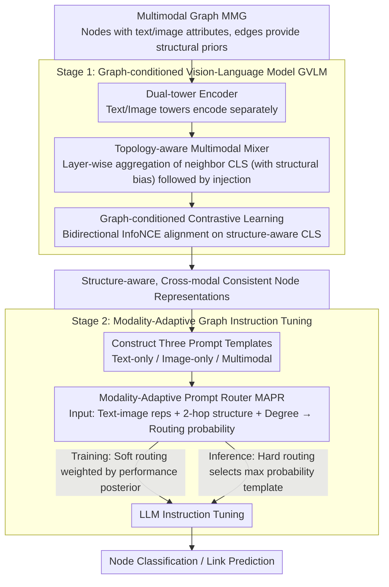

# Mario: Multimodal Graph Reasoning with Large Language Models

**Conference**: CVPR 2026  
**arXiv**: [2603.05181](https://arxiv.org/abs/2603.05181)  
**Code**: Coming soon  
**Area**: Graph Learning  
**Keywords**: Multimodal Graph, LLM Reasoning, Vision-Language Alignment, Modality-Adaptive Routing, Instruction Tuning

## TL;DR

Mario is proposed for LLM reasoning on Multi-Modal Graphs (MMGs). It achieves topology-aware cross-modal alignment via a Graph-conditioned Vision-Language Model (GVLM) and selects the optimal modality configuration for each node using a Modality-Adaptive Prompt Router (MAPR), reaching SOTA performance on node classification and link prediction.

## Background & Motivation

Existing multimodal LLMs process independent image-text pairs, neglecting the relational structures among multimodal data in the real world. In Multimodal Graphs (MMGs), each node possesses text and image attributes, while edges provide structural priors. Directly encoding these with VLMs (e.g., CLIP) and feeding them into graph models faces two challenges:

**C1 Weak Cross-modal Consistency**: Node text and images are not always semantically synchronized; neighbor information can help disambiguate but is often ignored. The cross-modal cosine similarity of frozen CLIP is low, but increases by 68% after incorporating graph topology.

**C2 Heterogeneous Modality Preferences**: Information richness varies across modalities for different nodes. Approximately 30% of nodes can only be correctly classified under specific modality configurations. A "one-size-fits-all" prompt template wastes information.

### Core Problem

> Can a unified framework be designed to simultaneously address cross-modal inconsistency and heterogeneous modality preferences on MMGs during LLM reasoning?

## Method

### Overall Architecture

Mario handles Multi-Modal Graphs (MMG) where nodes have text and image attributes and edges provide structural priors. It addresses two issues: semantic asynchrony between node text and images (Weak Cross-modal Consistency) and varying modality preferences (Heterogeneous Modality Preferences). The framework consists of two stages: Stage 1 trains a Graph-conditioned Vision-Language Model (GVLM) using dual-tower encoders and a topology-aware multimodal mixer for graph-conditioned contrastive learning to produce structure-aware, cross-modal consistent representations; Stage 2 constructs three prompt templates (text/image/multimodal) for each node and employs a Modality-Adaptive Prompt Router (MAPR) to select the optimal template for LLM reasoning.

### Key Designs

**1. Topology-aware Multimodal Mixer: Leveraging Neighbors to Resolve Ambiguity**

When VLM encoders like CLIP are frozen, the cross-modal similarity for a single node is low. Neighbors can provide disambiguation but are typically ignored. The mixer collects CLS representations for all nodes at each encoding layer, aggregates neighbor information using multi-head attention with structural position bias, and re-injects this structure-aware CLS back into the token sequence. This layer-wise deep fusion of structure and modality improves cross-modal consistency by 68% compared to frozen CLIP.

**2. Graph-conditioned Contrastive Learning: Aligning Structure-aware Multimodal Data**

While the mixer integrates features, a training objective is needed to align modalities. Mario applies bidirectional InfoNCE on the structure-aware text/image CLS embeddings:

$$\mathcal{L}_{\text{S1}} = -\frac{1}{|\mathcal{B}|}\sum_v \Big[\log\frac{e^{s(v,v)/\tau}}{\sum_u e^{s(v,u)/\tau}} + \log\frac{e^{s(v,v)/\tau}}{\sum_u e^{s(u,v)/\tau}}\Big]$$

Text and image pairs from the same node serve as positive samples, while others are negative. This pulls positive pairs together and pushes negative pairs apart, resulting in cross-modal consistent representations constrained by topology for the second stage.

**3. Modality-Adaptive Prompt Router (MAPR): Optimal Modality Selection per Node**

Since ~30% of nodes favor specific modality configurations, rigid prompting is inefficient. MAPR prepares three prompts for each node: text-only $\mathcal{S}_v^{\text{txt}}$, image-only $\mathcal{S}_v^{\text{vis}}$, and multimodal $\mathcal{S}_v^{\text{mm}}$. The router processes $[\mathbf{h}_v^{\text{text}}; \mathbf{h}_v^{\text{image}}; \phi^{(1)}(v); \phi^{(2)}(v); \log d_v]$ (embeddings + 2-hop structural features + degree) through an MLP to output routing probabilities $\mathbf{p}_v = \text{softmax}(\mathbf{s}_v)$. During training, actual performance serves as a teacher: the negative losses of the three templates are converted to a performance posterior $\mathbf{q}_v = \text{softmax}(-[\ell_v^{(\text{txt})}, \ell_v^{(\text{vis})}, \ell_v^{(\text{mm})}])$, which the routing probabilities approximate:

$$\mathcal{L}_{\text{S2}} = \frac{1}{|B|}\sum_v \Big[\sum_k q_v^{(k)} \ell_v^{(k)} + \lambda \, \text{KL}(\mathbf{q}_v \| \mathbf{p}_v)\Big]$$

Soft routing is used during training, while hard routing (selecting the highest probability) is used during inference, ensuring stability and zero extra inference cost.

### Loss & Training

Stage 1 uses contrastive loss to train the encoder. Stage 2 employs performance-weighted LM loss and KL regularization to fine-tune the LLM and router simultaneously. During inference, the router directly selects the optimal modality template.

## Key Experimental Results

### Main Results (Node Classification Accuracy %)

| Method | Movies | Reddit | CDs | Arts |
|------|--------|--------|-----|------|
| GCN(text) | 43.8 | 84.3 | 51.4 | 76.9 |
| GATv2(text) | 48.7 | 85.6 | 54.7 | 80.4 |
| **Mario** | **53.6+** | **95.3+** | **63.4+** | **92.1+** |

### Ablation Study

| Configuration | Effect | Description |
|------|------|------|
| W/o Graph-conditioned VLM (Frozen CLIP) | Low consistency | Cross-modal misalignment |
| Node-level Tuning (W/o Topology) | Partial improvement | Lacks neighbor information |
| +GVLM (Stage 1) | Significant gain | Topology + modality awareness |
| +MAPR (Stage 2) | **Optimal** | Modality-adaptive selection |

### Mix-Training Results (Node Classification Accuracy %)

| Method | Modality | Movies | Reddit | CDs | Arts |
|------|--------|--------|--------|-----|------|
| SAGE | Text | 46.85 | 89.96 | 53.24 | 87.46 |
| LLaGA | Text | 47.80 | 91.14 | 51.33 | 74.02 |
| LLaGA-A | Text+Image | 50.61 | 92.94 | 56.29 | 88.83 |
| Graph4MM | Text+Image | 51.07 | 92.89 | 55.53 | 89.32 |
| **Mario-8B** | **Text+Image** | **53.63** | **95.30** | **63.43** | **92.13** |

### Key Findings

- Cross-modal consistency increases by 68% after introducing graph topology (vs. frozen CLIP).
- ~30% of nodes exhibit clear single-modality preferences.
- Zero-shot transfer achieves up to 1.6x improvement.

## Highlights & Insights

- **Accurate Challenge Identification**: Weak consistency and heterogeneous preferences are identified as genuine bottlenecks in MMG reasoning, supported by intuitive Venn diagram analysis.
- **Elegant MAPR Routing**: Uses LLM loss as a performance signal to drive routing learning, with soft routing for training and zero-overhead hard routing for inference.
- **GVLM Paradigm**: The Stage 1 model introduces a topology-aware vision-language model where graph attention and token attention alternate within Transformer layers.
- **Strong Zero-shot Transfer**: Achieves up to 1.6× gain on unseen MMGs, indicating that the learned modality routing strategy generalizes well.
- **Unified Framework**: A single architecture handles both node classification and link prediction tasks.

## Limitations & Future Work

- Two-stage training increases complexity; Stage 2 requires three LLM forward passes per sample during training.
- The mixer's attention complexity is $\mathcal{O}(|\mathcal{V}_s|^2 d)$, requiring node sampling for large-scale graphs.
- Currently only processes text+image MMGs; not yet extended to audio or video.
- Graph topology bias $\mathbf{B}_h$ relies on pre-computed shortest paths, which is unfriendly to dynamic graphs.
- While MLaGA uses Q-Former fusion and Graph4MM handles missing modalities, Mario excels in full modality scenarios but remains untested for missing modalities.

## Rating

⭐⭐⭐⭐⭐ (5/5)

Dual innovation in GVLM and MAPR, comprehensive experiments across four datasets, two tasks, and three modality settings. Zero-shot validation confirms generalization power, representing a pioneering work in multimodal graph reasoning with LLMs.

<!-- RELATED:START -->

## Related Papers

- [\[ICML 2025\] Graph-constrained Reasoning: Faithful Reasoning on Knowledge Graphs with Large Language Models](../../ICML2025/graph_learning/graph-constrained_reasoning_faithful_reasoning_on_knowledge_graphs_with_large_la.md)
- [\[ICLR 2026\] Global-Recent Semantic Reasoning on Dynamic Text-Attributed Graphs with Large Language Models](../../ICLR2026/graph_learning/global-recent_semantic_reasoning_on_dynamic_text-attributed_graphs_with_large_la.md)
- [\[AAAI 2026\] PathMind: A Retrieve-Prioritize-Reason Framework for Knowledge Graph Reasoning with Large Language Models](../../AAAI2026/graph_learning/pathmind_a_retrieve-prioritize-reason_framework_for_knowledge_graph_reasoning_wi.md)
- [\[NeurIPS 2025\] Deliberation on Priors: Trustworthy Reasoning of Large Language Models on Knowledge Graphs](../../NeurIPS2025/graph_learning/deliberation_on_priors_trustworthy_reasoning_of_large_language_models_on_knowled.md)
- [\[ACL 2025\] FiDeLiS: Faithful Reasoning in Large Language Model for Knowledge Graph Question Answering](../../ACL2025/graph_learning/fidelis_faithful_reasoning_in_large_language_model_for_knowledge_graph_question_.md)

<!-- RELATED:END -->
