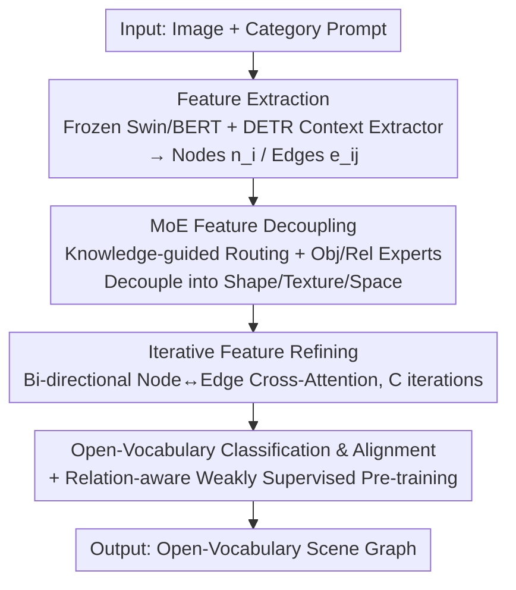

# Mixture-of-Experts based Feature Decoupling for Open Vocabulary Scene Graph Generation

**Conference**: CVPR 2026  
**Paper**: [CVF Open Access](https://openaccess.thecvf.com/content/CVPR2026/html/Li_Mixture-of-Experts_based_Feature_Decoupling_for_Open_Vocabulary_Scene_Graph_Generation_CVPR_2026_paper.html)  
**Code**: Not disclosed  
**Area**: Graph Learning / Scene Graph Generation  
**Keywords**: Open-Vocabulary Scene Graph, Mixture-of-Experts, Feature Decoupling, Cross-Attention, Vision-Semantic Alignment

## TL;DR
Addressing the issues of "relying solely on off-the-shelf VLM features, lacking discriminative attributes, and semantic isolation between objects and relations" in Open Vocabulary Scene Graph Generation (OVSGG), this paper proposes MoE-FD. It adaptively decouples object/relation features into sub-attributes like shape, texture, and space using a Mixture-of-Experts (MoE) module, followed by iterative cross-attention for mutual refinement between nodes and edges. On the Visual Genome all-open vocabulary setting, it significantly improves R@100 for novel categories (e.g., +4.24% R@20 over ACC in the OvD+R novel relation setting).

## Background & Motivation

**Background**: Scene Graph Generation (SGG) aims to parse images into structured graphs of $\langle \text{subject, relation, object} \rangle$ triplets. Inspired by open-vocabulary object detection, recent works extend SGG to open-vocabulary settings (OVSGG) by mapping visual concepts and candidate labels from off-the-shelf VLMs (e.g., CLIP, Grounding DINO) into a shared semantic space for alignment.

**Limitations of Prior Work**: Existing methods often treat VLM visual features as a "black box," failing to extract discriminative attributes for novel objects/relations. For instance, when distinguishing a "cup" from a "bowl," models struggle to capture fine-grained differences like "shape" or "size," often misclassifying novel classes as similar base classes. Furthermore, most methods independently calculate similarity for objects and relations in the semantic space, lacking visual-semantic interaction, which limits alignment accuracy.

**Key Challenge**: An intuitive solution is "attribute decoupling" for visual features to identify discriminative components. However, object attributes vary widely, and relation attributes are abstract and difficult to define. Consequently, training data with attribute annotations is fundamentally unavailable. The core contradiction lies in the need to decouple attributes without explicit attribute supervision.

**Goal**: Without attribute annotations, (1) adaptively learn attribute decoupling for objects/relations; (2) establish semantic interaction between objects and relations to enhance prediction for novel classes.

**Key Insight**: Utilize a Mixture-of-Experts (MoE) to transform "attribute decoupling" into an implicit learning task via a routing network. Each expert specializes in a vision-semantic subspace (shape, texture, function), with gating weights determining selection, eliminating the need for manual attribute labels.

**Core Idea**: Replace "direct VLM feature application + independent labeling" with "MoE feature decoupling + iterative cross-attention refinement," enabling the extraction of discriminative attributes while facilitating object-relation semantic interaction.

## Method

### Overall Architecture
Given an image $I$ and all possible object/relation categories (formatted as class prompts), MoE-FD first extracts features using a frozen image backbone (Swin-T/B) and a text encoder (BERT). A DETR-style context extractor fuses both modalities to construct node features $n_i$ and edge features $e_{i,j}$ using object and relation queries. These then enter two core components: **MoE Feature Decoupling** splits node/edge features into discriminative sub-attributes, and **Iterative Feature Refining** updates nodes and edges via bi-directional cross-attention. Finally, refined visual features are aligned with semantic labels for open-vocabulary classification, utilizing relation-aware weakly supervised pre-training as in OvSGTR.

### Key Designs

**1. MoE-based Knowledge-Guided Feature Decoupling: Learning Discriminative Details Without Labels**

This design specifically targets the "vague VLM features" problem. MoE-FD separates feature decoupling into object and relation paths, each equipped with a set of expert networks (3-layer MLPs with ReLU, specializing in subspaces like shape or texture). Crucially, the routing network does not rely solely on visual features. For node $n_i$, VLM pseudo-labels are used to retrieve related nodes from ConceptNet with semantic similarity $>\epsilon$. Their two-hop neighborhood subgraph $C_{k,i}$ is encoded as a 1024-d prior vector. The vector $[n_i, C_{k,i}, r]$ (where $r$ is a relation-aware query) is fed into a routing MLP to compute expert weights: $z_o = \mathrm{MLP_{Route}}([n_i, C_{k,i}, r])$, $\alpha_k = \mathrm{Softmax}(z_o)_k$. The final feature is the weighted sum: $n_i^* = \sum_{k=1}^{E_o} \alpha_k \cdot \mathrm{Expert}_k^{obj}(n_i)$. Relation decoupling follows a similar process. Injecting ConceptNet knowledge guides the model to select experts relevant to novel classes without supervision.

**2. Iterative Feature Refining: Bi-directional "Dialogue" Between Object and Relation Semantics**

Decoupling improves discriminative power, but nodes and edges remain isolated. This design addresses "semantic fragmentation" by iterating $C$ times through two stages. First, edge features are updated via node-pair cross-attention: weights $w_{i,j} = \mathrm{Softmax}\big(\phi_Q(n_i)\cdot\phi_K(n_j)^T/\sqrt{d}\big)$ are computed, and aggregated as $e'_{i,j} = e_{i,j} + \mathrm{MLP_{edge}}(w_{i,j}\cdot\phi(n_i+n_j))$, allowing edges to encode fine-grained interactions. Second, edges refine nodes: $n'_i = n_i + \mathrm{MLP_{node}}(\sum_j \gamma_{i,j}\cdot\phi'(e'_{i,j}))$. This "Node $\to$ Edge $\to$ Node" update ensures nodes adapt to relational semantics and edges encode object details.

**3. Open-Vocabulary Alignment and Relation-aware Weakly Supervised Pre-training**

The refined features are reconnected for classification. Object classification uses similarity between node features and word embeddings $\mathrm{sim_{obj}}(n_i, g_k) = \sigma(\langle \hat g_k, n_i\rangle)$, modeled as bipartite matching. Relation classification projects candidate embeddings into the edge feature space to compute alignment scores $s(e_{i,j}, t_{proj}) = e_{i,j}^T t_{proj}$, optimized via binary cross-entropy. To mitigate data sparsity for rare relations, the model adopts the weakly supervised paradigm from OvSGTR, extracting triplets from image captions via dependency parsing to generate pseudo-labels.

### Loss & Training
Object/relation classification uses Focal Loss for contrastive alignment with language tokens. Bounding box regression uses L1 + GIoU loss. Relation alignment uses binary cross-entropy $L = -\mathbb{E}[y\log\sigma(s) + (1-y)\log(1-\sigma(s))]$. The model utilizes frozen Swin-T/B and BERT-base, with 100 object queries, 8 object experts, and 6 relation experts. The knowledge threshold $\epsilon=0.7$, and cross-attention iterates 4 times. Training is conducted with SGD (LR 0.001, 0.9 decay) on 8×NVIDIA 4090.

## Key Experimental Results

### Main Results
Evaluated on VG150 under the SG DET protocol (no ground truth used). Three settings: OvD-SGG (novel objects), OvR-SGG (novel relations), OvD+R-SGG (both novel). Metrics: Recall@K.

| Setting | Metric | Ours | Prev. SOTA | Gain |
|--------|------|------|----------|------|
| OvD (Swin-T, include novel) | R@50 / R@100 | 23.39 / 28.33 | OvSGTR 23.20 / — | ~+5.36% (R@50) |
| OvD (Swin-T, novel obj only) | R@50 / R@100 | 18.13 / 22.72 | VS3 15.07 / 18.73 | Significant |
| OvR (Swin-B, novel rel only) | R@50 / R@100 | 23.06 / 27.60 | OvSGTR 16.39 (R@50) | Decisive Lead |
| OvD+R (Swin-B, novel rel) | R@20 | 16.61 | ACC 12.37 | +4.24 (Abs.) |
| Zero-shot Pretrain (Swin-B) | R@50 / R@100 | 12.41 / 16.40 | ACC 11.61 / 14.33 | Consistent |

### Ablation Study
FD(Obj) = Object Feature Decoupling, FD(Rel) = Relation Feature Decoupling, IFR = Iterative Feature Refining. Results under OvD+R setting (Joint Base+Novel).

| Config | R@20 | R@50 | R@100 | Note |
|------|------|------|-------|------|
| Full Model | 17.35 | 23.15 | 26.97 | All components included |
| w/o FD(Obj) | 15.72 | 21.17 | 25.15 | Largest drop |
| w/o FD(Rel) | 16.09 | 21.91 | 25.58 | Relation impact |
| w/o IFR | 17.03 | 22.70 | 26.66 | Refinement impact |

### Key Findings
- **Object Decoupling Significance**: Removing FD(Obj) leads to a larger performance drop than removing FD(Rel). Accuracy in object detection directly restricts the subsequent relation classification.
- **Expert Count "Sweet Spot"**: Optimal performance is achieved with 8 object experts and 6 relation experts. Knowledge threshold $\epsilon=0.7$ is ideal.
- **Division of Labor**: Visualization shows distinct expert activation patterns for different categories, confirming that experts indeed specialize in different attribute subspaces rather than degrading into uniform weighting.

## Highlights & Insights
- **MoE for Unsupervised Decoupling**: Modeling "attribute decoupling" as a learnable routing problem avoids the need for manual labels. This bypasses the difficulty of defining complex relation attributes.
- **ConceptNet Prior in Routing**: Using structured external knowledge to guide the gating mechanism effectively provides a "semantic compass" for novel classes, a strategy transferable to other open-vocabulary tasks.
- **Bi-directional Iteration**: Explicitly modeling the reciprocal relationship between objects and relations aligns more closely with the intrinsic graph structure of scene graphs compared to independent labeling.

## Limitations & Future Work
- Fixed query and expert counts may lack flexibility in broader open-world scenarios. Future work could include learnable expert controllers (e.g., using RL or LLMs for dynamic selection).
- Evaluation is limited to VG150; cross-dataset generalization (e.g., on GQA) was not explored.
- Dependence on external knowledge like ConceptNet may be problematic in specialized domains where knowledge coverage is poor.
- Weakly supervised labels from caption parsing are inherently noisy.

## Related Work & Insights
- **vs OvSGTR**: The most direct competitor. This paper improves over it by introducing MoE-based decoupling to discover crucial details instead of relying on flat VLM features.
- **vs ACC**: While ACC uses interaction-aware fine-tuning, this paper outperforms it on novel relations (+4.24% R@20), suggesting that explicit attribute decoupling is more effective for distinguishing novel categories.
- **vs Traditional Closed-set SGG**: These methods achieve nearly 0 Recall on novel classes, highlighting the necessity of open-vocabulary approaches.
- **vs MoE for Prediction (e.g., Zhou et al.)**: Previous works use MoE for unbiased prediction; this work uses MoE for visual feature decoupling to enhance discriminability.

## Rating
- Novelty: ⭐⭐⭐⭐ Transforms MoE into an "unsupervised attribute decoupler" with knowledge-guided routing.
- Experimental Thoroughness: ⭐⭐⭐⭐ Solid results across three settings, but restricted to VG150.
- Writing Quality: ⭐⭐⭐⭐ Clear motivation and comprehensive formulas.
- Value: ⭐⭐⭐⭐ Strong new SOTA for open-vocabulary SGG.

<!-- RELATED:START -->

## Related Papers

- [\[NeurIPS 2025\] Interaction-Centric Knowledge Infusion and Transfer for Open-Vocabulary Scene Graph Generation](../../NeurIPS2025/graph_learning/interaction-centric_knowledge_infusion_and_transfer_for_open-vocabulary_scene_gr.md)
- [\[CVPR 2026\] Robo-SGG: Exploiting Layout-Oriented Normalization and Restitution Can Improve Robust Scene Graph Generation](robo-sgg_exploiting_layout-oriented_normalization_and_restitution_can_improve_ro.md)
- [\[ICLR 2026\] Diverse and Sparse Mixture-of-Experts for Causal Subgraph–Based Out-of-Distribution Graph Learning](../../ICLR2026/graph_learning/diverse_and_sparse_mixture-of-experts_for_causal_subgraphbased_out-of-distributi.md)
- [\[ICLR 2026\] Adaptive Mixture of Disentangled Experts for Dynamic Graph Out-of-Distribution Generalization](../../ICLR2026/graph_learning/adaptive_mixture_of_disentangled_experts_for_dynamic_graph_out-of-distribution_g.md)
- [\[CVPR 2025\] Universal Scene Graph Generation](../../CVPR2025/graph_learning/universal_scene_graph_generation.md)

<!-- RELATED:END -->
