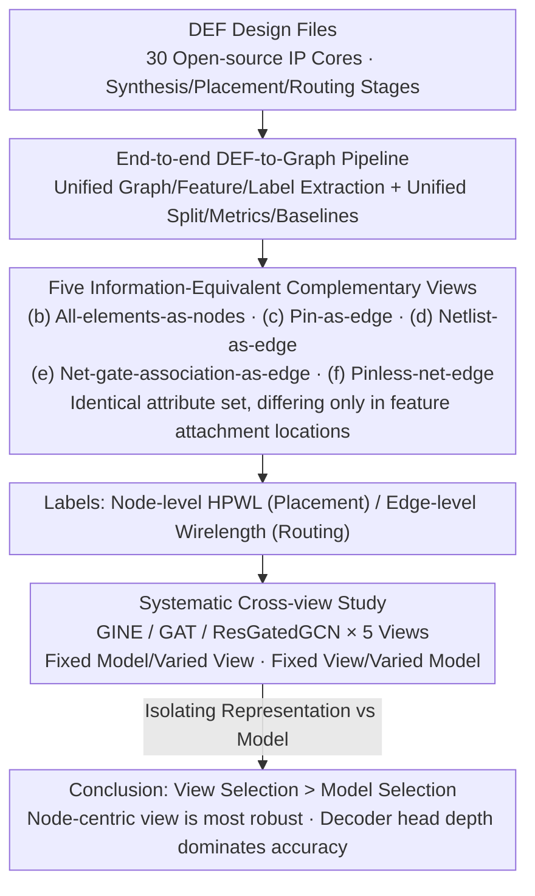

# R2G: A Multi-View Circuit Graph Benchmark Suite from RTL to GDSII

**Conference**: CVPR 2026  
**arXiv**: [2604.08810](https://arxiv.org/abs/2604.08810)  
**Code**: [https://github.com/ShenShan123/R2G](https://github.com/ShenShan123/R2G)  
**Area**: Graph Learning  
**Keywords**: circuit graph, GNN benchmark, multi-view, physical design, EDA

## TL;DR

Ours proposes R2G, the first standardized multi-view circuit graph benchmark suite, providing five stage-aware graph representations (with information equivalence) across 30 IP cores. Systematic research reveals that the choice of graph representation has a greater impact on performance than the choice of GNN model.

## Background & Motivation

Graph Neural Networks (GNNs) are increasingly applied to physical design tasks (e.g., congestion prediction, wirelength estimation), but progress is hindered by inconsistent circuit representations and the lack of evaluation protocols with controlled variables. Existing EDA datasets couple graph representations with task labels, making it impossible to distinguish whether model accuracy stems from architectural advantages or representation choices.

The core contribution of R2G: Decoupling representation choice from model choice and isolating representation effects by fixing circuits and tasks while varying only the graph views, thus becoming the first circuit graph benchmark with controlled variables.

## Method

### Overall Architecture

R2G addresses a methodological pain point in the EDA-ML field: existing circuit graph datasets tie "graph representation" to "task labels," making it unclear whether model accuracy originates from architectural strength or superior representation. The solution in R2G is controlled variables—fixing the circuit and the task while only changing the graph view. It extracts five stage-aware graph views directly from standard DEF design files. Each encodes the same attribute set but attaches features to different locations (information equivalence), covering three physical design stages: synthesis, placement, and routing, thereby isolating the representation effect for study.

### Key Designs

**1. Five Information-Equivalent Complementary Views: Treating "Representation" as a Tunable Knob**

To study the impact of representation in isolation, the prerequisite is that different views must be identical in all aspects except for structure; otherwise, the comparison measures information content rather than representation. R2G designs five complementary views for the same set of back-end circuits: (b) all-elements-as-nodes (gates, pins, nets, and IOs are all nodes), (c) pin-as-edge, (d) net-as-edge, (e) net-gate-association-as-edge (bipartite form), and (f) net-edge view with pin nodes removed. These five views encode exactly the same attribute set, with the only difference being whether these features are attached to nodes or edges (information equivalence). This information equivalence is the key premise for the entire controlled-variable experiment—any performance difference can only be attributed to the representation structure itself, not the amount of information.

**2. End-to-End DEF-to-Graph Pipeline: Making Benchmarks Unified and Reproducible**

For a circuit graph benchmark to be credible, it must ensure that everyone uses the same extraction, splitting, and metrics. R2G directly extracts graph structures, features, and labels from standard DEF files, accompanied by unified data splits, domain metrics, and reproducible baselines. The data covers 30 open-source IP cores, with scales ranging from $\sim 500$ to $>10^6$ nodes/edges. Categories include audio controllers (ss_pcm, ac97_ctrl), encryption cores (des3_area, SHA256, AES), and video controllers (vga_lcd), spanning synthesis, placement, and routing stages to ensure conclusions are not limited to a single type of circuit.

**3. Systematic Cross-View Study: Sweeping Five Views with the Same Set of GNNs**

Simply having views and a pipeline is insufficient; the representation effect must be quantified. R2G systematically conducts experiments on the five views using three representative GNNs: GINE, GAT, and ResGatedGCN. By fixing the model and changing the view, and vice versa, it successfully isolates the respective contributions of "representation vs. model"—supporting the core conclusion that "view selection affects performance more than model selection."

### Loss & Training

Standard regression losses are used for node-level placement tasks (HPWL prediction) and edge-level routing tasks (wirelength prediction), with unified training/validation/test splits to ensure reproducibility.

## Key Experimental Results

### Key Findings

| Finding | Data | Explanation |
|------|------|------|
| View > Model | Test $R^2$ variation across views $>0.3$ | View selection dominates performance under a fixed GNN |
| Model Ranking Inversion | Optimal model differs across views | Severe representation-model coupling |
| Node-centric View is Most Robust | View (b) is optimal across stages | Best performance in both placement and routing |
| Decoding Head Depth is Critical | 3-4 layer head: $R^2$ from -0.17 to 0.99 | Far exceeds the impact of GNN depth |

### Highlights & Insights

- Graph representation choice is significantly more important than GNN architecture choice.
- Decoding head depth (3-4 layers) is a primary driver of accuracy.
- The node-centric view generalizes best in both placement and routing stages.
- The five views maintain information equivalence (same attribute set, different feature attachment locations), which is the critical prerequisite for controlled-variable experiments.
- When the head depth increases from 1 layer to 4 layers, the $R^2$ for the placement task jumps from -0.17 to 0.99, and the routing task shifts from NaN to convergence.
- The optimal GNN model varies across different views, indicating severe representation-model coupling.

## Highlights & Insights

- First instance of treating graph representation as an independent variable in controlled experiments.
- The finding that "view selection dominates model selection" provides important guidance for the EDA-ML community.
- The surprising importance of decoding head depth may alter the logic of GNN architecture design.
- Information equivalence design serves as the foundation for rigorous ablation.

## Limitations & Future Work

- Limited diversity with only 30 IP cores.
- The five views do not exhaust all possible circuit representations.
- Primary focus is on back-end physical design; front-end logical design is not covered.
- Performance of heterogeneous GNNs (e.g., distinguishing between cell and net node types) across multiple views has not been explored.
- Dataset scale ranges from $\sim 500$ to $>10^6$ nodes/edges; while the span is large, the number of samples per scale segment is limited.
- R2G inherits best practices from graph ML benchmarks like OGB: unified splits, scalable loaders, and reproducible baselines.
- While existing EDA datasets couple graph representation and task labels, R2G enables the first controlled-variable experiment through decoupling.

## Rating

- Novelty: ⭐⭐⭐⭐⭐ — First multi-view circuit graph benchmark with controlled variables.
- Technical Depth: ⭐⭐⭐⭐ — Rigorous information equivalence design ensures experimental controllability.
- Experimental Thoroughness: ⭐⭐⭐⭐ — Systematic cross-view and cross-model experiments.
- Value: ⭐⭐⭐⭐ — Provides standardized tools for EDA-ML research, with open-source code and datasets.

<!-- RELATED:START -->

## Related Papers

- [\[ICML 2026\] View Space：跨任意图的表示学习](../../ICML2026/graph_learning/view_space_learning_representation_across_arbitrary_graphs.md)
- [\[AAAI 2026\] Skill Path: Unveiling Language Skills from Circuit Graphs](../../AAAI2026/graph_learning/skill_path_unveiling_language_skills_from_circuit_graphs.md)
- [\[CVPR 2026\] M3KG-RAG: Multi-hop Multimodal Knowledge Graph-enhanced Retrieval-Augmented Generation](m3kg_rag_multi_hop_multimodal_knowledge_graph_enhanced_retrieval_augmented_genera.md)
- [\[NeurIPS 2025\] FALCON: An ML Framework for Fully Automated Layout-Constrained Analog Circuit Design](../../NeurIPS2025/graph_learning/falcon_an_ml_framework_for_fully_automated_layout-constrained_analog_circuit_des.md)
- [\[AAAI 2026\] S-DAG: A Subject-Based Directed Acyclic Graph for Multi-Agent Heterogeneous Reasoning](../../AAAI2026/graph_learning/s-dag_a_subject-based_directed_acyclic_graph_for_multi-agent.md)

<!-- RELATED:END -->
