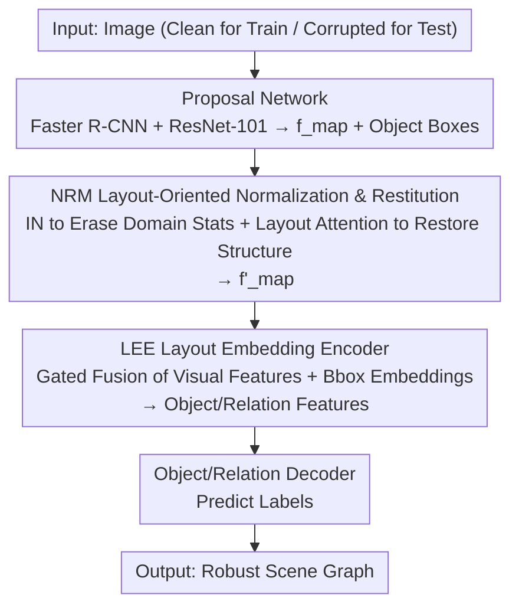

# Robo-SGG: Exploiting Layout-Oriented Normalization and Restitution Can Improve Robust Scene Graph Generation

**Conference**: CVPR 2026  
**Paper**: [CVF Open Access](https://openaccess.thecvf.com/content/CVPR2026/html/Lv_Robo-SGG_Exploiting_Layout-Oriented_Normalization_and_Restitution_Can_Improve_Robust_Scene_CVPR_2026_paper.html)  
**Code**: https://github.com/MICLAB-BUPT/Robo-SGG  
**Area**: Graph Learning / Scene Graph Generation  
**Keywords**: Robust Scene Graph Generation, Image Corruption, Layout Information, Instance Normalization, Gated Fusion, Plug-and-play

## TL;DR
Addressing the issue where "domain shift in visual features leads to a performance collapse" in robust Scene Graph Generation (inference on corrupted images with noise/blur/weather), this paper proposes a plug-and-play framework, Robo-SGG. It utilizes Instance Normalization to eliminate domain-specific statistics caused by corruption and uses layout-aware attention to recover global structural features (NRM). Additionally, it employs gated fusion to adaptively balance visual and coordinate features (LEE). Integrating these into existing SGG models yields relative improvements in mR@50 of 6.3% / 11.1% / 8.0% for PredCls/SGCls/SGDet on VG-C.

## Background & Motivation

**Background**: Scene Graph Generation (SGG) parses images into visual graphs where nodes represent objects and edges represent relationships, widely used in autonomous driving and robot navigation. Most existing methods assume "clean" input images and rely on multi-modal interactions between visual, textual, and external knowledge graphs to improve generalization.

**Limitations of Prior Work**: In real-world scenarios, images are often contaminated by natural corruptions such as noise, blur, weather, and digital distortions. Corruption causes **domain shift** in visual features—the feature distributions of clean and corrupted images do not match, leading to incorrect multi-modal interactions and significantly degrading SGG performance. Existing robust methods (data augmentation, adversarial training, normalization, denoising) are either computationally expensive or **object-centric**, failing to enhance the robustness of "structural features" (positional and semantic relationships between objects).

**Key Challenge**: Corruption damages low-level appearance cues (texture, color), but SGG fundamentally requires global structural relationships between objects. Existing methods focus robustness on object appearance, failing to protect the part SGG relies on most. Layout information (global spatial arrangement of objects) is naturally more robust to domain shift than texture or color—this is the overlooked breakthrough point.

**Goal**: (1) To erase domain-specific perturbations from corruption while preserving and restituting structural features robust to various corruptions; (2) To robustly fuse visual and spatial information to obtain object/relationship representations even when detection boxes are unreliable due to corruption.

**Key Insight**: Corruption can be viewed as a covariate shift introduced to the feature domain, where each corruption type is a "domain." Since layout is robust to domain shift, Instance Normalization can be used to remove domain-specific mean/variance perturbations, and layout can then "restitute" the structural features.

**Core Idea**: A set of plug-and-play modules consisting of "Domain Erasing via Instance Normalization + Structural Restitution via Layout-Aware Attention" (NRM) and "Visual-Coordinate Balancing via Gated Fusion" (LEE). These replace heavy adversarial training/denoising to specifically bolster the robustness of structural features in SGG.

## Method

### Overall Architecture
Robo-SGG does not rebuild SGG models but inserts two modules into the second stage of a standard SGG pipeline (Proposal Network → Object/Relation Encoder → Object/Relation Decoder). The proposal network (e.g., Faster R-CNN + ResNet-101) extracts feature maps $f_{map}$ from the image. **NRM** is applied after $f_{map}$, using Instance Normalization to erase domain-specific statistics and layout-aware attention to recover structural features, outputting a more robust $f'_{map}$. **LEE** replaces the original object/relation encoders, using gated fusion to adaptively balance visual features with bounding box coordinate embeddings, resulting in robust object features $f'_i$ and relationship features $f'_{i\to j}$. Finally, object and relationship labels are decoded as usual. The model is trained only on clean images and evaluated on corrupted images, ensuring the modules learn generalized structures rather than memorizing specific corruptions. The design is decoupled from specific SGG models and can be integrated into both one-stage and two-stage models.

### Key Designs

**1. Layout-Oriented Normalization and Restitution Module (NRM): Erase domain statistics first, then recover structure via layout**

This step addresses the issue of domain shift in visual features caused by corruption. The key insight is that each corruption type introduces a covariate shift in the feature domain. NRM follows two steps. First, **Instance Normalization (IN)**: For each image and channel, the spatial mean $\mu_i = \frac{1}{HW}\sum_{m,l} a_{iml}$ and variance $\sigma_i^2$ are calculated, and $b_{iml} = (a_{iml}-\mu_i)/\sqrt{\sigma_i^2+\epsilon}$ is performed. Unlike BN which uses batch statistics, IN normalizes per-image per-channel, effectively suppressing covariate shift from corruptions. However, IN might also erroneously remove structural features important for SGG. Thus, the second step, **Layout-Aware Attention**, restores this structure: First, the residual is taken as $R = f_{map} - \overline{f_{map}}$ (the difference between original and normalized features, carrying info erased by IN). Then, the global layout is modeled using the centroids $e_j=(x_j,y_j)$ of all object boxes. For each normalized spatial position $(m,l)$, attention is calculated based on distance to object centroids $A_{(m,l),j} = \frac{\exp(-\|(m,l)-e_j\|^2)}{\sum_{j'}\exp(-\|(m,l)-e_{j'}\|^2)}$. A layout mask is obtained by taking the maximum across objects $M_{m,l} = \max_j A_{(m,l),j}$. This mask filters the residual to get structural features $R^+ = R\odot M$, and the final output is $f'_{map} = \overline{f_{map}} + R^+$. In essence, info erased by IN is not lost; the layout mask retrieves the residual "aligned with object structures" and adds it back—suppressing corruption while preserving structure. Ablations show centroids perform better than full boxes as they are less sensitive to detection noise.

**2. Layout Embedding Encoder (LEE): Adaptively trust layout when detection boxes are unreliable**

This step mitigates the issue where noisy detection boxes under corruption introduce further noise when coordinates are directly concatenated. Existing methods (like SHA) concatenate bounding box embeddings with visual features, which depends on reliable detection; under corruption, inaccurate boxes become "poisonous." LEE performs gated fusion for objects and relations separately. First, boxes are encoded into coordinate embeddings—$f_i^C = \mathrm{Emb}^{obj\text{-}bbox}(b_i)$ for objects, and $f_{i\to j}^C = \mathrm{Emb}^{pred\text{-}bbox}([b_i, b_j, e_i-e_j, \|b_i-b_j\|_2])$ for relations. Then, a gating coefficient $z_i = \mathrm{Sigmoid}(Wf_i)\in[0,1]^d$ is calculated from visual features, indicating how much visual info to retain, resulting in $f_i^\prime = (1-z_i)\circ f_i^C + z_i\circ f_i$ (where $\circ$ is element-wise multiplication). The gate allows the model to automatically decrease the weight of visual features as quality degrades, increasing reliance on global layout structure. The paper provides evidence: under Gaussian noise, the gate mean $E[z_i]$ drops from 0.65 (severity 1) to 0.52 (severity 5), indicating LEE trusts layout more as vision worsens. Even with $\pm30\%$ random box jitter, the method improves the baseline by $+2.0\%$.

### Loss & Training
The standard SGG loss $L_{SGG}$ (the sum of cross-entropy for object and relationship predictions) is adopted directly without extra losses. In terms of integration, NRM operates on $f_{map}$ from the proposal network, and LEE replaces the object/relationship encoder. Both can be seamlessly inserted into existing SGG models during training, validation, and testing. NRM introduces zero learnable parameters and no additional GPU memory. LEE adds only 0.02GB of VRAM and approximately 0.005s/iter in inference, while NRM adds 0.019s/iter. Together, they provide an 8.8% mR@50 improvement, offering a good trade-off between overhead and gain.

## Key Experimental Results

### Main Results
The datasets used are Visual Genome (VG) and GQA, with 20 types of corruption applied according to the HiKER protocol (5 categories: noise, blur, weather1, digital, weather2) forming VG-C and GQA-C. **All models are trained on clean images and evaluated on unseen corrupted images.** The metric is the category-balanced mR@K. "Corruption Avg." refers to the average of 20 corruptions at severity 5, and "Imp." is the relative gain over baseline.

| Baseline Model | Task | Baseline Corrupted mR@50 | +Robo-SGG | Relative Gain |
|--------|------|------|----------|------|
| VCTree | PredCls | 12.8 | 13.6 | +6.3% |
| VCTree | SGCls | 5.4 | 6.0 | +11.1% |
| VCTree | SGDet | 2.5 | 2.7 | +8.3% |
| HiKER (Robust-SGG specific)| PredCls | 32.6 | 33.8 | +3.7% |
| HiKER | SGCls | 3.5 | 3.7 | +5.7% |
| DPL (Recent SOTA)| SGDet mR@50/mR@100 | 4.8 / 5.3 | 5.1 / 5.7 | +6.3% / +7.5% |

> Note: Low mR values are due to the inherent difficulty of SGDet/SGCls on corrupted images; the key is the consistency of relative improvements. Success is also observed on one-stage models: RelTR's SGDet mR@50 improved from 3.4→3.7 (+8.8%), and EGTR from 5.6→5.9 (+5.4%). Standard deviation across three seeds for MOTIFS+Ours (SGCls) is <0.01, far smaller than the +11.1% gain.

### Ablation Study
The table below decomposes NRM and LEE on PredCls / SGCls (based on MOTIFS, values in parentheses are relative gains).

| Configuration | PredCls mR@100 | SGCls mR@100 | Explanation |
|------|------|------|------|
| MOTIFS (Baseline) | 13.9 | 4.9 | — |
| +LEE | 14.1 (+1.4%) | 5.0 (+2.0%) | Gated fusion only |
| +NRM | 14.1 (+1.3%) | 5.0 (+1.9%) | Normalization restitution only |
| +LEE+SNR | 14.2 (+2.2%) | 5.0 (+2.1%) | NRM replaced with SNR |
| +LEE+NRM (Full) | 14.5 (+4.3%) | 5.1 (+3.9%) | Best synergy |

Ablation of fusion methods in LEE (VCTree, SGDet mR@50): Direct addition $\mathrm{LEE_{Add}}$ resulted in $-1.2\%$ under corruption, direct concatenation $\mathrm{LEE_{Concat}}$ in $-2.0\%$, while gated $\mathrm{LEE_{Gate}}$ yielded $+4.2\%$. NRM using centroids $\mathrm{NRM_{centroid}}$ (+7.2%) outperformed using full boxes $\mathrm{NRM_{bbox}}$ (+1.6%).

### Key Findings
- **NRM outperforms general restitution method SNR**: SNR uses channel attention for feature restitution, yielding $+2.2\%/+2.0\%$ on PredCls mR@100 for MOTIFS/HiKER, whereas NRM uses layout-aware attention to reach $+4.3\%/+3.8\%$, better recovering structural features needed for relation recognition.
- **Direct coordinate concatenation is harmful under corruption**: $\mathrm{LEE_{Concat}}$/$\mathrm{LEE_{Add}}$ dropped performance on corrupted images ($-2.0\%/-1.2\%$), confirming that "coordinates are noise when boxes are inaccurate," necessitating adaptive suppression via gates.
- **Gating adapts to corruption**: The gate mean decreases as severity increases under Gaussian noise (0.65→0.52), quantitatively confirming the model relies more on layout as vision degrades.
- **More pronounced generalization to OOD**: Gains are larger under harder settings like style changes (+12.6%) and zero-shot distribution shifts (+17.8%), indicating structural robustness pays off more as domain gaps widen.

## Highlights & Insights
- **"IN Erasing + Residual Layout Restitution" is an elegant decoupling**: Splitting "de-corruption" and "structure preservation" into two steps allows for precise filtering of the structural components within the residual—more effective than bulk normalization or denoising, and NRM adds zero parameters/memory.
- **Gated fusion lets data decide "when to trust detection boxes"**: Using visual features to generate gates that auto-adjust weights based on severity can be transferred to any downstream task (detection, tracking, relation reasoning) where detection might be unreliable.
- **Truly plug-and-play**: Consistent gains across one/two-stage, weak/strong baselines (from MOTIFS to DPL/HiKER) with minimal overhead (+0.024s/iter, +0.02GB VRAM), ensuring high practical value.
- **Observation that layout resists domain shift**: The insight that global spatial structure is more robust than low-level texture is valuable for any visual task relying on relationships/structure.

## Limitations & Future Work
- The authors acknowledge failure cases: models still confuse relationships like "near" and "behind" when both describe the same interaction, requiring finer-grained labeling.
- Self-identified limitation: NRM's layout-aware attention depends on object boxes/centroids from the proposal network. If detection fails completely (no boxes) under extreme corruption, the layout prior is lost. The method is primary validated on natural corruptions; adversarial corruptions are not covered.
- Absolute mR values for SGDet/SGCls remain low; robust SGG is still far from practical application. Gates are currently single scalars; exploring finer-grained spatially adaptive gating is a potential direction.

## Related Work & Insights
- **vs HiKER-SGG**: HiKER is designed for robust SGG but relies on external knowledge graphs, limiting flexibility. Robo-SGG is knowledge-free, plug-and-play, and still improves HiKER's PredCls/SGCls by +3.7%/+5.7%.
- **vs SHA**: SHA uses concatenation to fuse spatial and visual info, relying on reliable detection. This work uses gating to adaptively down-weight unreliable spatial cues.
- **vs SNR (General Feature Restitution)**: SNR uses channel attention. Ours uses layout-aware attention to specifically restore structural features, showing more stable gains in relation recognition.
- **vs Conventional Robustness Strategies (Augmentation/Adversarial/Denoising)**: These are compute-heavy and object-centric; this work focuses on structural feature robustness with nearly zero extra overhead.

## Rating
- Novelty: ⭐⭐⭐⭐ The perspective of "using layout to restore structure against corruption" is novel; the IN + residual layout filtering in NRM is clever, though gated fusion is common.
- Experimental Thoroughness: ⭐⭐⭐⭐⭐ Coverage of VG-C/GQA-C, one/two-stage models, 5 baselines, various corruptions, and OOD settings. Ablations and overhead analyses are comprehensive.
- Writing Quality: ⭐⭐⭐⭐ Clear motivation, solid formulas/visualizations, and good alignment between text and figures.
- Value: ⭐⭐⭐⭐ Plug-and-play, minimal overhead, consistently sets new SOTAs for robust SGG; high deployment value.

<!-- RELATED:START -->

## Related Papers

- [\[CVPR 2026\] Mixture-of-Experts based Feature Decoupling for Open Vocabulary Scene Graph Generation](mixture-of-experts_based_feature_decoupling_for_open_vocabulary_scene_graph_gene.md)
- [\[CVPR 2026\] WSGG: Towards Spatio-Temporal World Scene Graph Generation from Monocular Videos](wsgg_spatiotemporal_world_scene_graph.md)
- [\[CVPR 2025\] Universal Scene Graph Generation](../../CVPR2025/graph_learning/universal_scene_graph_generation.md)
- [\[CVPR 2025\] Unbiased Video Scene Graph Generation via Visual and Semantic Dual Debiasing](../../CVPR2025/graph_learning/unbiased_video_scene_graph_generation_via_visual_and_semantic_dual_debiasing.md)
- [\[CVPR 2026\] M3KG-RAG: Multi-hop Multimodal Knowledge Graph-enhanced Retrieval-Augmented Generation](m3kg_rag_multi_hop_multimodal_knowledge_graph_enhanced_retrieval_augmented_genera.md)

<!-- RELATED:END -->
