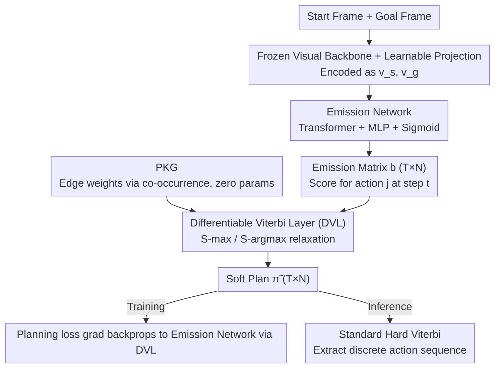

# ViterbiPlanNet: Injecting Procedural Knowledge via Differentiable Viterbi for Planning

**Conference**: CVPR 2026  
**arXiv**: [2603.04265](https://arxiv.org/abs/2603.04265)  
**Code**: [Project Page](https://gigi-g.github.io/ViterbiPlanNet/)  
**Area**: Graph Learning  
**Keywords**: Procedure Planning, Differentiable Viterbi, Procedural Knowledge Graph, Instructional Video, Structure-Aware Training

## TL;DR

Ours embeds the Procedural Knowledge Graph (PKG) into a planning model end-to-end via a differentiable Viterbi layer, allowing the neural network to focus on learning emission probabilities rather than memorizing complete procedural structures. This achieves SOTA success rates on CrossTask/COIN/NIV with only 5-7M parameters (1-3 orders of magnitude fewer than Diffusion/LLM methods) and establishes a unified evaluation benchmark.

## Background & Motivation

**Background**: Video procedure planning is the task of predicting an intermediate action sequence given initial and goal visual states, which is a core capability for building applications like wearable AI assistants. Current SOTA methods include architectures based on Diffusion models (PDPP, KEPP, MTID, approx. 42M-1B parameters), LLMs (PlanLLM, approx. 385M parameters), and Transformers (SCHEMA, approx. 6M parameters).

**Limitations of Prior Work**: These methods implicitly encode procedural knowledge within network parameters and must learn complex procedural structures (e.g., the valid sequence of "bottom bread → turkey → lettuce → top bread") from large datasets, resulting in: (1) Low data efficiency—requiring massive training samples to memorize procedural rules; (2) High computational cost—requiring increasingly complex and massive models; (3) Limited generalization—performance drops sharply on planning horizons shorter than those seen during training.

**Key Challenge**: Humans do not reason from scratch when performing procedure planning; they naturally integrate internal procedural knowledge (action priors, preconditions, typical sequences, etc.) into the planning process. However, even when existing methods use a Procedural Knowledge Graph (PKG), they treat it only as a post-processing decoder during inference, leaving the model unaware of the procedural structure during training.

**Goal**: To elevate the PKG from post-processing to a guidance signal during training, allowing structured priors to participate directly in end-to-end optimization.

**Key Insight**: Modeling procedure planning as the optimal state sequence decoding problem in a Hidden Markov Model (HMM), solved via the Viterbi algorithm. The key innovation is replacing the non-differentiable max and argmax operations in Viterbi with differentiable log-sum-exp and softmax relaxations, enabling gradients to flow from the planning loss back to the visual encoder.

**Core Idea**: Instead of forcing the network to memorize procedures, it is only asked to learn the "match between the current visual state and various actions" (emission probability). The valid order of procedures is guaranteed by the knowledge graph; the differentiable Viterbi layer allows this division of labor to be trained end-to-end.

## Method

### Overall Architecture

The core concept of ViterbiPlanNet is to decouple "how the procedure should progress" from "which action the current frame resembles." The former is handled by a fixed PKG, while the latter is the primary learning task for the neural network. Given start and goal frames, the model first uses a frozen visual backbone and learnable projections to encode the video segments into vectors $v_s^{enc}, v_g^{enc} \in \mathbb{R}^E$. Then, a Transformer encoder followed by an MLP and Sigmoid predicts an emission matrix $b \in \mathbb{R}^{T \times N}$, which scores "how much the image seen at step $t$ resembles action $j$" ($T$ is the planning horizon, $N$ is the total number of actions). The action sequence is determined by a differentiable Viterbi layer, which takes the transition probabilities of the PKG as fixed parameters and the emission matrix as input to decode a soft plan $\tilde{\pi} \in [0,1]^{T \times N}$ along the time axis. Crucially, this decoding layer is fully differentiable, allowing gradients from the planning loss to propagate back to the visual encoder.

### Key Designs

**1. HMM Modeling: Decoding Planning as an Optimal Sequence**

Existing methods conflate "valid action order" and "vision-action correspondence" within a single network, which is inefficient. This work formalizes the problem as an HMM: assuming actions depend only on the previous step (Markov property $P(a_t \mid a_{t-1})$), the joint probability of the plan is decomposed as:

$$P(\pi = a_{1:T} \mid v_{0:T}) \propto \prod_{t=1}^{T} P(a_t \mid a_{t-1}) \cdot P(v_t \mid a_t),$$

where the transition term $P(a_t \mid a_{t-1})$ describes the procedure structure and the emission term $P(v_t \mid a_t)$ describes the visual match. The optimal plan maximizes this product. This cleanly separates the problem: transitions are fixed by an external PKG, and the neural network only handles emissions, simplifying the learning objective.

**2. Procedural Knowledge Graph (PKG): Explicit, Zero-Parameter Structural Prior**

Since the network should not be burdened with transition knowledge, it is modeled as an external graph $\mathcal{G} = (\mathcal{V}, \mathcal{E}, \omega)$. Vertices $\mathcal{V}$ are actions, directed edges $\mathcal{E}$ represent valid transitions, and edge weights $\omega(i,j)$ are estimated via co-occurrence statistics from the training set. The PKG contains no trainable parameters but provides a reliable temporal prior (e.g., standard sequences are encoded in edge weights), eliminating the need for the model to memorize these from data. This "explicit plug-in" is far more efficient than implicit encoding: ablations show that the same PKG brings a +5.98% SR gain to ours, but only +3.31% to SCHEMA (post-processing) and +2.56% to KEPP (conditioning).

**3. Differentiable Viterbi Layer (DVL): Gradient Backpropagation for Decoding**

To allow training signals to reach the visual encoder, the hard max and argmax operations of the standard Viterbi algorithm are replaced with smooth versions: max is replaced by S-max (log-sum-exp relaxation), and argmax is replaced by S-argmax (softmax relaxation). In each time step, the candidate scores are calculated as $s_{i \to j}^{(t)} = \delta_{t-1}(i) \cdot \omega(i,j)$, and the state scores are updated:

$$\delta_t(j) = b[t,j] \cdot \text{S-max}\big(\{s_{i \to j}^{(t)}\}\big),$$

while $\boldsymbol{\psi}_t(j, \cdot) = \text{S-argmax}(\{s_{i \to j}^{(t)}\})$ tracks soft back-pointers. Since the entire chain is continuous and differentiable, planning loss gradients flow through the DVL to the emission network $f_{emiss}$, forcing it to produce emission probabilities compatible with the procedural structure. Standard (hard) Viterbi is used only during inference to extract discrete sequences.

### Loss & Training

The total loss is the sum of three terms: $\mathcal{L} = \mathcal{L}_{plan} + \mathcal{L}_{align} + \mathcal{L}_{task}$. Core supervision comes from $\mathcal{L}_{plan}$—the MSE between the soft plan $\tilde{\pi}$ from the DVL and the ground-truth one-hot plan. $\mathcal{L}_{align}$ is a vision-semantic alignment loss, and $\mathcal{L}_{task}$ is a task classification loss. Experiments use 5 random seeds and report means with 90% confidence intervals.

## Key Experimental Results

### Main Results

| Dataset | Metric | ViterbiPlanNet | SCHEMA | PlanLLM | PDPP | Gain (vs. runner-up) |
|--------|------|------|----------|------|------|------|
| CrossTask T=3 | SR↑ | **38.45±0.32** | 37.24±0.60 | 36.84±1.21 | 36.73±0.59 | +1.21±0.69 |
| CrossTask T=3 | mAcc↑ | **63.07±0.17** | 62.69±0.28 | 61.56±1.03 | 61.96±0.59 | +0.38 |
| COIN T=3 | SR↑ | **33.99±0.23** | 32.89±0.61 | 33.44±0.15 | 22.37±0.57 | +0.55±0.27 |
| NIV T=3 | SR↑ | **32.37±0.96** | 26.30±1.49 | 30.00±1.41 | 26.52±1.56 | +2.37±1.63 |
| NIV T=4 | SR↑ | **27.54±0.70** | 24.39±1.84 | 23.42±1.40 | 21.40±0.53 | +3.15±1.93 |

**Parameter comparison**: ViterbiPlanNet uses only 5-7M parameters, compared to PDPP (42M), PlanLLM (385M), and MTID (1085M). Compared to MTID (1B params), SR and mAcc are comparable, but mIoU is significantly higher (T=3: 76.92 vs 69.17) with 200x fewer parameters.

### Ablation Study

| Config | Train DVL | Infer VD | SR↑ | mAcc↑ | mIoU↑ | Description |
|------|---------|------|------|---------|------|------|
| Base Model | ✗ | ✗ | 32.47 | 60.63 | 82.45 | No structural guidance |
| + Infer VD | ✗ | ✓ | 32.99 | 58.57 | 82.34 | Weak post-processing effect |
| + Train DVL + Infer VD | ✓ | ✓ | **38.45** | **63.07** | **83.89** | Full Ours, +5.98 SR |
| Only Train DVL | ✓ | ✗ | 20.05 | 54.61 | 76.99 | Emission prob ≠ Direct prediction |

### Key Findings

- **Structure-aware training is critical**: Introducing DVL during training brings a +5.98% SR gain, far exceeding adding VD (+0.52%) or DVL (-0.38%) only during inference.
- **PKG Utilization**: Ours benefits most from PKG (+5.98%), significantly outperforming SCHEMA (+3.31% post-proc) and PlanLLM (+1.97% post-proc).
- **Sample Efficiency**: With only 20% training data, Ours outperforms SCHEMA trained on 100% data.
- **Cross-Horizon Generalization**: In cross-horizon experiments (train T=6, test T=3), Ours achieves 27.77% SR, 11.65 points higher than SCHEMA (16.12%).
- LLM/VLM baselines (e.g., Gemini 2.5 Pro) perform significantly worse than trained methods; a simple PKG beam search outperforms most LLMs.

## Highlights & Insights

- The approach is elegantly simple: decomposing planning into "visual matching" and "procedural knowledge," allowing the network to focus on the former while the graph ensures the latter.
- The use of differentiable dynamic programming is impressive, seamlessly integrating classical algorithms with deep learning without adding parameters.
- The release of a unified evaluation benchmark addresses long-standing inconsistencies in data splitting and metrics in the field.
- Cross-horizon consistency demonstrates that structured priors lead to genuine generalization rather than rote memorization.

## Limitations & Future Work

- PKG quality depends on co-occurrence statistics of training data and may be inaccurate under distribution shifts.
- The method currently handles discrete action spaces and is not directly applicable to continuous control.
- Soft approximations might lose precision over extremely long sequences (T > 6).
- The Markov assumption in HMM limits long-range dependency modeling, though PKG partially mitigates this.
- Requires pre-defined action categories and PKG construction, missing a fully end-to-end setup from raw text.

## Related Work & Insights

- **vs. SCHEMA**: Comparable parameters (~6M), but Ours leads in SR (38.45 vs 37.24) because it uses the PKG for training guidance rather than just post-processing.
- **vs. PlanLLM**: PlanLLM has 70x more parameters (385M vs 5.5M) but lower performance, suggesting that implicit memorization of procedures is inefficient.
- **vs. MTID**: Despite a 200x parameter gap (1085M vs 5.5M), performance is comparable, proving lightweight structured methods can match heavy generative ones.
- **vs. LLM/VLM**: Gemini 2.5 Pro only achieves 29.18% SR (T=3 CrossTask), failing to match ours (38.45%), highlighting LLM deficiencies in structured procedural reasoning.

## Rating

- Novelty: ⭐⭐⭐⭐⭐ The differentiable Viterbi layer conceptually distinguishes training-time guidance from inference-time post-processing.
- Experimental Thoroughness: ⭐⭐⭐⭐⭐ Comprehensive across 3 datasets, unified benchmarks, 5-seed bootstrap, and extensive baseline comparisons.
- Writing Quality: ⭐⭐⭐⭐⭐ Clear derivation of the probabilistic framework and a highly logical chain from modeling to validation.
- Value: ⭐⭐⭐⭐ High methodological contribution; the differentiable DP paradigm can likely extend to other structured sequence tasks.

<!-- RELATED:START -->

## Related Papers

- [\[CVPR 2026\] Graph2Eval: Automatic Multimodal Task Generation for Agents via Knowledge Graphs](graph2eval_automatic_multimodal_task_generation_for_agents_via_knowledge_graphs.md)
- [\[ACL 2026\] What Makes AI Research Replicable? Executable Knowledge Graphs as Scientific Knowledge Representations](../../ACL2026/graph_learning/what_makes_ai_research_replicable_executable_knowledge_graphs_as_scientific_know.md)
- [\[CVPR 2026\] M3KG-RAG: Multi-hop Multimodal Knowledge Graph-enhanced Retrieval-Augmented Generation](m3kg_rag_multi_hop_multimodal_knowledge_graph_enhanced_retrieval_augmented_genera.md)
- [\[CVPR 2026\] Graph-to-Frame RAG: Visual-Space Knowledge Fusion for Training-Free and Auditable Video Reasoning](graph-to-frame_rag_visual-space_knowledge_fusion_for_training-free_and_auditable.md)
- [\[NeurIPS 2025\] MedMKG: Benchmarking Medical Knowledge Exploitation with Multimodal Knowledge Graph](../../NeurIPS2025/graph_learning/medmkg_benchmarking_medical_knowledge_exploitation_with_multimodal_knowledge_gra.md)

<!-- RELATED:END -->
