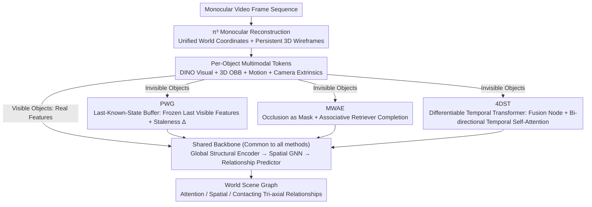

# WSGG: Towards Spatio-Temporal World Scene Graph Generation from Monocular Videos

**Conference**: CVPR 2026  
**arXiv**: [2603.13185](https://arxiv.org/abs/2603.13185)  
**Code**: [https://github.com/rohithpeddi/WorldSGG](https://github.com/rohithpeddi/WorldSGG)  
**Area**: Graph Learning  
**Keywords**: World Scene Graph, Object Permanence, Occlusion Reasoning, 4D Scene Understanding, ActionGenome4D

## TL;DR

This paper proposes the World Scene Graph Generation (WSGG) task, extending traditional frame-level scene graphs to track all objects (including occluded/invisible ones) within a unified world coordinate system. It introduces the ActionGenome4D dataset and three complementary methods—PWG, MWAE, and 4DST—to achieve persistent scene reasoning.

## Background & Motivation

**Background**: Video Scene Graph Generation (VidSGG) represents objects as nodes and relationships as edges, with various Transformer-based methods like STTran. However, current methods are inherently "frame-level"—objects disappear from the graph as soon as they leave the view or become occluded.

**Limitations of Prior Work**: This frame-level representation is severely decoupled from the needs of embodied agents. Robots require persistent memory of the entire environment to know where objects are and their relationships with humans, even when invisible. Existing datasets lack both 3D spatial annotations and relationship annotations for occluded objects.

**Key Challenge**: "Object permanence" from developmental psychology—the understanding that objects do not cease to exist when invisible—is a fundamental capability for physical reasoning, yet current scene graph methods completely lack this ability.

**Goal**: (1) Construct the 4D annotated dataset ActionGenome4D; (2) Formalize the WSGG task; (3) Explore three different inductive biases for handling invisible objects.

**Key Insight**: Utilize the π³ model for monocular 3D reconstruction to obtain a world coordinate system, and use VLMs to generate pseudo-labels for occluded object relationships followed by manual correction.

**Core Idea**: Extend video scene graphs from "visible objects within a frame" to "all objects in the world coordinate system" through feature persistence, masked completion, and temporal attention.

## Method

### Overall Architecture

This paper upgrades video scene graphs from "mapping only visible objects in the current frame" to "tracking all objects (including occluded/off-screen ones) in a unified world coordinate system." Given an input monocular video $V_1^T = \{I^t\}_{t=1}^T$, it outputs world scene graphs $\mathcal{G}_{\mathcal{W}}^t$ at each timestep. The world state $\mathcal{W}^t = \mathcal{O}^t \cup \mathcal{U}^t$ is explicitly split into a visible set $\mathcal{O}^t$ and an invisible set $\mathcal{U}^t$. Each object is anchored by a 3D OBB $\mathbf{b}_k^t \in \mathbb{R}^{8 \times 3}$, and relationships span three axes: attention (3 types), spatial (6 types), and contacting (17 types). The three proposed methods share a common Global Structural Encoder + Spatial GNN + Relationship Predictor; the divergence lies solely in **how features for invisible objects are acquired**. The paper segments "how to achieve object permanence" into three progressive inductive biases for comparison.

### Key Designs

**1. PWG: Buffering with Last-Known-State for Naive Object Permanence**

Addressing the issue where objects vanish from the graph in frame-level methods, PWG maintains a non-differentiable Last-Known-State buffer. While an object is visible, its DINO features $\mathbf{f}_n^{(t)}$ are refreshed in real-time. Once invisible, the features are frozen at the state of the last visible frame. To ensure the downstream modules are aware of how "stale" the features are, the buffer records staleness $\Delta_n^{(t)} = |t - \tau^*|$ (where $\tau^*$ is the last visible moment). Geometry, motion, and context are concatenated with staleness into a token for the Spatial GNN:

$$\mathbf{x}_n^{(t)} = \text{Proj}([\mathbf{g}_n \,\|\, \mathbf{m}_n \,\|\, \mathbf{c}_n \,\|\, \log(\Delta_n + 1)])$$

This is the most direct path to "non-disappearance," but frozen features inevitably distort over time and the buffer is non-differentiable.

**2. MWAE: Treating Occlusion as a Natural Mask for Feature Retrieval**

Unlike PWG, which merely freezes old features, MWAE attempts to "infer" the current state of occluded objects. Drawing from the MAE perspective, it treats occlusion/invisibility as a natural mask. The visual stream of invisible objects is masked, and an Associative Retriever uses asymmetric cross-attention (where all tokens query only visible tokens) to reconstruct missing features. During training, the model learns to "fill in" occluded objects using visible context and 3D geometric priors by simulating occlusions.

**3. 4DST: Differentiable Temporal Transformer for End-to-End History Retrieval**

To overcome information degradation in static buffers or manual masking, 4DST employs a differentiable temporal Transformer. Multimodal tokens (visual, structural, motion, camera) are first aggregated into a Fusion Node, then processed via unmasked bi-directional temporal self-attention across the entire video range. This allows the model to automatically learn how to retrieve information from when an object was previously visible to infer its current invisible state relationships—leading to a nearly 6-point R@20 improvement over PWG for invisible objects.

### Loss & Training

The three methods share a set of losses: Cross-Entropy for the attention axis, Binary Cross-Entropy for the multi-label spatial and contacting axes, and Cross-Entropy for node classification. The ActionGenome4D dataset was constructed using a pipeline of π³ reconstruction + GDINO detection + SAM2 segmentation + VLM pseudo-labeling + manual correction.

## Key Experimental Results

### Main Results

| Method | Type | SGCls R@10 | R@20 | R@50 | PredCls R@10 | R@20 | R@50 |
|------|------|-----------|------|------|-------------|------|------|
| STTran (VidSGG) | Frame-level | 30.2 | 33.8 | 36.1 | 39.5 | 49.2 | 58.4 |
| PWG | WSGG | 27.5 | 31.2 | 34.8 | 35.1 | 44.3 | 53.7 |
| MWAE | WSGG | 29.8 | 33.5 | 37.2 | 38.6 | 48.1 | 57.3 |
| 4DST | WSGG | **31.4** | **35.1** | **38.5** | **41.2** | **51.3** | **60.5** |

### Ablation Study

| Configuration | Visible R@20 | Invisible R@20 | Overall R@20 | Description |
|------|-------------|---------------|----------|------|
| 4DST Full | 35.1 | 28.3 | 33.5 | Best overall performance |
| w/o 3D Geometry | 32.4 | 21.7 | 29.8 | 3D encoding is critical for invisible objects |
| w/o Motion | 34.2 | 25.6 | 32.1 | Motion aids inference |
| w/o Camera Pose | 33.8 | 24.1 | 31.3 | Camera motion helps judge visibility |
| PWG (LKS Buffer) | 33.2 | 22.4 | 30.5 | Non-differentiable buffer performs worst |

### Key Findings
- 4DST is superior across all metrics, especially in predicting relationships for invisible objects (outperforming PWG by 5.9 R@20 points).
- 3D geometric encoding is a core component of WSGG; its removal drops invisible object R@20 by 6.6 points.
- The WSGG task is more challenging yet more meaningful than standard VidSGG, with 4DST even outperforming the frame-level STTran in PredCls.

## Highlights & Insights
- **Precise Task Definition**: Introducing "object permanence" into scene graphs is a natural and significant direction. WSGG is clearly formalized and provides a standardized evaluation framework for future work.
- **Practical Annotation Pipeline**: The pipeline of π³ + GDINO + SAM2 + VLM pseudo-labeling + manual correction demonstrates a feasible path for low-cost 4D annotation.
- **Comprehensive Design Space**: The three methods—from feature buffering to masked completion and differentiable Transformers—provide a reference for different computation-performance trade-offs.

## Limitations & Future Work
- ActionGenome4D is based only on home videos, limiting scene diversity and generalizability to outdoor or industrial settings.
- Pseudo-labels for invisible object relationships depend on VLM quality, which creates a performance ceiling.
- The work focuses on human-object relationships and has not yet extended to object-object relationships.
- π³ reconstruction suffers from pose drift in long sequences, requiring additional BA (Bundle Adjustment) steps.

## Related Work & Insights
- **vs STTran/VidSGG**: Traditional methods only process visible objects within a frame, while WSGG extends to the full world state, representing a qualitative leap.
- **vs 3D/4D SGG**: Existing works perform scene graph generation on point clouds but do not handle relationship persistence for occluded objects.
- **vs RealGraph**: Requires multi-view input, whereas WSGG is more practical as it only requires monocular video.

## Rating
- Novelty: ⭐⭐⭐⭐ Innovative task definition and comprehensive method exploration.
- Experimental Thoroughness: ⭐⭐⭐⭐ Solid combination of dataset, comparative methods, and ablation studies.
- Writing Quality: ⭐⭐⭐⭐ Rigorous formalization and clear structure.
- Value: ⭐⭐⭐⭐ Establishes a new paradigm for embodied AI scene understanding.

<!-- RELATED:START -->

## Related Papers

- [\[CVPR 2026\] Mixture-of-Experts based Feature Decoupling for Open Vocabulary Scene Graph Generation](mixture-of-experts_based_feature_decoupling_for_open_vocabulary_scene_graph_gene.md)
- [\[CVPR 2026\] Robo-SGG: Exploiting Layout-Oriented Normalization and Restitution Can Improve Robust Scene Graph Generation](robo-sgg_exploiting_layout-oriented_normalization_and_restitution_can_improve_ro.md)
- [\[CVPR 2025\] Universal Scene Graph Generation](../../CVPR2025/graph_learning/universal_scene_graph_generation.md)
- [\[NeurIPS 2025\] Spatio-Temporal Directed Graph Learning for Account Takeover Fraud Detection](../../NeurIPS2025/graph_learning/spatio-temporal_directed_graph_learning_for_account_takeover_fraud_detection.md)
- [\[CVPR 2025\] Unbiased Video Scene Graph Generation via Visual and Semantic Dual Debiasing](../../CVPR2025/graph_learning/unbiased_video_scene_graph_generation_via_visual_and_semantic_dual_debiasing.md)

<!-- RELATED:END -->
