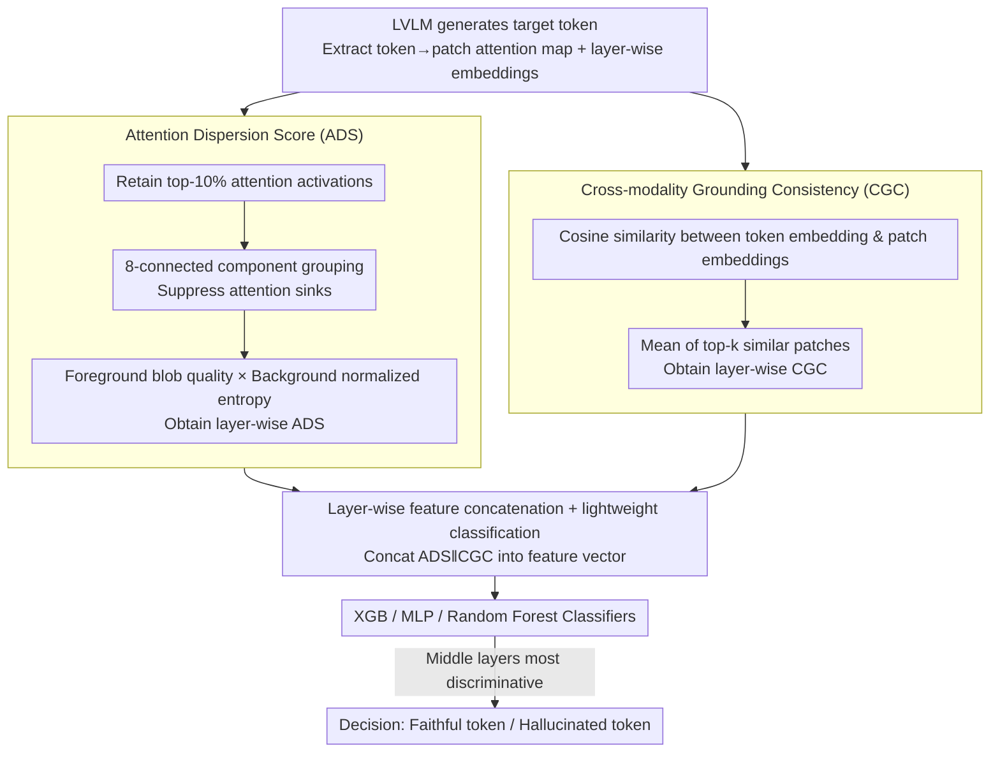

# Beyond the Global Scores: Fine-Grained Token Grounding as a Robust Detector of LVLM Hallucinations

**Conference**: CVPR 2026  
**arXiv**: [2604.04863](https://arxiv.org/abs/2604.04863)  
**Code**: Yes  
**Area**: Hallucination detection  
**Keywords**: hallucination detection, LVLM, attention dispersion, patch-level grounding, token-level

## TL;DR

Ours proposes a patch-level LVLM hallucination detection framework, discovering that hallucinated tokens exhibit dispersed attention patterns and low semantic alignment. Based on these signatures, Attention Dispersion Score (ADS) and Cross-modality Grounding Consistency (CGC) are designed as lightweight metrics, achieving a detection accuracy of 90%.

## Background & Motivation

LVLMs are prone to visual hallucinations—describing objects or attributes not present in the image. Existing detection methods rely on coarse-grained global statistics (e.g., aggregated attention, output probability, global embedding similarity). Such global strategies have fundamental limitations: a hallucinated token might have weak but dispersed correlations with multiple local regions, which, when aggregated, produce deceptively high correlation scores that bypass global detectors.

**Key Insight**: Faithful object tokens must be strongly grounded to specific image regions. Therefore, hallucination detection must shift from global analysis to patch-level grounding analysis.

## Method

### Overall Architecture

This work addresses the limitation where existing detectors only examine globally aggregated attention/probability/similarity, allowing hallucinated tokens to hide behind dispersed correlations. The proposed mechanism sinks the perspective from global to the patch level—analyzing fine-grained interactions between each token and image patches. By extracting structural features like "spatial attention distribution" and "cross-modality semantic alignment," a lightweight classifier is used to identify hallucinations. The pipeline runs two parallel branches: ADS calculated from the attention map and CGC calculated from embedding similarities. These are concatenated across layers into a feature vector for the classifier.

### Key Designs

**1. Attention Dispersion Score (ADS): Distinguishing "Focused" vs "Dispersed" via Spatial Compactness**

**Design Motivation**: Faithful tokens are anchored to specific regions, while hallucinated tokens exhibit dispersed attention. ADS quantifies this by retaining top-k% activations and filtering "attention sinks" (scattered small blobs with area $< \tau_{ADS}$) via 8-connected components. It computes: foreground blob quality $m_t^{(n)} = \sum_{c \in \mathcal{C}_t^{(n)*}} \sum_{p \in c} \bar{\mathbf{A}}_t^{(n)}(p)$ to measure concentration, and background normalized entropy $\hat{H}_t^{(n)} = -\sum_{p \in \mathcal{B}} \mathbf{E}(p) \log \mathbf{E}(p) / \log|\mathcal{P}|$ to measure dispersion. The final score is $ADS_t^{(n)} = (1-m_t^{(n)}) \cdot \hat{H}_t^{(n)}$. Low ADS indicates compact focus (faithful), while high ADS indicates dispersion (hallucination).

**2. Cross-modality Grounding Consistency (CGC): Verifying Semantic Alignment**

ADS only observes distribution; CGC provides semantic evidence. A faithful token should be highly similar to its corresponding image region in the embedding space. CGC computes the cosine similarity between the token embedding and each patch embedding layer-wise, taking the mean of the top-k patches. Faithful tokens exhibit sharp similarity peaks, whereas hallucinated tokens show low, flat similarities across all regions.

**3. Layer-wise Concatenation + Lightweight Classification: Leveraging Middle Layers**

Single-layer analysis is insufficient; thus, ADS and CGC from all layers are concatenated into a feature vector for lightweight classifiers (XGB/MLP/RF). A **Key Finding** is that discriminative power is concentrated in middle layers. Shallow layers lack feature fusion, while deep layers are dominated by language priors, causing the gap between faithful and hallucinated tokens to converge. Middle layers best expose visual grounding.

### Loss & Training

Classifiers are trained using cross-entropy loss. Labels are derived from GPT-4o semantic verification (combining CHAIR metrics and manual descriptions). Experiments are conducted on 4,000 images from MS-COCO 2014 val set, using a 90/10 train/test split.

## Key Experimental Results

### Main Results (Image Captioning Task)

| Method | LLaVA-1.5-7B F1 | Qwen2.5-VL-7B F1 | InternVL2.5-8B F1 |
|------|----------------|------------------|-------------------|
| MetaToken | 0.51 | 0.54 | — |
| SVAR | — | — | — |
| **Ours (XGB)** | **0.90** | **0.88** | **0.88** |

### Key Findings

- Faithful tokens show compact, well-localized attention in early/middle layers; hallucinated tokens show dispersed attention.
- Faithful tokens have high semantic similarity with corresponding patches; hallucinated tokens show low similarity everywhere.
- **Key Insight**: Hallucinations primarily stem from over-reliance on language priors rather than vision encoder failures.
- Middle-layer features are most discriminative; deep layers converge due to language prior dominance.
- ADS alone achieves F1 0.73-0.77; combined with CGC, performance reaches F1 0.88-0.90.
- Labels were determined via GPT-4o semantic verification combined with CHAIR metrics.

## Highlights & Insights

- The perspective shift "from global to local" captures the essence of hallucination detection.
- The 8-connected component filtering and background entropy in ADS elegantly handle the attention sink phenomenon.
- High interpretability—detection results can be explained via attention heatmap visualizations.
- Achieving 90% accuracy with only a lightweight classifier.

## Limitations & Future Work

- Requires white-box access to internal model attention weights.
- Classifiers must be trained individually for each LVLM.
- Evaluated primarily on object-level hallucinations; attribute-level hallucinations remain unexplored.
- While lightweight classifiers like XGB/MLP are interpretable, their ability to capture extremely complex patterns might be limited.
- Deep analysis of existing global methods (like SVAR) reveals their fundamental limitation: dispersed weak correlations aggregate into deceptively high global scores.

## Rating

- **Novelty**: ⭐⭐⭐⭐⭐ — Pioneering work in patch-level hallucination analysis.
- **Technical Depth**: ⭐⭐⭐⭐ — Sophisticated design of ADS and CGC.
- **Experimental Thoroughness**: ⭐⭐⭐⭐ — Validated across multiple models and benchmarks.
- **Value**: ⭐⭐⭐⭐ — A lightweight and interpretable hallucination detector.

<!-- RELATED:START -->

## Related Papers

- [\[CVPR 2026\] Zina: Multimodal Fine-grained Hallucination Detection and Editing](zina_multimodal_fine-grained_hallucination_detection_and_editing.md)
- [\[CVPR 2026\] Fine-Grained Multi-Image Object Hallucination Benchmark](fine-grained_multi_image_object_hallucination_benchmark.md)
- [\[CVPR 2026\] FINER: MLLMs Hallucinate under Fine-grained Negative Queries](finer_mllms_hallucinate_under_fine-grained_negative_queries.md)
- [\[NeurIPS 2025\] Robust Hallucination Detection in LLMs via Adaptive Token Selection](../../NeurIPS2025/hallucination/robust_hallucination_detection_in_llms_via_adaptive_token_selection.md)
- [\[CVPR 2026\] Evaluating and Easing Hallucinations for GUI Grounding](exposing_and_evaluating_hallucinations_for_gui_grounding.md)

<!-- RELATED:END -->
