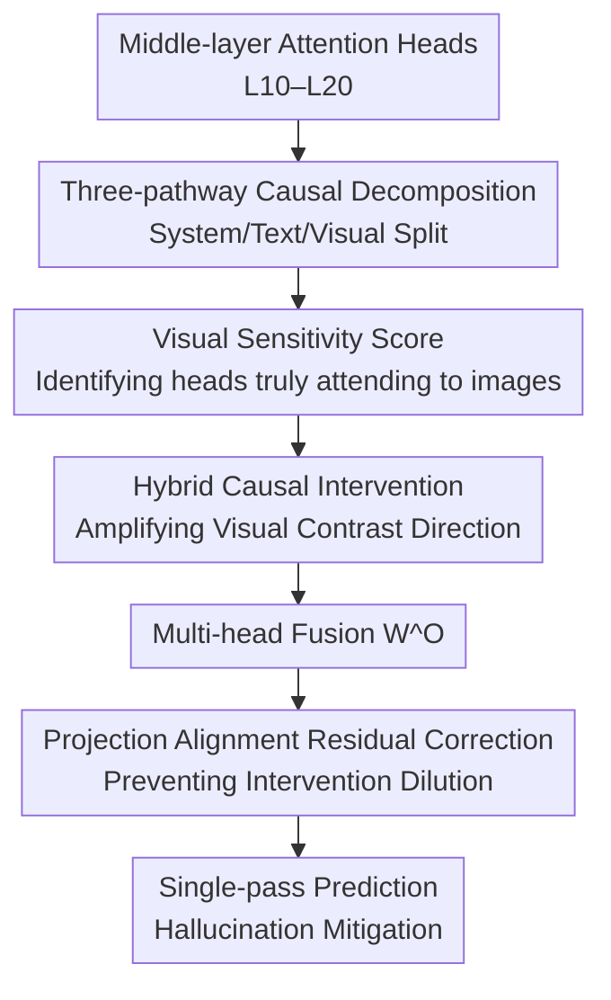

# CausalLens: Sensitivity-Guided Multi-Head Causal Intervention for Hallucination Mitigation in Large Vision-Language Models

**Conference**: CVPR 2026  
**Paper**: [CVF Open Access](https://openaccess.thecvf.com/content/CVPR2026/html/Ji_CausalLens_Sensitivity-Guided_Multi-Head_Causal_Intervention_for_Hallucination_Mitigation_in_Large_CVPR_2026_paper.html)  
**Code**: None  
**Area**: Multimodal VLM / Hallucination Mitigation  
**Keywords**: LVLM Hallucination, Causal Intervention, Attention Head Decomposition, Visual Sensitivity, Training-free Decoding  

## TL;DR
CausalLens decomposes each attention head of the decoder into three pathways—"visual, text, and system prompt"—and identifies heads that truly attend to the image using a visual sensitivity score. By amplifying visual contributions and applying projection alignment corrections in a single forward pass within the middle layers (L10–L20), it significantly reduces hallucinations in Large Vision-Language Models without retraining or multiple decoding iterations.

## Background & Motivation

**Background**: Large Vision-Language Models (LVLMs, such as LLaVA and Qwen2-VL) connect visual encoders to LLMs to perform captioning, VQA, and referring expression comprehension. However, they commonly suffer from "hallucinations"—describing objects, attributes, or relationships that are not present in the image. Current mitigation methods fall into two categories: retraining/instruction fine-tuning, or inference-stage contrastive decoding (e.g., VCD).

**Limitations of Prior Work**: Retraining requires high-quality data, gradient access, and massive computational resources, leading to poor scalability. While contrastive decoding is training-free, it requires running both the "original image" and a "distorted image" (sometimes through multiple iterations), which doubles or quadruples inference latency and memory usage—VCD doubles the latency, while DeGF increases it fourfold. This makes them largely impractical for real-time, low-latency scenarios.

**Key Challenge**: Both categories of methods are stuck on an unfavorable "performance-efficiency" frontier. The goal is a method that is both training-free and single-pass while effectively suppressing hallucinations, which existing paradigms fail to achieve.

**Key Insight**: Instead of operating at the input/output level, the authors perform layer-wise and head-wise attention analysis within the decoder. They discover a structural causal imbalance: visual information is strongly represented only in shallow layers (L0–L2) and decays rapidly in middle and late layers. Conversely, system prompts and text priors dominate from the middle layers (starting at L10), with many heads allocating 60–80% of attention to prompt tokens. This $V \to H_t \to Y_t$ (Vision → Hidden State → Output) causal chain is severed in the middle-to-late layers, causing the model to generate "fluent but ungrounded" text. Crucially, the authors perform causal validation via top-k head ablation on POPE: removing the most sensitive heads causes accuracy to collapse from 0.879 to 0.548 (k=5), while removing the least sensitive heads has almost no effect. This demonstrates that "high-sensitivity heads" are the causal carriers of visual grounding.

**Core Idea**: Rather than running the model multiple times, it is more effective to isolate and amplify the visual contribution of the "heads truly looking at the image" while suppressing linguistic priors in the middle layers, thereby reconnecting the broken visual causal chain in a single forward pass.

## Method

### Overall Architecture

CausalLens is a training-free, single-pass causal intervention framework acting only on the middle layer set $L_{mid}=\{\ell_{10},\dots,\ell_{20}\}$. Its logical chain involves: decomposing each attention head into three pathway contributions based on the key-value sequence segments (system prompt $\mathcal{S}$ / visual $\mathcal{V}$ / text $\mathcal{T}$); using a visual sensitivity score $\hat{s}_{\ell,i}$ to identify heads to be enhanced; applying Hybrid Causal Intervention (HCI) before multi-head fusion to inject weighted visual contrast directions; and finally applying a Projection Alignment Residual Correction (PRC) after fusion to prevent the intervention from being diluted by the output projection matrix $W^O$. This process is embedded within the middle Transformer blocks. Since attention aggregation is additive, adjustments to individual pathways do not break the architecture, making it plug-and-play.

### Key Designs

**1. Three-pathway Causal Decomposition: Separating vision, text, and prompts within heads**

To enhance vision without damaging linguistic fluency, it is necessary to decompose a head's output by its source. The authors exploit the fact that LVLM key-value sequences are organized into three continuous segments: system prompt $\mathcal{S}$, visual $\mathcal{V}$, and text $\mathcal{T}$. Thus, the attention matrix can be sliced column-wise as $A_{\ell,i}^{X}=A_{\ell,i}[:,X],\ X\in\{\mathcal{S},\mathcal{V},\mathcal{T}\}$. Multiplying each slice by its corresponding value yields the hidden state contribution of each pathway: $H_{\ell,i}^{(\mathrm{sys})}=A_{\ell,i}^{\mathcal{S}}V_{\ell,i}^{\mathcal{S}}$, $H_{\ell,i}^{(\mathrm{text})}=A_{\ell,i}^{\mathcal{T}}V_{\ell,i}^{\mathcal{T}}$, and $H_{\ell,i}^{(\mathrm{vis})}=A_{\ell,i}^{\mathcal{V}}V_{\ell,i}^{\mathcal{V}}$. The original head output is the sum of these three:

$$H_{\ell,i}=H_{\ell,i}^{(\mathrm{sys})}+H_{\ell,i}^{(\mathrm{text})}+H_{\ell,i}^{(\mathrm{vis})}.$$

This additive decomposition is critical because it explicitly expresses the "head output" as a linear combination of three causal pathways, allowing for both the independent measurement of visual contribution and surgical intervention on specific pathways without structural changes.

**2. Visual Sensitivity Score: Distinguishing "object-focused" vs. "diffuse" heads**

Not all heads utilize visual information effectively. The authors observe that some heads (Head A) focus attention precisely on target objects (e.g., a chair a dog is sitting on), while others (Head B) spread attention almost uniformly across the image, lacking discriminative power. To quantify this, the visual sensitivity score is defined as:

$$s_{\ell,i}=\frac{\mathrm{Var}(A_{\ell,i}^{\mathcal{V}})}{\mathrm{Mean}(A_{\ell,i}^{\mathcal{V}})+\epsilon},$$

where $A_{\ell,i}^{\mathcal{V}}$ is the normalized attention distribution over visual tokens. The intuition is that higher variance relative to the mean indicates non-uniform attention concentrated on salient regions (strong spatial selectivity and visual causality). Low scores indicate diffuse or text-driven heads. Intra-layer normalization is applied as $\hat{s}_{\ell,i}=s_{\ell,i}\big/\big(\tfrac{1}{H}\sum_{j}s_{\ell,j}+\epsilon\big)$ for head comparison. Ablations show that removing high-$s$ heads leads to accuracy collapse, proving this score's causal significance.

**3. Hybrid Causal Intervention (HCI): Injecting visual contrast directions via sensitivity**

After selecting reliable heads, the visual-text balance must be adjusted before multi-head fusion. A visual contrast direction is defined as $D_{\ell,i}=H_{\ell,i}^{(\mathrm{vis})}-H_{\ell,i}^{(\mathrm{sys})}$ (visual contribution minus system contribution, pointing towards "more visual, less prompt-dominated"). System and text pathways are combined into a text prior term $T_{\ell,i}=H_{\ell,i}^{(\mathrm{sys})}+H_{\ell,i}^{(\mathrm{text})}$. The intervened head output is:

$$H_{\ell,i}^{*}=(1-\gamma)\,H_{\ell,i}+\gamma\!\left(T_{\ell,i}+\lambda\,\hat{s}_{\ell,i}\,D_{\ell,i}\right).$$

Here, $\lambda$ controls visual enhancement strength (set to 0.15), and $\hat{s}_{\ell,i}$ ensures only visually focused heads are amplified. $\gamma$ is an adaptive gate determined by the energy ratio of the system pathway to the visual pathway:

$$\gamma=\frac{\mathbb{E}\,\|H^{(\mathrm{sys})}\|^{2}}{\mathbb{E}\,\|H^{(\mathrm{sys})}\|^{2}+\mathbb{E}\,\|H^{(\mathrm{vis})}\|^{2}+\epsilon}.$$

When the system prior is stronger (weaker vision), $\gamma$ increases, leading to more intervention. The goal is to allow the visual pathway to regain proportional causal influence while retaining the original term $(1-\gamma)H_{\ell,i}$ to maintain linguistic fluency.

**4. Projection Alignment Residual Correction (PRC): Preventing dilution by output projections**

After head intervention, outputs are concatenated and passed through a projection matrix: $H_{\ell}^{fusion}=\mathrm{Concat}(H_{\ell,1}^{*},\dots,H_{\ell,H}^{*})\,W_{\ell}^{O}$. Since $W_{\ell}^{O}$ mixes the outputs into the model's semantic space, enhancements made in the "head space" may be diluted. To counter this, the visual contrast direction is projected onto the output basis to construct a projection alignment residual:

$$\Delta_{\ell}^{proj}=W_{\ell}^{O}\,\mathrm{Concat}\big(H_{\ell,1}^{(\mathrm{vis})}-H_{\ell,1}^{(\mathrm{sys})},\dots\big),$$

which is added back to the fused representation: $\widetilde{H}_{\ell}=H_{\ell}^{fusion}+\lambda\,\Delta_{\ell}^{proj}$. This step aligns local head-space adjustments with global semantics. Ablations indicate that HCI and PRC are complementary.

### Loss & Training

This method is entirely training-free and single-pass, requiring no gradient updates or architectural modifications. The intervention (Algorithm 1) calculates three-pathway contributions and $\hat{s}_{\ell,i}$ for each middle layer $\ell\in L_{mid}$, applies HCI to obtain $H^{*}$, adds the PRC residual after fusion, and outputs logits via $\phi(\widetilde{H})$. Hyperparameters include $\lambda=0.15$ and the middle layer range L10–L20.

## Key Experimental Results

Models: LLaVA-v1.5-7B / 13B, Qwen2-VL-7B; Benchmarks: POPE, MMHAL-Bench, CHAIR, MME, LLaVA-Bench; Baselines: VCD, DeGF, VAF (training-free decoding).

### Main Results (POPE, Average across MS-COCO/A-OKVQA/GQA)

| Setting | Metric | LLaVA-7B | LLaVA-13B | Qwen2-VL-7B |
|------|------|----------|-----------|-------------|
| Random / Regular | Acc | 85.9 | 87.3 | 88.8 |
| Random / VAF | Acc | 89.6 | 90.1 | 90.5 |
| Random / **Ours** | Acc | **90.6** | **90.9** | **91.4** |
| Adversarial / Regular | Acc | 77.9 | 79.7 | 82.6 |
| Adversarial / VAF | Acc | 80.1 | 82.7 | 84.9 |
| Adversarial / **Ours** | Acc | **81.6** | **83.9** | 84.7 |

On Random/Popular/Adversarial sets, CausalLens consistently leads VCD/DeGF/VAF in accuracy and F1. Only on Qwen2-VL-7B (Adversarial) does it slightly trail VAF (84.7 vs 84.9); it is optimal in all other settings.

CHAIR (Caption Hallucination, LLaVA-7B, Max Token 64, Lower is Better):

| Method | CHAIR_S ↓ | CHAIR_I ↓ |
|------|-----------|-----------|
| Regular | 26.4 | 9.7 |
| VCD | 23.1 | 7.7 |
| DeGF | 19.1 | 6.3 |
| VAF | 20.7 | 7.1 |
| **Ours** | **18.7** | **6.2** |

Efficiency (LLaVA-7B, single L40): CausalLens has an average latency of 0.293s (1.04x) and VRAM usage of 16111MB (1.01x). Compared to VCD (2.01x latency) and DeGF (4.07x latency), its overhead is negligible and comparable to VAF. It also excels on MMHAL-Bench and MME subsets.

### Ablation Study (LLaVA-7B, POPE-Popular + CHAIR)

| HCI | PRC | POPE Acc↑ | POPE F1↑ | C_i↓ | C_s↓ |
|-----|-----|-----------|----------|------|------|
| ✗ | ✗ | 82.3 | 82.1 | 26.4 | 9.7 |
| ✓ | ✗ | 84.9 | 85.1 | 21.9 | 7.2 |
| ✗ | ✓ | 84.7 | 84.6 | 22.7 | 7.5 |
| ✓ | ✓ | **86.5** | **86.8** | **18.7** | **6.2** |

Sensitivity to $\lambda$: Performance improves from $\lambda=0.05$ to $0.15$. At $0.15$, POPE Acc and C_s reach optimal levels (86.5 / 6.2). Beyond 0.20, performance degrades, suggesting that excessive visual amplification distorts semantic consistency.

### Key Findings
- **HCI and PRC are complementary**: Neither alone provides full benefits. Together, they improve POPE Acc from 82.3 to 86.5 and reduce C_s from 9.7 to 6.2.
- **Middle layer intervention (L10–L20) is key**: This range corresponds to where visual signals are "swallowed" by linguistic priors, making intervention targeted and computationally efficient.
- **High-sensitivity heads are causal carriers for grounding**: Ablating even one high-$s$ head causes POPE Acc to drop from 0.879 to 0.758, whereas ablating low-$s$ heads has minimal impact. This provides direct causal evidence for focusing intervention on high-$s$ heads.

## Highlights & Insights
- **Reconceptualizing "hallucination" as internal causal imbalance**: By using layer-wise attention maps and top-k head ablation, the authors quantitatively prove that "vision decays while language dominates," allowing for precise middle-layer intervention.
- **The three-pathway decomposition and sensitivity gating are reusable tricks**: Leveraging the KV sequence structure to decompose head outputs into sys/text/vis and screening them via variance/mean ratios is a versatile paradigm for modality-level intervention in Transformers.
- **Achieving training-free SOTA with single-pass efficiency**: Unlike contrastive decoding methods that incur 2–4x latency, this method achieves SOTA results with virtually zero overhead (1.04x latency), making it an ideal candidate for real-time deployment.

## Limitations & Future Work
- **Empirically fixed layer range and $\lambda$**: The L10–L20 range and $\lambda=0.15$ were tuned on LLaVA-7B. Their optimality across different architectures has not been fully explored; the "visual decay zone" likely varies by model.
- **Sensitivity measures "concentration," not "correctness"**: If a head focuses intensely on the wrong image region, the sensitivity score will still amplify it, potentially introducing new hallucinations.
- **Dependency on KV sequence organization**: The three-pathway split assumes visual tokens are organized continuously. Interleaved tokens or different prompt templates would require modifying the slicing logic.
- **Upper limit of intervention under strong priors**: In the most difficult Adversarial settings, the method does not always offer a massive lead, suggesting that the limit of intervening in linguistic priors warrants further study.

## Related Work & Insights
- **vs. VCD (Contrastive Decoding)**: VCD uses blurred image negative samples for contrast, requiring a second model pass and doubling latency. CausalLens restores the visual causal chain in hidden states without negative samples, offering better efficiency and performance.
- **vs. DeGF (Generative Feedback)**: DeGF iteratively queries the model's own output to correct tokens (4.07x latency); CausalLens completes intervention in a single pass.
- **vs. VAF (Attention Filtering)**: VAF increases attention on image regions during decoding. CausalLens differs by specifically amplifying the visual *contribution* of reliable heads rather than all image attention, and includes projection alignment, leading to better results in most settings.

## Rating
- Novelty: ⭐⭐⭐⭐ The combination of causal imbalance diagnosis, three-pathway decomposition, sensitivity gating, and projection alignment is novel and grounded in causal ablation.
- Experimental Thoroughness: ⭐⭐⭐⭐ Extensive benchmarks and multiple backbones, though the layer range scan was not fully systematic.
- Writing Quality: ⭐⭐⭐⭐ Clear logic from motivation to mechanism, with complete algorithms and formulas.
- Value: ⭐⭐⭐⭐⭐ A training-free, single-pass SOTA solution for hallucination mitigation with negligible overhead, highly suitable for real-time deployment.

<!-- RELATED:START -->

## Related Papers

- [\[CVPR 2026\] Prefill-Time Intervention for Mitigating Hallucination in Large Vision-Language Models](prefill-time_intervention_for_mitigating_hallucination_in_large_vision-language_.md)
- [\[CVPR 2026\] VES-RFT: Rewarding Visual Evidence Sensitivity to Mitigate Hallucinations in Large Vision-Language Models](ves-rft_rewarding_visual_evidence_sensitivity_to_mitigate_hallucinations_in_larg.md)
- [\[CVPR 2026\] Envision, Attend, Then Respond: Counterfactual Hallucination Mitigation in Large Vision-Language Models](envision_attend_then_respond_counterfactual_hallucination_mitigation_in_large_vi.md)
- [\[ICML 2026\] Mitigating Hallucinations in Large Vision-Language Models via Causal Route Gating](../../ICML2026/hallucination/mitigating_hallucinations_in_large_vision-language_models_via_causal_route_gatin.md)
- [\[CVPR 2026\] HulluEdit: Single-Pass Evidence-Consistent Subspace Editing for Mitigating Hallucinations in Large Vision-Language Models](hulluedit_single-pass_evidence-consistent_subspace_editing_for_mitigating_halluc.md)

<!-- RELATED:END -->
