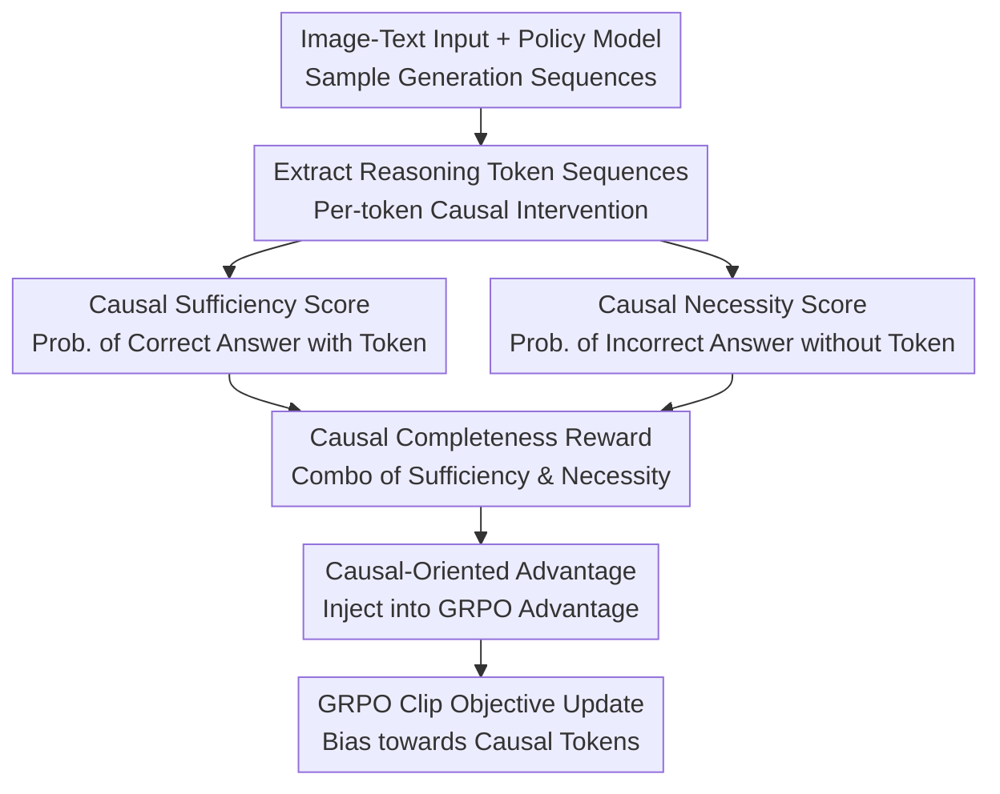

# COPO: Causal-Oriented Policy Optimization for Hallucinations of MLLMs

**Conference**: CVPR 2026  
**Paper**: [CVF Open Access](https://openaccess.thecvf.com/content/CVPR2026/html/Guo_COPO_Causal-Oriented_Policy_Optimization_for_Hallucinations_of_MLLMs_CVPR_2026_paper.html)  
**Code**: To be open-sourced (Original claims "The code will be available at COPO", no actual link provided)  
**Area**: Multimodal VLM / Hallucination Mitigation / RL Post-training  
**Keywords**: Multimodal Hallucination, GRPO, Causal Sufficiency and Necessity, Token-level Reward, Spurious Correlation

## TL;DR
The authors discovered that MLLMs, when post-trained with GRPO (using only outcome rewards based on final answer correctness), tend to over-focus on image backgrounds, forming spurious "background $\to$ answer" correlations that lead to hallucinations. They propose COPO, which calculates a "causal completeness" reward (sufficiency + necessity) for each reasoning token and injects it into the GRPO advantage function. This forces the model to reward only those tokens that truly determine the answer's correctness, consistently reducing hallucination rates across multiple benchmarks such as CHAIR and POPE.

## Background & Motivation
**Background**: A mainstream approach to mitigating MLLM hallucinations is post-training with Reinforcement Learning (especially GRPO) to enhance reasoning capabilities. GRPO scores sampling trajectories based on whether the final answer is correct (reward=1, otherwise 0) and uses intra-group relative advantage to drive the model to explore and reinforce better reasoning paths.

**Limitations of Prior Work**: GRPO was originally designed for pure-text LLMs, where rewards are strictly outcome-based. The authors conducted a key comparative experiment: training an MLLM (image+text input) and an LLM (same question but with text descriptions instead of images) under identical GRPO settings, and then examining their gradient saliency maps. The results showed that **regardless of answer correctness, MLLMs exhibited significantly higher gradient saliency on task-irrelevant background regions compared to LLMs**, while LLM gradients were concentrated on semantic words directly related to the question (e.g., "white bird", "traffic light"). This indicates that MLLMs develop an inappropriate reliance on backgrounds.

**Key Challenge**: Images have much higher information density than text—describing a dog takes a few words, whereas a single image packs in appearance, pose, and environment. With limited visual samples, massive background information spatially overlaps with foreground cues, making it difficult for the model to exclude backgrounds entirely. Since outcome rewards provide positive feedback as long as the final answer is correct—**even if it was reached via background cues**—these "shortcut" paths are reinforced. Over time, the model regards irrelevant backgrounds as predictive signals, establishing spurious correlations between background signals and correct answers.

**Goal**: The authors decompose the problem into two assertions and prove them sequentially: (i) GRPO’s outcome-only rewards induce spurious correlations; (ii) spurious correlations further lead to hallucinations. The mechanism for the second assertion is that during inference, tokens are sampled via Top-K or beam search. Because the model attends to both foreground and background, there is a non-negligible probability in the decoding/selection phase for background features to dominate, ultimately outputting fluent but factually incorrect hallucinations.

**Key Insight**: The authors revisit the MLLM generation process from a causal perspective, constructing Structural Causal Models (SCM) for both data generation and token generation. The input $I=(I_v,I_t)$ is viewed as being generated by two sets of latent factors: $L_c$ (semantic attributes like object existence and category), which is causally related to the answer $Y$, and $L_s$ (background, lighting, etc.), which is non-causal. Ideally, the predicted answer $\tilde{Y}$ should depend only on $L_c$ and remain invariant to $L_s$. The problem transforms into: how to force the model to use only $L_c$ and block $L_s$ when generating tokens.

**Core Idea**: Replace coarse-grained "correct-answer-is-enough" rewards with "causal sufficiency + necessity" constraints. Only tokens that are **both individually helpful for a correct answer (sufficient) and whose absence leads to an incorrect answer (necessary)** deserve high rewards. Background-driven tokens cannot satisfy both, naturally failing to support the spurious $L_s \to \tilde{Y}$ path, thereby reducing hallucinations.

## Method

### Overall Architecture
COPO maintains the core framework of GRPO but modifies the reward/advantage component. In short: **for each reasoning trajectory sampled by the policy model, a "causal completeness reward" is calculated token-by-token and added to the GRPO advantage function, biasing gradients toward tokens that truly determine answer correctness.** The workflow is: policy model $\pi_\theta$ samples a set of sequences (including reasoning and answer tokens) for a given input $\to$ for each reasoning token, sufficiency score $S_\text{suff}$ and necessity score $S_\text{nec}$ are estimated via "masking subsequent tokens" and "masking the token itself" interventions $\to$ these are combined into a causal completeness reward $r_\text{causal}$ $\to$ this is superimposed onto the original GRPO advantage to get the causal-oriented advantage $\hat{A}_{i,t}$ $\to$ the policy is updated using the modified advantage and the standard GRPO clipped objective.

### Key Designs

**1. Causal Sufficiency Score: Can this token save an incorrect answer?**

Sufficiency targets "which reasoning tokens truly help get the answer right." For a token $\bar{o}_t$ in the reasoning sequence $\bar{o}=\{\bar{o}_1,\dots,\bar{o}_{T_{\bar{o}}}\}$, the author constructs an intervention: keep prefix $\bar{o}_{\le t}$ and mask subsequent tokens, then let the model complete the sequence $H$ times starting from $\bar{o}_{\le t}$ and $\bar{o}_{<t}$ respectively, obtaining answer sets $\{\tilde{Y}^k_{(t)}\}$ (with $\bar{o}_t$) and $\{\tilde{Y}^k_{(t-1)}\}$ (without $\bar{o}_t$). The sufficiency score is defined as:

$$S_\text{suff}(\bar{o}_t) = \frac{1}{H}\sum_{k=1}^{H}\big(r(\tilde{Y}^k_{(t)}) - r(\tilde{Y}^k_{(t-1)})\big)\cdot \mathbb{I}\big(r(\tilde{Y}^k_{(t)}) > r(\tilde{Y}^k_{(t-1)})\big)$$

Simply put: how much higher is the reward of the answer generated with this token compared to without it? It only accumulates when the addition "actually helps" (indicator function is 1), and averages over $H$ samplings to offset decoding randomness. A higher $S_\text{suff}$ indicates $\bar{o}_t$ can independently trigger the correct answer. In the paper's example, "dog" (subject) has 0.87 sufficiency, "brown" (color) 0.68, while articles like "a" or "the" are near 0, and the hallucinated "sunset" (though the image is daytime) is only 0.09.

**2. Causal Necessity Score: Does the answer collapse without this token?**

Necessity is the dual of sufficiency, measuring "whether the answer becomes wrong if it's missing." The authors use masking as a counterfactual intervention: replacing $\bar{o}_t$ with a mask token (zero value) to get $\bar{o}^\text{mask}_{(t)}$. The model generates a new answer $\tilde{Y}^\text{mask}_{(t)}$ based on this. The necessity score is the difference in rewards between the original and masked answers:

$$S_\text{nec}(\bar{o}_t) = r(\tilde{Y}) - r(\tilde{Y}^\text{mask}_{(t)})$$

A larger difference indicates the token is more indispensable for correctness. Unlike sufficiency, necessity **does not use multi-sample averaging**. The reasoning is that most MLLMs already incorporate mechanisms like Top-K or beam search when generating from a reference sequence, making further averaging redundant. This design choice makes necessity computation more efficient.

**3. Causal Completeness Reward: Only sufficient AND necessary tokens count**

Looking at sufficiency or necessity in isolation is insufficient—a token might be "helpful but optional" (sufficient but not necessary) or "allow a correct answer, but so would alternatives." To lock onto tokens that are **both helpful and irreplaceable**, the authors combine both normalized scores $[0,1]$ via convex combination:

$$r_\text{causal}(\bar{o}_t) = \lambda_s \cdot S_\text{suff}(\bar{o}_t) + \lambda_n \cdot S_\text{nec}(\bar{o}_t)$$

where $\lambda_s, \lambda_n \in [0,1]$ are weights. This reward is naturally unfavorable to background-driven tokens: they are rarely sufficient to independently save an answer and are easily replaced (low necessity). Consequently, the $L_s \to \tilde{Y}$ spurious path is not reinforced. In the paper's example, "dog" gets 0.59 completeness and "grass" 0.46, while hallucinated or modifier words like "sunset" or "quickly" stay around 0.05.

**4. Causal-Oriented Advantage and COPO Objective: Injecting Causal Signals into GRPO**

With token-level rewards, the key is affecting the gradient. While retaining GRPO’s intra-group relative advantage $A^\text{orig}_{i,t}=A_i$ (calculated via $A_i=\frac{r_i-\text{mean}(r_{1..G})}{\text{std}(r_{1..G})}$), the authors add the causal completeness reward **only for reasoning tokens**:

$$\hat{A}_{i,t} = A^\text{orig}_{i,t} + r^\text{causal}_{i,t},\quad \text{s.t. } o^i_t\in\bar{o}^i$$

Answer tokens still use the original advantage, while reasoning tokens superimpose their causal contribution. A clever detail: $\lambda_s, \lambda_n$ not only tune the ratio of sufficiency/necessity but also control the overall injection intensity of the causal reward. Finally, $\hat{A}_{i,t}$ is fed back into the standard GRPO clip objective:

$$J_\text{COPO}(\theta) = \mathbb{E}\Big[\frac{1}{G}\sum_{i=1}^{G}\frac{1}{T_i}\sum_{t=1}^{T_i}\big(\min(\rho_{i,t}\hat{A}_{i,t},\,\Psi(\hat{A}_{i,t})) - \beta\,\mu(\pi_\theta)\big)\Big]$$

where $\rho_{i,t}$ is the importance weight, $\Psi(\hat{A}_{i,t})=\text{clip}(\rho_{i,t},1-\epsilon,1+\epsilon)\cdot\hat{A}_{i,t}$, and $\mu(\pi_\theta)$ is the KL penalty. This preserves GRPO’s stability and contrastive nature while adding token-level causal supervision.

### Mechanism: Scoring a Caption Token-by-Token
For "A brown dog jumps quickly to catch a red frisbee during sunset on the grass," COPO provides triples (Suff/Nec/Causal Reward): Main subjects and attributes get high scores—"dog" (0.87/0.81/0.59), "brown" (0.68/0.54/0.43), "frisbee" (0.65/0.63/0.45); functional words are near zero—"a", "the", "to" are between 0.01~0.02; **hallucinated tokens** like "sunset" (image is daytime) only get 0.09/0.03/0.04, and the modifier "quickly" gets 0.11/0.03/0.05. The advantage function amplifies gradients for grounded tokens and suppresses those for hallucinations, teaching the model to "speak based on sight, not imagination."

## Key Experimental Results

### Main Results
Evaluated on four representative MLLMs (InstructBLIP / MiniGPT-4 / LLaVA-1.5 / Qwen-VL, all 7B) using CHAIR (sentence-level CHAIR$_S$↓, instance-level CHAIR$_I$↓) and POPE (F1↑) for object hallucination. COPO achieved SOTA across all models:

| Model | Metric | Prev. SOTA (GCPO/CSR) | COPO | Gain |
|------|------|------|------|------|
| InstructBLIP | CHAIR$_S$↓ | 38.2 | 35.9 | ↓1.7 |
| InstructBLIP | POPE↑ | 85.9 | 86.9 | ↑1.0 |
| MiniGPT-4 | CHAIR$_S$↓ | 21.9 | 20.6 | ↓1.3 |
| MiniGPT-4 | POPE↑ | 78.6 | 80.1 | ↑1.5 |
| LLaVA-1.5 | CHAIR$_I$↓ | 5.8 | 5.3 | ↓0.5 |
| LLaVA-1.5 | POPE↑ | 87.2 | 88.0 | ↑0.8 |
| Qwen-VL | CHAIR$_S$↓ | 19.9 | 18.8 | ↓1.1 |
| Qwen-VL | POPE↑ | 86.5 | 88.3 | ↑1.5 |

GPT-4o auxiliary evaluation (scoring Accuracy A, Correctness C, and Detailedness D) also shows leadership:

| Metric | Vanilla | DeCo (2nd Best) | COPO | Gain |
|------|---------|------|------|------|
| Accuracy A | 5.21 | 7.42 | 8.71 | ↑1.29 |
| Correctness C | 6.31 | 6.25 | 6.89 | ↑0.57 |
| Detailedness D | 8.18 | 7.96 | 9.58 | ↑1.40 |

Notably, while reducing hallucinations, COPO achieves the highest detailedness (9.58), indicating it reduces hallucinations not by "speaking less" but by being more grounded.

### Ablation Study
Removing components of the causal completeness reward (on LLaVA-1.5, including MME and GPT-4 dimensions):

| Config | CHAIR$_S$↓ | CHAIR$_I$↓ | POPE↑ | MME↑ | A | C | D |
|------|------|------|------|------|---|---|---|
| Complete COPO | 19.8 | 5.3 | 88.0 | 1589.3 | 8.71 | 6.89 | 9.58 |
| w/o $S_\text{suff}$ | 21.7 | 7.5 | 86.7 | 1531.5 | 7.78 | 6.21 | 8.89 |
| w/o $S_\text{nec}$ | 22.5 | 6.9 | 87.0 | 1522.3 | 7.81 | 6.18 | 8.75 |
| w/o both | 30.5 | 10.9 | 85.9 | 1489.2 | 7.21 | 5.77 | 8.19 |

### Key Findings
- **Sufficiency and necessity are both vital and synergistic**: Removing either increases CHAIR$_S$ from 19.8 to around 21-22. However, removing **both** (degrading to near-pure GRPO) spikes CHAIR$_S$ to 30.5 and doubles CHAIR$_I$ to 10.9—proving the gains come from the joint constraint rather than simple addition.
- **Necessity is slightly more critical**: Removing $S_\text{nec}$ (CHAIR$_S$ 22.5) impacts performance more than removing $S_\text{suff}$ (21.7), supporting the intuition that "it breaks without it" is a stronger causal signal.
- **Hyperparameter sensitivity is mild**: Grid searching $\lambda_s, \lambda_n$ in $[0,1]$ shows POPE F1 fluctuating between 86.4 and 88.4. The optimum at $\lambda_s=\lambda_n=0.35$ suggests the method is robust to weight tuning.
- **Gradient saliency visualization supports the mechanism**: With COPO, model gradients on background regions significantly shrink and concentrate on actual objects, verifying the design goal of suppressing spurious background correlations.

## Highlights & Insights
- **Dual Empirical+Theoretical argument for the "Spurious Correlation $\to$ Hallucination" chain**: Using the MLLM vs. LLM gradient saliency control experiment provides empirical evidence, while the SCM formalizes background latent factors $L_s$. This foundation is more robust than simply proposing a new loss that happens to work.
- **Approximating counterfactuals with "masking interventions" for token-level attribution**: This successfully translates the abstract concept of causal sufficiency/necessity (Pearl's PNS concept) into computable rewards. The asymmetric design (multi-sampling for sufficiency, single-forward for necessity) shows careful engineering consideration.
- **High reusability**: By adding a term to the advantage function without altering the GRPO framework, COPO has low migration costs—any MLLM already using GRPO post-training can directly adopt this reward system.
- **Reducing hallucinations without sacrificing detail**: COPO proves that lower hallucination rates and higher detailedness are not mutually exclusive, whereas many prior methods make models "conversational but conservative" to avoid errors.

## Limitations & Future Work
- **High computational overhead for token-level interventions**: Sufficiency requires $H$ completions for every reasoning token, and necessity requires another masked forward pass. This is a significant extra cost during training (⚠️ Detailed in Appendix, not quantified in the main text).
- **Masking $\approx$ Counterfactual is an approximation**: Using zero-valued tokens for "removal of causal influence" doesn't perfectly equate to a token "never existing." The bias introduced by this approximation remains unexplored.
- **Dependence on a verifiable outcome reward $r(\cdot)$**: Sufficiency/necessity scores rely on being able to judge the answer as correct or incorrect. Defining $r$ for open-ended generation or tasks lacking ground truth (e.g., fine-grained captioning) requires additional design.
- **Modest performance gains**: Improvements on CHAIR/POPE are often around $\pm 1$ point. While consistent, it is not a revolutionary jump; performance on harder reasoning/math hallucination benchmarks is relegated to the Appendix.

## Related Work & Insights
- **vs. GRPO (Baseline)**: GRPO uses only outcome rewards and spreads credit across the whole trajectory. COPO adds token-level causal credit assignment for reasoning tokens, answering "why" a token contributed to the outcome.
- **vs. GCPO**: While both use SCMs for policy optimization, GCPO handles dependencies between candidate answers (causal projection) for LLMs. COPO focuses on MLLM hallucinations and descends to the granularity of token-level sufficiency/necessity.
- **vs. Decoding-time suppression (DoLa / OPERA / VCD / DeCo)**: These adjust decoding distributions during inference without weight updates. COPO is a post-training method that addresses background reliance at the source, generally achieving lower hallucination rates.
- **vs. Preference Alignment (HA-DPO / POVID / CSR)**: These rely on constructing preference pairs for DPO. COPO requires no paired data, driven instead by automatically calculated token-level causal rewards, reducing the burden of data construction.

## Rating
- Novelty: ⭐⭐⭐⭐⭐ Bringing causal sufficiency/necessity (PNS) to token-level rewards in GRPO is a fresh and well-argued perspective.
- Experimental Thoroughness: ⭐⭐⭐⭐ Multiple models and benchmarks plus ablations and visualizations, though training costs are not quantified and main-table gains are modest.
- Writing Quality: ⭐⭐⭐⭐⭐ Clear logical flow from empirical findings to causal modeling to methodology, with well-integrated formulas and examples.
- Value: ⭐⭐⭐⭐ Highly reusable and plug-and-play, while exposing the significant phenomenon that MLLMs are more prone than LLMs to learning background shortcuts.

<!-- RELATED:START -->

## Related Papers

- [\[CVPR 2025\] Seeing Far and Clearly: Mitigating Hallucinations in MLLMs with Attention Causal Decoding](../../CVPR2025/hallucination/seeing_far_and_clearly_mitigating_hallucinations_in_mllms_with_attention_causal_.md)
- [\[CVPR 2026\] Tell Model Where to Look: Mitigating Hallucinations in MLLMs by Vision-Guided Attention](tell_model_where_to_look_mitigating_hallucinations_in_mllms_by_vision-guided_att.md)
- [\[CVPR 2026\] FINER: MLLMs Hallucinate under Fine-grained Negative Queries](finer_mllms_hallucinate_under_fine-grained_negative_queries.md)
- [\[ICLR 2026\] Cat-PO: Cross-modal Adaptive Token-rewards for Preference Optimization in Truthful Multimodal LLMs](../../ICLR2026/hallucination/cat-po_cross-modal_adaptive_token-rewards_for_preference_optimization_in_truthfu.md)
- [\[ICML 2026\] Learning from Fine-Grained Visual Discrepancies: Mitigating Multimodal Hallucinations via In-Context Visual Contrastive Optimization](../../ICML2026/hallucination/learning_from_fine-grained_visual_discrepancies_mitigating_multimodal_hallucinat.md)

<!-- RELATED:END -->
