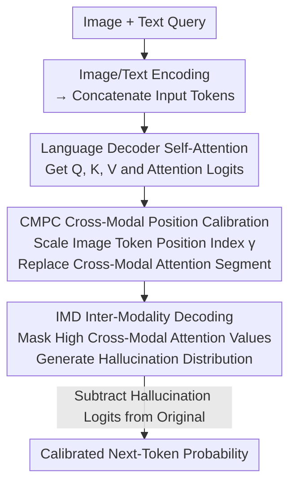

# Cross-Modal Attention Calibration for LVLM Hallucination Mitigation

**Conference**: CVPR 2026  
**Paper**: [CVF Open Access](https://openaccess.thecvf.com/content/CVPR2026/html/Li_Cross-Modal_Attention_Calibration_for_LVLM_Hallucination_Mitigation_CVPR_2026_paper.html)  
**Code**: https://github.com/lijm48/IMCCD  
**Area**: Multimodal VLM  
**Keywords**: LVLM Hallucination, Contrastive Decoding, Cross-modal Attention, Position Bias, Training-free  

## TL;DR
To mitigate hallucinations in LVLMs, this paper proposes CMAC, a training-free cross-modal attention calibration framework. It uses the IMD module to perform "surgical" masking of high cross-modal weight value vectors in the attention layer to construct a more accurate hallucination distribution for contrastive decoding. Additionally, the CMPC module scales the position indices of image tokens to alleviate the position bias introduced by RoPE. CMAC consistently outperforms existing contrastive decoding methods across POPE, CHAIR, and MME.

## Background & Motivation
**Background**: LVLMs (e.g., LLaVA-1.5, InstructBLIP, Qwen-VL) show strong performance in image-text understanding, but frequently suffer from hallucinations during generation—producing fluent text that contradicts the image content. Among training-free inference-time interventions, Contrastive Decoding (CD) has gained significant attention. CD artificially creates a "hallucination-prone" distorted input to generate a hallucination distribution, which is then subtracted from the original distribution to suppress hallucinations.

**Limitations of Prior Work**: The authors identify two overlooked fundamental flaws in existing CD methods (such as VCD using visual noise, ICD using negative instruction prefixes, or token pruning). First, they only address "unimodal over-reliance" (models ignoring the image or text) and fail to distinguish between **true visual correlations** and **spurious cross-modal correlations**. LVLMs learn superficial associations from web data, such as "food often co-occurs with tables"; thus, an image of food may trigger a hallucination of a non-existent table. Global visual distortion in CD is too coarse to penalize such specific spurious correlations. Second, the authors discover a systematic **position bias** in cross-modal attention: hallucinations are more likely to occur for objects corresponding to the **earlier** positions in the image token sequence.

**Key Challenge**: The root of the position bias lies in the RoPE (Rotary Positional Embedding) used in language decoders. Since images are embedded as tokens and interleaved with text for auto-regressive generation, this architecture naturally biases the model towards the **latter** part of the visual sequence, leading to the omission of early visual content and subsequent hallucinations. Existing training-free methods address neither spurious cross-modal correlations nor position bias.

**Goal**: To simultaneously address "spurious cross-modal correlations" and "position bias"—two overlooked sources of hallucination—without requiring training or weight modifications.

**Key Insight**: Instead of globally distorting the image or text at the input level, it is more effective to perform precise interventions **inside the attention layer**. By only modifying the value vectors corresponding to high cross-modal attention weights, one can construct a hallucination distribution that exposes both spurious correlations and unimodal reliance, while accelerating inference by reusing intermediate values from the original forward pass.

**Core Idea**: Replace "global input distortion" with "selective masking of attention layer values" to construct the hallucination distribution (IMD), and use "position index scaling" to flatten the position bias of RoPE (CMPC).

## Method

### Overall Architecture
CMAC (Cross-Modal Attention Calibration) is a **training-free** framework integrated into the inference process of LVLM language decoders. It consists of two complementary modules: **IMD** (Inter-Modality Decoding) to eliminate spurious cross-modal correlations, and **CMPC** (Cross-Modal Position Calibration) to eliminate position bias.

Reviewing LVLM decoding notation: image tokens $X=\{x_i\}$ and text tokens $T$ are concatenated as $[T_{0:m_b}, X, T_{m_b+1:m}]$ (where $T_{0:m_b}$ is the system prompt and $T_{m_b+1:m}$ is the query). Self-attention layers map hidden states to $Q, K, V$, RoPE adds positional information to $Q, K$ (rotation matrix $R^i$, position index $P=[\{i\}_{i=1}^{m+n}]$), the attention matrix is $A=\text{softmax}(A^l)=\text{softmax}(Q_pK_p^T/\sqrt{d})$, and the output is $O=AV$. Standard contrastive decoding is defined as:

$$p_\theta(Y_t|T,X)=\text{softmax}((1+\alpha)\,l_t-\alpha\,\widetilde{l}_t)$$

where $l_t$ represents the original logits, $\widetilde{l}_t$ represents the distorted input logits, and $\alpha$ controls the contrast strength. The key to CMAC is **a different way to generate $\widetilde{l}_t$**: rather than distorting the input, it distorts internal attention values and replaces the cross-modal segments with positional attention calibrated by CMPC before feeding them to IMD. The inference flow is shown below:

### Key Designs

**1. IMD: Surgical Intervention on Attention Values to Construct Hallucination Distributions**

This design directly addresses the limitation that "existing CD cannot distinguish true correlations from spurious ones." The authors observe that in cross-modal attention, **high-weight** positions typically correspond to strong associations the model relies on (which could be valid or spurious), while **low-weight** positions represent weak associations and unimodal knowledge exchange. Thus, IMD selectively suppresses values at high-weight positions to the mean, rather than distorting the whole image.

Specifically, the cross-modal segment $A^l_{cross}=A^l[m_b+n:m+n,\ m_b:m_b+n]$ (text tokens' attention to image tokens) is extracted from the attention logits. An adaptive binary mask is generated based on magnitude:

$$M_{cross}=\mathbb{I}\!\left(A^l_{cross}>\mu(A^l_{cross})\right)$$

where $\mu(\cdot)$ is the mean and $\mathbb{I}$ is the indicator function—cross-modal attention higher than the mean is marked as a "significant correlation." After zero-padding $M_{cross}$ to a global mask $M$, IMD does not prune tokens; instead, it uses the dimension-wise mean $\mu(V)$ as the "distorted value" and performs weighted fusion:

$$\widetilde{O}=(M\cdot A)\,\mu(V)+((1-M)\cdot A)\,V$$

Meaning: values corresponding to high cross-modal attention are replaced by the mean (erasing content), while others remain unchanged. The resulting $\widetilde{O}\to\widetilde{l}_t$ exposes both "unimodal over-reliance" and "spurious cross-modal correlation" failures. Substituting this into the CD formula $\text{softmax}((1+\alpha)l_t-\alpha\widetilde{l}_t)$ suppresses both. Compared to traditional CD, IMD offers three advantages: ① It only affects cross-modal segments, preserved low-weight associations and intra-modal knowledge; ② It does not modify the attention **weights** themselves (only the values), avoiding over/under-estimation of hallucinated regions; ③ The visual forward pass remains unchanged, allowing $K,V$ and attention weights to be reused for faster inference.

**2. CMPC: Scaling Image Token Position Indices to Flatten RoPE Position Bias**

While IMD solves cross-modal correlation issues, the model still biases focus toward the latter part of the image sequence due to RoPE, causing hallucinations of early objects. CMPC targets this by modifying the **position indices** of image tokens rather than content. It replaces the original indices $P=[\{i\}_{i=1}^{m+n}]$ with scaled ones:

$$P^c=\left[\{i\}_{i=1}^{m_b},\ \Big\{m_b+\tfrac{i}{\gamma}\Big\}_{i=1}^{n},\ \Big\{i+\tfrac{n}{\gamma}\Big\}_{i=m_b+1}^{m}\right]$$

where $\gamma$ is the scaling factor (set to $\gamma=2$ in experiments). This effectively compresses the positional gap between image tokens by $\gamma$ times, reducing their differences in RoPE rotation angles so that early image tokens are no longer "neglected"; meanwhile, global positional relationships remain preserved. The calibrated attention logits $A^c$ are recalculated using $P^c$, and only the cross-modal segment is replaced:

$$\widetilde{A}^l_{i,j}=\begin{cases}A^c_{i,j}, & j>m_b+n \text{ and } m_b+n>i\ge m_b\\ A^l_{i,j}, & \text{otherwise}\end{cases}$$

This applies calibrated positional attention only to the "text query looking at image tokens" segment. This $\widetilde{A}^l$ is used for both the original and IMD-distorted branches, encouraging the decoder to prioritize image content over token position throughout the CD process.

### Loss & Training
**Entirely training-free**, with no parameter updates or fine-tuning. Hyperparameters: scaling factor $\gamma=2$, contrast strength $\alpha=3$, top-$p=1$ during sampling, other settings following VCD. Baselines include LLaVA-1.5, InstructBLIP, and Qwen-VL (all using Vicuna-7B as the LLM).

## Key Experimental Results

### Main Results
**POPE (Object Existence Hallucination, Acc/F1)** — CMAC leads across three bases and three sampling strategies (Random/Popular/Adversarial). Typical values for LLaVA-1.5 with Nucleus sampling:

| Setting | Metric | Baseline | VCD | PAI (Runner-up) | CMAC (Ours) |
|------|------|----------|-----|-----------|------------|
| Random | Acc | 83.49 | 86.84 | 87.73 | **89.10** |
| Popular | Acc | 79.98 | 82.65 | 83.45 | **86.0** |
| Adversarial | Acc | 76.03 | 77.31 | 78.36 | **81.41** |
| Adversarial | F1 | 76.26 | 79.28 | 78.53 | **81.84** |

**CHAIR (Long-text Image Captioning Hallucination, lower is better)** — LLaVA-1.5 achieves a 9.6% reduction in $C_i$ and 5.1% in $C_s$ compared to the baseline. InstructBLIP drops by 6.4% / 3.5% respectivey, with higher F1 (more accurate and complete descriptions):

| Base | Method | $C_i$↓ | $C_s$↓ | Recall↑ | F1↑ |
|------|------|--------|--------|---------|-----|
| LLaVA-1.5 | Sampling | 55.6 | 17.8 | 72.4 | 77.0 |
| LLaVA-1.5 | VCD | 54.2 | 16.4 | 76.7 | 80.0 |
| LLaVA-1.5 | **Ours** | **47.0** | **12.7** | 75.6 | **81.0** |
| Qwen-VL | Sampling | 44.8 | 11.3 | 74.6 | 81.1 |
| Qwen-VL | **Ours** | **41.2** | **10.6** | 75.4 | **81.8** |

**MME Hallucination Subset (4 Categories, higher is better)** — LLaVA-1.5 improves in Count (+17.50), Position (+8.50), and Color (+5.42), with overall score increasing from 566.67 to 612.49, demonstrating generalization beyond object existence. Of 14 MME sub-tasks, CMAC leads in 10, though performance is weaker in numerical calculation and translation (which rely on language reasoning).

### Ablation Study
**Core Module Ablation (LLaVA-1.5, POPE Popular + CHAIR)**:

| IMD | CMPC | POPE Acc | POPE F1 | $C_i$↓ | $C_s$↓ |
|-----|------|----------|---------|--------|--------|
| | | 79.98 | 79.34 | 55.6 | 17.8 |
| ✓ | | 85.10 | 84.68 | 48.2 | 13.6 |
| | ✓ | 82.31 | 81.86 | 54.2 | 16.2 |
| ✓ | ✓ | **86.04** | **85.70** | **47.0** | **12.7** |

**Distortion Type Ablation** (Verifying that "value mean masking" is superior):

| Distortion Type | POPE Acc | POPE F1 | $C_i$↓ | $C_s$↓ |
|----------|----------|---------|--------|--------|
| Attention mask (Weight pruning) | 84.92 | 85.21 | 48.4 | 13.9 |
| Value noise (VCD-style noise) | 85.72 | 85.60 | 49.5 | 13.8 |
| **Value mask (Ours, mean-based)** | **86.04** | **85.70** | **47.0** | **12.7** |

### Key Findings
- **IMD is the primary driver**: Adding IMD alone boosts POPE Acc by 5.12% and F1 by 5.34%. CMPC adds an additional ~1.02% F1 and provides gains in long-sequence generation (CHAIR), showing complementarity.
- **"Modify values, not weights" works better**: Ablations show that masking attention weights (Attention mask) is inferior to masking values, confirming that modifying weights leads to regional over/under-estimation of hallucinations.
- **Specialization in visual hallucinations**: CMAC significantly improves perception tasks but shows limited gains in numerical/translation tasks, which rely on language reasoning rather than visual understanding.

## Highlights & Insights
- **Moving Contrastive Decoding from "Input" to "Attention Layer"**: While traditional CD distorts whole images, CMAC performs "surgical" mean-masking on high cross-modal weight values. This precise intervention is faster due to intermediate value reuse and can be applied to any CD-based method.
- **Adaptive Selection using Attention Magnitudes**: Using the mean of cross-modal attention as a threshold for binary masks ($\mathbb{I}(A^l_{cross}>\mu)$) provides an adaptive way to distinguish between strong and weak correlations without manual tuning.
- **Diagnosis and Lightweight Cure for Position Bias**: The "neglect of early visual tokens" is traced to RoPE rotation angles and solved with a one-line position index scaling formula $m_b+i/\gamma$. It requires no weight changes or extra compute, representing an elegant "diagnosis-treatment" pairing.

## Limitations & Future Work
- The authors admit limited improvements on MME sub-tasks like numerical calculation, translation, and code reasoning, as these are bounded by the language decoder's reasoning capacity rather than visual understanding.
- Contrastive decoding introduces an extra logits estimation pass. Although IMD is claimed to be faster than other CD methods (reusing visual forward passes), it still incurs more overhead than greedy/sampling decoding; explicit latency comparisons were not provided.
- The two key hyperparameters $\gamma=2$ and $\alpha=3$ are empirically set. Their sensitivity and adaptive selection across different bases/datasets were not fully explored. 

## Related Work & Insights
- **vs VCD**: VCD adds noise to the input image to create a hallucination distribution, targeting only unimodal over-reliance. CMAC masks high-weight cross-modal values within the attention layer, addressing both unimodal reliance and spurious cross-modal correlations.
- **vs ICD**: ICD uses negative character prefixes to implicitly distort instructions (text-side). CMAC intervenes directly inside cross-modal attention and additionally handles RoPE position bias ignored by ICD/VCD.
- **vs OPERA / PAI**: Like these, CMAC is a training-free inference method. However, PAI and others modify visual-to-text attention weights, potentially causing hallucination estimation errors. CMAC's "modify values, not weights" approach yields clear improvements over the runner-up PAI in POPE.

## Rating
- Novelty: ⭐⭐⭐⭐ "Attention value masking + RoPE position index scaling" are both novel and clearly diagnosed, though they remain within the larger CD framework.
- Experimental Thoroughness: ⭐⭐⭐⭐ Covered 3 bases × 3 benchmarks (POPE/CHAIR/MME) with discriminative and generative tasks. Needs more latency data.
- Writing Quality: ⭐⭐⭐⭐ Clear chain of Problem-Diagnosis-Solution with complete formulas and diagrams.
- Value: ⭐⭐⭐⭐ Training-free, plug-and-play, and adaptable to other CD methods. Highly practical for mitigating LVLM hallucinations.

<!-- RELATED:START -->

## Related Papers

- [\[CVPR 2026\] AdaIAT: Adaptively Increasing Attention to Generated Text to Alleviate Hallucinations in LVLM](adaiat_adaptively_increasing_attention_to_generated_text_to_alleviate_hallucinat.md)
- [\[CVPR 2026\] MAD: Modality-Adaptive Decoding for Mitigating Cross-Modal Hallucinations in Multimodal Large Language Models](mad_modality-adaptive_decoding_for_mitigating_cross-modal_hallucinations_in_mult.md)
- [\[AAAI 2026\] InEx: Hallucination Mitigation via Introspection and Cross-Modal Multi-Agent Collaboration](../../AAAI2026/hallucination/inex_hallucination_mitigation_via_introspection_and_cross-mo.md)
- [\[CVPR 2026\] Same Attention, Different Truths: Put Logit-Lens over Visual Attention to Detect and Mitigate LVLM Object Hallucination](same_attention_different_truths_put_logit-lens_over_visual_attention_to_detect_a.md)
- [\[ICML 2026\] Capturing Gaze Shifts for Guidance: Cross-Modal Fusion Enhancement for VLM Hallucination Mitigation](../../ICML2026/hallucination/capturing_gaze_shifts_for_guidance_cross-modal_fusion_enhancement_for_vlm_halluc.md)

<!-- RELATED:END -->
