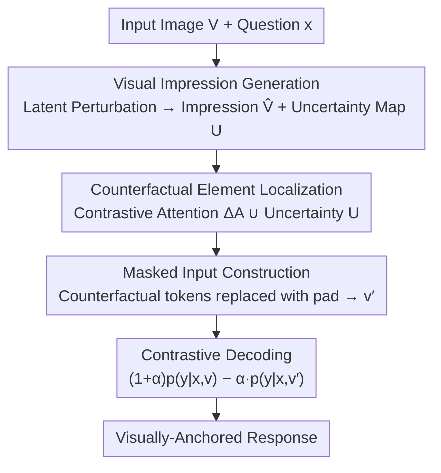

# Envision, Attend, Then Respond: Counterfactual Hallucination Mitigation in Large Vision-Language Models

**Conference**: CVPR 2026  
**Paper**: [CVF Open Access](https://openaccess.thecvf.com/content/CVPR2026/html/Liang_Envision_Attend_Then_Respond_Counterfactual_Hallucination_Mitigation_in_Large_Vision-Language_CVPR_2026_paper.html)  
**Code**: https://github.com/Lyxxx1211/CVPR2026-EnAR  
**Area**: Multi-modal VLM / Hallucination Suppression  
**Keywords**: Counterfactual hallucination, Contrastive decoding, Diffusion prior, Visual impression, Training-free  

## TL;DR
EnAR is a training-free framework that utilizes a diffusion model to generate a "visual impression" of what an input image "should look like." By comparing the visual attention differences between the original image and this impression, it identifies counterfactual elements (e.g., a five-legged alpaca). These tokens are then masked for contrastive decoding, forcing the LVLM to anchor its response on real pixels rather than linguistic priors. This approach achieves a 10.82% improvement on the counterfactual benchmark VLMBias and an average 6.9% gain on the general hallucination benchmark POPE.

## Background & Motivation
**Background**: Large Vision-Language Models (LVLMs) align pre-trained visual encoders with LLMs, demonstrating strong performance in description, VQA, and multimodal dialogue. However, they frequently suffer from "hallucinations," where generated text contradicts the actual visual content.

**Limitations of Prior Work**: Existing hallucination mitigation methods span data, encoding, training, and decoding levels. Training-free decoding-layer methods are the most practical (e.g., VCD using Gaussian noise, RITUAL using image rotation/cropping, M3ID contrasting with text-only inputs, AGLA masking prompt-irrelevant regions, and DeGF using self-generated descriptions for back-verification). However, these focus only on **generalized hallucinations**, assuming they stem from the model "missing" or "misidentifying" common objects.

**Key Challenge**: These methods fail to address **counterfactual hallucinations**, which occur when the image itself violates common sense (e.g., an alpaca drawn with five legs or an Adidas logo with modified stripes). In such cases, the linguistic priors accumulated by the LLM during large-scale pre-training **overpower** the visual evidence, causing the model to output "four legs" without truly looking at the image. The root issue is that existing decoding methods **cannot locate the counterfactual elements** within the image; noise, rotation, or masking are either global or random perturbations with no mechanism to point to "where the fifth leg is."

**Goal**: (1) Generate a signal capable of precisely locating counterfactual elements; (2) Use this localization to guide the model's attention and decoding, basing judgments on perception rather than priors; (3) Ensure the method is training-free and cross-architecture compatible.

**Key Insight**: The authors draw inspiration from human cognitive mechanisms: humans form a "visual impression" based on long-term experience. When encountering an abnormal scene, the conflict between this impression and the actual scene triggers a cognitive conflict, shifting attention to the inconsistent element for re-evaluation. Can a model be made to "imagine the normal state first, then compare and find the anomaly"?

**Core Idea**: A diffusion model is used as a "real-world visual prior" to edit the input image into a "visual impression" of how it should look under normal priors. Counterfactual tokens are localized using both **attention differences** in the visual encoder between the original image and the impression, alongside **pixel-level uncertainty** from the diffusion process. Finally, contrastive decoding is performed between the original and masked inputs.

## Method

### Overall Architecture
EnAR (Envision-Attend-Respond) is a training-free three-stage pipeline compatible with any off-the-shelf LVLM. Given an image $V$ and a question $x$:

- **Envision**: A pre-trained diffusion model is invoked to apply latent space perturbations to the input image, generating a "prior-consistent" visual impression $\hat V$ and a pixel-wise uncertainty map $U$.
- **Attend**: Both the original image $V$ and the impression $\hat V$ are fed into the LVLM's visual encoder. The contrastive attention $\Delta A$ is derived by comparing their attention distributions. Combined with $U$, this identifies a set of counterfactual token indices $H$. These tokens are replaced with `<pad>` to construct a second input path $v'$.
- **Respond**: Contrastive decoding is performed between the original input $v$ and the masked input $v'$ to suppress biases from counterfactual elements, outputting an answer anchored in visual reality.

The key across these stages is that "Envision" provides a reference (the normal state), "Attend" translates that reference into precise token-level localization, and "Respond" utilizes this localization to amplify visual evidence that would otherwise be drowned out by linguistic priors.

### Key Designs

**1. Visual Impression Generation: Using Diffusion Priors to "Normalize" Anomalies**

This step addresses the lack of a reference point for anomalies. The authors treat the diffusion model as a generator encoding the real-world visual prior $p(V)$. The diffusion formulation provides a gradient field $\nabla_V \log p(V)$ pointing toward visually "reasonable" regions. Specifically (Algorithm 1): the image is encoded as $z_0=\mathrm{Encoder}(V)$, and **deterministic DDIM** is used to push $z_0$ to step $T$ (total steps $T_{\max}=50$, perturbation applied at $T=30$). DDIM is chosen over stochastic DDPM to ensure the impression is precisely reconstructible and controllable.

**Annealed Langevin Dynamics** are then used on $z_T$ to push the latent variable toward high-likelihood regions:
$$z_T \leftarrow z_T + \rho \cdot G + \sqrt{2\rho\tau}\,\epsilon,\qquad G = \nabla_{z_T}\log p(z_T) \approx -\frac{\epsilon_\theta(z_T,T)}{\sqrt{1-\bar\alpha_T}}$$
The gradient field $G$ is estimated from the denoising network $\epsilon_\theta$ using the Tweedie estimator, with the step size $\rho$ annealed from $10^{-2}$ to $10^{-4}$ and temperature $\tau=0.1$ over $M=10$ steps. This modifies only abnormal regions while preserving normal structures, as normal regions already reside in high-likelihood space.

**2. Uncertainty Map: Utilizing Model "Indecision" as a Localization Signal**

Running the perturbation $K$ times yields a set of impressions $\{\hat V^{(k)}\}$. The variance at each pixel defines the uncertainty map: $U_{i,j}=\mathrm{Var}(\{\hat V^{(k)}_{i,j}\}_K)$. Counterfactual elements typically exhibit high variance as the diffusion model fluctuates during generation. The final impression $\hat V$ is selected as the one with the maximum deviation from the original: $\hat V=\hat V^{(k^\*)},\ k^\*=\arg\max_k \lVert \hat V - \hat V^{(k)}\rVert_2^2$.

**3. Counterfactual Element Localization: Combining Attention Delta and Uncertainty**

To translate the reference into localization, the authors compare the attention of the original image and the impression at **layer $L$** of the visual encoder (using `<cls>` token attention or summed input attention for models like Qwen-VL):
$$\Delta A = \big|\,\mathrm{Attn}^{(L)}(V) - \mathrm{Attn}^{(L)}(\hat V)\,\big|$$
Larger $\Delta A$ indicates an attention shift caused by counterfactual elements. The top-K% indices from $\Delta A$ ($H_{\text{attn}}$) and the top 5% from $U$ ($H_{\text{unc}}$) are combined via a **union** $H=H_{\text{attn}}\cup H_{\text{unc}}$ to form the final counterfactual token set. Replacing these indices in the visual embedding $v$ with `<pad>` creates the masked input $v'$.

**4. Contrastive Decoding: Reversing Priors to Amplify Visual Evidence**

The final output is generated using contrastive decoding:
$$p(y\,|\,x,v,v') = (1+\alpha)\,p(y\,|\,x,v) - \alpha\,p(y\,|\,x,v')$$
Since the masked branch $v'$ removes the counterfactual elements, $p(y|x,v')$ represents what the model would say based purely on linguistic priors (e.g., "four legs"). Subtracting this from the original branch $(1+\alpha)p(v)$ penalizes prior-driven answers and amplifies those supported by the anomalous visual evidence.

### Loss & Training
None. The method is a pure inference-time plugin. Visual impressions are generated using Stable Diffusion v1.5. Hyperparameters follow VCD configurations, with the visual encoder's 6th layer and a 10% masking ratio used throughout.

## Key Experimental Results

### Main Results
Testing across three heterogeneous LVLMs (InternVL3.5-8B, Qwen2.5VL-7B, LLaVA-v1.5-7B) comparing against Regular, VCD, M3ID, RITUAL, DeGF, and AGLA.

VLMBias (Counterfactual Hallucination, Overall Accuracy %):

| Backbone | Regular | Strongest Baseline | EnAR | Gain |
|------|---------|---------------|------|------|
| InternVL3.5-8B | 19.83 | 23.76 (VCD) | **31.36** | +11.53 |
| Qwen2.5VL-7B | 22.63 | 24.78 (VCD) | **28.02** | +5.39 |
| LLaVA-v1.5-7B | 16.92 | 19.18 (VCD) | **22.20** | +5.28 |

POPE (General Hallucination):

| Metric | Regular | EnAR | Gain |
|-------------|------|---------|------|
| POPE-Random / LLaVA-v1.5-7B (F1) | 80.8 | **88.9** | +8.1 |
| POPE-Adversarial / LLaVA-v1.5-7B (F1) | 76.9 | **83.8** | +6.9 |

### Ablation Study
Ablation of components (VLMBias Acc / POPE F1):

| Configuration | InternVL3.5-8B VLMBias | InternVL3.5-8B POPE-F1 | LLaVA-v1.5-7B VLMBias |
|------|------|------|------|
| EnAR Full | **31.36** | **89.0** | **22.20** |
| w/o Uncertainty | 29.03 | 88.9 | 20.27 |
| w/o Impression | 25.80 | 88.5 | 17.78 |
| w/o ours (= Regular) | 19.83 | 88.2 | 16.92 |

### Key Findings
- **Visual impressions are the primary driver**, while uncertainty maps provide a complementary boost.
- **Encoder layers have a "sweet spot"**: Layer 6 typically provides the best attention alignment with visual objects.
- **Masking ratio**: A 10% padding ratio is optimal across most benchmarks.
- **Failure in "Chess Pieces"**: All methods scored 0 in this category, likely because the base models lack the reasoning capacity to recognize specific chess states, leaving "no room for correction."

## Highlights & Insights
- **Diffusion as a querying world prior**: Instead of just generating new images, it is used to "imagine" the normative state, turning a generative model into a discriminative localization tool.
- **Dual-signal insurance**: Combining attention shifts and generation variance makes localization more robust.
- **Training-free and cross-architecture**: Effectiveness across diverse visual encoders (with or without `<cls>` tokens) ensures low deployment costs.

## Limitations & Future Work
- **Inference Cost**: Running multiple diffusion iterations and dual visual encoder passes increases latency.
- **Dependency on Diffusion Prior**: If the counterfactual element falls into a domain where the diffusion model itself is weak (e.g., abstract shapes), the localization fails.
- **Hyperparameter Sensitivity**: The choice of layer and masking ratio might require tuning for different backbones or diffusion models.

## Related Work & Insights
- **vs. VCD / RITUAL**: These rely on global perturbations (noise/warping), whereas EnAR provides **token-level precision** by identifying specific counterfactual anomalies.
- **vs. DeGF**: DeGF relies on the model's own descriptions for verification (which may be hallucinated); EnAR uses an external diffusion prior.
- **vs. AGLA**: AGLA masks "prompt-irrelevant" areas; EnAR masks "prior-conflicting" areas, allowing it to capture counterfactuals that AGLA misses.

## Rating
- Novelty: ⭐⭐⭐⭐⭐ Uses diffusion priors as localization signals for counterfactuals.
- Experimental Thoroughness: ⭐⭐⭐⭐⭐ Comprehensive testing across models and honest reporting of failure cases.
- Writing Quality: ⭐⭐⭐⭐ Clear motivation and logic.
- Value: ⭐⭐⭐⭐ High practical value as a plug-and-play solution, limited mainly by compute cost.

<!-- RELATED:START -->

## Related Papers

- [\[CVPR 2026\] First Logit Boosting: Visual Grounding Method to Mitigate Object Hallucination in Large Vision-Language Models](first_logit_boosting_visual_grounding_method_to_mitigate_object_hallucination_in.md)
- [\[CVPR 2026\] CausalLens: Sensitivity-Guided Multi-Head Causal Intervention for Hallucination Mitigation in Large Vision-Language Models](causallens_sensitivity-guided_multi-head_causal_intervention_for_hallucination_m.md)
- [\[CVPR 2026\] Locate-then-Sparsify: Attribution Guided Sparse Strategy for Visual Hallucination Mitigation](locate-then-sparsify_attribution_guided_sparse_strategy_for_visual_hallucination.md)
- [\[CVPR 2026\] PAS: Prelim Attention Score for Detecting Object Hallucinations in Large Vision-Language Models](pas_prelim_attention_score_for_detecting_object_hallucinations_in_large_vision-l.md)
- [\[CVPR 2026\] MAD: Modality-Adaptive Decoding for Mitigating Cross-Modal Hallucinations in Multimodal Large Language Models](mad_modality-adaptive_decoding_for_mitigating_cross-modal_hallucinations_in_mult.md)

<!-- RELATED:END -->
## Related Papers

- [\[CVPR 2026\] First Logit Boosting: Visual Grounding Method to Mitigate Object Hallucination in Large Vision-Language Models](first_logit_boosting_visual_grounding_method_to_mitigate_object_hallucination_in.md)
- [\[CVPR 2026\] CausalLens: Sensitivity-Guided Multi-Head Causal Intervention for Hallucination Mitigation in Large Vision-Language Models](causallens_sensitivity-guided_multi-head_causal_intervention_for_hallucination_m.md)
- [\[CVPR 2026\] SEASON: Mitigating Temporal Hallucination in Video Large Language Models via Self-Diagnostic Contrastive Decoding](season_mitigating_temporal_hallucination_in_video_large_language_models_via_self.md)
- [\[CVPR 2026\] Locate-then-Sparsify: Attribution Guided Sparse Strategy for Visual Hallucination Mitigation](locate-then-sparsify_attribution_guided_sparse_strategy_for_visual_hallucination.md)
- [\[CVPR 2026\] HulluEdit: Single-Pass Evidence-Consistent Subspace Editing for Mitigating Hallucinations in Large Vision-Language Models](hulluedit_single-pass_evidence-consistent_subspace_editing_for_mitigating_halluc.md)

<!-- RELATED:END -->
