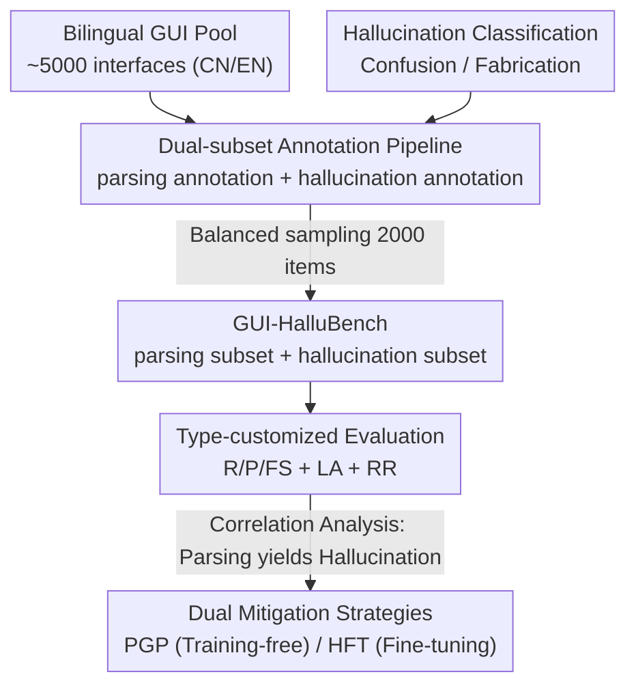

# Evaluating and Easing Hallucinations for GUI Grounding

**Conference**: CVPR 2026  
**Paper**: [CVF Open Access](https://openaccess.thecvf.com/content/CVPR2026/html/Zhang_Exposing_and_Evaluating_Hallucinations_for_GUI_Grounding_CVPR_2026_paper.html)  
**Code**: https://github.com/aibench/GUI-HalluBench  
**Area**: Multimodal VLM / GUI Agent / Hallucination Evaluation  
**Keywords**: GUI grounding, hallucination evaluation, multimodal large models, benchmark, bilingual  

## TL;DR
This paper presents the first systematic study of hallucinations in GUI grounding, categorizing them into "confusion hallucinations" (misidentifying similar elements) and "fabrication hallucinations" (inventing non-existent coordinates). The authors construct GUI-HalluBench, a bilingual dataset with dual subsets, to diagnose the correlation between hallucinations and parsing capabilities. They propose a training-free Parsing-guided Prompt (PGP) and a Hallucination-aware Fine-Tuning (HFT) solution. Experiments demonstrate that stronger parsing leads to fewer hallucinations, with HFT yielding an absolute improvement of approximately 7%.

## Background & Motivation

**Background**: Large Multimodal Models (LMMs) are being extensively deployed in GUI automation, intelligent assistants, and interactive agents. GUI interaction relies on two core capabilities: parsing (identifying and categorizing elements like buttons, icons, and text boxes) and grounding (mapping user instructions to specific element coordinates). Existing benchmarks such as ScreenSpot, ScreenSpot-Pro, MMBench-GUI, and Mind2Web primarily evaluate "comprehensive capabilities."

**Limitations of Prior Work**: Existing benchmarks emphasize a model's ability to understand interfaces and follow instructions while largely ignoring **reliability**, particularly hallucinations. While studies like POPE and HallusionBench have explored hallucinations in natural images (focusing on visual-text misalignment), they are not applicable to structured GUIs. Hallucinations in GUIs manifest as models **confidently outputting incorrect or fabricated target coordinates**, which undermines trustworthiness in real-world interactions.

**Key Challenge**: Grounding, despite being a core GUI capability, is highly susceptible to hallucinations, yet no benchmark specifically analyzes its root causes. Empirical observations suggest that grounding hallucinations are strongly correlated with parsing defects—if a model fails to perceive the interface structure correctly, it will either confuse similar elements or invent non-existent ones.

**Goal**: To address three sub-problems: ① **Classifying** GUI grounding hallucinations; ② Building a benchmark to **simultaneously measure parsing and hallucinations** while analyzing their correlation; ③ Providing mitigation strategies ranging from **low-cost to high-cost**.

**Key Insight**: Since hallucinations stem from parsing deficiencies, parsing and hallucinations should be evaluated together using complementary subsets within the same benchmark. Correlation analysis can then confirm the causal link "poor parsing $\rightarrow$ high hallucination."

**Core Idea**: GUI grounding hallucinations are dichotomized into **confusion hallucinations** and **fabrication hallucinations**. A bilingual diagnostic benchmark consisting of a "parsing subset + hallucination subset" is used to expose their root causes, followed by PGP and HFT to address these issues.

## Method

### Overall Architecture

This work integrates benchmarking, analysis, and mitigation. It aims to clarify why GUI grounding hallucinations occur, how to measure them, and how to ease them. The framework consists of four components: defining two categories of hallucinations; constructing a benchmark of 2,000 samples (1,000 Chinese, 1,000 English) from 5,000 bilingual interfaces via an "automated detection + manual review" pipeline; designing specific metrics for each hallucination type and evaluating 13+ SOTA models; and providing two mitigation paths: training-free PGP and HFT fine-tuning.

### Key Designs

**1. Hallucination Dichotomy: Formalizing GUI Grounding Failure Modes**

The authors define two failure modes for GUI grounding. **Confusion Hallucination** occurs when the target element exists, but the model selects a "distractor" due to ambiguous semantic understanding or high visual similarity (e.g., mistaking a camera-like icon for the camera app). **Fabrication Hallucination** occurs when the target element is absent, but the model "imagines" one and provides plausible coordinates (e.g., locating "Nov 17th" in a calendar where it doesn't appear). This classification determines the sample construction and metrics: confusion tests selection among distractors, while fabrication tests the ability to refuse. The benchmark consists of approximately 40% confusion and 60% fabrication cases.

**2. Dual-subset Annotation Pipeline: Joint Diagnosis of Parsing and Hallucination**

The benchmark consists of two complementary subsets: the **parsing subset** measures structural identification (outputting semantics and coordinates of all elements), and the **hallucination subset** measures grounding robustness under challenging conditions. English interfaces are sourced from ScreenSpot and AMEX, while Chinese interfaces are manually collected from popular apps across five domains. **Parsing annotation** uses Grounding DINO for bounding boxes, PaddleOCR for text, and an LMM for semantic validation, followed by manual review. **Hallucination annotation** utilizes LMMs to generate candidates for confusion/fabrication, which are then verified by **at least three annotators**.

**3. Type-customized Evaluation Metrics: Defining "Correctness" per Category**

Specific metrics are designed for different failure modes. For parsing: Recall $R = N_m / N_{gt}$, Precision $P = N_m / N_{pr}$, and Function Similarity $FS = \frac{1}{N_m}\sum_{i=1}^{N_m}\mathrm{sim}(f_i^{pred}, f_i^{gt})$, where $\mathrm{sim}$ is the cosine similarity of function description embeddings. For hallucinations: **Location Accuracy** $LA = N_{cor} / N_{tot}$ is used for confusion (percentage of correct selections), and **Rejection Rate** $RR = N_{rej} / N_{fab}$ is used for fabrication (percentage of successful refusals for non-existent elements).

**4. Dual Mitigation Strategies: Training-free PGP and Trainable HFT**

**PGP (Parsing-guided Prompt)** transforms direct "locate element X" instructions into a "parse then locate" structured prompt, forcing the model to enumerate all elements and their coordinates before outputting the target. **HFT (Hallucination-aware Fine-Tuning)** employs supervised fine-tuning using 20K parsing-annotated and 10K hallucination-annotated interfaces (isolated from the benchmark). Training uses LoRA (rank 8, $\alpha$ 32, lr 1e-4) on Qwen3-VL-8B and InternVL3.5-8B while freezing the ViT and aligner.

## Key Experimental Results

### Main Results

Evaluation of 13+ representative models on GUI-HalluBench. The table below shows Average Parsing scores (A–F) and Average Hallucination scores (LA + RR):

| Model | Parsing Avg (%) | Hallu Avg (%) | Notes |
|------|------|------|------|
| GPT-4o (with grounding) | 20.2 | 57.2 | Proprietary; Precision only 4.3%; weak on cluttered UIs |
| Claude Computer Use | 37.7 | 56.6 | Proprietary |
| Gemini-2.0 (Project Mariner) | 41.6 | 60.5 | Best proprietary model |
| InternVL3.5-8B | 55.7 | 63.2 | Open-source |
| GUI-Owl-7B | 55.4 | 64.9 | Specialized GUI version |
| Qwen3-VL-8B | 58.1 | 66.0 | Best open-source baseline |
| InternVL3.5-8B (HFT) | 71.9 | 69.1 | Ours (fine-tuned) |
| **Qwen3-VL-8B (HFT)** | **72.3** | **73.0** | Ours (best performer) |

Counter-intuitively, proprietary models with stronger general reasoning do **not** lead in GUI parsing and hallucination tasks, indicating that general multimodal reasoning does not equate to reliable GUI understanding.

### Ablation Study

Comparison of Baseline, PGP, and HFT across two open-source models:

| Configuration | Parsing Avg (%) | Hallu Avg (%) | Note |
|------|------|------|------|
| Qwen3-VL-8B Baseline | 58.1 | 66.0 | — |
| Qwen3-VL-8B + PGP | 58.1 | 67.7 | Training-free, Hallu +1.7 |
| Qwen3-VL-8B + HFT | 72.3 | **73.0** | Fine-tuned, Hallu +7.0 |
| InternVL3.5-8B Baseline | 55.7 | 63.2 | — |
| InternVL3.5-8B + PGP | 55.7 | 64.8 | Hallu +1.6 |
| InternVL3.5-8B + HFT | 71.9 | 69.1 | Hallu +5.9 |

### Key Findings

- **Strong correlation between hallucination and parsing**: SRCC analysis shows that higher element precision/recall in parsing directly correlates with stronger anti-hallucination capabilities, confirming that grounding hallucinations stem from parsing defects.
- **PGP provides modest, zero-cost gains**: PGP does not change parsing scores but stabilizes decision-making through a "parse-then-locate" sequence, primarily improving Rejection Rates ($RR$).
- **HFT delivers significant cross-lingual generalization**: HFT improves Qwen3-VL-8B's average hallucination score by ~7%. Strengthening structural perception allows hallucination suppression to generalize across languages.
- **Bilingual inconsistency**: All models exhibit a performance gap between English and Chinese. Parsing tasks show larger gaps than hallucination tasks, reflecting linguistic and cultural biases in training corpora.

## Highlights & Insights

- **Redefining "Hallucination" for the GUI Domain**: The authors move away from natural image hallucination paradigms to characterize GUI grounding through a confusion/fabrication dichotomy.
- **Rejection Rate (RR) as a Crucial Metric**: Quantifying the ability to say "no" targets the core of fabrication hallucinations, which is often neglected in benchmarks that assume the target always exists.
- **Diagnostic-driven Mitigation**: By using SRCC to quantify the causal relationship between parsing and hallucinations, the authors transform an intuition into a verifiable conclusion that directly guides the design of PGP and HFT.
- **Transferability of PGP**: The "parse-then-locate" strategy of making implicit perception explicit can be transferred to other structured tasks like Table QA or Chart understanding.

## Limitations & Future Work

- **Dependence on Auto-detectors for Parsing**: Although manually reviewed, Grounding DINO and PaddleOCR may introduce systematic biases in dense interfaces.
- **LMM-generated Hallucination Samples**: Hallucination candidates and 10K HFT training samples involve LMM generation, which may introduce generation biases or limit diversity compared to fully manual annotation.
- **Limited Gains from PGP**: Training-free methods yield only 1–2% improvements and do not improve parsing itself; substantial relief currently requires high-cost fine-tuning.
- **Static Single-step Grounding**: The benchmark does not cover hallucination accumulation in multi-step navigation, which is critical for real-world agents.

## Related Work & Insights

- **vs. Natural Image Benchmarks (POPE / HallusionBench)**: While previous works focus on object/relation hallucinations in natural scenes, this work targets functional confusion and element fabrication in structured GUIs.
- **vs. GUI Grounding Benchmarks (ScreenSpot / ScreenSpot-Pro)**: Existing benchmarks focus on whether a model can locate an existing target. This work introduces the "rejection" dimension to measure reliability.
- **vs. GUI LMM Methods (SeeClick / UI-TARS / OmniParser)**: While others focus on performance upper bounds, this work diagnoses a shared weakness (hallucinations) and identifies "parsing enhancement" as the primary lever for mitigation.

## Rating
- Novelty: ⭐⭐⭐⭐⭐ 
- Experimental Thoroughness: ⭐⭐⭐⭐ 
- Writing Quality: ⭐⭐⭐⭐ 
- Value: ⭐⭐⭐⭐⭐ 

<!-- RELATED:START -->

## Related Papers

- [\[CVPR 2026\] HalluGen: Synthesizing Realistic and Controllable Hallucinations for Evaluating Image Restoration](hallugen_synthesizing_realistic_and_controllable_hallucinations_for_evaluating_i.md)
- [\[CVPR 2026\] TriDF: Evaluating Perception, Detection, and Hallucination for Interpretable DeepFake Detection](tridf_evaluating_perception_detection_and_hallucination_for_interpretable_deepfa.md)
- [\[CVPR 2026\] Beyond the Global Scores: Fine-Grained Token Grounding as a Robust Detector of LVLM Hallucinations](beyond_global_scores_fine_grained_token_grounding_as_robust_detector_of_lvlm_hallucinations.md)
- [\[ACL 2026\] FinGround: Detecting and Grounding Financial Hallucinations via Atomic Claim Verification](../../ACL2026/hallucination/finground_detecting_and_grounding_financial_hallucinations_via_atomic_claim_veri.md)
- [\[CVPR 2026\] First Logit Boosting: Visual Grounding Method to Mitigate Object Hallucination in Large Vision-Language Models](first_logit_boosting_visual_grounding_method_to_mitigate_object_hallucination_in.md)

<!-- RELATED:END -->
