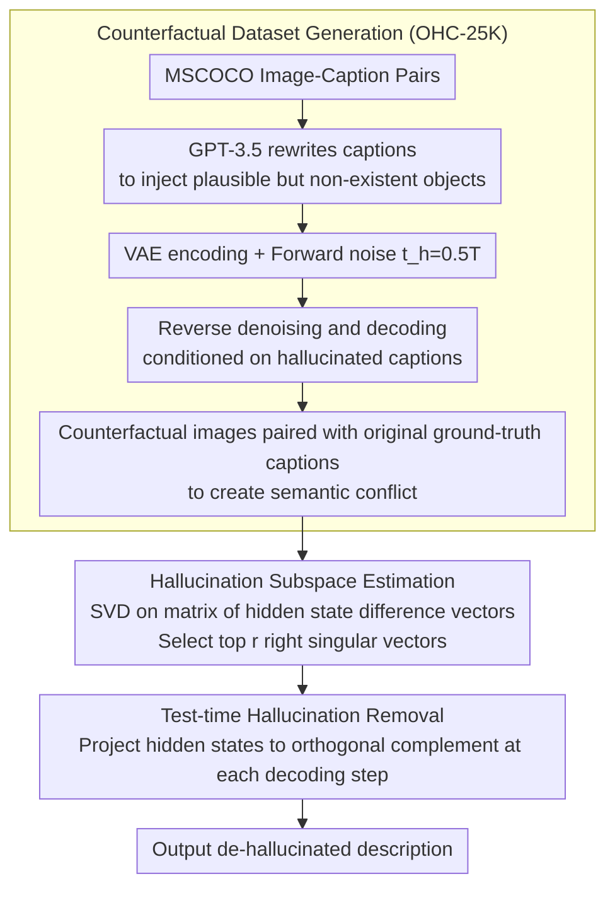

# Fighting Hallucinations with Counterfactuals: Diffusion-Guided Perturbations for LVLM Hallucination Suppression

## Basic Information

**Conference**: CVPR2026  
**arXiv**: [2603.10470](https://arxiv.org/abs/2603.10470)  
**Code**: [Project Page](https://hamidreza-dastmalchi.github.io/cipher-cvpr2026/)  
**Area**: Hallucination Detection  
**Keywords**: Large Vision-Language Models, Hallucination Suppression, Counterfactual Reasoning, Diffusion Models, Feature Projection, Training-free  

## TL;DR

Ours proposes CIPHER, a training-free test-time hallucination suppression method. In the offline stage, a diffusion model is used to generate counterfactual images to construct the OHC-25K dataset, from which a visual hallucination subspace is extracted via SVD. During inference, hidden states are projected onto the orthogonal complement of this subspace, significantly reducing visual hallucinations in LVLMs without modifying model parameters or increasing inference overhead.

## Background & Motivation

Large Vision-Language Models (LVLMs) such as LLaVA, MiniGPT-4, and mPLUG-Owl2 exhibit excellent performance on multimodal tasks but frequently produce **hallucinations**—generating descriptions inconsistent with visual inputs (non-existent objects, incorrect attributes, etc.). The sources of hallucinations can be categorized into two types:

**Text-induced Hallucinations**: Stemming from the autoregressive generation preferences and linguistic priors of the LLM.

**Visual-induced Hallucinations**: Stemming from weak visual grounding and insufficient modality alignment.

Existing test-time methods (e.g., Nullu) primarily extract hallucination directions by perturbing the text side, **ignoring hallucinations triggered by the visual modality**. Through linear probing experiments, the authors found that hallucination signals from text perturbations are weak and unstable in the hidden representation space (accuracy 0.73–0.80), whereas visual perturbation signals generated by diffusion models exhibit **high separability and cross-layer stability** (accuracy 0.86–0.89). This finding motivated the authors to construct visual counterfactuals to locate hallucination directions more precisely.

## Method

### Overall Architecture

CIPHER (Counterfactual Image Perturbations for Hallucination Extraction and Removal) consists of two stages. In the offline stage, a diffusion model is first used to create a batch of "hallucinatory images" to form the counterfactual dataset OHC-25K. Visual hallucination directions are extracted from this dataset, and a hallucination subspace is estimated using SVD. During the inference stage, the hidden state at each generation step is projected onto the orthogonal complement of this subspace to subtract the hallucination component. The entire process does not modify model parameters or add inference overhead.

### Key Designs

**1. Counterfactual Dataset Generation (OHC-25K): Creating "Semantic Conflict" Hallucinatory Images via Diffusion Models**

To locate visual hallucination directions, a set of samples is required where "objects are absent from the image but easily imagined by the model." The authors randomly select $M=5000$ image-caption pairs $\{(\boldsymbol{I}_i, \mathcal{C}_i)\}_{i=1}^M$ from MSCOCO and follow a four-step process to generate counterfactual images: First, GPT-3.5 is used to rewrite the ground-truth caption $\mathcal{C}_i$ into a hallucinated caption $\tilde{\mathcal{C}}_i$ by injecting plausible but non-existent objects (e.g., adding "a bunch of grapes" to a dining table scene). Next, the VAE of Stable Diffusion v1.5 is used to encode the image into the latent space $\boldsymbol{z}_0 = \mathcal{E}(\boldsymbol{I}_i)$, followed by $t_h$ steps of forward noise addition:

$$\tilde{\boldsymbol{z}}_{t_h} = \sqrt{\bar{\alpha}_{t_h}} \boldsymbol{z}_0 + \sqrt{1 - \bar{\alpha}_{t_h}} \boldsymbol{\epsilon}, \quad \boldsymbol{\epsilon} \sim \mathcal{N}(0, I)$$

$t_h = 0.5T$ is chosen to preserve global structure while allowing semantic modification. Then, reverse denoising $\tilde{\boldsymbol{z}}_{t-1} = f_\theta(\tilde{\boldsymbol{z}}_t, t, \tilde{\mathcal{C}}_i)$ is performed conditioned on the hallucinated caption $\tilde{\mathcal{C}}_i$, guiding the noisy latent variable back to an image aligned with the hallucinated caption. This is decoded to obtain $\tilde{\boldsymbol{I}}_{i,j} = \mathcal{D}(\tilde{\boldsymbol{z}_0})$ (with $B=5$ noise seed variants per image). Finally, these counterfactual images are paired with the **original ground-truth captions** to create a semantic conflict:

$$\textbf{OHC-25K} = \{(\tilde{\boldsymbol{I}}_{i,j}, \mathcal{C}_i) \mid i=1,\dots,M,\; j=1,\dots,B\}$$

**2. Hallucination Subspace Estimation: SVD of Hallucination Principal Directions from Hidden State Difference Vectors**

With paired samples, "hallucinations" can be measured in the representation space. For each pair of original $(\boldsymbol{I}_i, \mathcal{C}_i)$ and their $B$ counterfactual variants, intermediate hidden representations are extracted from the frozen LVLM. Mean pooling is performed over caption tokens to obtain $\boldsymbol{h}_\ell^{(i)} = \frac{1}{N}\sum_{k=1}^{N} \boldsymbol{h}_{\ell,k}^{(i)}$ and $\tilde{\boldsymbol{h}}_\ell^{(i)} = \frac{1}{B}\sum_{j=1}^{B} \tilde{\boldsymbol{h}}_\ell^{(i,j)}$. The difference between them represents the hallucination direction vector $\boldsymbol{\delta}_\ell^{(i)} = \tilde{\boldsymbol{h}}_\ell^{(i)} - \boldsymbol{h}_\ell^{(i)}$ for sample $i$ at layer $\ell$. Hallucinated directions of all samples are stacked into a difference matrix $\boldsymbol{\Delta}_\ell \in \mathbb{R}^{M \times d}$, and SVD is performed: $\boldsymbol{\Delta}_\ell = \boldsymbol{U}_\ell \boldsymbol{\Sigma}_\ell \boldsymbol{V}_\ell^\top$. The top $r$ right singular vectors $\boldsymbol{V}_{\ell,r} = [\boldsymbol{v}_{\ell,1}, \dots, \boldsymbol{v}_{\ell,r}]$ are retained as the Hallucination Basis Bank for that layer—the subspace spanned by these vectors captures the principal directions of visual-induced hallucinations.

**3. Test-time Hallucination Removal: Projecting Hidden States onto the Orthogonal Complement of the Hallucination Subspace**

Once directions are located, the intervention is a single linear projection step. During inference, at each autoregressive decoding step $k$ and selected layer $\ell$, the component of the hidden state along the hallucination basis vectors is subtracted, which is equivalent to multiplying by a projection matrix:

$$\boldsymbol{h}_{\ell,k}^{\text{clean}} = \boldsymbol{h}_{\ell,k}^{\text{test}} - \sum_{j=1}^{r} \langle \boldsymbol{h}_{\ell,k}^{\text{test}}, \boldsymbol{v}_{\ell,j} \rangle \boldsymbol{v}_{\ell,j} = \boldsymbol{P}_\ell \boldsymbol{h}_{\ell,k}^{\text{test}}, \quad \boldsymbol{P}_\ell = \boldsymbol{I} - \boldsymbol{V}_{\ell,r} \boldsymbol{V}_{\ell,r}^\top$$

This projection is executed before each token is decoded, removing components aligned with the hallucination direction while preserving core semantics. Since this is only a matrix multiplication, there is zero additional inference overhead, and the throughput is identical to greedy decoding.

### Implementation Details

- **Intervention Layer Selection**: Projections are applied to the upper layers of the Transformer (layers 16–32).
- **Rank Selection**: $r=8$ for LLaVA-1.5, $r=64$ for MiniGPT-4, and $r=32$ for mPLUG-Owl2 (determined via grid search).
- **Diffusion Steps**: $t_h = 0.5T$ to balance structure preservation and semantic replacement.
- **Classifier-free guidance scale**: 7.5.
- **Decoding Settings**: Beam size=3, max 64 tokens for CHAIR, max 256 tokens for OPOPE.
- **Zero Additional Inference Overhead**: Projections are lightweight matrix operations; throughput is identical to greedy decoding.

## Main Results

### Main Results I: CHAIR Benchmark (Hallucination Rate + Fluency)

| Method | LLaVA CHAIR$_S$↓ | CHAIR$_I$↓ | BLEU↑ | MiniGPT-4 CHAIR$_S$↓ | CHAIR$_I$↓ | BLEU↑ | mPLUG CHAIR$_S$↓ | CHAIR$_I$↓ | BLEU↑ |
|------|-----------------|----------|-------|---------------------|----------|-------|----------------|----------|-------|
| Greedy | 20.40 | 7.08 | 15.72 | 32.40 | 12.20 | 14.57 | 22.90 | 8.62 | 15.01 |
| DoLa | 20.20 | 6.75 | 15.68 | 31.90 | 12.15 | 14.54 | 22.40 | 8.36 | 15.13 |
| OPERA | 17.50 | 6.07 | 16.02 | 29.70 | 11.96 | 14.82 | 20.07 | 7.18 | 15.41 |
| VCD | 20.30 | 7.28 | 14.53 | 29.00 | 12.64 | 14.42 | 22.80 | 8.68 | 15.14 |
| Woodpecker | 23.85 | 7.50 | 17.05 | 28.87 | 10.20 | 15.30 | 26.33 | 8.43 | 16.43 |
| LURE | 19.48 | 6.50 | 15.97 | 27.88 | 10.20 | 15.03 | 21.27 | 7.67 | 15.65 |
| HALC | 16.90 | 5.72 | 16.02 | 25.20 | 9.42 | 14.91 | 18.80 | 7.00 | 15.33 |
| Nullu | 15.20 | 5.30 | 15.69 | 21.40 | 8.99 | 14.81 | 15.60 | 5.77 | 15.45 |
| **Ours** | **13.05** | **4.53** | 15.82 | **18.48** | **8.33** | 15.10 | **13.60** | **4.92** | **16.25** |

CIPHER achieves the lowest hallucination rate across all models. On LLaVA, CHAIR$_S$ decreased by 2.15% compared to Nullu and by 7.35% compared to Greedy; on MiniGPT-4, it decreased by 13.92% compared to Greedy. BLEU scores were maintained or improved, indicating that hallucination suppression did not sacrifice generation fluency.

### Main Results II: OPOPE Benchmark (Object Hallucination Detection)

| Method | LLaVA Acc↑ | Prec↑ | F1↑ | MiniGPT-4 Acc↑ | Prec↑ | F1↑ | mPLUG Acc↑ | Prec↑ | F1↑ |
|------|-----------|-------|-----|----------------|-------|-----|-----------|-------|-----|
| Greedy | 79.14 | 91.98 | 90.45 | 71.22 | 93.72 | 90.04 | 76.46 | 88.85 | 87.29 |
| Nullu | 79.52 | 93.46 | 91.79 | 71.92 | 95.96 | 92.07 | 77.09 | 92.83 | 90.80 |
| **Ours** | **80.05** | **93.72** | **92.11** | **72.25** | **96.50** | **92.58** | **77.87** | **92.93** | **90.95** |

On the near-saturated OPOPE benchmark, Ours consistently outperformed all baselines, with particularly significant gains in precision.

### Ablation Study: Hallucination Source Analysis

| Text Perturbation | Image Perturbation | CHAIR$_S$↓ | CHAIR$_I$↓ | BLEU↑ |
|---------|---------|----------|----------|-------|
| Yes | No | 15.20 | 5.30 | 15.69 |
| **No** | **Yes** | **13.05** | **4.53** | **15.82** |
| Yes | Yes | 15.71 | 5.32 | 15.66 |

Image perturbation alone yielded the best results; joint perturbation was slightly worse, suggesting potential mutual interference between the two hallucination directions.

### Inference Efficiency Comparison

| Metric | Greedy | OPERA | HALC | Nullu | **Ours** |
|------|--------|-------|------|-------|------------|
| CHAIR$_S$↓ | 20.40 | 17.50 | 16.90 | 15.20 | **13.05** |
| Throughput↑ (items/s) | 0.70 | 0.10 | 0.05 | 0.70 | **0.70** |

The throughput of CIPHER is perfectly consistent with standard Greedy decoding (0.70 items/s), far exceeding OPERA (7x speedup) and HALC (14x speedup).

### Key Findings

- **Linear probing proves visual perturbation is superior to text perturbation**: The separability of text perturbation hidden representations is only 0.73–0.80 (unstable across layers), whereas visual perturbation reaches 0.86–0.89 (stable across layers).
- **Diffusion steps $t_h=0.5T$ are optimal**: Too small preserves too much original semantics, while too large disrupts structural consistency.
- **Subspace rank $r=8$ (LLaVA) is optimal**: CHAIR and BLEU are optimized simultaneously.
- **Strong robustness to visual noise**: In tests with noise ranging from $\sigma=0$ to $1$, CIPHER consistently outperformed baselines, with more significant advantages in high-noise scenarios.
- **Comprehensive improvement on MMHal-Bench**: The greatest gains were seen in attributes, environment, overall description, and adversarial scenarios.
- **LLaVA-Bench**: Accuracy improved from 6.79 to 7.08, and detail improved from 6.33 to 6.75.

## Highlights & Insights

- **Unique Perspective of Visual Counterfactuals**: First to extract hallucination directions via "hallucinated images" rather than "hallucinated text," with linear probing experiments fully demonstrating that visual hallucination signals are stronger and more stable.
- **Zero Additional Inference Overhead**: Requires only a single forward pass + lightweight matrix projection; throughput is identical to the no-intervention baseline.
- **Training-free and Plug-and-play**: No model retraining, no additional labeling, and no architectural modifications required; the subspace only needs to be calculated once offline.
- **Cross-model Generality**: Consistent and significant improvements across three architectures: LLaVA-1.5, MiniGPT-4, and mPLUG-Owl2.
- **Mathematical Elegance**: Counterfactual → difference vector → SVD → orthogonal projection; the logical chain is complete, and the algorithm is simple and interpretable.

## Limitations & Future Work

- Offline stage relies on Stable Diffusion and GPT-3.5 to generate counterfactual data, with a non-zero one-time construction cost.
- The hallucination subspace is **static and fixed**, using the same projection matrix for all test inputs, lacking input-adaptive capabilities.
- Rank $r$ and intervention layers require grid search for each model; optimal configurations vary widely across models ($r$ from 8 to 64).
- Joint text + image perturbation was less effective than image perturbation alone; the authors have not provided an in-depth analysis of this phenomenon.
- Primarily validated on object-level hallucinations; effects on fine-grained attribute/relationship hallucinations require further exploration.

## Rating

⭐⭐⭐⭐ — The method is simple, elegant, and experimentally effective. The counterfactual concept of "fighting hallucinations with hallucinated images" is novel, and comprehensive validation across four benchmarks is convincing. The main drawbacks are the lack of adaptivity in the static projection and the insufficient analysis of why joint perturbation fails.

<!-- RELATED:START -->

## Related Papers

- [\[CVPR 2026\] Tell Model Where to Look: Mitigating Hallucinations in MLLMs by Vision-Guided Attention](tell_model_where_to_look_mitigating_hallucinations_in_mllms_by_vision-guided_att.md)
- [\[ACL 2026\] Lost in Diffusion: Uncovering Hallucination Patterns and Failure Modes in Diffusion Large Language Models](../../ACL2026/hallucination/lost_in_diffusion_uncovering_hallucination_patterns_and_failure_modes_in_diffusi.md)
- [\[CVPR 2026\] AdaIAT: Adaptively Increasing Attention to Generated Text to Alleviate Hallucinations in LVLM](adaiat_adaptively_increasing_attention_to_generated_text_to_alleviate_hallucinat.md)
- [\[CVPR 2026\] Cross-Modal Attention Calibration for LVLM Hallucination Mitigation](cross-modal_attention_calibration_for_lvlm_hallucination_mitigation.md)
- [\[AAAI 2026\] Bridging Day and Night: Target-Class Hallucination Suppression in Unpaired Image Translation](../../AAAI2026/hallucination/bridging_day_and_night_target-class_hallucination_suppressio.md)

<!-- RELATED:END -->
