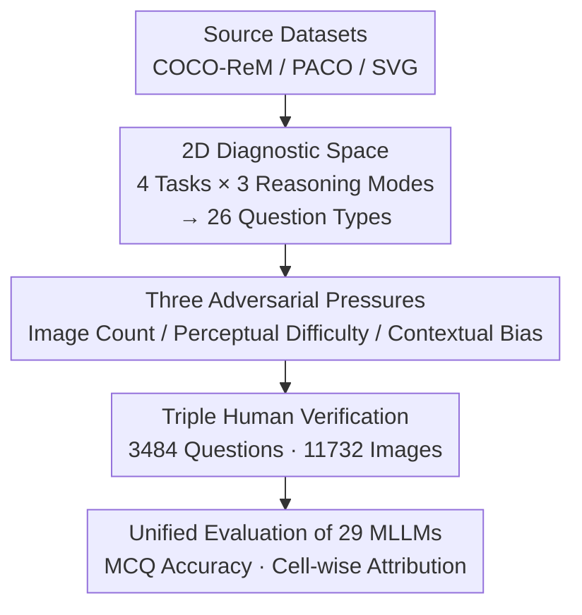

# Fine-Grained Multi-Image Object Hallucination Benchmark

**Conference**: CVPR 2026  
**Paper**: [CVF Open Access](https://openaccess.thecvf.com/content/CVPR2026/html/Min_Fine-Grained_Multi_Image_Object_Hallucination_Benchmark_CVPR_2026_paper.html)  
**Code**: To be confirmed  
**Area**: Multimodal VLM / Hallucination Evaluation  
**Keywords**: Object Hallucination, Multi-image Reasoning, Evaluation Benchmark, Adversarial Pressure, MLLM Diagnosis

## TL;DR
MIOH is the first fine-grained object hallucination diagnostic benchmark designed for **multi-image scenarios**. It creates a matrix of "4 object tasks × 3 multi-image reasoning modes" resulting in 26 question types, further overlaid with three controllable adversarial pressures: "number of images / perceptual difficulty / contextual bias." Evaluations of 29 models reveal that even GPT-5 and Gemini-2.5-Pro achieve overall accuracies of only 63.1% and 64.4%, respectively, with a global average of only 36.1%. The study identifies that hallucinations primarily originate from the **cross-image integration stage** rather than simple perceptual failure.

## Background & Motivation

**Background**: Multimodal Large Language Models (MLLMs) are increasingly deployed in multi-image scenarios—comparing, retrieving, or summarizing across a set of images. However, they remain plagued by **object hallucinations**: generating object descriptions that sound plausible but do not match the images. Existing object hallucination benchmarks (such as POPE) are almost exclusively **single-image + binary questions**, focusing on "existence" or "counting" tasks.

**Limitations of Prior Work**: Single-image benchmarks cannot reveal how visual difficulty factors systematically induce hallucinations, nor can they evaluate reasoning modes and combinatorial abilities specific to multiple images (e.g., attribute binding, spatial relations). Conversely, general multi-image benchmarks (like Mantis-Eval) measure cross-image reasoning but lack **controllable manipulation** of visual factors, making them unsuitable for specialized hallucination diagnosis. The most relevant MIHBench only treats "number of images" as a single adversarial factor in its ablation and fails to systematically vary visual difficulty or distinguish between reasoning modes.

**Key Challenge**: Multi-image scenarios amplify hallucinations along **two independent axes**: ① **Perceptual failure** (small objects, occlusions, misleading co-occurrence scenes); ② **Information integration failure** (difficulty in summarizing, comparing, or retrieving cross-image information). Existing benchmarks conflate these two axes, making it impossible to diagnose whether a model "cannot see clearly" or "cannot integrate information."

**Goal**: To build a fine-grained diagnostic space that **separates these two axes**, identifying both which visual conditions trigger perceptual errors and which integration requirements are most fragile.

**Key Insight**: Decompose the evaluation into three orthogonal layers: Reasoning Mode (How to integrate) × Object Task (What to see) × Adversarial Pressure (How difficult). By changing only one variable at a time, failure modes can be isolated individually.

**Core Idea**: Use a **controlled Cartesian product** of "Reasoning Mode × Object Task × Adversarial Pressure" to transform multi-image object hallucination into a diagnostic matrix where failures can be attributed cell by cell.

## Method

### Overall Architecture

MIOH is an **evaluation benchmark** rather than a new model. Its core output consists of 3,484 multi-image multiple-choice questions (covering 11,732 images) and corresponding evaluation protocols. Its framework is built on the intersection of two complementary dimensions:

1.  **Multi-image Reasoning Modes** (probing different integration capabilities): Comprehensive (summarizing the full set), Comparative (finding differences between images), and Selective (retrieving a specific image that fits a condition).
2.  **Object Tasks** (probing what is observed): Existence, Counting, Attribute (attribute binding, e.g., "red car"), and Position (spatial relations, e.g., "dog next to the cat").

Four categories of tasks × three reasoning modes are manually curated into **26 question types** (not 12, as tasks like counting naturally derive multiple variants, while some meaningless combinations are excluded). Three types of **adversarial pressures** are overlaid to generate hard/easy samples, and 29 models are evaluated using a unified multiple-choice format and accuracy metrics. The construction pipeline is as follows:

### Key Designs

**1. 2D Diagnostic Space: Controlled Cartesian Product of Reasoning Modes and Object Tasks**

To address the issue that existing benchmarks only test existence/counting and conflate perception with integration, MIOH separates "what to see" and "how to integrate" into orthogonal dimensions. The three reasoning modes strain different integration mechanisms: Comprehensive asks "Is there a zebra in any image?" or "What is the total count of cars?" testing the ability to maintain a **unified representation** of scattered information; Comparative asks "Which image has more cars?" or "Which object is only in Image 1?" requiring the maintenance of **separate representations** for different scenes and precise cross-image comparison; Selective asks "Which image has exactly 3 zebras?" testing **target retrieval and distractor filtering**.

The diagnostic value of this design lies in its ability to detect different failure modes. **Failure across all modes → Root cause in object recognition (perceptual failure); Selective failure with Comprehensive success → Root cause in the integration step of retrieval/localization.** Crossing this with the four object tasks allows tracking capability breakdown from "basic detection" to "fine-grained attribute binding." Experiments discovered that Selective mode averaged only 34.2%, and Selective × Attribute dropped to 26.7%—indicating that models know an "attribute-object pair exists in the set" but cannot determine "specifically in which image," representing a grounding failure unique to multi-image contexts.

**2. Three Controllable Adversarial Pressures: Visual Difficulty as Adjustable Knobs**

To address the lack of systematic visual difficulty adjustment in existing benchmarks, MIOH designs three non-overlapping adversarial factors targeting specific failure mechanisms:

*   **Visual Context Scale (Number of Images, NI)**: Systematically varying the number of input images $\{2, 4, 8, 10\}$ for the same question. Inspired by the "Visual Haystack" problem, increasing images makes it harder for models to maintain accurate object representations in an expanded visual context, directly stressing **integration capacity**.
*   **Perceptual Difficulty (Hard Positive, HP)**: Specifically selecting small or occluded targets using two complementary paths: (a) Rule-based filtering: Selecting images with small bounding boxes or high occlusion rates; (b) CLIP semantic filtering: Selecting images where the CLIP similarity between the image and the text prompt "A photo of [object]" is abnormally low, indicating perceptual ambiguity. This pressure tests **feature extraction**, a prerequisite for downstream reasoning.
*   **Contextual Bias (Hard Negative, HN)**: Creating traps with "contextually plausible but visually absent" objects (e.g., a kitchen scene activating a "frying pan" prior leading to a false positive). Construction methods: (a) Estimating co-occurrence probability $P(\text{object}_A \mid \text{object}_B)$ from the COCO training set and selecting images containing high-co-occurrence objects but **missing the target**; (b) CLIP semantic confusion, finding images with high visual-text similarity where the target is actually absent. This measures whether a model **relies on contextual shortcuts or visual evidence**.

These knobs allow "why the model failed" to become an attributable variable: NI drop → Insufficient integration capacity; HP drop → Perceptual bottleneck; HN drop → Bias by priors.

**3. High-Quality Data Sources and Triple Annotation Protocol**

To mitigate the risk of confusing "hallucinations" with "annotation errors," MIOH sources its datasets based on where the labels are cleanest for each task: Existence/Counting uses COCO-ReM (a re-annotated version that fixes incomplete masks and missing instances in COCO), Attribute uses PACO (standardized attribute labels across categories), and Position uses SVG (complete scene-level relationship annotations, avoiding the sparsity of Visual Genome where subjects average only 1.5 relations). All questions are verified by **three independent annotators**, resulting in 3,484 questions balanced across tasks, reasoning modes, and difficulty levels. This ensures that observed failures are attributable to model hallucinations rather than noisy data.

## Key Experimental Results

### Main Results

Evaluations were conducted on 29 models with temperature=0 using four A6000 GPUs. The overall average accuracy was only **36.1%**. While a gap exists between proprietary and open-source models, even the strongest models are far from saturation.

| Model | Existence | Counting | Attribute | Position | Overall |
| :--- | :---: | :---: | :---: | :---: | :---: |
| Global Average (29 models) | 49.4 | 25.4 | 32.4 | 37.3 | **36.1** |
| Gemini-2.5 Pro | 75.4 | 57.5 | 57.9 | 66.6 | **64.4** |
| GPT-5 | 78.4 | 49.1 | 57.8 | 67.1 | **63.1** |
| Qwen2-VL-7B | 67.5 | 26.0 | 41.9 | 61.1 | 49.1 |
| MiniCPM-V-2.6 | 68.5 | 28.3 | — | — | 48.5 |
| Qwen2.5-VL-3B | 60.8 | 21.7 | 40.0 | 54.6 | 44.3 |
| MiniCPM-Llama3-V-2.5 | 20.4 | 5.9 | — | — | Lowest Tier |

Even for frontier models, **Counting is the most difficult area** (GPT-5 at 49.1, Gemini at 57.5), while Existence is generally the highest—confirming that models are heavily biased towards "simple existence verification."

### Ablation Study: Reasoning Mode × Task

| Reasoning Mode | Avg. Accuracy | Key Observation |
| :--- | :--- | :--- |
| Comprehensive | Highest Tier | Summarization is easiest; Existence-Comprehensive is the highest score. |
| Comparative | Medium | Requires maintenance of separate representations for two-image comparison. |
| Selective | **34.2 (Lowest)** | Retrieval + localization is most difficult; × Attribute drops to **26.7**. |

Regarding adversarial pressure, **NI (Number of Images) causes the most severe performance drop**: for Existence, the global average falls from 62.4 (Easy) to 30.0 under NI conditions; GPT-5 drops from 91.4 to 55.3. This indicates that cross-image representation maintenance capability decays rapidly as image count increases.

### Key Findings
*   **Hallucinations stem more from integration than perception**: The disconnect between "knowing it exists" and "locating which image" (Selective × Attribute at 26.7%) is a multi-image specific grounding failure that single-image benchmarks cannot detect.
*   **Existence Bias is widespread**: All models score densely high on Existence-Comprehensive; relying solely on this category would **systematically overestimate** model robustness.
*   **More images lead to breakdown**: NI is the most potent adversarial factor, validating that the "Visual Haystack" hypothesis applies to object hallucination.
*   **Large gap between proprietary and open-source**: Gemini/GPT-5 hover around 60%, while the strongest open-source models (Qwen2-VL-7B 49.1, MiniCPM-V-2.6 48.5) still lag by ~15 percentage points.

## Highlights & Insights
*   **Making "Why Hallucination Occurs" an Attributable Experiment**: By using three adversarial pressures (capacity/perception/prior) and three reasoning modes (integration types), the diagnostic logic can pinpoint whether the root cause is perception or integration. This "orthogonal controllable variable" strategy is transferable to other fine-grained attribution benchmarks.
*   **Cleanest Labels via Multi-dataset Sourcing**: Utilizing COCO-ReM/PACO/SVG for Counting/Attribute/Spatial tasks effectively prevents sparse annotations from contaminating the evaluation.
*   **The Selective × Attribute "Knowing but not Locating" Failure Mode**: This insight is the most significant discovery of the paper, providing a specific target for future multi-image grounding research.

## Limitations & Future Work
*   **Task/Data bias towards COCO ecosystem**: Existence/Counting/Attribute/Position are built on COCO-style annotations, which may limit object categories and scene distributions. ⚠️ The paper lacks extensive discussion on out-of-distribution (OOD) generalization.
*   **MCQ Format**: While multiple-choice accuracy facilitates automated evaluation, a gap exists between this and hallucinations in free-form generative descriptions. Performance on MCQs may not perfectly equate to open-ended generation hallucination rates.
*   **Diagnosis without Mitigation**: MIOH is a diagnostic tool and does not provide methods to reduce hallucinations. The authors leave "targeted mitigation based on diagnostic results (e.g., training for Selective/NI)" for future work.
*   **Horizontal Comparisons require caution**: Significant difficulty variations between tasks/modes mean that comparing absolute scores across cells should be done with caveats (e.g., Counting is inherently hard; a model's low score there doesn't simply mean it "fails" at counting).

## Related Work & Insights
*   **vs. POPE / Single-image Benchmarks**: These only test single-image, binary existence/counting. MIOH expands the scope to multi-image, adds attribute/spatial tasks, and makes difficulty controllable, diagnosing "cross-image integration hallucinations."
*   **vs. General Multi-image Benchmarks (Mantis-Eval, etc.)**: General benchmarks measure overall reasoning but do not control visual factors or specialize in hallucinations. MIOH sacrifices task breadth for fine-grained, controllable hallucination diagnosis.
*   **vs. MIHBench**: MIHBench also addresses multi-image hallucinations but only covers binary existence and varies only the image count. MIOH provides a much broader diagnostic space across question types, reasoning modes, and adversarial conditions.

## Rating
*   Novelty: ⭐⭐⭐⭐ First fine-grained multi-image object hallucination benchmark; orthogonal design has methodological value.
*   Experimental Thoroughness: ⭐⭐⭐⭐⭐ Evaluates 29 models including GPT-5/Gemini-2.5-Pro with robust attribution analysis.
*   Writing Quality: ⭐⭐⭐⭐ Clear chain from motivation to design to findings; diagnostic logic is well-articulated.
*   Value: ⭐⭐⭐⭐ Provides a controllable evaluation foundation for multi-image hallucination and identifies the specific target of "integration-stage grounding failure."

<!-- RELATED:START -->

## Related Papers

- [\[CVPR 2026\] Zina: Multimodal Fine-grained Hallucination Detection and Editing](zina_multimodal_fine-grained_hallucination_detection_and_editing.md)
- [\[CVPR 2026\] FINER: MLLMs Hallucinate under Fine-grained Negative Queries](finer_mllms_hallucinate_under_fine-grained_negative_queries.md)
- [\[CVPR 2026\] Beyond the Global Scores: Fine-Grained Token Grounding as a Robust Detector of LVLM Hallucinations](beyond_global_scores_fine_grained_token_grounding_as_robust_detector_of_lvlm_hallucinations.md)
- [\[CVPR 2026\] First Logit Boosting: Visual Grounding Method to Mitigate Object Hallucination in Large Vision-Language Models](first_logit_boosting_visual_grounding_method_to_mitigate_object_hallucination_in.md)
- [\[CVPR 2026\] Same Attention, Different Truths: Put Logit-Lens over Visual Attention to Detect and Mitigate LVLM Object Hallucination](same_attention_different_truths_put_logit-lens_over_visual_attention_to_detect_a.md)

<!-- RELATED:END -->
