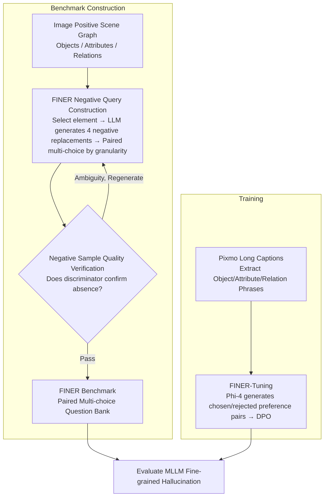

# FINER: MLLMs Hallucinate under Fine-grained Negative Queries

**Conference**: CVPR 2026  
**arXiv**: [2603.17662](https://arxiv.org/abs/2603.17662)  
**Code**: [https://explainableml.github.io/finer-project/](https://explainableml.github.io/finer-project/)  
**Area**: Hallucination Detection  
**Keywords**: MLLM Hallucination, Fine-grained Negative Queries, DPO, Scene Graphs, Hallucination Benchmark

## TL;DR
The study identifies a sharp increase in MLLM hallucination rates under fine-grained negative queries (queries with a single subtle error among multiple objects/attributes/relations). It proposes the FINER benchmark and the FINER-Tuning method (based on DPO), achieving a maximum improvement of 24.2% on InternVL3.5-14B.

## Background & Motivation
**Background**: MLLM hallucination has been widely studied, but existing benchmarks (POPE, DASH, AMBER) primarily focus on coarse-grained queries, such as the existence of a single object.

**Limitations of Prior Work**: Real-world user queries are often sophisticated, involving multiple objects, attributes, and relations. As query precision increases, models are more likely to be misled by "mostly correct" content and respond with "Yes."

**Key Challenge**: A strong positive correlation exists between query granularity and hallucination rates. InternVL3.5-14B achieves approximately 80% accuracy at granularity Level 1, which drops to roughly 20% at Levels 5-7.

**Goal**: (a) Systematically investigate hallucination behavior under fine-grained negative queries; (b) Propose a training method to effectively mitigate fine-grained hallucinations.

**Key Insight**: By simulating human sentence construction (object → adding attributes → adding relations), progressively fine-grained negative queries are constructed to systematically expose hallucinations.

**Core Idea**: Use scene graphs to drive the construction of a fine-grained negative query benchmark. This is paired with FINER-Tuning to teach the model to detect subtle errors in queries.

## Method

### Overall Architecture
The framework consists of two components: quantifying "how easily MLLMs hallucinate under fine-grained negative queries" using a new benchmark, and addressing this weakness through a training method. On the benchmark side, starting from the scene graph of each image (objects, attributes, relations), one element is selected and replaced with a negative version that does not exist in the image. This is verified by a discriminator to ensure the negative element is truly absent. These form paired multiple-choice questions labeled by granularity. On the training side, preference pairs (chosen vs. rejected with subtle errors) are generated using Pixmo long captions, and the model learns to identify incorrect elements in queries via DPO.

### Key Designs

**1. FINER Benchmark: Pushing Negative Queries from "Single Object Existence" to "Multi-element Fine-grained"**

Unlike benchmarks like POPE or AMBER that focus on simple existence, FINER addresses the complexity of real-world queries where models are often misled by sentences that are "mostly right." FINER utilizes image scene graphs to generate 4 semantically plausible but non-existent negative replacements for each element (e.g., replacing "door frame" with "pillar"). These are formatted into multiple-choice questions covering multi-object, multi-attribute, multi-relation, and Wh-question settings. Accuracy is measured using "paired accuracy," where a model must answer both the positive and its corresponding negative query correctly to prevent it from cheating by simply favoring "No."

**2. Negative Sample Quality Verification: Ensuring "Non-existent" Elements are Truly Absent**

To ensure benchmark reliability, negative replacements must be absent from the image. FINER employs Qwen2.5-VL-72B as a discriminator. Positive elements are mixed with negative ones; if the discriminator fails to identify the positive element or finds a negative element plausible, the sample is regenerated. This cross-validation filters out "false negatives."

**3. FINER-Tuning: Teaching Models to Detect Errors in Queries via DPO**

Standard DPO-based hallucination mitigation (e.g., RLAIF-V, OPA-DPO) focuses on hallucinations in model-generated descriptions. FINER-Tuning specifically targets the model's failure to identify subtle errors within user queries. Object/attribute/relation phrases are extracted from Pixmo long captions, and Phi-4-14B is used to create a negative version. This forms a "chosen" (correct) and "rejected" (subtly incorrect) answer pair. The model is trained using the standard DPO loss:

$$\mathcal{L}_{DPO}(\theta) = -\mathbb{E}\big[\log\sigma\big(\beta(\Delta_\theta - \Delta_{ref})\big)\big]$$

where $\Delta$ is the difference in log-likelihood for the chosen and rejected responses. To prevent data leakage, Pixmo-caption is used instead of benchmark images, and the LLM used for data generation (Phi-4) differs from the one used for benchmark construction.

### Loss & Training
The DPO parameter $\beta$ is set to 0.1. Pixmo-caption serves as the fixed data source, isolated from the benchmark evaluation set to eliminate leakage.

## Key Experimental Results

### Main Results (FINER-CompreCap, Paired Accuracy)

| Model | Multi-obj | Multi-attr | Multi-rel | Wh |
|------|-----------|------------|-----------|-----|
| Random Guess | 4.0 | 4.0 | 4.0 | 4.0 |
| LLaVA-1.6-7B | 25.3 | 13.0 | 7.6 | 15.3 |
| +FINER-Tuning | **48.4** (+23.1) | **38.4** (+25.4) | **24.2** (+16.6) | **22.1** (+6.8) |
| InternVL-3.5-8B | 75.0 | 72.5 | 49.8 | 23.5 |
| +FINER-Tuning | **77.1** (+2.1) | **78.9** (+6.4) | **64.1** (+14.3) | **34.2** (+10.7) |
| InternVL-3.5-14B | 74.5 | 68.1 | 47.0 | 21.8 |
| +FINER-Tuning | **80.0** (+5.5) | **78.9** (+10.8) | **71.2** (+24.2) | **30.1** (+8.3) |

### Key Findings
- Hallucination is strongly correlated with query granularity: Higher granularity leads to lower accuracy, confirming that fine-grained queries are a systemic weakness of MLLMs.
- Multi-rel (multi-relation) is the most difficult setting, with even strong model baselines falling below 50%.
- FINER-Tuning provides more significant gains for weaker models (LLaVA-1.6-7B) compared to stronger models.
- FINER-Tuning improves performance on the FINER benchmark as well as 8 existing hallucination benchmarks without degrading general capabilities (tested across 6 benchmarks).

## Highlights & Insights
- The discovery of the **granularity-hallucination correlation** provides significant insight into the mechanism by which MLLMs are misled by "mostly correct" information.
- The **paired query** evaluation method ensures models cannot cheat by developing a bias towards "No" responses.
- FINER-Tuning offers a novel perspective by teaching the model to detect "errors in queries" rather than just "hallucinations in responses."
- The data construction pipeline is transferable to other VQA robustness evaluations.

## Limitations & Future Work
- Generation of negative elements relies on LLMs, which may introduce systematic bias.
- The templates for converting scene graphs to queries are relatively fixed and do not cover all natural language expressions.
- The benchmark focuses on negative queries; fine-grained understanding of positive queries also warrants research.
- Scene graphs from DOCCI are extracted from long captions, which may contain extraction noise.

## Related Work & Insights
- **vs POPE**: POPE only tests single object existence; FINER expands to multi-element fine-grained negation.
- **vs AMBER**: AMBER includes single objects/attributes/relations, while FINER pushes granularity to multi-element combinations.
- **vs RLAIF-V/OPA-DPO**: These methods reduce hallucinations in model-generated output via DPO, whereas FINER-Tuning specifically targets subtle errors within input queries.

## Rating
- Novelty: ⭐⭐⭐⭐⭐ Systematic research on the granularity-hallucination relationship opens a new direction.
- Experimental Thoroughness: ⭐⭐⭐⭐ Evaluated on 4 models, 2 new benchmarks, 8 existing hallucination benchmarks, and 6 general benchmarks.
- Writing Quality: ⭐⭐⭐⭐ Clear motivation analysis and detailed data construction process.
- Value: ⭐⭐⭐⭐⭐ Both the benchmark and the method provide significant value for understanding and mitigating MLLM hallucinations.

<!-- RELATED:START -->

## Related Papers

- [\[CVPR 2026\] Zina: Multimodal Fine-grained Hallucination Detection and Editing](zina_multimodal_fine-grained_hallucination_detection_and_editing.md)
- [\[CVPR 2026\] Fine-Grained Multi-Image Object Hallucination Benchmark](fine-grained_multi_image_object_hallucination_benchmark.md)
- [\[CVPR 2026\] Beyond the Global Scores: Fine-Grained Token Grounding as a Robust Detector of LVLM Hallucinations](beyond_global_scores_fine_grained_token_grounding_as_robust_detector_of_lvlm_hallucinations.md)
- [\[ICML 2026\] Learning from Fine-Grained Visual Discrepancies: Mitigating Multimodal Hallucinations via In-Context Visual Contrastive Optimization](../../ICML2026/hallucination/learning_from_fine-grained_visual_discrepancies_mitigating_multimodal_hallucinat.md)
- [\[CVPR 2026\] COPO: Causal-Oriented Policy Optimization for Hallucinations of MLLMs](copo_causal-oriented_policy_optimization_for_hallucinations_of_mllms.md)

<!-- RELATED:END -->
