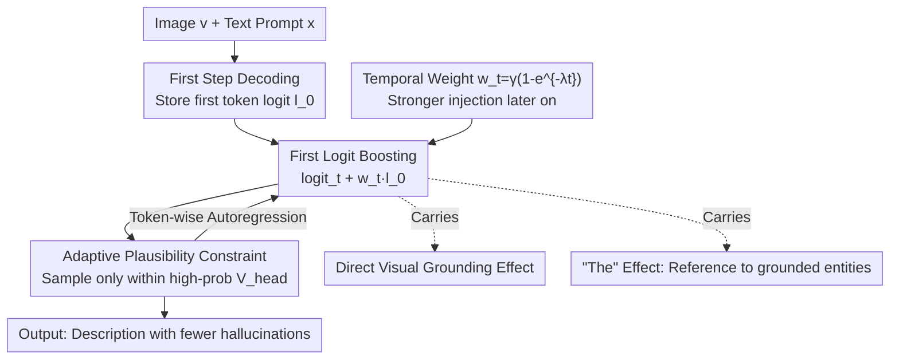

# First Logit Boosting: Visual Grounding Method to Mitigate Object Hallucination in Large Vision-Language Models

**Conference**: CVPR 2026  
**Paper**: [CVF Open Access](https://openaccess.thecvf.com/content/CVPR2026/html/Ha_First_Logit_Boosting_Visual_Grounding_Method_to_Mitigate_Object_Hallucination_CVPR_2026_paper.html)  
**Code**: https://github.com/jiwooha20/FLB  
**Area**: Multimodal VLM / Object Hallucination Mitigation  
**Keywords**: Object Hallucination, Visual Grounding, Contrastive Decoding, Training-free, Long-term Decay  

## TL;DR
Addressing the "long-term decay" problem in Large Vision-Language Models (LVLMs)—where models increasingly detach from images and fabricate objects later in the generation process—this paper proposes First Logit Boosting (FLB). The method **stores the logit of the first generated token and adds it back to the logits of each subsequent step with a weight that increases over time**. FLB is training-free, requires no external models, uses only a single forward pass, and significantly reduces object hallucinations on CHAIR/AMBER benchmarks with almost no added inference overhead.

## Background & Motivation
**Background**: LVLMs (e.g., LLaVA-1.5, InstructBLIP) are constructed from a visual encoder, an LLM, and a cross-modal alignment module. While strong in image captioning and VQA, they suffer from **object hallucination**—describing objects not present in the image—which is a critical issue in safety-sensitive scenarios like autonomous driving or medical imaging. Existing methods to mitigate hallucinations fall into three categories: ① Retraining (RLHF, modifying positional encodings), which is data and compute-intensive; ② External grounding (using extra models to verify object existence), which sacrifices efficiency; ③ Training-free (direct intervention on logits/latent space during inference), which is the most lightweight.

**Limitations of Prior Work**: A representative training-free approach is **Contrastive Decoding (CD)**, which runs "original" and "perturbed" inputs simultaneously and subtracts them to suppress linguistic priors (e.g., VCD uses noisy images, ICD uses perturbed instructions, M3ID uses unconditional inputs). However, CD has two fundamental flaws: (1) **Long-term decay**: As the sentence grows, the model's attention gradually drifts from visual evidence to linguistic priors, causing hallucinations to cluster in the later segments. The authors found that VCD/ICD/M3ID fail to suppress this trend—average logits for ground-truth tokens decline while those for hallucinated tokens rise as the sequence progresses. (2) **Inference inefficiency**: CD requires two forward passes per step (original + perturbed), nearly doubling inference time and increasing linearly with sequence length.

**Key Challenge**: The physical root of long-term decay lies in the **RoPE (Rotary Positional Encoding)** used in LVLMs. Image tokens are placed at the very beginning of the sequence. As the generated text grows longer, the relative distance between text and image tokens increases, diluting cross-modal attention. CD only performs **local** contrastive correction at each step, lacking a **global, persistent** visual anchor to counteract this position-dependent drift.

**Key Insight / Core Idea**: The authors identified a crucial positional observation: **the first token is generated immediately after the visual tokens when cross-modal attention has not yet decayed, making its logit the "strongest visual grounding" moment of the generation** (the gap between ground-truth and hallucinated logits is largest at step 1). By "freezing" this first logit and adding it back to every subsequent step, the "cleanest visual evidence" is repeatedly injected to combat decay. In short: **use the first step's logit as a persistent visual anchor, amplified and re-injected during decoding**.

## Method

### Overall Architecture
FLB is a **training-free plugin** for the decoding loop. Given an image $v$ and text prompt $x$, it outputs text $y$. The only difference from standard autoregressive decoding is the addition of a "time-weighted first-step logit" to the logit at each step, followed by sampling under an adaptive plausibility constraint. The process requires only one forward pass (reusing $l_0$ after the first step), resulting in negligible overhead.

It yields two complementary effects: the **direct visual grounding effect** (repeatedly strengthening visual signals via the first logit) and the serendipitous **"The" effect** (the first token is often an article like "The"; boosting it encourages the model to refer back to previously grounded entities, implicitly suppressing hallucinations).

### Key Designs

**1. First Logit Boosting: Freezing and Re-injecting the Strongest Grounding**

This is the core of the method to combat long-term decay. Standard decoding samples $y_t \sim \mathrm{softmax}(\mathrm{logit}_\theta(y\mid v,x,y_{<t}))$, where later logits are contaminated by linguistic priors. FLB first stores the logit:

$$l_0 = \mathrm{logit}_\theta(y \mid x, v)$$

Since $l_0$ is constant across all steps, it is calculated once. It is then added back at each step:

$$y_t \sim \mathrm{softmax}\big[\mathrm{logit}_\theta(y\mid v,x,y_{<t}) + w_t\, l_0\big]$$

This is effective because the first token is adjacent to visual tokens, RoPE distance is minimal, and cross-modal attention is intact. The authors measured that ground-truth words at step 1 (e.g., man, hat, tie; mean logit 4.74) are systematically higher than hallucinated words (e.g., woman, sun, tree; mean 2.15). Applying this "clean visual gap" repeatedly acts as a continuous visual patch against drift.

**2. Time-increasing weight $w_t$: Heavier anchoring where decay is worse**

Uniform injection would over-interfere with early steps (already well-grounded) and under-correct later steps. FLB uses a weight that rises monotonically with the step count to match the decay intensity:

$$w_t = \gamma\,(1 - e^{-\lambda t})$$

where $\gamma$ is the maximum scale and $\lambda$ controls the rise speed (experimentally $\gamma=0.3, \lambda=0.05$). When $t$ is small, $w_t \approx 0$, leaving early correct predictions intact; as $t$ grows, $w_t \to \gamma$, maximizing visual anchoring where hallucinations are most likely.

**3. Adaptive Plausibility Constraint: Preventing "out-of-place" tokens**

Since $l_0$ comes from the first position, it might boost tokens that are contextually inappropriate for the current position (e.g., an uppercase "The" in the middle of a sentence). FLB adopts the strategy from VCD to define a high-probability candidate set for sampling:

$$\mathcal{V}_{\mathrm{head}}(y_{<t}) = \{\,y_t\in\mathcal{V} : p_\theta(y_t\mid v,x,y_{<t}) \ge \beta\max_w p_\theta(w\mid v,x,y_{<t})\,\}$$

Probabilities outside this set are zeroed ($\beta=0.1$). This ensures FLB only re-ranks tokens the original model deems plausible, maintaining grammar and fluency.

**4. The "The" Effect:Serendipitous Implicit Visual Anaphora**

A discovery from the analysis rather than a deliberate design. Reusing $l_0$ boosts the most frequent first-step tokens—primarily "The". The authors found that **sentences starting with "The" have significantly lower hallucination rates, and nouns following "The" are more frequently grounded**. After "The/the", ground-truth nouns appear at a rate of 0.317 vs. 0.020 for hallucinations; after "A/a", hallucinations rise to 0.105. "The" implies a reference to a previously mentioned or visually attended entity, guiding the model to refer back to grounded objects rather than sampling new, vague objects from linguistic priors.

### Loss & Training
No training. FLB is a pure inference-time method with no weight updates or external modules. It uses three hyperparameters: $\gamma=0.3, \lambda=0.05, \beta=0.1$.

## Key Experimental Results

### Main Results
Benchmarks: **AMBER** (1,004 images) and **CHAIR** (500 MSCOCO images). Backbone: LLaVA-1.5 (7B) and InstructBLIP (7B). Prompts were standardized to "Please describe this image in detail."

AMBER (CHAIR↓: hallucinated objects, Cover↑: coverage, Hal↓: % of hallucinated sentences, Cog↓: cognitive plausible hallucinations):

| Model | Method | CHAIR↓ | Cover↑ | Hal↓ | Cog↓ |
|------|------|--------|--------|------|------|
| LLaVA-1.5 | Baseline | 11.5 | 50.1 | 48.9 | 4.6 |
| LLaVA-1.5 | VCD | 9.9 | 51.2 | 43.4 | 4.6 |
| LLaVA-1.5 | ICD | 9.1 | 51.2 | 40.6 | 4.3 |
| LLaVA-1.5 | M3ID | 9.8 | 55.6 | 48.4 | 3.6 |
| LLaVA-1.5 | **FLB** | **6.1** | 50.4 | **31.6** | **2.7** |

CHAIR (CHAIR$_s$/CHAIR$_i$↓, Recall↑):

| Model | Method | CHAIR$_s$↓ | CHAIR$_i$↓ | Recall↑ |
|------|------|-----------|-----------|---------|
| LLaVA-1.5 | Baseline | 57.5 | 17.3 | 73.3 |
| LLaVA-1.5 | **FLB** | **43.5** | **12.0** | 73.6 |

FLB significantly reduces hallucinations while **maintaining Cover/Recall**, avoiding the typical trade-off. Inference speed is equivalent to the baseline, whereas CD methods are roughly $2\times$ slower.

### Ablation Study
Isolating the two effects (AMBER, LLaVA-1.5):

| Configuration | CHAIR↓ | Cover↑ | Hal↓ | Cog↓ | Logic |
|------|--------|--------|------|------|------|
| Baseline | 11.9 | 49.6 | 48.8 | 4.4 | Standard decoding |
| Direct visual grounding only | 9.2 | 50.3 | 41.1 | 4.7 | $l_0$ with only noun tokens |
| "The" effect only | 6.5 | 50.6 | 29.9 | 2.4 | $l_0$ with only "The" token |
| FLB (full) | 5.7 | 50.3 | 30.7 | 2.4 | Combined effects |

### Key Findings
- **Both effects are effective and complementary**: Direct grounding reduces CHAIR from 11.9 to 9.2, while the "The" effect alone reduces it further to 6.5.
- **The "The" effect is a major contributor**: It wasn't intentional but emerged from boosting the first logit, favoring definite articles that guide the model toward grounded entities.
- **Long-term decay is suppressed**: Unlike VCD/ICD/M3ID, where hallucination probability rises with position, FLB successfully flattens this curve.

## Highlights & Insights
- **"Freezing the first moment" is a simple yet optimal trick**: Since the root of long-term decay is the widening gap between text and image, caching the strongest visual signal from the first step is an elegant, zero-cost solution.
- **Time-increasing injection $w_t$** is a model of "treating the symptoms where they are strongest," a principle applicable to other length-dependent degradation issues.
- **The "The" effect is a brilliant "Aha" moment**: Framing a linguistic phenomenon (definite articles as anaphoric triggers) as implicit visual anchoring, supported by solid probability statistics.

## Limitations & Future Work
- **Language Dependency**: The "The" effect depends heavily on English articles; its effectiveness in languages without articles (e.g., Chinese/Japanese) is unknown ⚠️.
- **Static Anchoring**: Reusing $l_0$ across long descriptions might over-anchor to the first few objects mentioned, potentially suppressing new objects in later sentences.
- **Scalability**: While tested on 7B models, sensitivity to hyperparameters and effectiveness on much larger models (e.g., 70B+) require further validation.

## Related Work & Insights
- **vs. Contrastive Decoding (VCD/ICD/M3ID)**: These rely on local contrast via dual forward passes. FLB is faster (single pass) and more effective at handling long-term decay through global anchoring.
- **vs. Training-based methods**: FLB avoids high-cost retraining/annotation, though its upper bound is capped by the quality of the first step's logit.

## Rating
- Novelty: ⭐⭐⭐⭐ Re-injecting $l_0$ is counter-intuitively simple; the "The" effect discovery is highly imaginative.
- Experimental Thoroughness: ⭐⭐⭐⭐ Solid cross-model and cross-benchmark testing with detailed ablation, though lacks multi-lingual testing.
- Writing Quality: ⭐⭐⭐⭐ Clear progression from observation to mechanism to verification.
- Value: ⭐⭐⭐⭐ High utility for real-time systems due to zero training and zero inference overhead.

<!-- RELATED:START -->

## Related Papers

- [\[CVPR 2026\] Same Attention, Different Truths: Put Logit-Lens over Visual Attention to Detect and Mitigate LVLM Object Hallucination](same_attention_different_truths_put_logit-lens_over_visual_attention_to_detect_a.md)
- [\[CVPR 2026\] VES-RFT: Rewarding Visual Evidence Sensitivity to Mitigate Hallucinations in Large Vision-Language Models](ves-rft_rewarding_visual_evidence_sensitivity_to_mitigate_hallucinations_in_larg.md)
- [\[ACL 2025\] Retrieval Visual Contrastive Decoding to Mitigate Object Hallucinations in Large Vision-Language Models](../../ACL2025/hallucination/retrieval_visual_contrastive_decoding_to_mitigate_object_hallucinations_in_large.md)
- [\[CVPR 2026\] Envision, Attend, Then Respond: Counterfactual Hallucination Mitigation in Large Vision-Language Models](envision_attend_then_respond_counterfactual_hallucination_mitigation_in_large_vi.md)
- [\[CVPR 2026\] PAS: Prelim Attention Score for Detecting Object Hallucinations in Large Vision-Language Models](pas_prelim_attention_score_for_detecting_object_hallucinations_in_large_vision-l.md)

<!-- RELATED:END -->
## Related Papers

- [\[CVPR 2026\] Same Attention, Different Truths: Put Logit-Lens over Visual Attention to Detect and Mitigate LVLM Object Hallucination](same_attention_different_truths_put_logit-lens_over_visual_attention_to_detect_a.md)
- [\[CVPR 2026\] VES-RFT: Rewarding Visual Evidence Sensitivity to Mitigate Hallucinations in Large Vision-Language Models](ves-rft_rewarding_visual_evidence_sensitivity_to_mitigate_hallucinations_in_larg.md)
- [\[CVPR 2026\] Envision, Attend, Then Respond: Counterfactual Hallucination Mitigation in Large Vision-Language Models](envision_attend_then_respond_counterfactual_hallucination_mitigation_in_large_vi.md)
- [\[ICML 2026\] Revis: Sparse Latent Steering to Mitigate Object Hallucination in Large Vision-Language Models](../../ICML2026/hallucination/revis_sparse_latent_steering_to_mitigate_object_hallucination_in_large_vision-la.md)
- [\[CVPR 2026\] SEASON: Mitigating Temporal Hallucination in Video Large Language Models via Self-Diagnostic Contrastive Decoding](season_mitigating_temporal_hallucination_in_video_large_language_models_via_self.md)

<!-- RELATED:END -->
