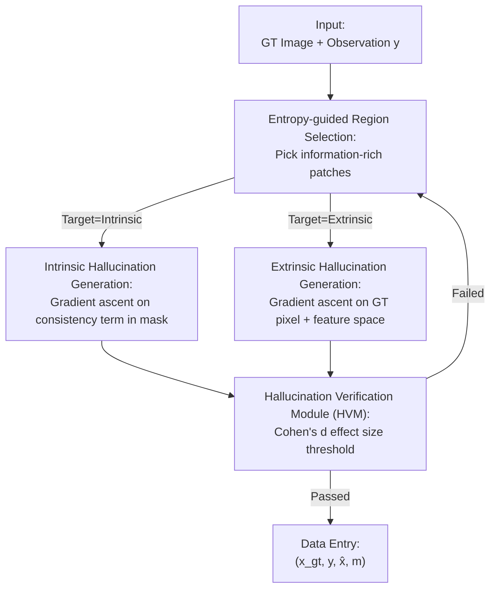

# HalluGen: Synthesizing Realistic and Controllable Hallucinations for Evaluating Image Restoration

**Conference**: CVPR 2026  
**Paper**: [CVF Open Access](https://openaccess.thecvf.com/content/CVPR2026/html/Kim_HalluGen_Synthesizing_Realistic_and_Controllable_Hallucinations_for_Evaluating_Image_Restoration_CVPR_2026_paper.html)  
**Code**: https://github.com/edshkim98/HalluGen (Available)  
**Area**: Hallucination Evaluation / Diffusion Models / Image Restoration  
**Keywords**: Hallucination Synthesis, Diffusion Posterior Sampling, Controllable Hallucinations, Medical Image Restoration, Hallucination Evaluation Benchmark

## TL;DR
HalluGen utilizes diffusion posterior sampling combined with masked gradient guidance to **proactively inject** "controllable type, location, and severity" realistic hallucinations into image restoration results. This enables the creation of the first hallucination dataset with ground-truth labels (4350 brain MRIs), establishment of a benchmark, proposal of the hallucination-sensitive SHAFE metric, and training of a no-reference detector that generalizes to real restoration failures.

## Background & Motivation

**Background**: In image restoration tasks such as super-resolution, denoising, and deblurring, generative restoration methods based on diffusion priors produce extremely sharp and realistic results. These have been extended to medical scenarios like low-field MRI enhancement (low-field devices are affordable and common in resource-limited areas but have poor image quality and require restoration models to reach diagnostic levels).

**Limitations of Prior Work**: Generative restoration has a fatal side effect—**hallucination**: structures that look plausible but do not exist in the ground-truth (e.g., adding an extra sulcus or fabricating a lesion). In safety-critical fields like medical imaging, industrial inspection, and remote sensing, this "perceptually correct but factually wrong" content can lead directly to misdiagnosis. Worse, it is **difficult to measure**: common metrics like PSNR/SSIM/LPIPS favor "perceived sharpness" over "content correctness." As shown in Fig. 2, hallucinated images can receive higher scores than "slightly blurred but content-correct" images.

**Key Challenge**: Hallucination research is stuck in a **circular dependency**: evaluating hallucinations requires data annotated with "where the hallucination is," but hallucinations themselves are ambiguous and subjective, making annotation extremely expensive. The authors had two domain experts perform patch-level annotations on 50 images, and the Cohen's $\kappa$ was only 0.30, far below the acceptable threshold of 0.60, proving that manual annotation is neither scalable nor reliable.

**Goal**: To break this cycle—instead of "finding" and then labeling hallucinations, the authors **proactively synthesize hallucinations with known ground-truth**, transforming annotation from "post-hoc guessing" to "known at generation time."

**Key Insight**: Following recent work, the authors categorize hallucinations into two types: **intrinsic hallucinations** violate measurement consistency ($\mathcal{A}(\hat{x}) \neq \mathcal{A}(x_{gt})$ and can be caught by consistency checks), and **extrinsic hallucinations** maintain measurement consistency but deviate in the inverse problem domain ($\mathcal{A}(\hat{x}) = \mathcal{A}(x_{gt})$ but the inverse solutions differ, requiring ground-truth or domain knowledge to identify). With these formal definitions, both types can be **reverse-constructed by definition**.

**Core Idea**: During the reverse denoising process of Diffusion Posterior Sampling (DPS), "reverse" gradient guidance is applied to **specified masked regions**. For intrinsic hallucinations, gradient ascent is applied to the measurement consistency term (proactively destroying consistency). For extrinsic hallucinations, gradient ascent is applied to GT pixel and feature spaces (semantic deviation in directions invisible to measurements), while the diffusion prior itself pulls the results back to the manifold to ensure realism.

## Method

### Overall Architecture

HalluGen is a "hallucination injection" pipeline built upon **Diffusion Posterior Sampling (DPS)**. The input is a clean ground-truth image $x_{gt}$ and its degraded observation $y$; the output is a restoration $\hat{x}$ that is **visually realistic but semantically incorrect within a specified patch**, along with an accurate hallucination mask $m$. The pipeline consists of four steps: an **entropy-guided strategy** selects information-rich regions for injection → **intrinsic/extrinsic gradient guidance** is applied to these patches based on the target type → the **HVM validation module** checks if the effect size meets the criteria, re-sampling if not → results are compiled into $(x_{gt}, y, \hat{x}, m)$ data entries. Regions outside the mask are smoothly interpolated with the DPS baseline at each diffusion step to strictly confine hallucinations within the injected patches, ensuring that only the injected parts are measured during evaluation.

The basic update rule of DPS involves injecting a measurement consistency gradient at each denoising step:

$$x_{t-1} = \mu_\theta(x_t, t) - \lambda_t \nabla_{x_t}\|y - \mathcal{A}(\hat{x}_0(x_t))\|^2 + \sigma_t \epsilon$$

Where $\mu_\theta$ is the model-predicted mean, $\hat{x}_0(x_t)$ is the Tweedie-estimated clean image, and $\lambda_t$ controls the guidance strength. HalluGen's "magic" lies in modifying the sign and region of effect for this gradient term.

### Key Designs

**1. Entropy-guided Region Selection: Placing hallucinations where they matter**

Hallucinations are only meaningful if they appear in "content-rich" regions. Randomly placing patches likely hits background or extra-cranial empty spaces where injections are unnoticeable. Using segmentation masks for semantic regions requires extra labels, defeating the purpose of "label-free." HalluGen uses an **unlabeled entropy heuristic**: for each candidate patch, it calculates the Shannon entropy $H(p) = -\sum_i p_i \log p_i$ of its normalized intensity histogram. Patches with low entropy (homogeneous/flat) or excessive background are rejected. Patch sizes are randomly sampled between 16–24 pixels to match typical hallucination scales. This reliably injects hallucinations into **semantically sensitive non-homogeneous regions** like sulci and ventricles without any labeling.

**2. Intrinsic Hallucination Generation: Proactively destroying consistency inside the mask**

Intrinsic hallucinations are defined by violating $\mathcal{A}(\hat{x}) = \mathcal{A}(x_{gt})$. To create them "by definition," HalluGen **flips the sign** of the DPS consistency gradient inside vs. outside the mask: gradient descent (consistency/fidelity) occurs outside the mask, while gradient ascent (pushing away from consistency) occurs inside:

$$x_{t-1} = \mu_\theta(x_t,t) - \lambda_t \nabla_{x_t}\|(1-m)\odot(y-\mathcal{A}(\hat{x}_0(x_t)))\|^2 + \gamma_t \nabla_{x_t}\|m\odot(y-\mathcal{A}(\hat{x}_0(x_t)))\|^2$$

$\gamma_t > 0$ is the ascent strength, corresponding to a "severity" knob—larger $\gamma$ results in stronger measurement space violations. This creates intrinsic hallucinations only in specified patches while maintaining fidelity elsewhere.

**3. Extrinsic Hallucination Generation: Semantic deviation in measurement-invisible directions**

Extrinsic hallucinations are trickier: they require maintaining measurement consistency ($\mathcal{A}(\hat{x}) = \mathcal{A}(x_{gt})$) while deviating in the inverse solution domain. For a general non-linear operator $\mathcal{A}$, this "null space" cannot be explicitly solved, so HalluGen induces semantic deviation by performing gradient ascent in the **ground-truth image space**. However, pixel-space divergence alone is ineffective as the optimization must compromise between data priors, measurement consistency, and GT divergence. Thus, a **feature-space divergence** term is added using pre-trained feature extractors $F(\cdot)$ (DINO / SAM / MedSAM):

$$x_{t-1} = \mu_\theta(x_t,t) - \lambda_t\odot\nabla_{x_t}\|y-\mathcal{A}(\hat{x}_0)\|^2 + \gamma_{1,t}\nabla_{x_t}\|m\odot(\hat{x}_0 - x_{gt})\|^2 + \gamma_{2,t}\nabla_{x_t}\|m\odot(F(\hat{x}_0)-F(x_{gt}))\|^2$$

$\gamma_{1,t}, \gamma_{2,t}$ control pixel/feature divergence. The feature term allows the hallucination to maintain visual realism while **significantly deviating** in semantic features (mask IoU drops from 0.86 to ~0.36), capturing the essence of being "visually plausible but semantically wrong."

> **Manifold Regularization Effect**: Although gradient ascent perturbs the diffusion process, the denoising network $\mu_\theta$ acts as a "soft manifold prior," projecting samples back to high-likelihood regions of $p_{data}(x)$ at each step. This maintains global coherence while introducing local deviations. The authors also **gradually suppress gradient ascent** in the final steps, allowing the denoising prior to dominate convergence and further enhance realism.

**4. Hallucination Verification Module (HVM): Using effect sizes to ensure "realism + hallucination"**

Injection does not guarantee success—it might be too weak to notice or fail the type classification. HVM performs quality control at the final diffusion step ($t=0$) using **Cohen's d effect size** in the masked region. For intrinsic hallucinations, a measurement domain violation is required: $d_{meas} \ge \tau_{hvm}$. For extrinsic, the measurement domain must be **consistent** ($d_{meas} \le \tau_{hvm}$) while the image domain must **deviate** ($d_{img} \ge \tau_{hvm}$). Samples failing these criteria are re-sampled. Cohen's $d$ is used as a **domain-agnostic** normalized metric, allowing the same $\tau_{hvm}$ to control strictness across datasets.

### Loss & Training
HalluGen **does not train a new model**—it is a sampling framework that guides pre-trained diffusion priors at inference time. The base diffusion model was trained on high-quality 3T brain MRIs from HCP (256×256). Low-field MRI (<0.36T) was simulated using a composite degradation operator $\mathcal{A} = \mathrm{Blur}(\mathrm{DS}_k(\Gamma_\gamma(\cdot)))$ ($k=4, \gamma=0.7$), forming a moderately ill-posed non-linear inverse problem. For each GT, three versions are generated: DPS non-hallucination baseline, intrinsic, and extrinsic, each with $n\in\{1,2,3\}$ non-overlapping patches. The dataset is balanced with 1450 images for each hallucination type.

## Key Experimental Results

### Main Results: Hallucination Generation Quality
HalluGen aims to be "realistic" (low FID) and "hallucinated" (high semantic deviation in mask). Comparisons were made against vanilla DPS, random rotation, and measurement perturbation:

| Method | FID ↓ | Mask Area IoU ↓ | Classification Consistency |
| :--- | :--- | :--- | :--- |
| DPS (Ref) | 0.32 | 0.861±0.09 | - |
| Random Rotation | 0.32 | 0.393±0.12 | Intrinsic Only |
| Meas. Perturb. | 0.48 | 0.721±0.10 | Intrinsic Only |
| HalluGen + MedSAM | 0.41 | 0.363±0.15 | Intrinsic + Extrinsic |
| HalluGen + SAM | 0.36 | 0.367±0.15 | Intrinsic + Extrinsic |
| HalluGen + DINOv3 | 0.43 | 0.362±0.04 | Intrinsic + Extrinsic |

HalluGen's FID is comparable to DPS (maintaining realism) while segmentation IoU drops from 0.86 to ~0.36 (significant semantic deviation). It is the only method capable of generating both types. In expert blind tests (n=2, mixing HalluGen and vanilla DPS), the identification accuracy was only **50.5%**, indicating that the human eye cannot distinguish them.

Classification validation (Mask MSE) confirms hallucinations are generated by definition:

| Region | Measurement Loss | Image Loss |
| :--- | :--- | :--- |
| DPS | 0.006 | 0.022 |
| Intrinsic | 0.039 | 0.058 |
| Extrinsic | 0.003 | 0.041 |

Intrinsic measurement loss is ~**7x** that of DPS, while extrinsic loss remains low (0.003) despite high image deviation (0.041), strictly following the formal definitions in Eq. 2–3.

### Ablation Study (Controllability)

| Control Dimension | Knob | Effect | FID |
| :--- | :--- | :--- | :--- |
| Severity | Gradient γ | Mask MSE 718 (γ=0.0005) → 767 (γ=0.01) | Stable |
| Spatial Extent | Patch count 1→5 | Linear total MSE 150 → 810 | Consistently low |
| Granularity | Patch size | 16×16: 488 → 64×64: 9000 | Stable |

All three dimensions can be adjusted independently while maintaining stable FID—demonstrating that controllability and realism coexist due to the manifold regularization effect.

### Key Findings
- **SHAFE Metric**: The authors propose **SHAFE** (Semantic Hallucination Assessment via Feature Evaluation), which uses **soft-attention aggregation** to focus on sparse local errors rather than uniform averaging. SHAFE-DINOv3 achieved a **0.79 AUC** on real data, improving by ~30% over standard metrics like LPIPS (0.42).
- **Intrinsic vs. Extrinsic**: Intrinsic hallucinations are easier to detect (AUC difference of ~0.14) because they leave pixel-level inconsistencies; extrinsic hallucinations, being consistent with measurements, are fundamentally harder and require semantic recognition.
- **Cross-domain Generalization**: HalluGen successfully generates hallucinations in industrial (MVTec AD) and natural image (ImageNet) domains, such as missing transistor pins or fabricated insect legs, showing the framework is not limited to medical imaging.

## Highlights & Insights
- **Turning "Evaluation Problem" into "Generation Problem"**: By using generative models to create hallucinations with known answers, the authors bypass the circular dependency on unreliable manual labeling.
- **Clever Gradient Sign Flipping**: Changing the consistency gradient from descent to ascent within a mask is an elegant, low-cost way to create hallucinations that strictly map to formal definitions.
- **Diffusion Prior as "Realism Insurance"**: The denoising network ensures that even when "errors" are injected through gradient ascent, the resulting image remains on the data manifold.
- **Domain-agnostic quality control with Cohen’s d**: Using normalized effect sizes instead of absolute thresholds makes the HVM module robust across different domains and tasks.

## Limitations & Future Work
- **Failure in Homogeneous Regions**: In smooth areas like the skull or background, the strong diffusion prior often "smooths out" the injected hallucinations, making them visually weak.
- **Lack of Explicit Semantic Control**: While type, location, and severity are controllable, the framework cannot specify semantic content (e.g., "synthesize a tumor").
- **Health-only Dataset**: The current 4350 MRIs are from healthy subjects; extending this to various pathologies is a priority.
- **Dependency on Feature Extractors**: Extrinsic hallucination generation depends on the choice of $F(\cdot)$, which may introduce semantic biases.

## Related Work & Insights
- **vs. Downstream Task Eval / Manual Labels**: HalluGen provides synthetic data with ground-truth, avoiding the ambiguity of manual labels ($\kappa=0.30$) and the confounding factors of downstream task performance.
- **vs. Traditional Full-Reference Metrics**: Traditional metrics average errors spatially and favor sharpness, making them insensitive to sparse local hallucinations (AUC $\approx 0.5$). SHAFE's soft-attention aggregation directly addresses this blind spot.

## Rating
- Novelty: ⭐⭐⭐⭐⭐ (First controllable, taxonomically-grounded hallucination synthesis framework for restoration).
- Experimental Thoroughness: ⭐⭐⭐⭐ (Extensive validation across generation quality, controllability, and applications; lacks pathology-rich data).
- Writing Quality: ⭐⭐⭐⭐⭐ (Rigorous mapping between hallucination taxonomy and mathematical formulations).
- Value: ⭐⭐⭐⭐⭐ (Provides scalable infrastructure for evaluating hallucinations in safety-critical fields).

<!-- RELATED:START -->

## Related Papers

- [\[CVPR 2026\] Evaluating and Easing Hallucinations for GUI Grounding](exposing_and_evaluating_hallucinations_for_gui_grounding.md)
- [\[ICML 2026\] REALISTA: Realistic Latent Adversarial Attacks that Elicit LLM Hallucinations](../../ICML2026/hallucination/realista_realistic_latent_adversarial_attacks_that_elicit_llm_hallucinations.md)
- [\[CVPR 2026\] Fine-Grained Multi-Image Object Hallucination Benchmark](fine-grained_multi_image_object_hallucination_benchmark.md)
- [\[CVPR 2026\] TriDF: Evaluating Perception, Detection, and Hallucination for Interpretable DeepFake Detection](tridf_evaluating_perception_detection_and_hallucination_for_interpretable_deepfa.md)
- [\[ICLR 2026\] EmotionHallucer: Evaluating Emotion Hallucinations in Multimodal Large Language Models](../../ICLR2026/hallucination/emotionhallucer_evaluating_emotion_hallucinations_in_multimodal_large_language_m.md)

<!-- RELATED:END -->
## Related Papers

- [\[CVPR 2026\] Evaluating and Easing Hallucinations for GUI Grounding](exposing_and_evaluating_hallucinations_for_gui_grounding.md)
- [\[ICML 2026\] REALISTA: Realistic Latent Adversarial Attacks that Elicit LLM Hallucinations](../../ICML2026/hallucination/realista_realistic_latent_adversarial_attacks_that_elicit_llm_hallucinations.md)
- [\[CVPR 2026\] Fine-Grained Multi-Image Object Hallucination Benchmark](fine-grained_multi_image_object_hallucination_benchmark.md)
- [\[CVPR 2026\] TriDF: Evaluating Perception, Detection, and Hallucination for Interpretable DeepFake Detection](tridf_evaluating_perception_detection_and_hallucination_for_interpretable_deepfa.md)
- [\[CVPR 2026\] HulluEdit: Single-Pass Evidence-Consistent Subspace Editing for Mitigating Hallucinations in Large Vision-Language Models](hulluedit_single-pass_evidence-consistent_subspace_editing_for_mitigating_halluc.md)

<!-- RELATED:END -->
