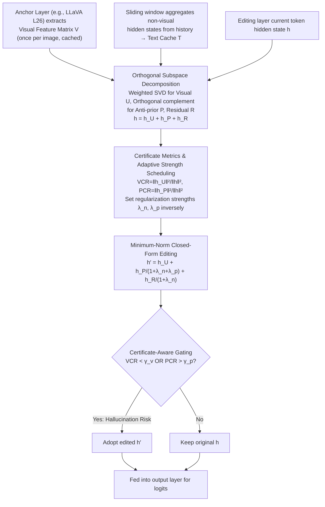

# HulluEdit: Single-Pass Evidence-Consistent Subspace Editing for Mitigating Hallucinations in Large Vision-Language Models

**Conference**: CVPR 2026  
**arXiv**: [2602.22727](https://arxiv.org/abs/2602.22727)  
**Code**: [GitHub](https://github.com/VioAgnes/HulluEdit)  
**Area**: Hallucination Detection

## TL;DR

HulluEdit is proposed as a single-pass, reference-free subspace editing framework. By decomposing hidden states into orthogonal visual evidence, conflicting prior, and residual uncertainty subspaces, it selectively suppresses hallucination patterns without interfering with visual grounding. It achieves SOTA hallucination mitigation performance on POPE and CHAIR benchmarks.

## Background & Motivation

1.  **Severe Object Hallucination**: LVLMs tend to generate descriptions of objects, attributes, or quantities that do not exist in the image, often because language priors override weak or blurry visual evidence, leading to inconsistency between text and image content.
2.  **Inefficiency of Contrastive Decoding**: Methods like VCD alleviate hallucinations but typically require a reference model or secondary inference, increasing latency and engineering complexity.
3.  **Lack of Adaptivity in Static Subspace Editing**: Methods like Nullu construct dataset-level hallucination subspaces offline, lacking token-level adaptivity and risking the suppression of authentic visual evidence.
4.  **Lack of Reliable Decoupling Mechanism**: Existing methods lack a reliable decoupling mechanism and fine-grained control between suppressing language priors and preserving visual evidence.

## Method

### Overall Architecture

HulluEdit aims to resolve object hallucinations in LVLMs—where language priors override visual evidence, causing the model to describe non-existent objects—using a single forward pass without reference models or secondary inference. The core idea is to decompose the hidden state $h$ of the current token at the editing layer into three mutually orthogonal subspaces: a visual subspace $U$ carrying visual evidence, an anti-prior subspace $P$ carrying conflicting language priors, and a residual uncertainty subspace $R$. Two "certificates" are used to measure the current token's reliance on vision versus priors, based on which a closed-form solution shrinks the prior and residual components proportionally while leaving the visual component intact. Finally, a gating mechanism decides whether to apply the edit. Visual evidence is extracted and cached once from an anchor layer (e.g., LLaVA layer 26) as a visual feature matrix $V$, while priors are derived from a text cache $T$ aggregated from non-visual hidden states via a sliding window. Since intervention occurs only at the final layer, the entire pipeline merely adds a few matrix projections to the forward pass.

The diagram below illustrates this single-pass pipeline of "Extraction & Caching → Orthogonal Decomposition → Certificate Scheduling → Closed-form Editing → Gating":

### Key Designs

**1. Orthogonal Subspace Decomposition: Completely separating grounding from prior-based fabrication**

The root of hallucination is the mixing of visual evidence and language priors within the same hidden state. Crude suppression of priors often damages authentic visual grounding. Thus, the first step is clean decomposition. The visual evidence subspace is constructed online at the token level: cosine similarity weights $w_i = \text{softmax}_i\!\left(v_i^\top h / (\|v_i\|_2\|h\|_2 + \epsilon)\right)$ are calculated for each visual token $v_i$ in the anchor cache relative to the current $h$, highlighting relevant regions. Truncated SVD is then performed on the weighted visual matrix to obtain the first $r$ left singular vectors as the orthogonal basis:

$$U, \Sigma, V^\top = \text{SVD}(W^{1/2}V), \quad U = U_{[:,1:r]}$$

The anti-prior subspace $P$ is intentionally built within the orthogonal complement of $U$ by projecting the text cache $\tilde{T} = T(I_d - UU^\top)$ and taking the first $q$ dimensions via SVD. This construction ensures $U^\top P = 0$, meaning visual components $h_U$ remain untouched regardless of how $P$ is suppressed, providing the "non-interference" guarantee. Remaining directions form the residual subspace $\Pi_R = I_d - \Pi_U - \Pi_P$. The hidden state is thus losslessly decomposed, satisfying energy conservation:

$$h = \underbrace{\Pi_U h}_{h_U} + \underbrace{\Pi_P h}_{h_P} + \underbrace{\Pi_R h}_{h_R}, \quad \|h\|_2^2 = \|h_U\|_2^2 + \|h_P\|_2^2 + \|h_R\|_2^2$$

**2. Certificate Metrics & Adaptive Strength Scheduling: Letting each token decide its own treatment**

Decomposition alone is insufficient as tokens vary in their visual dependency. HulluEdit uses two ratios as "certificates": Visual Consistency Rate $\text{VCR}(h) = \|h_U\|_2^2 / (\|h\|_2^2 + \epsilon)$, measuring how much the state aligns with visual evidence, and Prior Consistency Rate $\text{PCR}(h) = \|h_P\|_2^2 / (\|h\|_2^2 + \epsilon)$, measuring alignment with conflicting priors. Editing strength is scheduled inversely: lower VCR (weak visual support) increases non-visual suppression, while higher PCR (priors dominating) activates anti-prior suppression. When VCR is high and PCR is low, interference naturally diminishes.

**3. Minimum-Norm Closed-Form Editing: Minimal necessary modification via analytical solution**

To suppress priors without destroying generation, the edit is formulated as a regularized minimum-perturbation optimization: minimize the perturbation $\|\delta\|_2^2$ while penalizing the energy of the edited state in the orthogonal complement $\Pi_\perp$ and prior subspace $\Pi_P$:

$$\min_{\delta \in \mathbb{R}^d} \frac{1}{2}\|\delta\|_2^2 + \frac{\lambda_n}{2}\|\Pi_\perp(h+\delta)\|_2^2 + \frac{\lambda_p}{2}\|\Pi_P(h+\delta)\|_2^2$$

This convex problem has a closed-form solution, eliminating the need for iteration:

$$h' = h_U + \frac{1}{1+\lambda_n+\lambda_p}h_P + \frac{1}{1+\lambda_n}h_R$$

The behavior is clear: the visual component $h_U$ has a coefficient of 1 (fully preserved); the conflicting component $h_P$ is suppressed most heavily by both $\lambda_n$ and $\lambda_p$; the residual $h_R$ is moderately shrunk by $\lambda_n$. This step adds less than 2% overhead to transformer layer complexity. The paper proves that post-edit $\text{VCR}$ is monotonically non-decreasing and $\text{PCR}$ is non-increasing ("evidence consistency"), and the transformation is Lipschitz continuous.

**4. Certificate-Aware Gating: Acting only when hallucination risk is real**

To avoid unnecessary disturbance to well-generated tokens, a gating mechanism uses hard thresholds:

$$g(h) = \begin{cases} 1 & \text{if } \text{VCR}(h) < \gamma_v \ \lor\ \text{PCR}(h) > \gamma_p \\ 0 & \text{otherwise} \end{cases}$$

Edits are triggered only if the visual consistency rate is below $\gamma_v$ or the prior consistency rate exceeds $\gamma_p$. Ablations show that removing this gate causes CHAIRs to jump from 13.00 to 22.90, identifying it as a critical performance driver.

## Key Experimental Results

### Main Results

**POPE Benchmark (Object Hallucination Detection)**

| Category | Method | LLaVA-1.5-7B Acc | LLaVA-1.5-7B F1 | LLaVA-1.5-13B Acc | Qwen-VL-Chat Acc |
| :--- | :--- | :--- | :--- | :--- | :--- |
| Random | Greedy | 87.8 | 87.5 | 87.6 | 88.2 |
| Random | VCD | 88.4 | 87.7 | 88.9 | 89.1 |
| Random | VAF | 89.6 | 89.3 | 90.1 | 90.0 |
| Random | **HulluEdit** | **90.4** | **90.5** | **90.6** | **90.2** |
| Popular | Greedy | 82.5 | 83.2 | 82.7 | 82.4 |
| Popular | **HulluEdit** | **87.5** | **87.6** | **88.0** | **88.2** |
| Adversarial | Greedy | 77.6 | 79.4 | 77.8 | 77.2 |
| Adversarial | **HulluEdit** | **82.5** | **83.4** | **82.7** | **84.3** |

**CHAIR Benchmark (Image Captioning Hallucination)**

| Method | LLaVA-1.5 CHAIRi↓ | CHAIRs↓ | mPLUG-Owl2 CHAIRi↓ | CHAIRs↓ |
| :--- | :--- | :--- | :--- | :--- |
| Greedy | 7.08 | 20.40 | 8.62 | 22.90 |
| OPERA | 6.07 | 17.50 | 7.18 | 20.07 |
| HALC | 5.72 | 16.90 | 7.00 | 18.80 |
| Nullu | 5.30 | 15.20 | 5.77 | 15.60 |
| **HulluEdit** | **4.18** | **13.00** | **3.35** | **13.60** |

**MME Fine-grained Evaluation**

| Method | Existence↑ | Count↑ | Position↑ | Color↑ |
| :--- | :--- | :--- | :--- | :--- |
| LLaVA-1.5 | 181.67 | 118.33 | 104.44 | 152.78 |
| Nullu | 190.00 | 121.11 | 105.56 | 156.67 |
| DeCo | 175.00 | 128.33 | 98.33 | 125.00 |
| **HulluEdit** | **195.00** | 105.00 | **126.67** | **160.00** |

### Ablation Study

| Ablation Variant | CHAIRi↓ | CHAIRs↓ |
| :--- | :--- | :--- |
| Full Model ($L_a$=26, $L_e$=last) | **4.18** | **13.00** |
| $L_a$=20 | 5.55 | 19.72 |
| Single Layer ($L_a$=$L_e$=last) | 5.50 | 18.20 |
| Uniform SVD (No weighting) | 4.85 | 13.68 |
| No Orthogonal Constraint | 5.60 | 15.90 |
| Fixed Edit Strength | 5.20 | 13.88 |
| No Gating Mechanism | 7.70 | 22.90 |

### Key Findings

The most critical component is the gating mechanism; removing it pushes CHAIRs to 22.90, nearly reverting to Greedy levels, highlighting that "only intervening when necessary" is a major performance source. Lack of orthogonal constraints and single-layer architectures also degrade performance, validating the role of subspace separation and the anchor/editing layer division. Notably, while HulluEdit leads in Existence, Position, and Color on MME, its Count performance is lower than the baseline (105.00 vs 118.33), suggesting numerical information might be suppressed within the conservatively regularized residual subspace.

## Highlights & Insights

-   **Mathematically Rigorous Orthogonal Decomposition**: Decomposing hidden states into three orthogonal subspaces guarantees $U^\top P = 0$, ensuring visual components are unaffected when editing the anti-prior subspace.
-   **Single-Pass, Reference-Free**: No extra models or secondary inference required. Operations are performed online during decoding with less than 2% overhead.
-   **Closed-Form Optimal Solution**: The editing process has a strict convex optimization analytical solution, ensuring minimal perturbation without iteration.
-   **Certificate-Aware Adaptive Editing**: Editing strength is dynamically adjusted via VCR and PCR, weakening intervention for strong evidence and strengthening it for high conflict.
-   **Cross-Architecture Generalization**: Consistently effective across LLaVA-1.5 (7B/13B), MiniGPT-4, mPLUG-Owl2, and Qwen-VL-Chat.

## Limitations & Future Work

-   **Count Performance Drop**: Decline in MME Count tasks (-13.33) suggests fine-grained numerical information may reside in the conservatively regularized residual subspace.
-   **Hyperparameter Sensitivity**: Selection of anchor layers, subspace dimensions ($r$, $q$), and gating thresholds ($\gamma_v$, $\gamma_p$) require tuning for different models.
-   **Limited to Object-Level Hallucination**: Primarily targets existence and attribute hallucinations; coverage for relationship reasoning or event-level hallucinations is limited.

## Rating

-   ⭐⭐⭐⭐ Novelty: The orthogonal subspace decomposition approach is novel and mathematically elegant, formalizing hallucination mitigation as a theoretically guaranteed editing problem.
-   ⭐⭐⭐⭐ Practicality: Single-pass, training-free, and reference-free; deployment-friendly with extremely low inference overhead.
-   ⭐⭐⭐ Experimental Thoroughness: Comprehensive coverage across POPE/CHAIR/MME with detailed ablations, though lacked evaluation on newer models (e.g., LLaVA-Next, InternVL2).
-   ⭐⭐⭐⭐ Writing Quality: Rigorous and clear mathematical derivations with complete theoretical guarantees and intuitive visualizations.

<!-- RELATED:START -->

## Related Papers

- [\[CVPR 2026\] HulluEdit: Single-Pass Evidence-Consistent Subspace Editing for Mitigating Hallucinations in LVLMs](hulluedit_subspace_editing_hallucination.md)
- [\[CVPR 2026\] VES-RFT: Rewarding Visual Evidence Sensitivity to Mitigate Hallucinations in Large Vision-Language Models](ves-rft_rewarding_visual_evidence_sensitivity_to_mitigate_hallucinations_in_larg.md)
- [\[CVPR 2026\] Prefill-Time Intervention for Mitigating Hallucination in Large Vision-Language Models](prefill-time_intervention_for_mitigating_hallucination_in_large_vision-language_.md)
- [\[CVPR 2026\] PAS: Prelim Attention Score for Detecting Object Hallucinations in Large Vision-Language Models](pas_prelim_attention_score_for_detecting_object_hallucinations_in_large_vision-l.md)
- [\[CVPR 2026\] MAD: Modality-Adaptive Decoding for Mitigating Cross-Modal Hallucinations in Multimodal Large Language Models](mad_modality-adaptive_decoding_for_mitigating_cross-modal_hallucinations_in_mult.md)

<!-- RELATED:END -->
