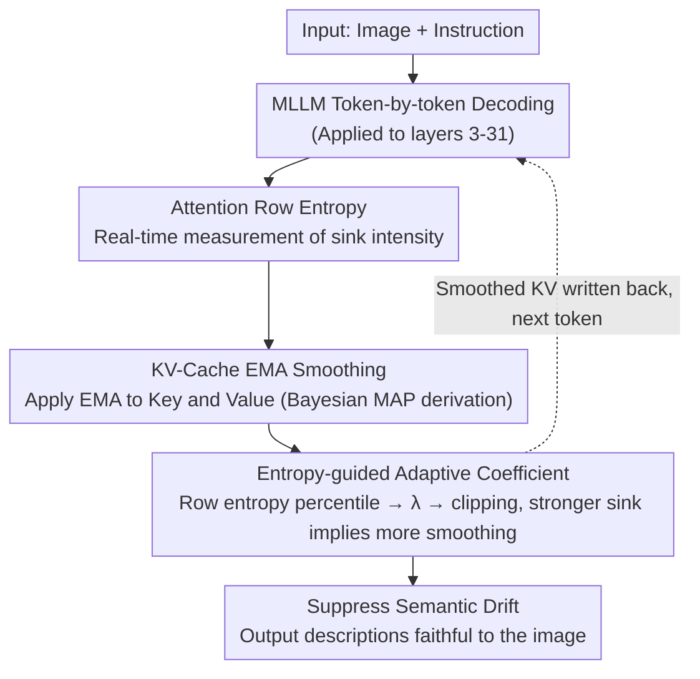

# KVSmooth: Mitigating Hallucination in Multi-modal Large Language Models through Key-Value Smoothing

**Conference**: CVPR2026  
**arXiv**: [2602.04268](https://arxiv.org/abs/2602.04268)  
**Code**: To be confirmed  
**Area**: Hallucination Detection  
**Keywords**: Multi-modal Hallucination Mitigation, KV-Cache Smoothing, Attention Entropy, Exponential Moving Average, Training-free Inference

## TL;DR

Ours proposes KVSmooth, a training-free plug-and-play method that performs smoothing on KV-Cache via adaptive Exponential Moving Average (EMA) guided by attention row entropy. It effectively suppresses semantic drift and hallucination generation triggered by sink tokens during the decoding process of Multi-modal Large Language Models (MLLMs). On LLaVA-1.5, it reduces CHAIR_S from 41.8 to 18.2 (a 56% reduction) while improving F1 from 77.5 to 79.2.

## Background & Motivation

1.  **Prevalence of Multi-modal Hallucinations**: MLLMs frequently generate objects, attributes, or relationships inconsistent with visual content in tasks like image captioning and VQA, severely hindering reliable deployment.
2.  **Long-range Decay of Visual Dependency**: As the decoding sequence grows, the influence of early visual tokens in hidden representations gradually decays, causing the generated text to deviate from the image content.
3.  **Cumulative Semantic Drift**: Small inaccuracies in early generation stages accumulate and amplify over time, widening the gap between generated descriptions and visual facts.
4.  **Sink Tokens Exacerbating Hallucinations**: Attention concentrates on a few "aggregation tokens." The hidden states of these tokens, produced through global averaging, deviate from the visual context and systematically inflate the logit scores of hallucinated objects.
5.  **Precision-Recall Trade-off in Existing Methods**: Fine-tuning methods require massive data and compute; contrastive decoding is computationally expensive; attention redistribution often suppresses correctly described objects while inhibiting hallucinations, sacrificing recall.
6.  **Lack of Deep Understanding of Sink Token Mechanisms**: Prior work focused on reducing sink tokens or weakening their weights without explaining why they trigger hallucinations.

## Method

### Overall Architecture

KVSmooth is a **training-free, plug-and-play** inference-time method designed to treat the issue where MLLM decoding becomes increasingly divergent and detached from the image. The authors target sink tokens—where attention excessively aggregates on a few "aggregation tokens" whose hidden states deviate from the visual context due to global averaging, systematically raising logits for hallucinations. KVSmooth applies an adaptive EMA smoothing to the Keys and Values in the KV-Cache during decoding to stabilize hidden state evolution and suppress semantic drift caused by sinks. The pipeline is a closed loop embedded in token-by-token decoding: first, **attention row entropy** is used to diagnose the sink intensity of the current token in real-time; then, **EMA smoothing is applied to the KV-Cache** based on this, with the smoothing strength dynamically determined by an **entropy-guided adaptive coefficient**. The smoothed KV is written back to the cache for the next token generation.

### Key Designs

**1. Attention Row Entropy: A Metric for Real-time Sink Intensity**

While previous works reduced or weakened sink tokens, they did not explain why they trigger hallucinations. The authors clarify the causal chain through three observations: the logit mean of ground-truth (GT) objects decreases monotonically with stable variance, while the logit mean of hallucinated objects rises with increasing variance (Obs1, hallucination candidates accumulate instability in hidden representations). Accordingly, the authors propose **attention row entropy** as a real-time measure of sink intensity: high row entropy tokens have a uniform (diffused) attention distribution, making their hidden states close to the historical average and geometrically near most other states. Consequently, they attract disproportionately high attention in subsequent steps, forming attention sinks (Obs2, cosine similarity between row entropy and traditional column-sum metrics centers at 0.79). Crucially, Obs3 shows that hallucinated object logit rankings correlate positively with row entropy—higher entropy leads to higher hallucination logits while GT logits decrease, revealing how sink tokens systematically inflate hallucination scores via global averaging.

**2. EMA Smoothing on KV-Cache: Formulating "Smooth Recurrent Trajectories" as Bayesian Inference**

Based on the assumption that "ideal decoding trajectories should be smooth," the hidden state transition is modeled as a Gaussian random walk $h_t = h_{t-1} + \epsilon_t$. Using Bayesian MAP estimation, it is derived that:

$$\hat{h_t} = (1-\lambda_t) o_t + \lambda_t h_{t-1}$$

This matches the EMA form. The key design choice is applying EMA to both Key and Value rather than directly modifying the hidden state. This maximizes the regularization of logit mean and variance to achieve the strongest hallucination suppression without damaging recall; ablations show that smoothing only the hidden state leads to a severe drop in recall.

**3. Entropy-guided Adaptive Coefficient: Scaling Smoothing with Sink Intensity**

A fixed coefficient is suboptimal. KVSmooth scales smoothing with sink intensity. At each layer, it computes the attention row entropy $z_t^l$ of the current token, maintains a FIFO queue of length $M$, and determines the coefficient using the **percentile rank** of the entropy $\hat{\lambda}_t^l = k/M$. High-entropy tokens receive larger coefficients. The value is then clipped within $[\lambda_{\text{ref}}-0.2, \lambda_{\text{ref}}+0.2]$ centered around a hyperparameter $\lambda_{\text{ref}}$ to stabilize generation and preserve diversity. Finally, for token $x_t$ at layer $l$, Key and Value are updated as:

$$\hat{K_t^l} = (1-\tilde{\lambda}_t^l) K_t^l + \tilde{\lambda}_t^l K_{t-1}^l$$
$$\hat{V_t^l} = (1-\tilde{\lambda}_t^l) V_t^l + \tilde{\lambda}_t^l V_{t-1}^l$$

In implementation, this is applied to layers 3-31, with a FIFO queue length of 15, and $\lambda_{\text{ref}}$ set to 0.9/0.5/0.7 for LLaVA-1.5/MiniGPT-4/InstructBLIP respectively. Ablation shows adaptive coefficients further reduce LLaVA-1.5's CHAIR_S from 36.2 to 18.2 compared to fixed ones.

## Key Experimental Results

### CHAIR Benchmark (Image Captioning Hallucination)

| Method | LLaVA-1.5 CHAIR_S↓ | LLaVA-1.5 F1↑ | MiniGPT-4 CHAIR_S↓ | MiniGPT-4 F1↑ | InstructBLIP CHAIR_S↓ | InstructBLIP F1↑ |
|------|---------------------|----------------|---------------------|----------------|------------------------|-------------------|
| Baseline | 41.8 | 77.5 | 31.8 | 69.9 | 61.4 | 71.6 |
| PAI | 22.6 | 75.5 | 24.6 | 71.0 | 63.4 | 71.1 |
| OPERA | 44.2 | 78.6 | 27.4 | 69.4 | 68.0 | 69.2 |
| MiddleLayer | 17.8 | 75.9 | 24.6 | 71.2 | 75.0 | 67.2 |
| **KVSmooth** | **18.2** | **79.2** | **17.0** | **71.7** | **42.2** | **75.1** |

- On LLaVA-1.5, CHAIR_S dropped by 56%, while F1 actually increased from 77.5 → 79.2, making it the **only method to simultaneously improve precision and recall**.
- On MiniGPT-4, CHAIR_S also decreased from 31.8 → 17.0 (47% reduction).

### Object HalBench

On LLaVA-1.5, CHAIR_SR was reduced from 45.3% to 16.7% (63.1% reduction). Sentence-level hallucination rates were reduced by 63.1%/40.3%/41.6% across the three models.

### Ablation Study

| Smoothing Position | LLaVA-1.5 Cs↓ | F1↑ |
|----------|----------------|-----|
| Only Attention Output $o_t$ | 33.8 | 74.7 |
| Only Key $K_t$ | 35.6 | 79.4 |
| **Key+Value** | **18.2** | **79.2** |

- Smoothing both Key and Value yields the best results; smoothing only the hidden state leads to a significant decrease in recall.
- Adaptive coefficients (Ada.) further reduced LLaVA-1.5’s CHAIR_S from 36.2 to 18.2 compared to fixed coefficients, validating the precise identification capability of the entropy-guided mechanism.

## Highlights & Insights

- **Training-free and Plug-and-play**: Requires no fine-tuning or parameter modification; acts directly on KV-Cache during inference with natural generalizability.
- **Dual Theory and Empirical Drive**: The EMA form is derived from Bayesian MAP estimation, while three observations provide a clear causal explanation chain (logit divergence → row entropy sink → entropy-hallucination coupling).
- **Breaking the Precision-Recall Dilemma**: PR curve analysis shows KVSmooth is the only method that significantly reduces hallucinations while maintaining or improving F1.
- **Concept of Sink Intensity**: Row entropy as a continuous real-time sink metric is more efficient than traditional column-summing and requires no multi-step lookback.
- **Extensive Validation**: Consistent results across 3 models (LLaVA-1.5/MiniGPT-4/InstructBLIP) and 4 benchmarks (CHAIR/POPE/AMBER/Object HalBench).

## Limitations & Future Work

- **Model-dependent Hyperparameters**: $\lambda_{\text{ref}}$ needs separate tuning for different models (0.9/0.5/0.7), lacking an automatic selection scheme.
- **Evaluation Limited to 7B Models**: Performance on larger scales (13B/70B) or newer architectures (e.g., Qwen2.5-VL) has not been verified.
- **Generation Length Constraints**: Maximum generation of 512 tokens; it is unexplored whether EMA remains effective in ultra-long generation scenarios.
- **Fixed Layer Range**: Application to layers 3-31 is empirical; no systematic layer selection criteria were provided.
- **Focus on Object Hallucinations**: Finer-grained hallucination types like attribute or relationship hallucinations were not specifically evaluated.
- **High Entropy is Not Always Bad**: High entropy at semantic transition points might be reasonable context switching; uniform smoothing carries a theoretical risk of information loss.

## Related Work & Insights

| Category | Representative Methods | Core Idea | KVSmooth Advantage |
|------|---------|----------|-------------|
| Contrastive Decoding | VCD, OPERA | Contrast with noise-augmented views / Penalize lookback | Lower compute, no multiple forward passes |
| Attention Redistribution | PAI, SPARC, MiddleLayer | Enhance attention to visual tokens | Does not sacrifice recall, superior PR curve |
| Fine-tuning Alignment | POVID, RLHF | Fine-tune with preference data | Training-free, no extra data required |
| KV-Cache Pruning | PruneHal | Delete redundant visual tokens | Better information preservation via smoothing instead of deletion |

## Rating

- Novelty: ⭐⭐⭐⭐ — The row entropy sink metric is novel; the EMA smoothing derived from a Bayesian perspective is theoretically elegant.
- Experimental Thoroughness: ⭐⭐⭐⭐ — Comprehensive with 3 models and 4 benchmarks + detailed ablation/PR analysis, but lacks large model and diverse hallucination type evaluations.
- Writing Quality: ⭐⭐⭐⭐ — Clear logic from observation to method to experiment; mathematical derivations are concise.
- Value: ⭐⭐⭐⭐ — The lightweight training-free solution is highly practical and provides a new direction for inference-time hallucination mitigation.

<!-- RELATED:START -->

## Related Papers

- [\[ICLR 2026\] Mitigating Hallucination in Vision-Language Model with Depth and Spatial-aware Key-Value Refinement](../../ICLR2026/hallucination/mitigating_hallucination_in_vision-language_model_with_depth_and_spatial-aware_k.md)
- [\[CVPR 2026\] MAD: Modality-Adaptive Decoding for Mitigating Cross-Modal Hallucinations in Multimodal Large Language Models](mad_modality-adaptive_decoding_for_mitigating_cross-modal_hallucinations_in_mult.md)
- [\[CVPR 2026\] Residual Decoding: Mitigating Hallucinations in Large Vision-Language Models via History-Aware Residual Guidance](residual_decoding_mitigating_hallucinations_in_large_vision-language_models_via_.md)
- [\[CVPR 2026\] CausalLens: Sensitivity-Guided Multi-Head Causal Intervention for Hallucination Mitigation in Large Vision-Language Models](causallens_sensitivity-guided_multi-head_causal_intervention_for_hallucination_m.md)
- [\[CVPR 2026\] Prefill-Time Intervention for Mitigating Hallucination in Large Vision-Language Models](prefill-time_intervention_for_mitigating_hallucination_in_large_vision-language_.md)

<!-- RELATED:END -->
