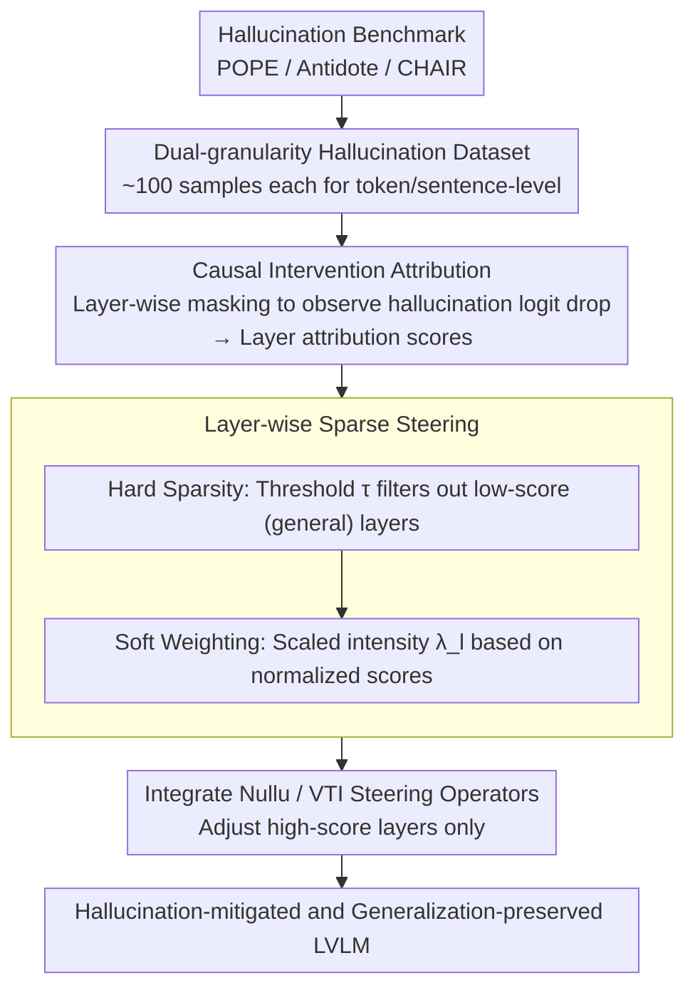

# Locate-then-Sparsify: Attribution Guided Sparse Strategy for Visual Hallucination Mitigation

**Conference**: CVPR 2026  
**arXiv**: [2603.16284](https://arxiv.org/abs/2603.16284)  
**Code**: [https://github.com/huttersadan/LTS-FS](https://github.com/huttersadan/LTS-FS)  
**Area**: Hallucination Detection  
**Keywords**: Visual Hallucination, Feature Steering, Layer-wise Attribution, Sparse Adjustment, LVLM

## TL;DR
The authors propose the LTS-FS (Locate-Then-Sparsify for Feature Steering) framework, which utilizes a causal intervention attribution method to locate hallucination-related layers. It applies layer-wise sparse control of feature steering intensity based on attribution scores, effectively mitigating LVLM hallucinations while preserving model generalization.

## Background & Motivation

**Background**: Although Large Vision-Language Models (LVLMs) demonstrate excellent performance in multimodal tasks, they still suffer from severe hallucination issues—generating fluent but factually incorrect descriptions relative to visual content. Existing mitigation methods are categorized into: fine-tuning (high cost, damages generalization), decoding enhancement (high inference overhead), and feature steering (modifying intermediate layer features).

**Limitations of Prior Work**: Feature steering methods (e.g., Nullu, VTI) apply uniform intensity across all layers, ignoring layer-wise differences—some layers are highly correlated with hallucinations, while others handle general representations. Uniform steering perturbs layers unrelated to hallucinations, disrupting original feature distributions and leading to degraded generalization.

**Key Challenge**: The trade-off between hallucination mitigation and the preservation of generalization—excessive steering reduces hallucinations but harms general capabilities, while insufficient steering is ineffective.

**Goal**: How to precisely locate hallucination-related layers and apply differential steering, intervening only where it is necessary?

**Key Insight**: Leveraging parameter localization techniques, layer-wise attribution scores are obtained by quantifying the contribution of each layer to hallucination outputs through causal intervention.

**Core Idea**: "Locate then Sparsify"—first locate hallucination-related layers, then sparsify steering intensity, applying strong adjustment to high-score layers and no adjustment to low-score layers.

## Method

### Overall Architecture
This paper addresses the "one-size-fits-all" problem in feature steering methods for hallucination mitigation, where layers responsible for general representations are perturbed, damaging generalization. LTS-FS first identifies which layers "should be adjusted" and then applies differential tuning. The pipeline consists of three steps: constructing a dual-granularity hallucination dataset (token-level + sentence-level) using a few samples; quantifying the contribution of each layer to hallucinations via causal intervention to obtain attribution scores; and translating these scores into layer-specific steering intensities. Layers with low scores are left untouched, while high-score layers are prioritized. The framework is decoupled from specific steering operators, allowing existing methods like Nullu or VTI to be integrated directly.

### Key Designs

**1. Dual-granularity Hallucination Dataset: Diagnostic differentiation for short answers and long descriptions**

Hallucination patterns differ between short Q&A (e.g., yes/no in POPE) and long descriptions (e.g., multi-sentence captions in CHAIR). Short Q&A hallucinations are concentrated in specific tokens, while long descriptions often spread throughout entire sentences. To avoid bias in the attribution signal, the authors construct two types of samples: token-level samples from POPE/Antidote (where hallucination tokens are identified via rules), and sentence-level samples from CHAIR (where paragraphs are split into sentences and labeled based on the presence of hallucination tokens). Only about 100 samples per category are required.

**2. Causal Intervention Attribution: Quantifying contribution by "blocking" layers**

To determine the relevance of layer $l$ to hallucinations, the authors perform direct interventions instead of gradient analysis. By masking the outputs of individual attention heads in a layer and measuring the resulting drop in hallucination token logits, they quantify contribution. Token-level attribution is defined as:

$$s_{tok}^l = \sum_{h=1}^H \log \frac{P(y\mid\mathbf{h}_{l-1}, \mathbf{a}_l)}{P(y\mid\mathbf{h}_{l-1}, \mathbf{a}_l \odot M^h)}$$

where the numerator is the probability of hallucination token $y$ given the complete attention output $\mathbf{a}_l$, and the denominator is the probability after masking head $h$ with $M^h$. Sentence-level attribution uses weighted aggregation of token scores based on three indicators—cue, position, and hallucination—prioritizing later tokens and those actually containing hallucinations. This intervention-based approach reflects the true causal role of layers better than gradients.

**3. Layer-wise Sparse Steering: Hard filtering followed by soft weighting**

After obtaining attribution scores, the final step translates them into layer-specific intensities via a two-stage process. Hard sparsity first applies a relative threshold $\tau = r_s \cdot \frac{1}{L}\sum_l s^l$ (where $r_s$ is a sparsity hyperparameter and $L$ is the number of layers). Layers with scores below this threshold are deemed unrelated to hallucinations and receive no steering, preventing disruption of general representations. The remaining high-score layers undergo soft weighting, scaling the intensity $\lambda_l$ according to normalized scores $\tilde{s}^l$:

$$\lambda_l = \lambda \cdot m_l + \lambda \cdot \tilde{s}_l$$

where $\lambda$ is the base steering intensity, $m_l$ is a binary mask for layer retention, and $\tilde{s}_l$ is the normalized attribution score. This ensures that layers most relevant to hallucinations are adjusted heavily while unrelated layers remain untouched.

### A Complete Example
Using LLaVA-1.5-7B (32 layers): 100 token-level and 100 sentence-level hallucination samples are used to perform mask intervention across all layers and heads to calculate 32 attribution scores. If a threshold $\tau$ is set, several mid-to-lower layers categorized as "general representation layers" are skipped ($m_l=0$). High-score layers are retained ($m_l=1$) and assigned different $\lambda_l$ based on $\tilde{s}_l$. During inference, only these high-score layers are adjusted by Nullu/VTI steering vectors, reducing metrics like CHAIR-S while preserving POPE accuracy and descriptive detail.

### Loss & Training
Attribution requires only 200 calibration samples. Once calculated, the steering strategy is fixed and does not require adjustment for the test set. There is no additional overhead during the inference phase, maintaining original model speeds.

## Key Experimental Results

### Main Results (CHAIR Metrics, lower is better)

| Model | Method | CS↓ | CI↓ | Recall | Len |
|------|------|-----|-----|--------|-----|
| LLaVA-1.5-7B | Regular | 53.0 | 13.9 | 77.2 | 98.0 |
| LLaVA-1.5-7B | Nullu | 50.2 | 13.7 | 76.9 | 93.3 |
| LLaVA-1.5-7B | LTS-FS(Nullu) | 46.8 | 13.5 | 76.6 | 93.2 |
| LLaVA-1.5-7B | VTI | 47.4 | 13.9 | 76.2 | 88.9 |
| LLaVA-1.5-7B | LTS-FS(VTI) | **35.8** | **11.9** | 75.4 | 82.2 |
| Qwen-VL2.5-7B | LTS-FS(Nullu) | **23.8** | **6.0** | 60.8 | 120.6 |

### Generalization Ability (POPE Accuracy / MMMU etc.)

| Metric | Nullu | LTS-FS(Nullu) | Description |
|------|-------|---------------|------|
| POPE-popular Acc | Baseline | +2% | Qwen-VL-2.5-7B |
| LLaVA-Bench detailness | 4.72 | 4.92 | Better generalization |
| MMMU | Decrease | Preserved/Improve | General ability unharmed |

## Highlights & Insights
- Introduces the concept of layer-wise sparse steering to hallucination mitigation, decoupled from and applicable to various steering methods.
- The causal intervention attribution method is simple and effective, requiring only 200 calibration samples to map layer relevance.
- Plug-and-play framework that enhances the effectiveness of existing methods like Nullu and VTI.
- Significantly preserves or improves generalization (e.g., LLaVA-Bench detailness 4.72 → 4.92) while reducing hallucinations.
- LTS-FS(VTI) reduces CHAIR-S on LLaVA-1.5-7B from 47.4 to 35.8, a 24.5% improvement.

## Limitations & Future Work
- Attribution calculation involves masking every head in every layer, which entails high computational overhead and VRAM requirements for larger models (>13B).
- Construction of dual-granularity datasets depends on existing hallucination benchmarks; applicability to out-of-domain scenarios requires verification.
- Currently validated on LLaVA and Qwen-VL series; adaptability to other architectures (InternVL, Gemma) is yet to be explored.
- Future work could refine attribution granularity to the attention head or neuron level for finer control.
- Attribution scores may vary across different tasks (Q&A vs. description); the current strategy of using token/sentence scores separately remains somewhat coarse.
- Optimal selection of the sparsity parameter $r_s$ may vary across models and tasks.
- Combinations with decoding enhancement methods (e.g., VCD) warrant further investigation.
- Computational efficiency of sentence-level attribution in long-context scenarios needs optimization.

### Results on Other Models
- Valid on LLaVA-1.5-13B: CS dropped from 40.8 to 35.7 (LTS-FS+Nullu) and 32.0 (LTS-FS+VTI).
- For Qwen-VL2.5-7B, CHAIR-CI dropped from 7.4 to 6.0, indicating a 19% reduction in detailed hallucinations.

<!-- RELATED:START -->

## Related Papers

- [\[CVPR 2026\] Envision, Attend, Then Respond: Counterfactual Hallucination Mitigation in Large Vision-Language Models](envision_attend_then_respond_counterfactual_hallucination_mitigation_in_large_vi.md)
- [\[CVPR 2026\] CausalLens: Sensitivity-Guided Multi-Head Causal Intervention for Hallucination Mitigation in Large Vision-Language Models](causallens_sensitivity-guided_multi-head_causal_intervention_for_hallucination_m.md)
- [\[CVPR 2026\] 3D-VCD: Hallucination Mitigation in 3D-LLM Embodied Agents through Visual Contrastive Decoding](3d-vcd_hallucination_mitigation_in_3d-llm_embodied_agents_through_visual_contras.md)
- [\[ACL 2026\] Spotlight and Shadow: Attention-Guided Dual-Anchor Introspective Decoding for MLLM Hallucination Mitigation](../../ACL2026/hallucination/spotlight_and_shadow_attention-guided_dual-anchor_introspective_decoding_for_mll.md)
- [\[CVPR 2026\] Same Attention, Different Truths: Put Logit-Lens over Visual Attention to Detect and Mitigate LVLM Object Hallucination](same_attention_different_truths_put_logit-lens_over_visual_attention_to_detect_a.md)

<!-- RELATED:END -->
