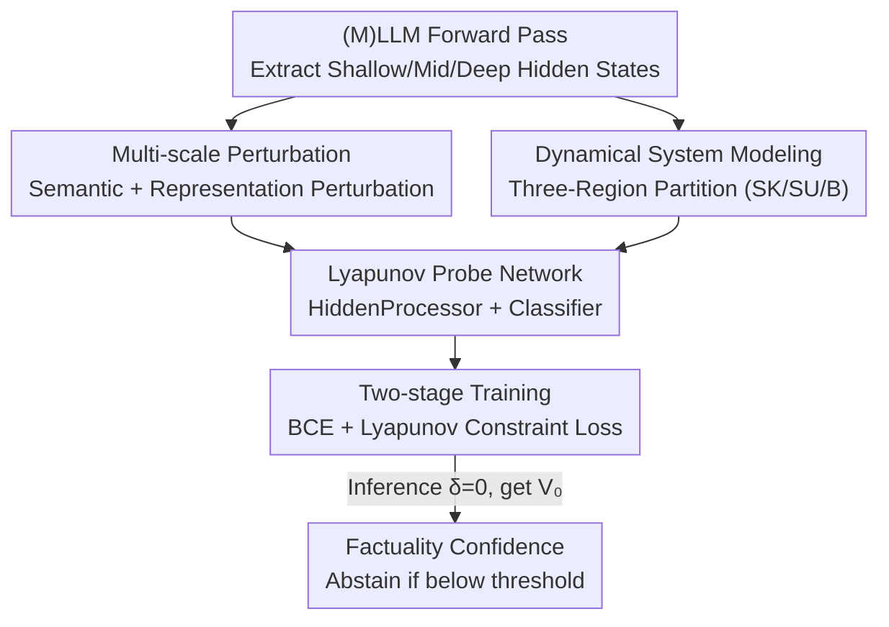

# Lyapunov Probes for Hallucination Detection in Large Foundation Models

**Conference**: CVPR 2026  
**Paper**: [CVF Open Access](https://openaccess.thecvf.com/content/CVPR2026/html/Luan_Lyapunov_Probes_for_Hallucination_Detection_in_Large_Foundation_Models_CVPR_2026_paper.html)  
**Code**: None  
**Area**: Multimodal VLM / Hallucination Detection  
**Keywords**: Hallucination detection, Lyapunov stability, Dynamical systems, Probe networks, Knowledge boundaries

## TL;DR
(M)LLMs are viewed as high-dimensional dynamical systems evolving in representation space, and "hallucinations" are redefined as cases where inputs fall into unstable knowledge boundary regions rather than stable equilibrium points. A lightweight probe network with a Lyapunov monotonic decay constraint (taking multi-layer hidden states and perturbation information as input) is used for discrimination, achieving AUPRC scores that consistently outperform ordinary probes by 4–8% across multiple LLMs/MLLMs.

## Background & Motivation
**Background**: Current hallucination detection is primarily divided into two categories: external verification (comparing outputs against knowledge bases) and internal features (training classifiers on hidden states or token probabilities, logit flatness, multi-generation consistency, and self-evaluated confidence).

**Limitations of Prior Work**: External methods require expensive, limited-coverage fact stores that need constant updates. Internal methods lack theoretical grounding, essentially treating hallucination detection as "standard binary classification / pattern recognition"; they fit surface statistical patterns but fail to explain **why and where hallucinations occur**.

**Key Challenge**: Existing methods treat hallucinations as randomly distributed errors for classification. However, the authors argue that hallucinations are a **systematic** phenomenon—concentrated in the transition zones between "reliable knowledge regions" and "uncertainty regions"—representing "representational instability" in the embedding space. Without this mechanistic characterization, probes learn only dataset-specific spurious features and fail during cross-domain deployment.

**Goal**: To establish a theoretically grounded framework for hallucination detection that explains "where/why," and to implement it as a practical, trainable, and cross-domain transferable probe.

**Key Insight**: Leveraging dynamical systems stability theory, the layer-wise forward computation of (M)LLMs is treated as a dynamical system $\mathcal{F}: \mathbb{R}^d \to \mathbb{R}^d$, where hidden states evolve as $h^{(l+1)}=\mathcal{F}^{(l)}(h^{(l)})$. Factual knowledge corresponds to **attractors / stable equilibrium points** (where outputs remain factually consistent under small perturbations), while hallucinations correspond to **unstable points** (where tiny perturbations cause the output to drift sharply).

**Core Idea**: Characterizing knowledge boundaries using Lyapunov stability theory—defining a probe function $V(h,\delta)$ to estimate the probability that "the representation remains factually correct under perturbation," and forcing it to **monotonically decay** as the perturbation magnitude increases. This transforms hallucination detection from "distinguishing factual/non-factual output" to "judging whether an input falls into a stable region or an unstable boundary region."

## Method

### Overall Architecture
The method addresses identifying whether a specific output of an (M)LLM falls into a "hallucination-prone" unstable region. The approach involves partitioning the representation space by stability and training a lightweight probe network to fit a Lyapunov function $V(h,\delta)$. The probe takes **multi-layer hidden states** $\{h_l\}_{l\in\mathcal{L}}$ and **explicit perturbation intensity** $\delta$ as input, outputting a factual confidence score in $[0,1]$ (closer to 1 indicates higher stability/trustworthiness). During training, in addition to standard factual supervision (BCE), a Lyapunov constraint loss is applied to force the confidence to decrease monotonically as perturbation increases—a hallmark of stable equilibrium points. During inference, the perturbation is set to 0 to obtain $V_0=V(h,0)$ as the factual confidence score; if it falls below a threshold, the model abstains, blocking the hallucination before generation.

### Key Designs

**1. Dynamical System Modeling and Three-Region Partitioning: Switching "Factuality Judgment" to "Stability Judgment"**

To address the lack of mechanism in existing work, the authors explicitly partition the representation space into three areas: **Stable Known (SK)**—inputs supported by solid parametric knowledge, where representation $h=\text{Encoder}(x)$ satisfies $\|\mathcal{F}(h+\delta)-\mathcal{F}(h)\|<\epsilon$ for any $\|\delta\|<\epsilon_0$, yielding robust outputs; **Stable Unknown (SU)**—outside the model's knowledge range, but the model stably outputs "I don't know" or abstains under small perturbations; and **Unstable Knowledge Boundary (B)**—sandwiched between the two with fragile stability, where small perturbations cause sudden response changes. **The vast majority of hallucinations occur here.** This partitioning redefines the detection target as "judging stability regions," providing a clear optimization objective for the probe.

**2. Lyapunov Probe Network: A Lightweight Discriminator Fusing Multi-layer Hidden States**

To implement the abstract criteria, the probe concatenates multi-layer raw hidden states with perturbation intensity:

$$V(h,\delta)=\text{Classifier}\big(\text{HiddenProcessor}(\{h_l\}_{l\in\mathcal{L}};\delta)\big)$$

The HiddenProcessor is a Transformer using self-attention to capture inter-layer dependencies, followed by two feature projection layers; the Classifier is a 3-layer MLP with a sigmoid output for $[0,1]$ confidence. A key design is **multi-layer signal aggregation**: the authors select shallow, middle, and deep layers—shallow layers are rich in semantic/syntactic info, middle layers provide strong factual signals, and deep layers reflect the generation process. This fusion is more reliable than any single-layer probe and removes the need for manual layer tuning across different architectures.

**3. Lyapunov Constraint Loss: Enforcing Monotonic Decay via Derivative Signs**

Ordinary probes only learn "discriminative patterns" and cannot guarantee capturing stability structures. The authors add an explicit stability constraint alongside BCE. The total loss is $\mathcal{L}_{\text{total}}=\mathcal{L}_{\text{BCE}}+\lambda\mathcal{L}_{\text{Lyapunov}}$. BCE supervises factual correctness on **unperturbed** samples: $\mathcal{L}_{\text{BCE}}=-\mathbb{E}[y\log V_0+(1-y)\log(1-V_0)]$, where $V_0=V(h,0)$ and $y\in\{0,1\}$ indicates correct answering—this ensures $V$ peaks at stable equilibrium points. The Lyapunov constraint loss penalizes non-negative derivatives:

$$\mathcal{L}_{\text{Lyapunov}}=\mathbb{E}_{h,\delta}\Big[\max\Big(0,\tfrac{\partial V(h,\delta)}{\partial\delta}\Big)\Big]$$

This forces $\partial V(h,\delta)/\partial\|\delta\|<0$, meaning predicted confidence must decrease as perturbation increases. This is the Lyapunov condition for stable equilibrium points, transforming "stability" from a theoretical criterion into a differentiable training signal, ensuring the probe learns mechanisms rather than surface correlations (ablation shows a 3–5 point drop without it).

**4. Multi-scale Perturbation + Two-stage Training: Making Stability Transitions "Observable"**

To allow the probe to observe how stability collapses, representations must be pushed across knowledge boundaries systematically. Two types of perturbations are used: **Semantic Perturbation** (part-of-speech replacement, random token insertion, syntactic adjustment) and **Representation Perturbation** (injecting Gaussian noise into hidden states). For each input, a sequence of perturbations $\delta_1,\dots,\delta_K$ with increasing magnitude is constructed, measured by cosine similarity $\delta=1-\cos(h,h_\delta)$. Training occurs in two stages: first using only BCE to distinguish factual/non-factual, then **gradually increasing $\lambda$** to introduce the Lyapunov constraint. This warm-up scheduling ensures stable optimization while embedding stability properties into the probe.

### Loss & Training
Total objective $\mathcal{L}_{\text{total}}=\mathcal{L}_{\text{BCE}}+\lambda\mathcal{L}_{\text{Lyapunov}}$; two-stage training (Stage 1: BCE only, Stage 2: incrementally increasing $\lambda$). Uses an 80/20 train/val split, greedy decoding, and multiple random seeds. ⚠️ Specific layer indices for the three hidden states, range of $\lambda$, and number of perturbation steps $K$ are as specified in the original paper/appendix.

## Key Experimental Results

### Main Results (LLM, AUPRC↑)
Comparison against probability/self-evaluation baselines and ordinary probes without stability constraints (Selection: Llama-3-8B and Falcon-7B):

| Model | Method | TriviaQA | PopQA | CoQA | MMLU |
|------|------|----------|-------|------|------|
| Llama-3-8B | Seq. Prob. | 70.72 | 27.02 | 50.35 | 57.48 |
| Llama-3-8B | Probe | 78.82 | 60.77 | 80.67 | 79.26 |
| Llama-3-8B | **Ours** | **86.46** | **67.08** | **81.28** | **80.00** |
| Falcon-7B | Probe | 63.27 | 60.48 | 65.36 | 24.79 |
| Falcon-7B | **Ours** | **65.52** | **61.23** | **66.03** | **25.11** |

Ours is on average 6.2% higher than ordinary probes and 18.5% higher than probability-based baselines; consistently achieves 4–8% Gains on tasks requiring factual accuracy (+7.1% for Llama-3-8B on TriviaQA).

### Key Experimental Results (MLLM, AUPRC↑)
| Model | Method | POPE | TextVQA | VizWiz | MME |
|------|------|------|---------|--------|-----|
| LLaVA-1.5 | Probe | 98.08 | 85.89 | 77.02 | 93.61 |
| LLaVA-1.5 | **Ours** | **99.13** | **89.02** | **83.18** | **95.18** |
| Qwen-2.5-VL | Probe | 98.41 | 95.61 | 84.04 | 96.32 |
| Qwen-2.5-VL | **Ours** | **99.00** | **96.98** | **85.17** | **97.57** |

Average 2.1% higher than basic probes; POPE is near saturation (+0.8%), but the largest gains appear in real-world low-quality images like VizWiz (Avg +3.6%, +6.2% for LLaVA on VizWiz).

### Ablation Study (TriviaQA, AUPRC↑)
| Configuration | Llama-2-7B | Llama-3-8B | Qwen-3-4B | Falcon-7B |
|------|-----------|-----------|-----------|-----------|
| w/o Perturbed Data | 82.41 | 82.35 | 79.92 | 65.65 |
| w/o Two-stage Training | 82.00 | 84.80 | 80.58 | 64.27 |
| w/o Multi-layer States | 77.34 | 82.16 | 77.59 | 60.50 |
| w/o Lyapunov Loss | 78.13 | 82.86 | 74.19 | 62.48 |
| **Full Model** | **83.09** | **86.46** | 79.47 | **65.52** |

### Key Findings
- **Multi-layer hidden states are most critical**: Removal leads to the sharpest drop (83.09 → 77.34 for Llama-2-7B). While optimal single-layer depth varies by architecture, multi-layer fusion outperforms the best single layer by 1.8–4.8 percentage points.
- **Lyapunov constraint loss is the second largest contributor**: Its removal causes a 3–5 point drop, proving that explicit monotonic decay outperforms ordinary supervised learning.
- **Stability is truly learned, not just fitted**: Fig. 4 shows full probe confidence decreasing smoothly/monotonically as perturbation increases (0.80→0.50 for Qwen-3-4B), whereas ordinary probes fluctuate, confirming Lyapunov condition satisfaction.
- **Strong cross-domain transfer**: Probes trained only on TriviaQA and tested on CoQA/PopQA outperform probability baselines by 20–30 points, with only a 5–16 point gap from in-domain probes, validating that instability at knowledge boundaries is a universal pattern.
- **Stability signals concentrate in middle-to-late layers**: Deep layers (15–32) generally outperform shallow layers (0–5).
- ⚠️ Two-stage training has minimal Gain for some models (e.g., Qwen-3-4B), likely due to architecture-specific optimization strategies.

## Highlights & Insights
- **Viewpoint reconstruction is the primary contribution**: Shifting from "factuality judgment" to "representation stability judgment" provides the first mechanistic explanation for "where/why" hallucinations occur. Applying dynamical systems/Lyapunov theory to LLM cognition is highly transferable.
- **Derivative sign as a loss function is ingenious**: $\max(0,\partial V/\partial\delta)$ encodes abstract "monotonic decay stability" into a differentiable regularizer with near-zero cost.
- **Minimal cross-domain performance drop** is the strongest evidence for the mechanistic hypothesis: If the probe were fitting dataset spurious features, it would fail across domains.
- Lightweight and decoupled: Probes read only hidden states without modifying the backbone, allowing plug-and-play use with different (M)LLMs.

## Limitations & Future Work
- **Requires labeled answerable/unanswerable tags** ($y\in\{0,1\}$) to train the probe; switching to entirely new domains still requires supervised data, though cross-domain transfer mitigates this.
- **Heuristic indentation of perturbations**: Semantic plus Gaussian noise with $1-\cos$ magnitude metrics; perturbation steps and intensity ranges remain hyperparameters without exhaustive sensitivity analysis in the main text.
- Limited gains on saturated benchmarks like POPE; value is mainly shown in noisy/open factual QA scenarios.
- ⚠️ AUPRC is reasonable for imbalanced classes, but absolute values shouldn't be compared directly across tasks (e.g., CoQA has naturally smaller gains due to context coherence).
- Future improvements: Explicitly parameterizing the boundary $B$ of the three-region partition or extending the Lyapunov function to vector fields could provide finer "hallucination risk maps."

## Related Work & Insights
- **vs. Probabilistic/Self-eval Baselines (Verbalized / Surrogate / Seq. Prob.)**: These rely on token probability flatness or self-assessment prompts; the current work relies on hidden state stability. The former treats hallucination as pattern recognition (prone to overconfidence), while the latter is theoretically grounded and cross-domain stable (AUPRC +18.5%).
- **vs. Ordinary Supervised Probes**: Both train hidden state classifiers, but this work adds Lyapunov monotonic constraints, multi-layer fusion, and multi-scale perturbation. Ordinary probes are non-monotonic and represent surface fitting; this method averages 6.2% higher with smaller cross-domain gaps.
- **vs. Subspace Methods (e.g., HaloScope)**: Those perform activation covariance eigendecomposition to find hallucination subspaces; this work characterizes "stability under perturbation," linking representational stability to factual reliability.

## Rating
- Novelty: ⭐⭐⭐⭐⭐ High; introduces dynamical systems/Lyapunov stability to redefine hallucination detection.
- Experimental Thoroughness: ⭐⭐⭐⭐ Solid; covers 6 (M)LLMs and 8 benchmarks plus cross-domain validation, though some hyperparameter details (e.g., $\lambda$) are missing from the main text.
- Writing Quality: ⭐⭐⭐⭐ Clear theoretical framework; derivation of the three-region partition and losses is logical.
- Value: ⭐⭐⭐⭐ Practical plug-and-play utility with strong cross-domain stability; mechanistic perspective is inspiring.

<!-- RELATED:START -->

## Related Papers

- [\[NeurIPS 2025\] Beyond Token Probes: Hallucination Detection via Activation Tensors with ACT-ViT](../../NeurIPS2025/hallucination/beyond_token_probes_hallucination_detection_via_activation_tensors_with_act-vit.md)
- [\[CVPR 2026\] HulluEdit: Single-Pass Evidence-Consistent Subspace Editing for Mitigating Hallucinations in Large Vision-Language Models](hulluedit_single-pass_evidence-consistent_subspace_editing_for_mitigating_halluc.md)
- [\[CVPR 2026\] TriDF: Evaluating Perception, Detection, and Hallucination for Interpretable DeepFake Detection](tridf_evaluating_perception_detection_and_hallucination_for_interpretable_deepfa.md)
- [\[CVPR 2026\] Prefill-Time Intervention for Mitigating Hallucination in Large Vision-Language Models](prefill-time_intervention_for_mitigating_hallucination_in_large_vision-language_.md)
- [\[ACL 2026\] HalluAudio: A Comprehensive Benchmark for Hallucination Detection in Large Audio-Language Models](../../ACL2026/hallucination/halluaudio_a_comprehensive_benchmark_for_hallucination_detection_in_large_audio-.md)

<!-- RELATED:END -->
