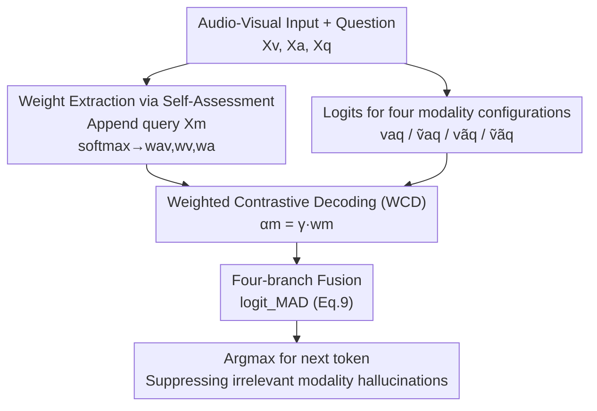

# MAD: Modality-Adaptive Decoding for Mitigating Cross-Modal Hallucinations in Multimodal Large Language Models

**Conference**: CVPR 2026  
**Paper**: [CVF Open Access](https://openaccess.thecvf.com/content/CVPR2026/html/Chung_MAD_Modality-Adaptive_Decoding_for_Mitigating_Cross-Modal_Hallucinations_in_Multimodal_Large_CVPR_2026_paper.html)  
**Code**: https://github.com/top-yun/MAD  
**Area**: Multimodal VLM / Hallucination Detection / Contrastive Decoding  
**Keywords**: Cross-modal hallucination, Contrastive decoding, Training-free, Modality self-assessment, Audio-visual LLMs

## TL;DR
To address "cross-modal hallucinations" in audio-visual large language models—where one modality incorrectly influences the generation of another—this paper proposes MAD (Modality-Adaptive Decoding). MAD is a training-free method that first extracts modality weights by having the model identify which modality is required for a question, then uses these weights to adaptively weight a four-way contrastive decoding branch. This suppresses interference from irrelevant modalities, improving overall accuracy on CMM/AVHBench by several percentage points compared to baselines like AVCD.

## Background & Motivation
**Background**: Audio-visual large language models (AV-LLMs, such as Video-LLaMA and Qwen2.5-Omni) integrate vision, audio, and text into an LLM for video QA and audio-visual scene understanding. The mainstream training-free approach to mitigate hallucinations is **Contrastive Decoding (CD)**. This involves subtracting the output distribution of a "distorted input" (noise, masking, or modality deletion) from that of a "clean input" to amplify tokens that truly rely on input evidence and suppress those generated by language priors. AVCD extends this to the audio-visual tri-modal setting.

**Limitations of Prior Work**: While unimodal hallucinations involve "fabricating within a single modality," multimodal scenarios involve the more subtle **cross-modal hallucination**. This occurs when one modality inappropriately affects the generation of another; for instance, if a video shows a boat, the model might fabricate "splashing sounds of fish jumping" when describing the audio. Existing CD/AVCD methods are **modality-agnostic**, applying a **uniform** distortion strength to all modalities regardless of which modality the current task actually requires.

**Key Challenge**: The root cause of cross-modal hallucination lies in the **failure of modality interaction control**. Static strategies cannot determine how much weight to assign to each modality, which misleading modality to suppress, or how to maintain modality boundaries. For a question like "What sound do you hear?", the model should strongly suppress visual contrast and weakly suppress audio contrast; the reverse applies to "What color is the car?". A fixed $\alpha$ "one-size-fits-all" strategy inevitably results in performance trade-offs.

**Goal**: Enable contrastive decoding to **adaptively** determine the contrastive strength for each modality based on the task, without requiring model retraining.

**Key Insight**: Models possess an inherent potential for **modality suitability judgment**. By directly asking the model, "Does answering this question require audio, video, or both?", its prediction can reflect which modality the task truly depends on.

**Core Idea**: Extract modality weights $w_m$ through **modality self-assessment**, and then inject these weights into the contrastive decoding strength using $\alpha_m=\gamma\cdot w_m$ to achieve task-aware multi-branch modality contrastive fusion.

## Method

### Overall Architecture
MAD is a training-free decoding-stage method consisting of two steps. **Step 1 (Modality Weight Extraction)**: Given video $X_v$, audio $X_a$, and a question $X_q$, a fixed modality query prompt $X_m$—"Which modality is needed to answer this question (audio/video/both)?"—is appended. The model's logits for the 'video', 'audio', and 'both' tokens are taken and passed through a softmax to obtain normalized modality weights $(w_{av},w_v,w_a)$. **Step 2 (Modality-Adaptive Generation)**: At each step of autoregressive decoding, logits for four modality configurations (both available, video only, audio only, and both missing) are calculated. These are fused into four contrastive branches weighted by $\gamma\cdot w_m$ to obtain $\text{logit}_{\text{MAD}}$, from which the next token is selected via argmax. Intuitive effect: When a task requires audio, the contrastive strength of the audio branch is increased to suppress visual fabrications, and vice versa.

### Key Designs

**1. Weighted Contrastive Decoding: Replacing fixed strength with task-related $\alpha_m=\gamma\cdot w_m$**

To address the "one-size-fits-all" limitation of existing CD, the authors first generalize contrastive decoding to any modality $m$:

$$\text{logit}_{\text{CD}}^{(m)}(y_t)=\text{logit}(y_t\mid X_m,X_q,y_{<t})+\alpha_m\cdot\Delta_m$$

where $\Delta_m=\text{logit}(y_t\mid X_m,X_q)-\text{logit}(y_t\mid X_{\tilde m},X_q)$ is the contrastive signal measuring output dependence on modality $m$, and $\alpha_m$ controls the penalty for tokens lacking $m$-grounding. The key change is decomposing the fixed $\alpha_m$ into $\alpha_m=\gamma\cdot w_m$, where $\gamma$ is a fixed base strength shared across all modalities and $w_m\in[0,1]$ is the task-related relevance weight. Using a unified $\gamma$ ensures that differences in contrastive strength arise **purely from adaptive weights** rather than inherent modality biases; high $w_m$ (modality relevant) amplifies hallucination suppression, while low $w_m$ (irrelevant) reduces unnecessary penalties.

**2. Modality-Adaptive Weight Extraction: Model self-assessment of "Modality Needs"**

How is $w_m$ obtained dynamically? Instead of using an external classifier, the authors utilize the model's own ability to judge modality relevance. By appending the prompt $X_m$ ("To answer this question, which modality is needed (audio, video, or both)?") after $X_v,X_a,X_q$, the model predicts the next token. Logits $z_{av},z_v,z_a$ for 'both', 'video', and 'audio' are taken and normalized:

$$[w_{av},w_v,w_a]=\text{softmax}([z_{av},z_v,z_a])$$

These weights represent the model's self-assessed importance for each modality. Validation on 100 videos and 300 questions from VideoMME (visual-related/audio-related/audio-visual-related) showed $w_v$ dominates for visual questions (avg. 0.565), confirming that this query can correctly identify required modalities **without any supervision**.

**3. Four-branch Modality-Adaptive Generation: Modality-specific contrastive application**

Substituting both modalities (video $v$, audio $a$) into the contrastive formula and distinguishing between joint strength $\alpha_{av}$ and unimodal strengths $\alpha_v,\alpha_a$ yields a four-branch form (with $\alpha$ replaced by $\gamma\cdot w$):

$$\text{logit}_{\text{MAD}}(y_t)=\underbrace{(1{+}\gamma w_{av})\text{logit}^{vaq}{-}\gamma w_{av}\text{logit}^{\tilde v aq}}_{\text{Visual CD | Audio present}}+\underbrace{(1{+}\gamma w_{av})\text{logit}^{vaq}{-}\gamma w_{av}\text{logit}^{v\tilde a q}}_{\text{Audio CD | Visual present}}+\underbrace{(1{+}\gamma w_v)\text{logit}^{v\tilde a q}{-}\gamma w_v\text{logit}^{\tilde v\tilde a q}}_{\text{Visual CD | Audio absent}}+\underbrace{(1{+}\gamma w_a)\text{logit}^{\tilde v aq}{-}\gamma w_a\text{logit}^{\tilde v\tilde a q}}_{\text{Audio CD | Visual absent}}$$

Each line implements contrast for a specific modality configuration: when both modalities are present (first two lines), $w_{av}$ controls the joint audio-visual contrast; when one is missing (last two lines), it falls back to unimodal contrast with weights $w_v/w_a$. The four signals are **soft-fused** together, suppressing cross-modal fabrications induced by the dominant modality while preserving complementary cues from the non-dominant one.

### Loss & Training
The method is training-free with no parameter updates. The only hyperparameter is the base contrastive strength $\gamma$. By sampling 100 cases per dataset and searching $\gamma$ from 0.5 to 3.0 in steps of 0.5, $\gamma=2.5$ was selected for all datasets. Temperature is set to 0 for deterministic generation. Distorted inputs $X_{\tilde v}/X_{\tilde a}$ are obtained via noise or masking (specific operators follow the original paper/appendix).

## Key Experimental Results

### Main Results (Accuracy %↑)
Performance on CMM (evaluated by Visual/Audio/Language dominance) and AVHBench (video-driven audio hallucination, audio-driven video hallucination) compared to Base, VCD-Extended, and AVCD:

| Model + Method | CMM Visual | CMM Audio | CMM Language | CMM Overall | AVHBench Overall |
|------|------|------|------|------|------|
| VideoLLaMA2-AV | 71.8 | 80.0 | 68.8 | 73.5 | 77.4 |
| VideoLLaMA2-AV + AVCD | 71.8 | 84.0 | 71.5 | 75.8 | 79.3 |
| VideoLLaMA2-AV + **MAD** | **82.3** | **84.3** | **77.5** | **81.3** | **79.4** |
| Qwen2.5-Omni-7B | 64.5 | 72.3 | 81.3 | 72.7 | 76.9 |
| Qwen2.5-Omni-7B + AVCD | 66.3 | 72.8 | 81.0 | 73.3 | 77.8 |
| Qwen2.5-Omni-7B + **MAD** | **76.8** | **84.3** | **83.3** | **81.4** | **81.6** |

MAD outperforms baselines across all models and datasets: VideoLLaMA2-AV improved by +9.3% in visual dominance and +5.5% in language dominance; Qwen2.5-Omni improved by +12.3% in visual dominance and +12.0% in audio dominance.

### Ablation Study: Fusion Strategies (VideoLLaMA2-AV, CMM %↑)
| Fusion Method | Visual Dominant | Audio Dominant | Language Dominant | Overall |
|------|------|------|------|------|
| Baseline | 71.8 | 80.0 | 68.8 | 73.5 |
| Uniform (1/3 Weight) | 77.5 | 83.3 | 77.5 | 79.4 |
| Argmax (Select Best) | 78.5 | 80.5 | 77.0 | 78.7 |
| **Weighted (Ours)** | **82.3** | **84.3** | **77.5** | **81.3** |

### Ablation Study: Contribution of Modality Weights (VideoLLaMA2-AV, CMM Overall %↑)
| Enabled Weights | Overall Acc |
|------|------|
| $w_v+w_{av}$ only (w/o $w_a$) | 78.0 |
| $w_a+w_{av}$ only (w/o $w_v$) | 78.3 |
| $w_a+w_v$ only (w/o $w_{av}$) | 78.9 |
| **All: $w_a+w_v+w_{av}$** | **81.3** |

### Key Findings
- **Soft Weighting > Uniform > Argmax**: Uniform weighting ignores task requirements, while Argmax loses complementary cues; soft fusion based on relevance is superior.
- **Symmetric and Necessary Weights**: Removing $w_a$ drops accuracy to 78.0 (visual dominance −6.5%, as the model fabricates audio events based on vision); removing $w_v$ drops it to 78.3. All three weights are required for optimal joint reasoning.
- **Bi-directional Hallucinations**: Visual dominance induces audio hallucinations and vice versa, necessitating adaptive balancing based on the question.
- **Preserves General AVQA Capabilities**: MAD maintains or slightly improves performance on general benchmarks like OmniBench and Worldsense, indicating it enhances reliance on reliable evidence.

## Highlights & Insights
- **Model Self-Assessment is Clever**: Converting contrastive strength—a hyperparameter—into an interpretable weight via model self-assessment and softmax is elegant. It requires zero training or extra annotation.
- **Decoupling $\gamma$ and $w_m$**: This clean separation ensures contrastive differences stem purely from task demands rather than modality bias, effectively upgrading AVCD's "one-size-fits-all" approach to "just-in-time" allocation.
- **Four-Branch Soft Fusion**: Avoiding a hard argmax selection preserves the complementary information necessary for joint audio-visual reasoning.
- **Training-Free and Plug-and-Play**: The low implementation cost makes it highly practical for any AV-LLM.

## Limitations & Future Work
- The derivation and experiments focus on audio and video; doubling the modalities would lead to exponential growth in branches ($2^M$), posing scalability issues.
- Computing logits for four modality configurations per step increases **inference overhead by roughly 4x**.
- Weight extraction depends on the model's ability to evaluate the "audio/video/both" tokens; poor self-assessment by the base model would bottleneck the method.
- $\gamma=2.5$ was searched on a subset; no task-specific sensitivity analysis for this parameter was performed.

## Related Work & Insights
- **vs. Standard CD / VCD**: These target unimodal scenarios and fixed visual distortions; MAD generalizes to audio-visual settings and introduces task-adaptive $\gamma w_m$.
- **vs. VCD-Extended**: VCD-Extended uses a uniform $\alpha$ to subtract distortions from all modalities collectively, lacking task awareness. MAD consistently outperforms it.
- **vs. AVCD**: AVCD also targets tri-modal settings through attention-based perturbations but remains **modality-agnostic** in strength. MAD's explicit self-assessment outperforms AVCD on CMM/AVHBench.
- **vs. DoLa**: DoLa contrasts logits from different layers; MAD contrasts different modalities. These approaches are orthogonal and could potentially be combined.

## Rating
- Novelty: ⭐⭐⭐⭐ The combination of "modality self-assessment → weighted contrastive decoding" is novel and consistent, though it builds on CD/AVCD frameworks.
- Experimental Thoroughness: ⭐⭐⭐⭐ Solid results on two cross-modal benchmarks and general AVQA; however, it lacks extensive inference cost and $\gamma$ sensitivity data.
- Writing Quality: ⭐⭐⭐⭐ Clear derivation of the four-branch formula and well-articulated motivation.
- Value: ⭐⭐⭐⭐ High utility for reducing cross-modal hallucinations in AV-LLMs due to its training-free, plug-and-play nature.

<!-- RELATED:START -->

## Related Papers

- [\[CVPR 2026\] MoD-DPO: Towards Mitigating Cross-modal Hallucinations in Omni LLMs using Modality Decoupled Preference Optimization](mod-dpo_towards_mitigating_cross-modal_hallucinations_in_omni_llms_using_modalit.md)
- [\[CVPR 2026\] Cross-Modal Attention Calibration for LVLM Hallucination Mitigation](cross-modal_attention_calibration_for_lvlm_hallucination_mitigation.md)
- [\[CVPR 2026\] SEASON: Mitigating Temporal Hallucination in Video Large Language Models via Self-Diagnostic Contrastive Decoding](season_mitigating_temporal_hallucination_in_video_large_language_models_via_self.md)
- [\[CVPR 2026\] HulluEdit: Single-Pass Evidence-Consistent Subspace Editing for Mitigating Hallucinations in Large Vision-Language Models](hulluedit_single-pass_evidence-consistent_subspace_editing_for_mitigating_halluc.md)
- [\[CVPR 2026\] Understanding and Mitigating Hallucinations in Multimodal Chain-of-Thought Models](understanding_and_mitigating_hallucinations_in_multimodal_chain-of-thought_model.md)

<!-- RELATED:END -->
