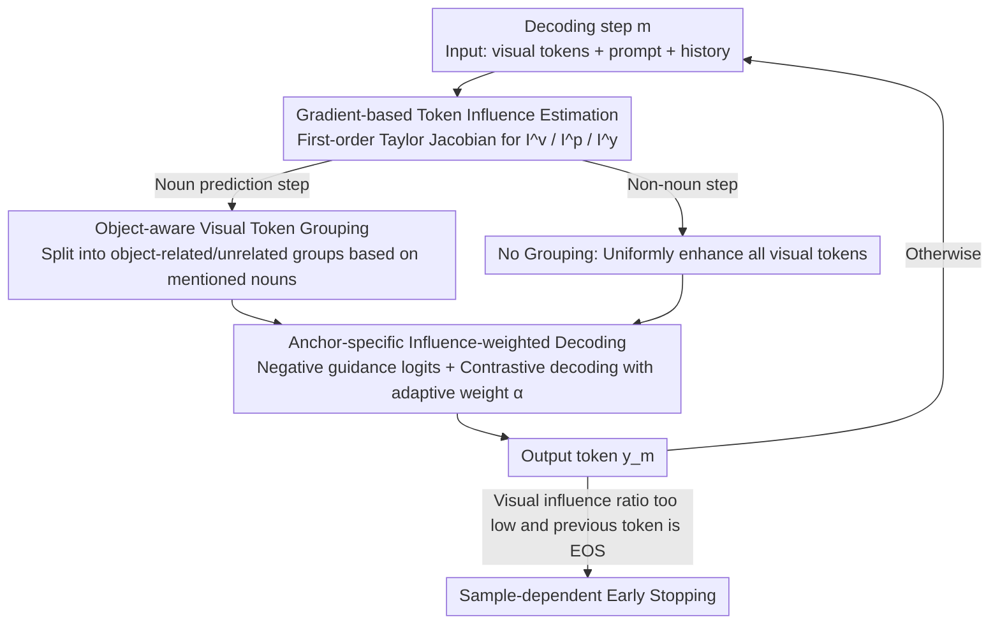

<!-- Generated automatically by src/gen_stubs.py -->
# Mitigating Multimodal Hallucinations via Gradient-based Self-Reflection

**Conference**: CVPR2026  
**arXiv**: [2509.03113](https://arxiv.org/abs/2509.03113)  
**Code**: Undisclosed  
**Area**: Hallucination Detection  
**Keywords**: Multimodal Hallucination, Gradient Attribution, Constrained Decoding, Co-occurrence Bias, Text-Visual Bias, Inference-stage Mitigation

## TL;DR

Ours proposes GACD (Gradient-based Influence-Aware Constrained Decoding), which utilizes first-order Taylor gradients to estimate the influence of each token on the output. It simultaneously mitigates multimodal hallucinations caused by text-visual bias and co-occurrence bias during the inference stage without requiring auxiliary models or fine-tuning.

## Background & Motivation

**Prevalence of Multimodal Hallucinations**: MLLMs often generate content inconsistent with visual inputs, which severely limits model trustworthiness and practical deployment.

**Text-Visual Bias**: Models over-rely on text prompts and previously generated historical outputs while ignoring visual information, a problem that worsens in long-sequence generation.

**Co-occurrence Bias**: Object pairs that frequently co-occur in training data (e.g., chair-table, fork-beer) lead models to incorrectly predict the presence of the second object upon seeing the first.

**Limitations of Prior Work**: Existing contrastive decoding methods (VCD, M3ID, etc.) apply uniform weights to all visual features and lack token-level selective adjustment, providing limited relief for co-occurrence bias.

**Dependency on Auxiliary Models**: Some methods require segmentation networks, detectors, or additional MLLMs as assistants, introducing new error sources and task-specific dependencies.

**Lack of Sample-level Bias Measurement**: Most existing works only report aggregate statistics and cannot quantify the degree of bias at the individual sample level for adaptive adjustment.

## Method

### Overall Architecture

GACD is a pure inference-stage, token-by-token decoding framework. At each decoding step $m$, it first uses **gradient influence estimation** to quantify the contribution of three types of tokens—visual, prompt, and historical output—to the current logit. Subsequently, it branches based on whether the current token to be predicted is a noun: **Noun steps** trigger **object-aware visual token grouping**, splitting visual tokens into those related to mentioned objects ($\mathbf{t}^o$) and those unrelated ($\mathbf{t}^u$) to target co-occurrence bias; **non-noun steps** do not group tokens and instead uniformly enhance all visual tokens to correct text-visual bias. These branches merge into **anchor-specific influence-weighted decoding**, which constructs negative guidance logits using $\mathbf{t}^o$ for contrastive decoding, with the weight $\alpha_m$ calculated adaptively based on influence. Finally, **sample-dependent early stopping** terminates generation when visual evidence is insufficient.

### Key Designs

**1. Gradient-based Token Influence Estimation**

A first-order Taylor expansion is performed on the logit vector $\mathbf{z}_m^* = \pi_{\theta^*}(\mathbf{t}^v, \mathbf{t}^p, \mathbf{y}_{<m})$. The Jacobian of each input token (visual, prompt, historical output) relative to the current output logit is calculated, using the Manhattan norm as the influence metric:

$$I_{ms}^v = \|\mathbf{g}_{ms}^v\|_1, \quad I_{mn}^p = \|\mathbf{g}_{mn}^p\|_1, \quad I_{mi}^y = \|\mathbf{g}_{mi}^y\|_1$$

Aggregating these yields group-level influence $\texttt{I}_m^v, \texttt{I}_m^p, \texttt{I}_m^y$, allowing the decomposition of text and visual contributions at the sample level.

**2. Object-aware Visual Token Grouping**

Since co-occurrence bias occurs between object pairs, this step is only triggered during **noun prediction steps**. First, spaCy is used to detect nouns in the generated sequence $\mathbf{y}_{<m}$, treating each noun $y_i$ as an "object mention." Using the influence from Design 1, the visual token with the highest influence for that noun is selected to form a mask $\mathcal{M}_{is}$. Cumulative masks $\mathcal{M}_m$ from all previous nouns are used to split visual tokens via Hadamard product into **object-related** $\mathbf{t}^o = \mathbf{t}^v \odot \mathcal{M}_m$ and **object-unrelated** $\mathbf{t}^u = \mathbf{t}^v \odot (\mathbf{1}-\mathcal{M}_m)$. The former serves as the "anchor" for co-occurrence hallucinations, while the latter represents the ignored true visual evidence. For non-noun steps, $\mathbf{t}^o = \varnothing$ and $\mathbf{t}^u$ equals all visual tokens, degrading to pure text-visual bias correction.

**3. Anchor-specific Influence-weighted Decoding**

Negative guidance logits $\mathbf{z}_m^o = \pi_{\theta^*}(\mathbf{t}^o, \mathbf{t}^p, \mathbf{y}_{<m})$ are constructed. The adjusted logits are:

$$\hat{\mathbf{z}}_m = (1+\alpha_m)\mathbf{z}_m^* - \alpha_m \mathbf{z}_m^o$$

The weight $\alpha_m$ is adaptively calculated via influence to align the influence of $\mathbf{t}^u$ with the text-dominant term $\texttt{I}_m^t = \max(\texttt{I}_m^p, \texttt{I}_m^y)$, with a non-negative constraint upper bound to prevent over-correction.

**4. Sample-dependent Early Stopping**

Stopping is triggered when the visual influence ratio $r_m^v = \texttt{I}_m^v / (\texttt{I}_m^v + \texttt{I}_m^p + \texttt{I}_m^y) < \epsilon$ and the previous token is EOS, preventing continued generation when visual grounding is insufficient.

### Loss & Training

GACD is an inference-stage method and does not involve training losses. The core optimization goal is to increase $D_{\mathrm{KL}}(\sigma(\mathbf{z}_m^*) \| \sigma(\mathbf{z}_m^o))$ in the probability space, thereby enhancing the contribution of object-unrelated visual tokens $\mathbf{t}^u$ while maintaining non-negative influence for object-related tokens and prompts through upper-bound constraints.

## Key Experimental Results

### Main Results

**AMBER Dataset (Generative + Discriminative Tasks)**:

| Model | Method | cha↓ | cov↑ | hal↓ | cog↓ | Score↑ | F1↑ |
|------|------|------|------|------|------|--------|-----|
| LLaVA-v1.5 | Baseline | 7.8 | 51.0 | 36.4 | 4.2 | 83.5 | 74.7 |
| | GACD | **5.6** | 51.0 | **24.3** | **1.8** | **90.2** | **86.0** |
| InstructBLIP | Baseline | 8.8 | 52.2 | 38.2 | 4.4 | 86.5 | 81.7 |
| | GACD | **6.0** | 49.4 | **26.6** | **2.4** | **88.1** | 82.2 |
| mPLUG-Owl2 | Baseline | 10.6 | 52.0 | 39.9 | 4.5 | 84.0 | 78.5 |
| | GACD | **7.5** | **53.6** | **34.7** | **4.0** | **89.6** | **86.6** |
| Qwen2-VL | Baseline | 6.4 | 70.4 | 54.8 | 5.9 | 90.1 | 86.6 |
| | GACD | **4.9** | **71.8** | **44.7** | **3.7** | **91.1** | **87.1** |

**POPE MSCOCO Adversarial Setting (Discriminative Task)**:

| Model | Method | Acc↑ | F1↑ |
|------|------|------|-----|
| LLaVA-v1.5 | Baseline | 80.9 | 81.6 |
| | GACD | **83.5** | **82.1** |
| mPLUG-Owl2 | Baseline | 72.5 | 77.5 |
| | GACD | **84.2** | **83.7** |
| InternVL2 | Baseline | 85.8 | 85.0 |
| | GACD | 85.8 | 85.0 |

### Ablation Study

| Component Combination | CS↓ (LLaVA-v1.5) | CI↓ | R↑ |
|----------|-------------------|------|------|
| Baseline | 48.8 | 13.4 | 78.6 |
| +VA (Visual Enhancement) | 46.4 | 11.6 | 79.0 |
| +VA+CR (Co-occurrence Suppression) | 46.2 | 11.3 | 79.4 |
| +VA+CR+ES (Full Model) | **41.0** | **10.9** | 77.3 |

- VA reduces hallucinations while improving recall.
- CR further mitigates residual hallucinations caused by co-occurrence bias.
- ES effectively reduces hallucinations by shortening outputs with minimal recall loss.

### Key Findings

1. **Improvement magnitude is negatively correlated with baseline visual influence**: LLaVA-v1.5 and mPLUG-Owl2 have low initial visual influence ratios (<50%), where GACD shows significant gains; InternVL2 already has visual influence >50%, resulting in limited improvement—validating the method's motivation.
2. **"Max-influence token sharing" in co-occurrence bias**: In chair-table co-occurrence experiments, both objects shared the same highest-influence visual token in 31.9% of hallucination cases; GACD effectively breaks this sharing.
3. **Direct Gradient vs. Integrated Gradient**: The direct gradient method is approximately 53x faster (385ms vs. 20335ms) with comparable accuracy.
4. **Superior Information Retention**: GACD's recall drop averages only 1.1%, compared to 3.2% for competing methods.

## Highlights & Insights

- **Clear Mathematical Principles**: Gradient attribution based on first-order Taylor expansion provides a mathematical foundation for bias estimation without relying on heuristic priors.
- **Joint Handling of Dual Biases**: Solves both text-visual and co-occurrence biases within a single framework; it is the first inference method to mitigate co-occurrence hallucinations in an object-aware manner at the token level.
- **Adaptive $\alpha_m$**: Weights are dynamically calculated from the influence ratio with upper-bound constraints, eliminating the need for cross-dataset hyperparameter tuning.
- **Plug-and-Play**: Does not change model parameters, requires no auxiliary models, and is compatible with various MLLM architectures.
- **Substantial Improvements**: Demonstrated by a 92% accuracy gain and 45% detail improvement on LLaVA-QA90.

## Limitations & Future Work

- **Restricted to White-box Models**: Requires access to model gradients, making it inapplicable to API-only models (e.g., GPT-4V).
- **Computational Overhead**: Inference computation increases by approximately 101%, comparable to VCD but not negligible.
- **Minimal Gain on High-Visual-Influence Models**: Improvements are small when the model already utilizes visual information well (e.g., InternVL2).
- **Limited Improvement on Relational Queries**: Performance is constrained for questions requiring complex visual reasoning rather than direct visual grounding.
- **Post-processing Only**: Gradient attribution signals are not fed back into the training phase.

## Related Work & Insights

- **Image-level Contrastive Decoding**: VCD and M3ID enhance all visual tokens uniformly, failing to distinguish between object-related and unrelated tokens.
- **Token-level Methods**: AVISC lacks object-aware decoupling; HALC relies on external segmentation models.
- **Training Methods**: RLAIF-V uses RL alignment but requires additional feedback data and training costs.
- **Attention Methods**: Require adjustments to specific layers, introduced model-specific heuristics.
- GACD's core advantages lie in: Object-awareness + Sample-adaptivity + No external dependencies.

## Rating

- Novelty: ⭐⭐⭐⭐ — The use of gradient attribution for bias estimation in the decoding stage is novel; object-aware grouping and adaptive weighting are original.
- Experimental Thoroughness: ⭐⭐⭐⭐⭐ — Covers 6 models across 4 datasets, spanning generative and discriminative tasks; detailed ablation including components, norms, and gradient methods.
- Writing Quality: ⭐⭐⭐⭐ — Rigorous mathematical derivation, clear motivation, and well-integrated formulas/figures.
- Value: ⭐⭐⭐⭐ — High utility as a plug-and-play inference method, though limited by white-box requirements and computational overhead.

<!-- RELATED:START -->

## Related Papers

- [\[CVPR 2026\] Understanding and Mitigating Hallucinations in Multimodal Chain-of-Thought Models](understanding_and_mitigating_hallucinations_in_multimodal_chain-of-thought_model.md)
- [\[ICML 2026\] From Flat Facts to Sharp Hallucinations: Detecting Stubborn Errors via Gradient Sensitivity](../../ICML2026/hallucination/from_flat_facts_to_sharp_hallucinations_detecting_stubborn_errors_via_gradient_s.md)
- [\[CVPR 2026\] MAD: Modality-Adaptive Decoding for Mitigating Cross-Modal Hallucinations in Multimodal Large Language Models](mad_modality-adaptive_decoding_for_mitigating_cross-modal_hallucinations_in_mult.md)
- [\[CVPR 2026\] Tell Model Where to Look: Mitigating Hallucinations in MLLMs by Vision-Guided Attention](tell_model_where_to_look_mitigating_hallucinations_in_mllms_by_vision-guided_att.md)
- [\[ICML 2026\] Learning from Fine-Grained Visual Discrepancies: Mitigating Multimodal Hallucinations via In-Context Visual Contrastive Optimization](../../ICML2026/hallucination/learning_from_fine-grained_visual_discrepancies_mitigating_multimodal_hallucinat.md)

<!-- RELATED:END -->
