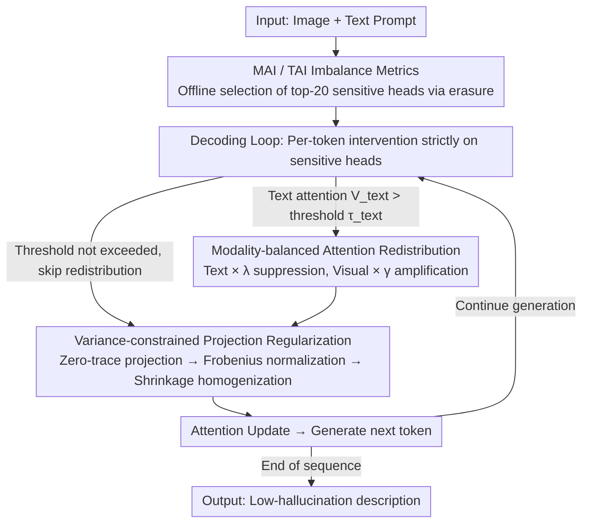

# Mitigating Object Hallucination in LVLMs via Attention Imbalance Rectification

**Conference**: CVPR 2026 Findings  
**arXiv**: [2603.24058](https://arxiv.org/abs/2603.24058)  
**Code**: None  
**Area**: Hallucination Detection  
**Keywords**: Large Vision-Language Models, Object Hallucination, Attention Imbalance, Decoding-time Intervention, Attention Rectification

## TL;DR

The authors propose the concept of Attention Imbalance to explain object hallucination in LVLMs and design a lightweight decoding-time intervention method, AIR. By rectifying attention imbalance through cross-modal attention redistribution and variance-constrained projection regularization, the method reduces hallucination rates by up to 35.1% across four LVLMs while improving general capabilities by up to 15.9%.

## Background & Motivation

1. **Background**: Large Vision-Language Models (LVLMs) demonstrate superior performance in cross-modal understanding tasks. However, object hallucination—the generation of descriptions for non-existent objects—severely undermines model reliability in high-stakes scenarios such as autonomous driving and medical imaging.
2. **Limitations of Prior Work**: Existing methods fall into three categories: visual instruction tuning (high training cost), post-processing techniques (extra inference overhead), and contrastive decoding (limited stability and generalization). A more fundamental issue is that the root cause analysis of hallucination remains insufficient.
3. **Key Challenge**: The complex training pipelines and architectures of LVLMs hinder interpretability analysis. Prior research from perspectives such as visual information interaction, positional encoding, and outlier tokens has failed to provide a comprehensive understanding.
4. **Goal**: (1) Provide a quantitative framework to explain the root cause of hallucination via attention mechanisms; (2) Design a training-free lightweight intervention method based on this framework.
5. **Key Insight**: Authors discovered through systematic experiments that attention allocation imbalance—at both inter-modal and inter-token levels—is strongly causally correlated with object hallucination.
6. **Core Idea**: Hallucinations stem from attention imbalance. Rectifying the cross-modal and token-level imbalances within hallucination-sensitive attention heads can effectively mitigate this phenomenon.

## Method

### Overall Architecture

The starting point of AIR is to translate "object hallucination" into an observable and intervenable attention problem. The authors first use two quantitative metrics to prove that hallucination is strongly correlated with attention imbalance, then integrate the rectification operations directly into the decoding loop. It operates entirely during inference without modifying any weights. First, "hallucination-sensitive heads" are identified offline using erasure-based attribution. During the generation of each token, the method intervenes only in these heads: when they focus excessively on text, attention weights are shifted from text tokens to visual tokens; when attention is overly concentrated on a specific token, the distribution is flattened. These two steps address modality-level and token-level imbalances respectively, suppressing hallucinations without damaging normal capabilities.

### Key Designs

**1. Quantitative Metrics for Attention Imbalance (MAI + TAI)**

The intervention logic of the method is built upon two custom metrics. Modality-wise Attention Imbalance (MAI) is defined as the ratio of total attention received by two modalities:

$$\text{MAI}(M_p, M_q) = \frac{A_{M_p}}{A_{M_q}}$$

A value much greater than 1 indicates that $M_p$ (usually text) is dominating the attention. Token-wise Attention Imbalance (TAI) divides the attention share of a single token by its actual information contribution; a value much greater than 1 implies the token is over-attended. Key causal observations reveal that MAI in hallucination-sensitive heads reaches 5.1 compared to 1.5 in insensitive heads, and high TAI for a token almost inevitably leads to hallucination within the subsequent 15 tokens.

**2. Modality-balanced Attention Redistribution**

This step addresses high MAI. The authors found that sensitive heads inherit the text-only attention patterns of the base language model—their attention patterns show a cosine similarity of 0.81 with the base LM, compared to 0.69 for insensitive heads. AIR monitors cumulative text attention $V^{\text{text}}$ at each decoding step. Once it exceeds $\tau_{\text{text}}$ (default 0.3), the text token weights are multiplied by a suppression coefficient $\lambda \in [0,1]$ (default 0.1), and visual token weights are multiplied by an amplification coefficient $\gamma > 1$ (default 3.5).

**3. Variance-constrained Projection Regularization**

This step addresses high TAI. TAI analysis shows that before a hallucination occurs, a specific token often consumes excessive attention (e.g., the `<0x0A>` newline token reaching a TAI of 98). AIR flattens these spikes in three steps: adaptive scaling of $W_{\text{QK}}$ based on spectral energy, followed by zero-trace projection to remove self-alignment bias:

$$\hat{A} = A - \frac{\text{tr}(A)}{L}\,I$$

Finally, after Frobenius energy normalization (denoted as $\tilde{A}$), shrinkage regularization is applied to pull the distribution toward uniformity:

$$A^* = (1-\beta)\,\tilde{A} + \beta \cdot \text{mean}(\tilde{A}) \cdot \mathbf{1}$$

where $\beta$ (default 0.3) controls the strength of the flattening, maintaining overall energy while neutralizing spikes that trigger hallucination propagation.

### Loss & Training

AIR is a pure inference-time method and **requires no training**. Two preparatory steps are conducted: (1) Offline identification of hallucination-sensitive heads using erasure-based attribution. (2) Fixing a set of hyperparameters: $\tau_{\text{text}}=0.3, \lambda=0.1, \gamma=3.5, \xi=0.01, \beta=0.3$.

## Key Experimental Results

### Main Results

CHAIR Hallucination Evaluation (Max New Tokens=256):

| LVLM | Metric | AIR (Ours) | Prev. SOTA (AD-HH) | Gain |
|------|------|------|----------|------|
| LLaVA-1.5 | $C_S$ ↓ | **28.8** | 35.2 | -18.1% |
| MiniGPT-4 | $C_S$ ↓ | **21.3** | 32.8 | -35.1% |
| InstructBLIP | $C_S$ ↓ | **30.1** | 36.0 | -16.4% |
| Shikra | $C_S$ ↓ | **30.3** | 36.9 | -17.9% |

MM-Vet General Capability:

| LVLM | AIR Overall | Greedy Overall | Gain |
|------|------------|----------------|------|
| LLaVA-1.5 | **32.0** | 27.6 | +15.9% |
| MiniGPT-4 | **22.0** | 20.0 | +10.0% |

### Ablation Study

| Configuration | $C_S$ ↓ | $C_I$ ↓ | MM-Vet ↑ | Note |
|------|---------|---------|----------|------|
| Greedy (baseline) | 51.8 | 13.7 | 27.6 | No intervention |
| R-only (Redistribution only) | 32.1 | 9.9 | 30.5 | Effective suppression/amplification |
| P-only (Projection only) | 38.4 | 11.2 | 29.8 | Effective homogenization |
| Full AIR | **28.8** | **8.6** | **32.0** | Complementary, best performance |

### Key Findings

- Modality redistribution contributes more significantly ($C_S$ drops from 51.8 to 32.1), indicating cross-modal imbalance is the primary cause of hallucination.
- AIR is unique in **simultaneously reducing hallucination and improving general capabilities**, whereas other methods (e.g., AD-HH) reduce hallucination at the cost of a 14.8% decline in general performance.
- Sensitive heads are primarily concentrated in the middle layers of the model.
- The co-occurrence of high TAI tokens and hallucinations is consistent across all four LVLMs.
- A "snowball effect" exists where an initial hallucinated word triggers further hallucinations.

## Highlights & Insights

- **Clear Causal Chain**: From defining TAI/MAI to co-occurrence validation, and then to head-level attribution and the inheritance hypothesis, a complete causal analysis of hallucination is formed.
- **Zero Training Overhead**: AIR operates entirely during inference, introducing no additional parameters or training costs.
- **Inherited Base LM Patterns**: The discovery that sensitive heads retain the text-only preference of the base LM suggests that visual alignment tuning is insufficient for these heads, providing a direction for improving future training strategies.

## Limitations & Future Work

- Selection of sensitive heads requires prior analysis via erasure-based attribution.
- Hyperparameters like $\tau_{\text{text}}$, $\lambda$, and $\gamma$ may need adjustment for different models.
- Validated only on 7B-scale models; performance on larger models (70B+) remains unknown.
- Future work could explore integrating AIR's insights into the training phase via balance-aware fine-tuning objectives.

## Related Work & Insights

- **vs VCD (ICLR24)**: VCD penalizes language priors by contrasting distributions with and without visual input, but can exacerbate hallucination in some models. AIR is more precise by operating directly on attention weights.
- **vs OPERA (ICML24)**: OPERA alleviates hallucination by penalizing over-attended summary tokens but only focuses on the token-level. AIR addresses both modality-level and token-level imbalances.
- **vs AD-HH**: Previous SOTA, but suffers from a 14.8% drop in general capability. AIR provides stronger hallucination mitigation and improves general performance.

## Rating

- Novelty: ⭐⭐⭐⭐⭐ The concept of Attention Imbalance and the definitions of MAI/TAI are novel; the causal chain for the intervention is elegant.
- Experimental Thoroughness: ⭐⭐⭐⭐⭐ Four LVLMs, three benchmarks, seven baselines, and detailed ablation/hyperparameter analysis.
- Writing Quality: ⭐⭐⭐⭐⭐ Rigorous mathematical definitions, clear progression of analysis, and informative visualizations.
- Value: ⭐⭐⭐⭐⭐ Extremely high practical value as it solves both hallucination and capability degradation without requiring training.

<!-- RELATED:START -->

## Related Papers

- [\[AAAI 2026\] Causally-Grounded Dual-Path Attention Intervention for Object Hallucination Mitigation in LVLMs](../../AAAI2026/hallucination/causally-grounded_dual-path_attention_intervention_for_objec.md)
- [\[CVPR 2026\] Same Attention, Different Truths: Put Logit-Lens over Visual Attention to Detect and Mitigate LVLM Object Hallucination](same_attention_different_truths_put_logit-lens_over_visual_attention_to_detect_a.md)
- [\[ICML 2026\] Finding the Correct Visual Evidence Without Forgetting: Mitigating Hallucination in LVLMs via Inter-Layer Visual Attention Discrepancy](../../ICML2026/hallucination/finding_the_correct_visual_evidence_without_forgetting_mitigating_hallucination_.md)
- [\[CVPR 2026\] PAS: Prelim Attention Score for Detecting Object Hallucinations in Large Vision-Language Models](pas_prelim_attention_score_for_detecting_object_hallucinations_in_large_vision-l.md)
- [\[CVPR 2026\] HulluEdit: Single-Pass Evidence-Consistent Subspace Editing for Mitigating Hallucinations in LVLMs](hulluedit_subspace_editing_hallucination.md)

<!-- RELATED:END -->
