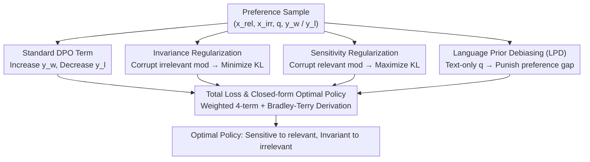

# MoD-DPO: Towards Mitigating Cross-modal Hallucinations in Omni LLMs using Modality Decoupled Preference Optimization

**Conference**: CVPR2026  
**arXiv**: [2603.03192](https://arxiv.org/abs/2603.03192)  
**Code**: TBD  
**Area**: Hallucination Detection  
**Keywords**: omni LLM, cross-modal hallucination, DPO, modality decoupling, audio-visual, preference optimization

## TL;DR
MoD-DPO (Modality-Decoupled DPO) is proposed to decouple the contributions of various modalities in Omni LLMs through three mechanisms: invariance regularization, sensitivity regularization, and language prior debiasing. It effectively mitigates cross-modal hallucinations (such as using auditory information to answer visual questions) and derives a closed-form optimal policy.

## Background & Motivation
Omni LLMs, which process text, vision, audio, and other modalities simultaneously, represent the frontier of current multimodal intelligence. However, these models face a unique and serious issue—**cross-modal hallucination**:

1. **Spurious Correlations**: Information from different modalities often co-occurs in training data (e.g., a "dog" image usually accompanied by a "barking" sound). Models learn to use these statistical correlations as "shortcuts." When these correlations do not hold during testing (e.g., seeing a dog but hearing no sound), the model still fabricates information from the other modality.
2. **Dominant Language Priors**: The backbone of Omni LLMs is typically a pre-trained LLM. Its powerful language priors can override actual multimodal perception. For instance, the model might ignore actual audio content and hallucinate a "reasonable" sound description based solely on cues in the text prompt (e.g., "What sound...").
3. **Inter-modal Interference**: When input from one modality is of poor quality or irrelevant, the model fails to ignore it correctly and is instead distracted by it.

Specific example: Given a video and the question "What is the person in the video saying?", the model might "hallucinate" dialogue based on the person's lip movements/scene despite the audio track being completely muted—this is a cross-modal hallucination.

Existing methods (such as vanilla DPO, mDPO) treat multimodal inputs as a whole for preference optimization without distinguishing the independent contributions of each modality, thus failing to precisely address cross-modal hallucinations.

## Core Problem
How can Omni LLMs be enabled to correctly distinguish the contributions of each modality—remaining sensitive to relevant modalities and insensitive to irrelevant ones—thereby eliminating cross-modal hallucinations?

## Method

### Overall Architecture
The input to an Omni LLM consists of $M$ modalities $\{x^1, \dots, x^M\}$ plus a text prompt $q$, producing a text response $y$. For a specific question $q$, only some modalities are **relevant** (denoted as $x^{rel}$), while others are **irrelevant** (denoted as $x^{irr}$). The essence of cross-modal hallucination is the model "looking at the wrong things"—either being over-sensitive to changes in irrelevant modalities $x^{irr}$ (being led astray) or being insufficiently sensitive to changes in relevant modalities $x^{rel}$ (not truly perceiving). MoD-DPO's solution adds three regularization terms on top of standard DPO to correct these two biases and the language prior bias. The overall structure involves four-way parallel computation derived from the same preference sample: a standard DPO term manages preference ranking, while three regularization terms compare model outputs after "corrupting" inputs in specific ways. The weighted sum forms the total loss, from which a closed-form optimal policy is derived.

### Key Designs

**1. Invariance Regularization: Output should not change when irrelevant modalities change**

Output distributions should remain stable when irrelevant modalities are replaced with noise or other samples. Given original input $(x^{rel}, x^{irr}, q)$ and "corrupted" input $(x^{rel}, \tilde{x}^{irr}, q)$, the KL divergence between the two output distributions is minimized:

$$\mathcal{L}_{\text{inv}} = D_{\text{KL}}\big(\pi_\theta(\cdot | x^{rel}, x^{irr}, q) \| \pi_\theta(\cdot | x^{rel}, \tilde{x}^{irr}, q)\big)$$

A smaller KL indicates the output is stable despite changes in irrelevant modalities—meaning the model is not misled by irrelevant information.

**2. Sensitivity Regularization: Output must change when relevant modalities change**

Conversely, if relevant modalities are corrupted into $\tilde{x}^{rel}$, the model should "perceive" the change in input and change its output accordingly. The goal is to **maximize** KL (loss is negative):

$$\mathcal{L}_{\text{sen}} = -D_{\text{KL}}\big(\pi_\theta(\cdot | x^{rel}, x^{irr}, q) \| \pi_\theta(\cdot | \tilde{x}^{rel}, x^{irr}, q)\big)$$

This term forces the model to truly "look" at the relevant modality rather than ignoring it.

**3. Language Prior Debiasing (LPD): Do not reply based on text alone**

To address "dominant language priors"—where the model ignores modalities and replies confidently based on prompt statistics—a penalty term is introduced. Here $\pi_\theta(\cdot|q)$ is the output when **only text is provided**:

$$\mathcal{L}_{\text{LPD}} = \log \pi_\theta(y_w | q) - \log \pi_\theta(y_l | q)$$

If the model can distinguish $y_w$ and $y_l$ solely from the text, it is relying on language priors rather than true perception; this term suppresses that tendency.

**4. Total Loss and Closed-form Optimal Policy**

The four terms are weighted and combined:

$$\mathcal{L}_{\text{MoD-DPO}} = \mathcal{L}_{\text{DPO}} + \alpha \cdot \mathcal{L}_{\text{inv}} + \gamma \cdot \mathcal{L}_{\text{sen}} + \lambda \cdot \mathcal{L}_{\text{LPD}}$$

The authors follow the Bradley-Terry derivation of the original DPO to provide the **closed-form optimal policy** for MoD-DPO, proving the optimal solution naturally satisfies "sensitivity to relevant modalities and invariance to irrelevant ones."

### A Complete Walkthrough (One "Visual Question" Training Sample)
1. **Sample**: Video shows a person playing guitar (Visual = Relevant), background has piano music (Audio = Irrelevant), Question: "What instrument is the person in the frame playing?", $y_w$ = "guitar", $y_l$ = "piano".
2. **$\mathcal{L}_{\text{DPO}}$**: Increases preference for $y_w$ and decreases it for $y_l$.
3. **Invariance Term**: Replace audio with noise → require output to remain "guitar" (KL → 0), preventing distraction by the piano sound.
4. **Sensitivity Term**: Scramble the visual frame (relevant) → require output change (KL increases), forcing the model to actually watch the frame.
5. **LPD Term**: Provide only text "What instrument is being played" — if the model still favors "guitar/piano," it is using language priors, and this is penalized.
6. **Gradient Aggregation**: All four terms update together; the model learns to "watch the frame, ignore background audio, and avoid text templates."

### Training Strategy
- **Automatic Preference Data Construction**: 18.1k preference samples are automatically generated from 10.8k videos. GPT-4o generates questions for different modalities (visual/audio/joint). Responses are collected under corrupted relevant/irrelevant conditions, and preferred/rejected labels are assigned based on modality consistency.
- **Efficiency Optimization**: Forward passes for corrupted inputs used for KL targets do not require gradients and are executed with `torch.no_grad()`. The model converges in approximately **1/4 of the training epochs** required for standard DPO.

## Key Experimental Results

### AVHBench (Audio-Visual Hallucination Benchmark)

| Method | Visual Acc ↑ | Audio Acc ↑ | Joint Acc ↑ | Avg ↑ |
|------|-------------|-------------|-------------|-------|
| Vanilla SFT | 61.2 | 58.7 | 55.3 | 58.4 |
| Vanilla DPO | 65.8 | 62.1 | 59.4 | 62.4 |
| mDPO | 67.3 | 63.5 | 60.1 | 63.6 |
| OmniDPO | 68.1 | 64.2 | 61.8 | 64.7 |
| **MoD-DPO** | **73.5** | **70.8** | **68.2** | **70.8** |

### CMM Benchmark (Cross-Modal Mismatch)

| Method | Audio→Visual ↓ | Visual→Audio ↓ | Language Prior ↓ | Overall Score ↑ |
|------|----------------|----------------|------------------|----------------|
| Vanilla DPO | 28.3 | 31.5 | 35.2 | 62.4 |
| mDPO | 25.1 | 28.7 | 32.8 | 63.6 |
| OmniDPO | 23.4 | 26.3 | 30.1 | 64.7 |
| **MoD-DPO** | **15.2** | **17.6** | **19.8** | **70.8** |

(↓ indicates lower cross-modal hallucination rate is better)

### Ablation Study
- **Invariance Regularization**: Removing it increases the Audio→Visual hallucination rate by 5.3%, showing it is key to suppressing irrelevant modality interference.
- **Sensitivity Regularization**: Removing it decreases Visual Acc by 3.2%, showing it helps the model better utilize relevant modalities.
- **LPD**: Removing it increases the Language Prior hallucination rate by 8.1%, confirming the necessity of language prior debiasing.
- **Training Efficiency**: MoD-DPO performance after 1/4 epoch exceeds the full training of vanilla DPO, with further gains after 4 epochs.

## Highlights & Insights
- **Precise Problem Definition**: Cross-modal hallucination is a core issue for Omni LLMs. This is among the first works to systematically study and propose a solution.
- **Triple Mechanism for Modality Decoupling**: Invariance (stable to irrelevant), sensitivity (responsive to relevant), and language debiasing (inhibiting text dominance) provide a complete design logic.
- **Theoretical Support**: A closed-form optimal policy is derived, moving beyond purely empirical loss design.
- **Automated Data Construction**: 18.1k preference samples are generated from 10.8k videos without human annotation, ensuring high scalability.
- **High Training Efficiency**: Gradient-free forward passes and fast convergence allow it to surpass full-training baselines in only 1/4 epoch.

## Limitations & Future Work
1. **Modality Count Restrictions**: Currently validated primarily on audio and visual modalities; extension to more modalities (e.g., touch, depth) may require adjustments in corruption strategies.
2. **Relevance Determination**: Automated data generation relies on rules to define which modality is relevant to a question, which might not apply to scenarios with blurred modality boundaries.
3. **Impact of Corruption Methods**: The effectiveness of regularization may depend on the specific corruption operation (noise vs. replacement vs. removal); comparisons are insufficient.
4. **Closed-form Gap**: While the closed-form optimal policy is derived, actual training uses approximate optimization; the gap remains unquantified.
5. **Focus on Hallucination Mitigation**: Potential degradation of overall Omni LLM capabilities (multimodal understanding, generation quality) has not been fully evaluated.

## Rating
- Novelty: ⭐⭐⭐⭐⭐ First systematic solution for Omni LLM cross-modal hallucination with a novel decoupling approach.
- Experimental Thoroughness: ⭐⭐⭐⭐ Validated on two benchmarks with complete ablations, though limited to audio-visual modalities.
- Writing Quality: ⭐⭐⭐⭐ Clear motivation and rigorous derivation.
- Value: ⭐⭐⭐⭐ Addresses a core pain point of Omni LLMs with a generalizable method.

<!-- RELATED:START -->

## Related Papers

- [\[CVPR 2026\] MAD: Modality-Adaptive Decoding for Mitigating Cross-Modal Hallucinations in Multimodal Large Language Models](mad_modality-adaptive_decoding_for_mitigating_cross-modal_hallucinations_in_mult.md)
- [\[ICLR 2026\] Cat-PO: Cross-modal Adaptive Token-rewards for Preference Optimization in Truthful Multimodal LLMs](../../ICLR2026/hallucination/cat-po_cross-modal_adaptive_token-rewards_for_preference_optimization_in_truthfu.md)
- [\[ICLR 2026\] P2-DPO: Grounding Hallucination in Perceptual Processing via Calibration Direct Preference Optimization](../../ICLR2026/hallucination/p2-dpo_grounding_hallucination_in_perceptual_processing_via_calibration_direct_p.md)
- [\[NeurIPS 2025\] Mitigating Hallucination Through Theory-Consistent Symmetric Multimodal Preference Optimization](../../NeurIPS2025/hallucination/mitigating_hallucination_through_theory-consistent_symmetric_multimodal_preferen.md)
- [\[ICML 2026\] Learning from Fine-Grained Visual Discrepancies: Mitigating Multimodal Hallucinations via In-Context Visual Contrastive Optimization](../../ICML2026/hallucination/learning_from_fine-grained_visual_discrepancies_mitigating_multimodal_hallucinat.md)

<!-- RELATED:END -->
