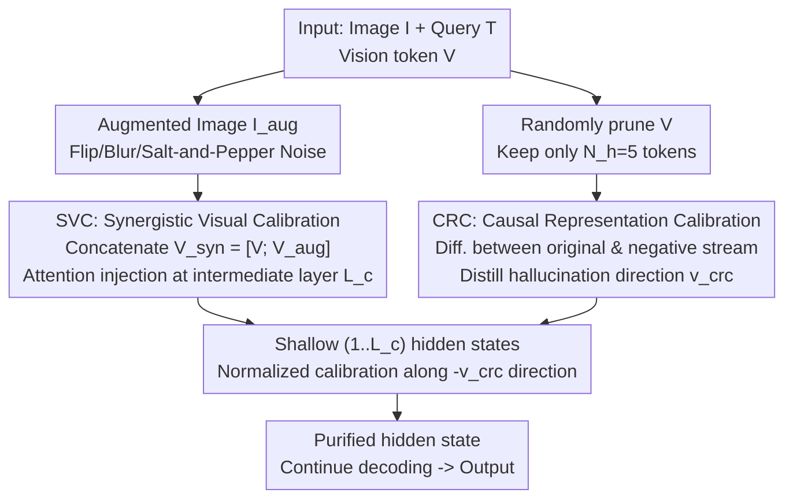

# One Token, Two Fates: A Unified Framework via Vision Token Manipulation Against MLLMs Hallucination

**Conference**: CVPR 2026  
**Paper**: [CVF Open Access](https://openaccess.thecvf.com/content/CVPR2026/html/Fa_One_Token_Two_Fates_A_Unified_Framework_via_Vision_Token_CVPR_2026_paper.html)  
**Code**: https://github.com/Fazhan-cs/OTT  
**Area**: Multimodal VLM / MLLM Hallucination Mitigation  
**Keywords**: MLLM Hallucination, Training-free, Vision Token Manipulation, Latent Space Calibration, Contrastive Decoding

## TL;DR
This paper redefines MLLM object hallucination as a "vision-language imbalance" problem and proposes a training-free framework that **manipulates vision tokens solely in the intermediate representation layer**. It enhances visual signals using vision tokens from augmented images (SVC) while constructing negative samples in the latent space using pruned vision tokens to purify internal model bias (CRC). On LLaVA-1.5, it improves the average absolute accuracy of POPE by approximately 2%, with only a 1.06× latency overhead during inference.

## Background & Motivation

**Background**: Hallucination in Multimodal Large Language Models (MLLMs)—generating fluent but image-contradictory text—is a major obstacle to deployment. Current mainstream mitigation methods are **training-free** and fall into two disjoint paths: one is **Visual Attention Enhancement** (e.g., PAI), which amplifies image signals during the attention stage; the other is **Textual Decoding Refinement** (e.g., VCD), which uses negative samples for contrastive decoding on the final logits to suppress language inertia.

**Limitations of Prior Work**: Both paths have critical drawbacks. **Simple visual enhancement** is often insufficient—language models have deep-rooted "text inertia"; as the output length increases, the visual influence naturally decays, and language priors regain control (referred to by the authors as F1: visual attention decays sharply with generation steps, and hallucinations erupt precisely where visual grounding is weakest). **Simple language suppression** introduces side effects—such methods often rely on **distorting input images** to create negative samples (modality-gap), but the distorted image content is unreliable and unstable, introducing extra noise into the calibration (F3).

**Key Challenge**: The authors further discover that **simply combining the two paths does not work**—a naive combination of attention enhancement (PAI) and decoding refinement (VCD) yields no performance gain or even causes a decline. The reason is that they are not designed for synergy: one enhances original image details in the **attention layer**, while the other suppresses language bias using negative samples in the **logit layer**. Since the **intervention layers and timings differ**, their signals conflict with each other.

**Goal**: Design a **truly unified** framework where "enhancement" and "suppression" work synergistically at the same representation level around the same core asset, resolving both sides of the vision-language imbalance simultaneously.

**Key Insight**: The authors turn their attention to the "hub" of vision-language interaction—**vision tokens**. They extract two key insights around it: (F2) **Semantic complementarity**—vision tokens from augmented images provide complementary semantics, which can construct richer visual anchors for enhancement; (F3) **Information-gap outperforms modality-gap**—negative samples constructed by **removing partial tokens** in the latent space (information-gap) are more stable and closer to the original distribution than pixel-level distorted images (modality-gap), allowing for more precise bias isolation.

**Core Idea**: Allow the same vision token to play **two fates**—acting as both the "material for visual enhancement" and the "probe to detect bias using negative samples." All operations are performed solely on the intermediate representations (hidden states), bypassing final decoding, thereby achieving synergistic calibration at a unified layer.

## Method

### Overall Architecture
The goal of the framework (referred to by the authors as Unified Latent Calibration) is to **modify only the hidden states of intermediate layers** during standard MLLM autoregressive generation, combating both "visual decay" and "text inertia" without changing model weights or decoding logic. It distributes vision tokens to two modules: **SVC** injects richer visual context into a key intermediate layer (to address visual decay); **CRC** constructs negative samples in shallow layers using pruned tokens, distills a stable "hallucination direction vector," and subtracts it from the main computation flow (to suppress language priors). Both modules share the same source (vision tokens) and operate on the representation level, allowing them to cooperate seamlessly.

Overall, there are two parallel forward streams: the **original stream** (orange path, standard `[V; Q]`) and the **hallucination probe stream** (purple path, using pruned vision tokens `[V_neg; Q]`). The probe stream is executed only once in the first step to cache the direction vector for subsequent reuse. SVC intervenes at a single intermediate layer (e.g., layer 16), while CRC calibrates from the initial layer up to the target layer.

### Key Designs

**1. Unified Reformulation of Vision-Language Imbalance: From "Two Opposing Paths" to "One Asset, Two Purposes"**

This serves as the core outline of the paper. The authors argue that the root of hallucination is a **systemic imbalance**—visual signals decay over generation, and language priors take over—meaning both ends must be repaired simultaneously, rather than focusing on only one. Existing methods fail to combine because they intervene at different layers (attention vs. logit) and times, causing signal conflicts. The proposed solution identifies **vision tokens as the sole hub for vision-language interaction**, deriving all calibration signals from them: augmenting them yields enhancement materials; pruning them yields bias probes. Sharing the same source and operating at the representation layer makes them naturally synergistic. This reformulation is the primary contribution of the paper, with SVC and CRC serving as its specific instantiations.

**2. SVC Synergistic Visual Calibration: Injecting a "Visual Boost" into Intermediate Layers using Complementary Semantics of Augmented Images**

Addressing the visual decay issue of F1. The authors first construct a "synergistic visual memory bank": by applying random horizontal flipping, Gaussian blur with a radius of 5, and salt-and-pepper noise of intensity 0.2 to the original image $I$, they obtain the augmented image $I_{aug}$. Their corresponding vision tokens are encoded and concatenated to form $V_{syn}=[V; V_{aug}] \in \mathbb{R}^{2N_v \times d}$. The insight of F2 is that the attention focuses of the original and augmented images are **complementary** (e.g., one focuses on a camera while the other covers elsewhere), which together form richer visual anchors.

The injection is **parameter-free**: intervention only occurs at a single pre-set intermediate layer $L_c$. At generation step $t$, the hidden state from the previous layer $H^{(L_c-1)}_t$ is used as the Query, while $V_{syn}$ is used as both Key and Value. The visual context $C_t$ is computed via scaled dot-product attention:

$$C_t = \text{softmax}\!\left(\frac{H^{(L_c-1)}_t (V_{syn})^T}{\sqrt{d}}\right) V_{syn}$$

It is then integrated back into the original hidden state via interpolation: $H'^{(L_c)}_t = (1-\lambda_s)\cdot H^{(L_c)}_t + \lambda_s \cdot C_t$, where $\lambda_s$ (default 0.06) controls the injection intensity. This essentially "feeds" the image signals back into the model at the critical layer where visual influence begins to fade. Since it affects only a single layer without adding parameters, the overhead is minimal.

**3. CRC Causal Representation Calibration: Constructing "In-distribution Negative Samples" in Latent Space using Pruning Tokens to Subtract Hallucination Direction**

Addressing text inertia while avoiding the problem of "noise from distorted images." The key to CRC is F3—**information-gap is superior to modality-gap**: instead of distorting images at the pixel level (creating out-of-distribution, unstable negative samples), it is better to directly **randomly prune** vision tokens in the latent space, keeping only $N_h=5$ tokens. The resulting negative samples preserve the structural properties of the original image, residing close to the original distribution (t-SNE shows they lie tightly close to the original representations, whereas masked images drift into distant clusters).

Specifically, at $t=0$, parallel forward passes are run: the original path $H^{(l)}_{0,org}=D^{(1..l)}([V;Q])$ and $K$ negative samples $H^{(l,k)}_{0,neg}=D^{(1..l)}([V^{(k)}_{neg};Q])$. Their difference is computed as $\Delta H^{(l,k)} = H^{(l)}_{0,org}-H^{(l,k)}_{0,neg}$, and averaged across the $K=3$ negative samples to obtain a stable **hallucination direction vector** $v^{(l)}_{crc}=\frac{1}{K}\sum_k \Delta H^{(l,k)}$. This vector is cached and reused in subsequent steps.

Calibration is performed in the **normalized space** to maintain representational stability: first, normalize $h_{norm}=H^{(l)}_{t,org}/\|H^{(l)}_{t,org}\|_2$ and $v_{norm}=v^{(l)}_{crc}/\|v^{(l)}_{crc}\|_2$, form the linear combination $h_{crc}=h_{norm}+\lambda_c \cdot v_{norm}$, and re-normalize, scaling back to the original magnitude:

$$H^{(l)}_{t,pos} = \frac{h_{crc}}{\|h_{crc}\|_2}\cdot \|H^{(l)}_{t,org}\|_2$$

Here, $\lambda_c$ defaults to 0.1. This step is applied from shallow layer $1$ all the way up to $L_c$, pushing the hidden state away from the hallucination direction.

**4. Causal Theoretical Support: Explaining CRC as Counterfactual Estimation of "Pure Visual Signals"**

The authors provide an explanation for CRC using Structural Causal Models (SCMs): hallucination arises from a **spurious causal path**—the internal bias $B$ (including language priors and noise) confounds the true visual path $V \to H^{(l)}_t$. Under local linear approximation, the hidden states can be decomposed into $H^{(l)}_{t,org}\approx E(V)+E_{shared}(Q,B)$ and $H^{(l)}_{t,neg}\approx E(V_{neg})+E_{shared}(Q,B)$. Subtracting the two exactly **cancels out the shared query and bias effects**, leaving $v^{(l)}_{crc}\approx E(V-V_{neg})$—which is purely the signal lost due to visual degradation. The calibration step uses this for counterfactual adjustment, pushing the representation toward the "visual truth." ⚠️ Refer to the original paper for exact details on this local linear approximation.

### Loss & Training
This method is **completely training-free**, requiring no training loss, and only inserts the SVC/CRC modules during inference. Default configuration: SVC intervention layer $L_c=16$, $\lambda_s=0.06$ for all models; CRC prunes to keep $N_h=5$ vision tokens, number of negative samples $K=3$, and calibration strength $\lambda_c=0.1$.

## Key Experimental Results

### Main Results
Evaluated on four MLLMs with distinct architectural differences (LLaVA-1.5, Shikra using linear projection; MiniGPT-4, InstructBLIP using Q-Former) and four benchmarks (POPE, CHAIR, MMHal-Bench, MME), with comparisons against strong training-free baselines including VCD, PAI, VISTA, and ONLY.

POPE (Average Accuracy / F1, higher is better, excerpt):

| Dataset | Method | LLaVA-1.5 Acc | LLaVA-1.5 F1 | Shikra Acc |
|---------|--------|---------------|--------------|------------|
| MSCOCO | Vanilla | 84.79 | 85.61 | 81.32 |
| MSCOCO | VISTA (ICML'25) | 86.15 | 86.29 | 82.44 |
| MSCOCO | ONLY (ICCV'25) | 86.03 | 86.22 | 82.75 |
| MSCOCO | **Ours** | **86.79** | **87.04** | **83.84** |

On the more challenging GQA split, LLaVA-1.5 achieves 81.54% Accuracy and InstructBLIP reaches 78.11%, consistently leading across different architectures and datasets (COCO/AOKVQA/GQA). On CHAIR (lower is better), LLaVA-1.5 achieves CHAIR$_I$=18.1, and Shikra reaches 16.7 (64 tokens), proving that latent layer calibration can effectively suppress ungrounded object generation. On MMHal-Bench (evaluated by GPT-4), the proposed method outperforms Vanilla/PAI/VISTA across all categories, with particularly significant gains in ATTR and ENV classes.

### Ablation Study
Table 5 (LLaVA-1.5, POPE, %) evaluates SVC variants (visual context) and CRC variants (negative sampling strategy):

| Configuration | Description | Conclusion |
|---------------|-------------|------------|
| Vanilla | Baseline | Imbalance on both ends, highest hallucinations |
| only SVC (using $V_{syn}$) | Visual enhancement only | Outperforms Vanilla standalone |
| only CRC (using pruned tokens) | Bias suppression only | Outperforms Vanilla standalone |
| **Full (SVC+CRC)** | Full model | Best across all metrics, showing synergy |

Efficiency: The full framework brings only a 1.06× latency increase compared to Greedy decoding (about 32.1 ms/token), which is faster than contrastive decoding methods.

### Key Findings
- **Two Modules Synergy > Single Module**: Both SVC and CRC improve performance individually, but their combination achieves the best results across all metrics, validating the value of "unified design" over simple stacking.
- **information-gap completely outperforms modality-gap**: t-SNE shows that negative samples from pruned tokens lie tight to the original image representations (in-distribution), whereas the representations of distorted/masked images drift to distant clusters (out-of-distribution, highly noisy)—this is the root cause of CRC's higher precision compared to traditional contrastive decoding.
- **Hyperparameter robustness**: Performance remains stable over a wide range of $\lambda_s$ and $\lambda_c$, with the optimal region around $\lambda_s = 0.06, \lambda_c = 0.10$. The number of negative samples $K = 3$ represents the best trade-off between accuracy and latency (more samples only increase latency with diminishing returns in stability).
- **Why SVC works**: Token Activation Mapping (TAM) visualization shows that while Vanilla attention is diffuse, original and augmented image attention points are complementary; integrating them yields more focused attention on target objects (such as 'bulldog').

## Highlights & Insights
- **The "One Token, Two Fates" perspective is clever**: Treating the same vision token as both the enhancement material and the probe naturally ensures the synergy of the two modules at the same level and from the same source. This is precisely what naive combination fails to do, directly transforming the diagnosis of "why they cannot be combined" into a design principle.
- **The information-gap > modality-gap discovery is highly transferable**: Creating negative samples by removing tokens in the latent space is cleaner than pixel-level distortion. This insight is highly valuable for any latent space calibration requiring contrastive/negative samples beyond hallucination.
- **Calibration in normalized space**: CRC performs vector addition on the unit sphere and scales back to the original magnitude. This avoids directly adding vectors which breaks representation stability, making it a highly reusable trick.
- **No decoding modifications, no training**: Inserting interventions entirely within intermediate hidden states yields only a 1.06× latency overhead, making it exceptionally easy to integrate into existing MLLMs in practice.

## Limitations & Future Work
- The method relies on a **preset intervention layer** $L_c$ (layer 16 by default) and several hyperparameters. Although robust, whether this is universally optimal across structures or requires model-by-model tuning remains an open question, as the paper provides a unified configuration rather than adaptive layer selection.
- Negative samples rely on **random pruning** to keep 5 tokens. The impact of randomness on the stability of the direction vector and the rationale for choosing $N_h$ are analyzed but remain largely empirical.
- The causal explanation of CRC is based on a **local linear approximation** ($H \approx E(V) + E_{shared}(Q, B)$), which is a strong simplifying assumption. Its theoretical rigor is subject to the original paper, and practical gains mostly rely on empirical validation.
- The evaluation focuses heavily on **object hallucination** (POPE/CHAIR) and limited comprehensive benchmarks. The generalization to more complex attribute, relation, or counting hallucinations, as well as cumulative hallucinations in long-form generation, warrants broader verification.

## Related Work & Insights
- **vs. PAI (Visual Attention Enhancement)**: PAI only amplifies the original image signal in the attention layer, which is powerless against language inertia over long outputs. SVC similarly enhances vision but additionally introduces the complementary semantics of augmented images, and is paired with CRC to repair the other end, breaking through the performance ceiling of single-sided enhancement.
- **vs. VCD (Contrastive Decoding / Text Correction)**: VCD performs contrastive decoding in the logit layer using distorted images to create negative samples (modality-gap, high noise, out-of-distribution). In contrast, CRC prunes in the latent space to create in-distribution negative samples and subtracts the direction vector in the representation layer. This is more stable and accurate, and avoids decoding-stage modifications, allowing same-layer synergy with visual enhancement.
- **vs. naive(PAI+VCD)**: The authors empirically show that such simple combinations yield zero improvement or even degrade performance due to conflicts in intervention layers and timings. The core value of this work is providing the diagnosis of "why integration fails" and a solution centered around the "unified vision token."

## Rating
- Novelty: ⭐⭐⭐⭐⭐ The unified perspective of "one token, two fates" + information-gap negative sampling successfully merges two opposing paths into a single representation layer.
- Experimental Thoroughness: ⭐⭐⭐⭐ Extensive verification across four models and four benchmarks, including ablations, t-SNE/TAM visualization, and hyperparameter analysis, though generalization beyond object hallucination is slightly lacking.
- Writing Quality: ⭐⭐⭐⭐⭐ Three findings (F1/F2/F3) progress step-by-step; the causal link from motivation to design is exceptionally clear.
- Value: ⭐⭐⭐⭐⭐ Training-free, plug-and-play with 1.06× latency, offering great practicality for real-world MLLM hallucination mitigation.

<!-- RELATED:START -->

## Related Papers

- [\[CVPR 2026\] Envision, Attend, Then Respond: Counterfactual Hallucination Mitigation in Large Vision-Language Models](envision_attend_then_respond_counterfactual_hallucination_mitigation_in_large_vi.md)
- [\[CVPR 2026\] First Logit Boosting: Visual Grounding Method to Mitigate Object Hallucination in Large Vision-Language Models](first_logit_boosting_visual_grounding_method_to_mitigate_object_hallucination_in.md)
- [\[CVPR 2026\] Cross-Modal Attention Calibration for LVLM Hallucination Mitigation](cross-modal_attention_calibration_for_lvlm_hallucination_mitigation.md)
- [\[CVPR 2026\] MAD: Modality-Adaptive Decoding for Mitigating Cross-Modal Hallucinations in Multimodal Large Language Models](mad_modality-adaptive_decoding_for_mitigating_cross-modal_hallucinations_in_mult.md)
- [\[CVPR 2026\] FINER: MLLMs Hallucinate under Fine-grained Negative Queries](finer_mllms_hallucinate_under_fine-grained_negative_queries.md)

<!-- RELATED:END -->
