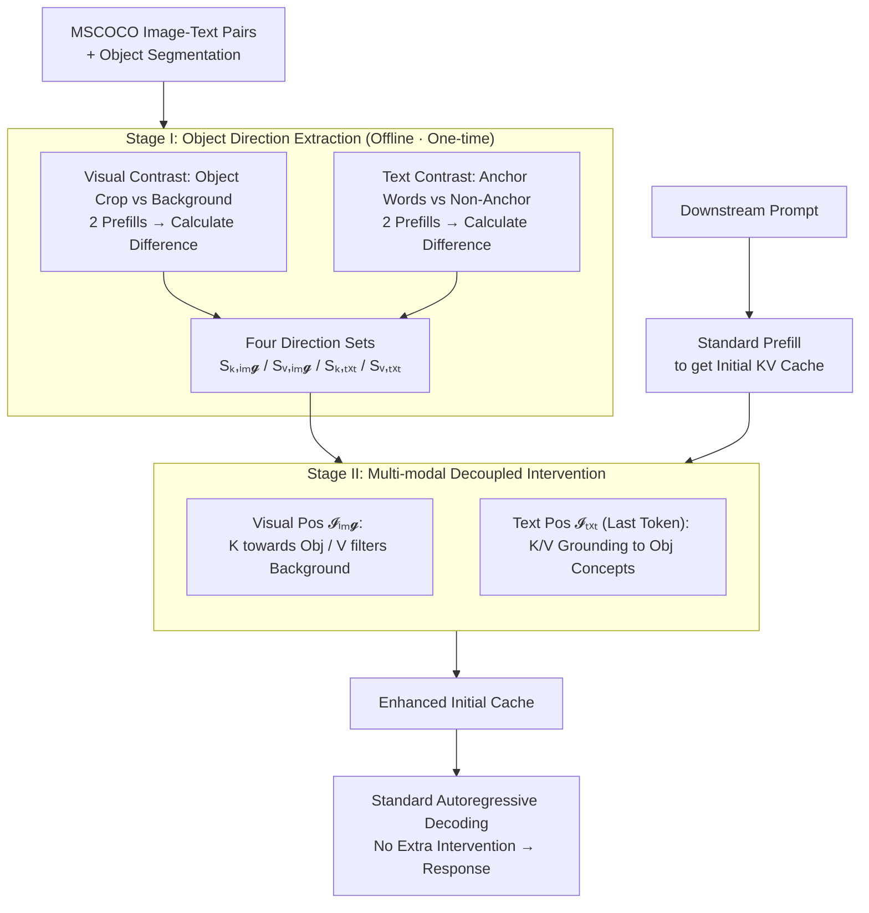

# Prefill-Time Intervention for Mitigating Hallucination in Large Vision-Language Models

**Conference**: CVPR 2026  
**arXiv**: [2604.25642](https://arxiv.org/abs/2604.25642)  
**Code**: https://github.com/huaiyi66/PTI  
**Area**: Multimodal VLM / Hallucination Mitigation  
**Keywords**: LVLM Hallucination, KV cache, steering vector, prefill intervention, modality decoupling

## TL;DR
PTI shifts steering intervention to mitigate LVLM hallucinations from the "token-by-token decoding phase" forward to the "one-time prefill phase." By applying modality-aware and key/value-decoupled steering vectors to the initial KV cache, it corrects hallucination-prone representations at the source. It outperforms existing decoding-time methods across three LVLMs and five benchmarks and is compatible with them as a plug-and-play enhancement.

## Background & Motivation
**Background**: Large Vision-Language Models (LVLMs) are powerful but prone to "hallucinations"—generating non-existent objects, incorrect attributes, or non-existent relations. The mainstream training-free mitigation route is **Decoding-Time Intervention (DTI)**: extracting a steering vector from contrastive samples and adding it to the model's hidden states at every decoding step to "steer" behavior toward visual loyalty (e.g., VTI, VISTA, PAI).

**Limitations of Prior Work**: The authors observe an counter-intuitive phenomenon—while DTI reduces the **frequency** of hallucinations, it amplifies the **severity** of residual hallucinations, manifesting as "snowball hallucination." Once an initial error token is generated, continuous intervention fails to suppress its propagation, allowing the error to accumulate along the autoregressive path. This cascading effect is quantified using the PSH metric, defined as $\text{PSH}=\frac{\text{Snowball Hallucinations}}{\text{Overall Hallucinations}}\times 100\%$, confirming that DTI drives PSH higher on the CHAIR benchmark.

**Key Challenge**: The failure of DTI is attributed to three dimensions—**how / what / when**. ① **how**: It typically derives a unified vector from **text** states (modality-agnostic), ignoring the specific sensitivity of text decoders to visual representations, which exacerbates modality mismatch. ② **what**: It operates on **coarse-grained** hidden states, failing to fix fine-grained visual perception errors. ③ **when** (most critical): It is **reactive**, intervening during the decoding phase only after a poorly grounded representation has already been computed and the "snowball" has started.

**Goal**: Rather than repeatedly attempting remedies during decoding, it is better to shape the initial state correctly at the **source**—the prefill stage where representations are first formed.

**Key Insight**: In Transformer-based LVLMs, the initial state is materialized as the **KV cache** constructed during prefill. The KV cache is not just a storage module; it actively shapes **every subsequent step** of decoding through the attention mechanism. Prior works (inference acceleration, long context) have shown that manipulating the KV cache significantly affects the entire generation, making it a natural intervention point.

**Core Idea**: Propose **Prefill-Time Intervention (PTI)**—intervening on the initial KV cache only **once** during the prefill stage (proactive, solving the "when"); deriving separate directions for visual and text tokens (modality-aware, solving the "how"); and intervening on fine-grained K/V instead of coarse hidden states (solving the "what"). It leverages the natural division of labor where the **key** determines "where to look" and the **value** determines "what to aggregate," decoupling the intervention to push keys toward visually grounded objects and use values to filter background noise.

## Method

### Overall Architecture
The core of PTI is a two-stage, training-free pipeline. The **input** is an image-text prompt for a downstream task, and the **output** is a generated response with fewer hallucinations. The only modification occurs after the prefill phase calculates the initial KV cache but before decoding begins.

- **Stage I (Offline · Direction Extraction)**: Contrastive samples of "Object vs. Background" are constructed using MSCOCO. Two independent prefill forward passes (Positive/Negative) are conducted for both **visual** and **text** branches. Steering directions are derived from the difference between positive and negative caches. Both visual and text branches are further split into **key directions** and **value directions**, resulting in four sets of directions: $S_{\text{k,img}}, S_{\text{v,img}}, S_{\text{k,txt}}, S_{\text{v,txt}}$ (averaged across $N$ samples per layer and denoised via PCA). These directions are task-agnostic and only need to be extracted once.
- **Stage II (Online · Downstream Intervention)**: After a downstream sample is prefilled to obtain the initial cache, the four sets of directions are injected based on token positions—visual directions are added only to visual token positions $\mathcal{I}_{\text{img}}$, and text directions are added only to text token positions $\mathcal{I}_{\text{txt}}$, across all layers. The enhanced cache serves as the "grounded" initial state for the decoder, followed by standard autoregressive decoding with **no additional intervention**, incurring negligible overhead.

### Key Designs

**1. Prefill-time One-time Intervention: Replacing "Remedy" with "Shaping"**

Addressing the "reactive" nature of DTI where intervention occurs after errors have formed, PTI operates once during prefill on the initial KV cache. Since the KV cache is the context source for every subsequent attention step, providing a "grounded" initial state effectively cuts off the snowball's origin before errors can accumulate. In contrast, DTI repeatedly adds the same vector to every token, which is both computationally expensive and risks pushing already erroneous representations further off track. Because it only modifies the initial cache and does not touch the decoding loop, PTI has near-zero overhead.

**2. Modality-aware + Position-sensitive: Global Vision, Precise Text**

Addressing the "how" limitation of DTI (unified text-based vectors), PTI derives separate directions for vision and text and uses **different injection positions**. Visual directions are applied to **all visual tokens** ($\mathcal{I}_{\text{img}}$) because visual perception errors are diffused throughout the image representation. Text directions are applied only to the **last text token** (index $N_x{-}1$) of the input sequence, as it is closest to the starting generation state, maximizing the benefit of precise correction. Ablations (Table 5) show that this combination yields optimal results, confirming that the best granularity differs for the two modalities.

**3. Key/Value Decoupling: Keys for "Where to Look," Values for "What to See"**

To address the "what" limitation (coarse hidden states), PTI acts directly on K and V within the attention mechanism. **Visual Direction Extraction**: Given image $I^i$ and object mask $M^i_{\text{obj}}$, the positive sample is the cropped object $I^i_{\text{pos}}=I^i\odot M^i_{\text{obj}}$ and the negative is the background $I^i_{\text{neg}}=I^i\odot(1-M^i_{\text{obj}})$. After two prefills, the difference is pooled across visual tokens:
$$\Delta C^{i,l}_{\text{img}}=\text{AP}(C^{i,l}_{\text{pos}}-C^{i,l}_{\text{neg}})[\mathcal{I}_{\text{img}}],\quad C\in\{K,V\}$$
This yields $S_{\text{k,img}}$ and $S_{\text{v,img}}$. **Text Direction Extraction**: NLP tools identify object anchor words (e.g., "cat") as $T_{\text{pos}}$ and others as $T_{\text{neg}}$, taking the difference at the last token. Intervention is a simple additive shift (with intensity $\lambda$ and normalization):
$$\tilde{K}^l[\mathcal{I}_{\text{img}}]\mathrel{+}=\lambda_{\text{k,img}}S^l_{\text{k,img}},\quad \tilde{V}^l[\mathcal{I}_{\text{img}}]\mathrel{+}=\lambda_{\text{v,img}}S^l_{\text{v,img}}$$
Interpretability analysis (Figure 5) shows differing effects: **Key intervention** mitigates the global decay of visual attention and focuses it on local object details ("where to look"), while **value intervention** uses the "object vs. background" signal to filter noise and enhance robustness ("what to aggregate").

### Loss & Training
PTI is **completely training-free with no learnable parameters**. Directions are extracted once from 100 randomly sampled MSCOCO VQA pairs, averaged layer-wise, and denoised via SVD-based PCA. The only hyperparameters are the four intensity coefficients $\lambda_{\text{k,img}}, \lambda_{\text{v,img}}, \lambda_{\text{k,txt}}, \lambda_{\text{v,txt}}$, which are selected via grid search with the constraint $\lambda_{\text{k,img}}{=}\lambda_{\text{k,txt}}$ and $\lambda_{\text{v,img}}{=}\lambda_{\text{v,txt}}$.

## Key Experimental Results

Evaluation spans three LVLMs (LLaVA-1.5, Qwen-VL-Chat, DeepSeek-VL-Chat), three decoding strategies (Greedy/Beam Search/Nucleus Sampling), and five benchmarks (CHAIR, POPE, AMBER, MMHal, MME). Baselines include training-free SOTA methods (PAI, VTI, VISTA, VCD, OPERA).

### Main Results

CHAIR Object Hallucination (Lower is better; 500 MSCOCO descriptions):

| Decoding / Model | Metric | Vanilla | VISTA (Next Best) | PTI | Ours Gain vs Vanilla |
|------|------|------|------|------|------|
| Greedy · LLaVA-1.5 | CHAIR$_S$ | 47.4 | 20.4 | **15.4** | ↓32.0 |
| Greedy · LLaVA-1.5 | CHAIR$_I$ | 13.7 | 6.9 | **5.4** | ↓8.3 |
| Beam · Qwen-VL | CHAIR$_S$ | 43.6 | 30.0 | **18.8** | ↓24.8 |
| Beam · DeepSeek-VL | CHAIR$_S$ | 27.0 | 24.0 | **15.6** | ↓11.4 |

POPE and Comprehensive Benchmarks:

| Benchmark | Model | Metric | Vanilla | PTI |
|------|------|------|------|------|
| POPE Adversarial | LLaVA-1.5 | Acc | 75.40 | **77.40** |
| POPE Average | Qwen-VL | Acc | 83.69 | **85.69** |
| MME (Cognition) | LLaVA-1.5 | Acc | 611.6 | **651.6** (↑40.0) |
| MME | Qwen-VL | Acc | 598.3 | **638.3** (↑40.0) |
| AMBER Sampling | LLaVA-1.5 | C$_I$↓ | 9.9 | **7.3** |

### Ablation Study

Intervention Modality & Position (LLaVA-1.5, Table 5):

| Configuration | CHAIR$_S$↓ | CHAIR$_I$↓ | F1↑ | Note |
|------|------|------|------|------|
| Vanilla | 47.4 | 13.7 | 75.3 | Baseline |
| Text Only · last token | 40.8 | 12.0 | 76.5 | Precise text correction |
| Text Only · all tokens | 45.2 | 14.3 | 75.6 | Spate text intervention is worse |
| Vision Only · last token | 41.2 | 12.4 | 76.4 | Limited visual impact |
| Vision Only · all tokens | 16.8 | 6.2 | 70.3 | Global vision: strongest reduction, but F1 drops |
| **PTI (Text last + Vision all)** | **15.4** | **5.4** | 72.7 | Optimal balance |

### Key Findings
- **Vision is the main driver, but sacrifices generation quality**: Vision-only intervention significantly cuts CHAIR$_S$ but causes F1 to drop; text intervention helps recover F1 and refine accuracy. PTI finds a trade-off between hallucination reduction and generation quality.
- **Modality-specific Granularity**: Vision benefits from "global" coverage, while text requires "precisely the last token." Reversing these degrades performance.
- **Contrastive Signal**: The "object vs. background" contrast for values provides a significantly stronger anti-hallucination signal than random masking.
- **Orthogonal Compatibility & Transferability**: PTI can be stacked with PAI/VISTA for additional gains. Directions extracted from LLaVA transfer to Qwen models with same KV dimensions, showing capture of model-agnostic object properties.

## Highlights & Insights
- **Intervention timing as a first-class design dimension**: While most work defaults to decoding-time, PTI argues that the "when" (prefill vs. decoding) is the root of snowball hallucinations. One-time shaping is more efficient than continuous remedy.
- **Leveraging physical division of labor in attention**: Decoupling tasks into "where to look" (Key) and "what to see" (Value) makes the intervention explainable and semantically clear.
- **Zero-cost plug-and-play**: By only modifying the initial cache, PTI introduces no overhead to the decoding loop and can coexist with any decoding-time strategy.
- **Transferable Trick**: The "object crop vs. pure background" contrast for purifying object directions is highly effective and applicable to other visual representation editing tasks.

## Limitations & Future Work
- **Trade-off between hallucination and quality**: Strong visual intervention can lower F1, requiring manual balancing of text/vision coefficients.
- **Dependency on segmentation**: Extracting directions currently requires object segmentation masks (e.g., from MSCOCO), which may be limited in domains without such labels.
- **Hyperparameter Tuning**: Finding the four $\lambda$ coefficients requires grid searching, which adds to deployment costs.
- **Architecture Constraints**: Cross-model transfer is currently limited to models with identical KV dimensions.

## Related Work & Insights
- **vs. DTI (VTI / VISTA / PAI)**: These methods apply unified vectors to coarse hidden states at every step. PTI is proactive, K-V decoupled, and operates at prefill on fine-grained caches.
- **vs. Visual Contrastive Decoding (VCD / OPERA)**: These compare logits from original and distorted images, incurring high latency. PTI avoids multiple decoding passes by enhancing the initial cache directly.
- **Systematic Reframe**: Compared to concurrent works using LLM "coprocessors" or style transfer, PTI is lightweight, training-free, and focuses on the "what/how/when" logic of cache intervention.

## Rating
- Novelty: ⭐⭐⭐⭐⭐ Shifts hallucination mitigation to prefill-time and redefines intervention along three systematic axes.
- Experimental Thoroughness: ⭐⭐⭐⭐⭐ Comprehensive 3x3x5 evaluation plus transferability and interpretability analyses.
- Writing Quality: ⭐⭐⭐⭐ Clear motivation, though method section is formula-dense and relies heavily on figures.
- Value: ⭐⭐⭐⭐⭐ Training-free, zero-overhead, and plug-and-play with high practical utility.

<!-- RELATED:START -->

## Related Papers

- [\[CVPR 2026\] CausalLens: Sensitivity-Guided Multi-Head Causal Intervention for Hallucination Mitigation in Large Vision-Language Models](causallens_sensitivity-guided_multi-head_causal_intervention_for_hallucination_m.md)
- [\[CVPR 2026\] HulluEdit: Single-Pass Evidence-Consistent Subspace Editing for Mitigating Hallucinations in Large Vision-Language Models](hulluedit_single-pass_evidence-consistent_subspace_editing_for_mitigating_halluc.md)
- [\[CVPR 2026\] Envision, Attend, Then Respond: Counterfactual Hallucination Mitigation in Large Vision-Language Models](envision_attend_then_respond_counterfactual_hallucination_mitigation_in_large_vi.md)
- [\[CVPR 2026\] SEASON: Mitigating Temporal Hallucination in Video Large Language Models via Self-Diagnostic Contrastive Decoding](season_mitigating_temporal_hallucination_in_video_large_language_models_via_self.md)
- [\[CVPR 2026\] First Logit Boosting: Visual Grounding Method to Mitigate Object Hallucination in Large Vision-Language Models](first_logit_boosting_visual_grounding_method_to_mitigate_object_hallucination_in.md)

<!-- RELATED:END -->
