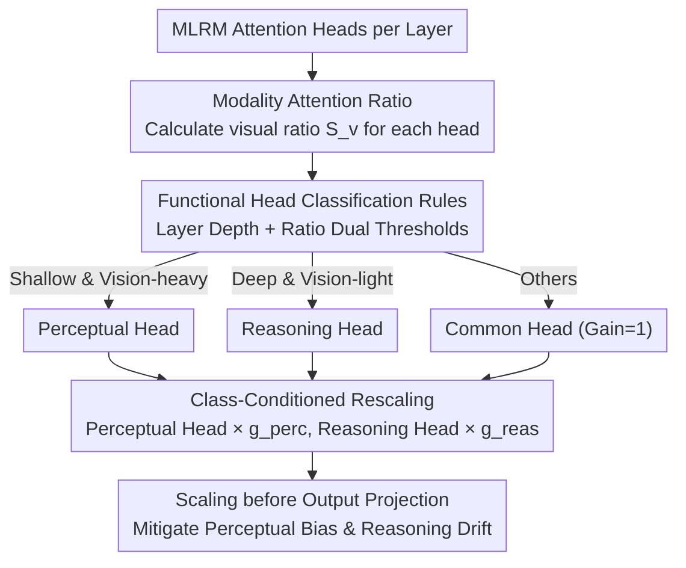

# Reallocating Attention Across Layers to Reduce Multimodal Hallucination

**Conference**: CVPR 2026  
**arXiv**: [2510.10285](https://arxiv.org/abs/2510.10285)  
**Code**: None  
**Area**: Hallucination Detection  
**Keywords**: Multimodal Hallucination, Attention Heads, Perceptual-Reasoning Hierarchy, Training-free Plugin, Attention Reallocation

## TL;DR

A lightweight, training-free plugin method is proposed to alleviate hallucinations in Multimodal Large Reasoning Models (MLRMs) by identifying perceptual and reasoning attention heads and applying Class-Conditioned Rescaling. This approach rebalances cross-layer attention allocation, achieving an average improvement of 4.2% across five benchmarks with almost no additional inference overhead.

## Background & Motivation

**Increasing Multimodal Hallucinations**: Multimodal Large Reasoning Models (MLRMs) frequently generate conclusions that contradict visual evidence or are inconsistent with their own reasoning chains, severely undermining model reliability and deployability.

**Biased Assumptions in Existing Methods**: Prevailing methods (e.g., stronger supervision, fine-grained alignment, external visual priors) assume hallucinations primarily stem from insufficient utilization of visual information, overlooking the internal imbalance between perception and reasoning.

**Interpretability Studies Reveal Hierarchical Mechanisms**: Prior work has found that Transformer attention exhibits phased characteristics—shallow layers rely on visual signals for evidence extraction, while deep layers shift toward text-based symbolic reasoning. This suggests hallucinations may arise from cross-layer functional dysfunction.

**Two Complementary Failure Modes**: "Perceptual Bias" in shallow layers leads to scattered visual attention and dilution of key evidence, while "Reasoning Drift" in deep layers causes the reasoning chain to deviate from the premises of intermediate steps.

**200 Manual Case Inspections**: Approximately 16% of hallucinations stem from perceptual bias, 20% from reasoning drift, and 10% from the co-occurrence of both, indicating a multi-stage composite problem.

**Internal Model Potential**: Models likely already contain attention heads with perceptual or reasoning expertise, but these do not play a dominant role in their current state and need to be explicitly identified and amplified.

## Method

### Overall Architecture

This paper attributes multimodal hallucinations to an overlooked factor: the allocation imbalance between "perceptual" and "reasoning" functions in cross-layer attention rather than mere underutilization of visual information. It introduces a plug-and-play, training-free two-step plugin. First, each attention head is classified as either a perceptual or reasoning head based on its attention allocation ratio between visual/text tokens and its layer depth. Second, multiplicative gains greater than 1 are applied to these categories to amplify their contributions, countering shallow "perceptual bias" and deep "reasoning drift." The process requires no architectural changes or retraining, applying only a slight rescaling before the output projection of each attention layer.

### Key Designs

**1. Modality Attention Ratio: Quantifying Visual Focus**

To distinguish between perceptual and reasoning heads, a metric is needed to measure visual focus. For each layer $\ell$ and head $h$, the visual attention allocation ratio $S_v^{(\ell)}(h) = \sum_{j \in \mathcal{T}_v} a_{i^* j}^{(h,\ell)}$ is defined as the sum of attention from query position $i^*$ to all visual tokens. It is complementary to the text ratio, where $S_v + S_t = 1$. This scalar forms the basis for subsequent classification.

**2. Functional Head Classification Rules: Dual Thresholds for Depth and Ratio**

Perception relies on shallow evidence gathering, while reasoning relies on deep symbolization. Classification considers both ratio and depth. Two ratio thresholds $\tau_{\text{perc}}, \tau_{\text{reas}}$ (where $\tau_{\text{reas}} < \tau_{\text{perc}}$) and two layer boundaries $\ell_{\text{perc}}$ (upper bound for perception) and $\ell_{\text{reas}}$ (lower bound for reasoning) are introduced:

- Perceptual Head: $\mathcal{H}_{\text{perc}}^{(\ell)} = \{h : \ell \le \ell_{\text{perc}} \wedge S_v^{(\ell)}(h) \ge \tau_{\text{perc}}\}$
- Reasoning Head: $\mathcal{H}_{\text{reas}}^{(\ell)} = \{h : \ell \ge \ell_{\text{reas}} \wedge S_v^{(\ell)}(h) \le \tau_{\text{reas}}\}$

Essentially, "shallow and vision-heavy" heads are perceptual, while "deep and vision-light" heads are reasoning. Others remain unchanged.

**3. Class-Conditioned Rescaling: Amplifying without Recomputing Attention**

After identification, global gains $g_{\text{perc}} \ge 1$ and $g_{\text{reas}} \ge 1$ are assigned to perceptual and reasoning heads respectively, with others set to 1. Crucially, rescaling occurs after the per-head output is computed but before the output projection, leaving the underlying attention computation unchanged:

$$Y_{\text{out}}^{(\ell)} = \text{Concat}(g^{(1,\ell)} O^{(1,\ell)}, \ldots, g^{(H,\ell)} O^{(H,\ell)}) W_O^{(\ell)}$$

This reinforces diluted visual evidence and stabilizes drifting reasoning chains with minimal inference overhead. For Ocean-R1, default configurations are $\ell_{\text{perc}}=7, \ell_{\text{reas}}=3, g_{\text{reas}}=1.30, \tau_{\text{reas}}=0.01, g_{\text{perc}}=1.16, \tau_{\text{perc}}=0.22$.

### Loss & Training

Ours is training-free and involves no optimization of a loss function. The theoretical objective is to minimize hallucination intensity:

$$\mathcal{I} = \lambda_1 \mathbb{E}_{\ell \in \mathcal{L}_{\text{perc}}}[\mathcal{E}_{\text{perc}}^{(\ell)}] + \lambda_2 \mathbb{E}_{\ell \in \mathcal{L}_{\text{reas}}}[\mathcal{E}_{\text{reas}}^{(\ell)}]$$

where perceptual bias $\mathcal{E}_{\text{perc}}$ and reasoning drift $\mathcal{E}_{\text{reas}}$ measure the L2 deviation of shallow visual features and deep reasoning representations from ideal targets.

## Key Experimental Results

Evaluations were conducted on three MLRMs (Kimi-VL A3B-Thinking, Ocean-R1 7B-Instruct, R1-Onevision 7B) across five benchmarks.

### Main Results (Table 1, Comparison with Vanilla and 3 Baselines)

| Method | MathVista | MathVision | HallusionBench Acc | MMStar Acc | SEED-Bench Acc |
|------|-----------|------------|---------------------|------------|----------------|
| Kimi-VL Vanilla | 63.48 | 56.24 | 64.76 | 59.76 | 66.26 |
| Kimi-VL + VCD | 63.51 | 56.14 | 65.68 | 59.48 | 66.52 |
| Kimi-VL + AGLA | 67.32 | 58.88 | 61.36 | 63.76 | 69.27 |
| **Kimi-VL + Ours** | **69.78** | **60.54** | **68.19** | **66.49** | **69.74** |
| Ocean-R1 Vanilla | 54.58 | 20.05 | 49.41 | 45.24 | 59.76 |
| **Ocean-R1 + Ours** | **59.32** | **26.01** | **53.64** | **50.77** | **66.51** |
| R1-OneVision Vanilla | 59.92 | 33.54 | 58.26 | 56.26 | 68.48 |
| **R1-OneVision + Ours** | **60.09** | **39.12** | **60.77** | **58.02** | **69.52** |

### Ablation Study

- **w/o Reason**: Visual tasks benefit more, but gains in mathematical reasoning tasks are limited.
- **w/o Percept**: Improvements in mathematical reasoning are more pronounced, but visual task performance drops.
- **Non-additive Effect**: On R1-OneVision for MathVision, reinforcing either head type individually caused a drop of $-3.91\%$, while reinforcing both resulted in a $+5.58\%$ gain, indicating a need for synergistic optimization.
- **Model Heterogeneity**: Different architectures rely differently on perceptual/reasoning heads. For instance, Kimi-VL achieved $+6.71\%$ on MMStar by reinforcing only perceptual heads, while the same setting for Ocean-R1 resulted in $-1.51\%$.

### Key Findings

1. **Optimal in approx. 95% of tasks**, with an average gain of 4.2% and up to 7% on difficult tasks.
2. **Excellent Efficiency**: Only adds approx. 2 seconds of inference time (approx. 9% baseline latency), significantly lower than the 1.2×–6.6× overhead of VCD/CGD/AGLA.
3. **Task-dependent "Ribbon" Regions**: Layer boundaries exist as task-dependent regions rather than single split points. Visual tasks prefer shallow boundaries, while reasoning tasks prefer deep boundaries.
4. **Optimal Gain $g \approx 1.14$**: Excessive gain leads to performance degradation; reasoning gain $g_{\text{reas}}$ is more stable, while perceptual gain $g_{\text{perc}}$ exhibits higher volatility.
5. **Sparse Intervention is Most Effective**: Performance peaks when approx. 6.4% of heads (50–150 heads) are selected; performance declines when the ratio increases to 18%.
6. **Transition Zones in Middle Layers (Layers 10–17)**: Perceptual and reasoning functions are highly intertwined in this range. Enhancing either direction individually is ineffective, supporting the hierarchical hypothesis.
7. **Limited Cross-model Transferability**: Optimal hyperparameter configurations differ significantly across architectures, reflecting different dependency patterns on perceptual/reasoning heads.

## Highlights & Insights

- **Plug-and-play**: No training or architectural changes required; directly modifies attention head outputs during inference, offering high practicality.
- **Theory-Experiment Consistency**: Design follows directly from formal analysis of perceptual bias/reasoning drift, and experiments validate each component's contribution.
- **Ultra-low Overhead**: Compared to other inference-time methods (VCD 1.2×, CGD 6.6×), this method adds only approx. 1% computation, essentially "free."
- **Interpretability Perspective**: Provides a new lens for understanding and regulating multimodal reasoning reliability through cross-layer functional dynamics.

## Limitations & Future Work

- Layer boundaries and thresholds require tuning for different models/tasks, involving a large search space (150+ boundary configurations, 24+ scaling strategies) lacking automated selection.
- Intervention is limited to the inference stage and cannot fix systemic biases introduced during training.
- Experiments only cover 7B-scale models; scalability and effects on larger models (e.g., 70B+) are unverified.
- Optimal intervals for $\ell_{\text{perc}}$ and $\ell_{\text{reas}}$ may overlap or have gaps; automated determination remains an open problem.
- Gains are global constants (layer-agnostic); potential benefits of layer-wise adaptive or sample-wise dynamic gains are unexplored.
- Functional head identification depends on the attention distribution of a single query position $i^*$; aggregation strategies (e.g., multi-position averaging) might be more robust.
- Performance on generative tasks (e.g., image captioning) vs. discriminative benchmarks has not been analyzed.

## Related Work & Insights

- **Contrastive Decoding**: VCD suppresses hallucinations by contrasting original/counterfactual image views, CGD uses CLIP to guide decoding, and AGLA fuses global/local views for visual anchoring. These are effective but introduce significant inference overhead (1.2×–6.6×).
- **Alignment & Preference Learning**: Improves cross-modal alignment through fine-tuning but requires extra training data and resources, making it unsuitable for black-box deployment.
- **Multimodal Interpretability**: Prior work revealed that visual focus of attention heads is higher in shallow/middle layers. This work translates those interpretability findings into actionable intervention strategies.
- **Attention Head Pruning/Analysis**: Previous studies found that pruning heads with high visual allocation impacts visual tasks more. This paper does the opposite, "amplifying" rather than "pruning" these functional heads.
- **Chain-of-Thought Reasoning**: CoT methods enhance multimodal reasoning through prompts or reasoning chain annotations but rely on manual prompt design or heavy supervision. This method is complementary to CoT.

## Rating

- Novelty: ⭐⭐⭐⭐ — Proposes a new paradigm of functional head identification and rescaling from a perceptual-reasoning hierarchy perspective.
- Experimental Thoroughness: ⭐⭐⭐⭐⭐ — 3 models × 5 benchmarks × 4 baselines, combined with large-scale hyperparameter searches and ablations.
- Writing Quality: ⭐⭐⭐⭐ — Clear theoretical analysis, complete formula derivations, and rich visualizations.
- Value: ⭐⭐⭐⭐ — High engineering value due to its plug-and-play nature and near-zero overhead.

<!-- RELATED:START -->

## Related Papers

- [\[CVPR 2026\] Same Attention, Different Truths: Put Logit-Lens over Visual Attention to Detect and Mitigate LVLM Object Hallucination](same_attention_different_truths_put_logit-lens_over_visual_attention_to_detect_a.md)
- [\[CVPR 2026\] Cross-Modal Attention Calibration for LVLM Hallucination Mitigation](cross-modal_attention_calibration_for_lvlm_hallucination_mitigation.md)
- [\[ACL 2025\] Mixture of Decoding: An Attention-Inspired Adaptive Decoding Strategy to Mitigate Hallucination in Multimodal LLMs](../../ACL2025/hallucination/mixture_of_decoding_an_attention-inspired_adaptive_decoding_strategy_to_mitigate.md)
- [\[CVPR 2026\] Understanding and Mitigating Hallucinations in Multimodal Chain-of-Thought Models](understanding_and_mitigating_hallucinations_in_multimodal_chain-of-thought_model.md)
- [\[CVPR 2026\] Zina: Multimodal Fine-grained Hallucination Detection and Editing](zina_multimodal_fine-grained_hallucination_detection_and_editing.md)

<!-- RELATED:END -->
