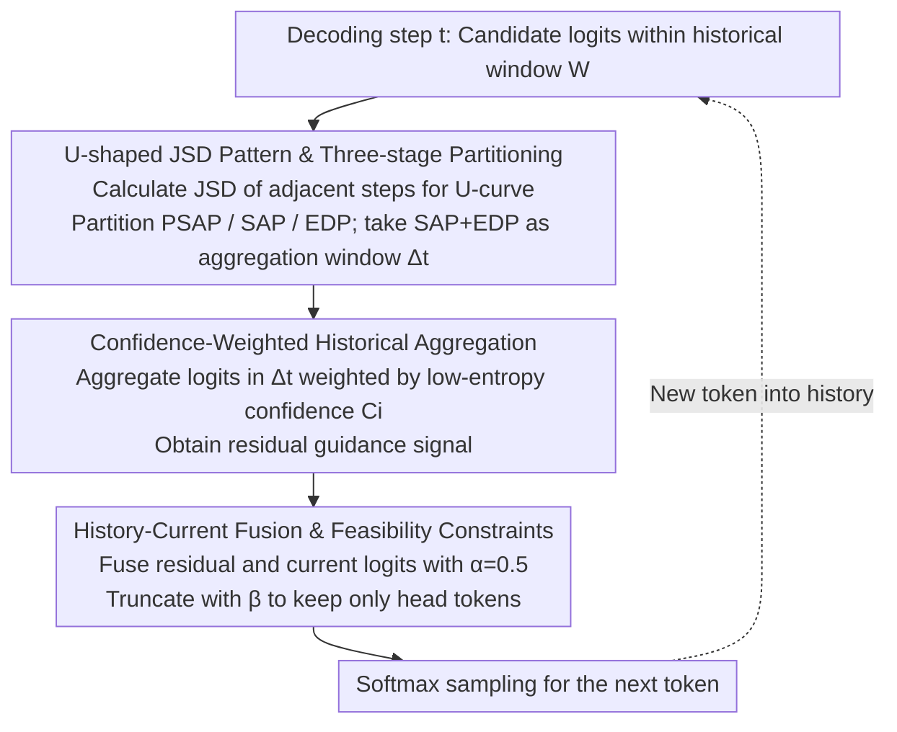

# Residual Decoding: Mitigating Hallucinations in Large Vision-Language Models via History-Aware Residual Guidance

**Conference**: CVPR2026  
**arXiv**: [2602.01047](https://arxiv.org/abs/2602.01047)  
**Code**: None  
**Area**: Hallucination Detection  
**Keywords**: Hallucination mitigation, decoding strategy, vision-language models, residual guidance, training-free

## TL;DR
Residual Decoding (ResDec) is proposed—a training-free, plug-and-play decoding strategy that discovers the semantic anchoring stage by analyzing U-shaped JSD patterns in historical token logit distributions. It effectively suppresses language prior hallucinations in LVLMs by aggregating logits from this stage as residual guidance for current decoding, incurring nearly zero additional inference overhead.

## Background & Motivation
Although Large Vision-Language Models (LVLMs) perform excellently on multimodal tasks, they suffer from **language prior hallucinations**—as replies are generated step-by-step, the textual context gradually overwhelms the visual context, leading to syntactically coherent but image-inconsistent content.

Limitations of existing mitigation methods: (1) Training-based methods (data debiasing, preference alignment, etc.) require additional training and annotation, hence poor scalability; (2) Contrastive decoding methods (VCD, ICD, etc.) require 2× or more inference time and GPU memory; (3) Internal model intervention methods (modifying attention/FFN/layers) show low efficiency and generalization.

**Key Insight**: The authors found that signals for correct answers are already embedded in the logit distributions of preceding tokens. For instance, when answering "The answer is D", while generating the prompt tokens "The", "answer", and "is", the logits for the correct answer "D" are already at a high value. However, during the generation of ":", the logits for the hallucinated token "C" abnormally increase and eventually surpass the ground-truth token. **The essence of hallucination is that hallucinated token logits abnormally spike at certain moments and gradually overtake ground-truth tokens**.

## Method

### Overall Architecture
ResDec targets the "language prior hallucination" of LVLMs—where textual context gradually drowns out visual context during generation. It operates purely in the decoding phase without modifying the architecture or requiring training. At the current decoding step $t$, it analyzes the logit evolution within a historical window to locate semantically stable intervals, aggregates these logits into a residual guidance signal, and samples after a weighted fusion with the current logits. The core logic is based on the observation that ground-truth signals are already embedded in historical logit distributions; hallucinations occur when hallucinated token logits spike and overtake ground-truth tokens.

The decoding loop consists of three serial steps: first, framing the "semantically anchored" trusted interval from the historical window via U-shaped JSD patterns; second, performing confidence-weighted aggregation of logits within this interval to obtain the residual guidance signal; and finally, fusing the residual with current logits, followed by truncation and sampling. The newly sampled token is integrated into the history to drive the next step.

### Key Designs

**1. U-shaped JSD Pattern & Three-stage Partitioning: Locating the "Semantically Anchored" Interval**

To reuse historical logits, one must identify which part of the history is reliable. ResDec calculates the Jensen-Shannon Divergence (JSD) between candidate distributions of adjacent time steps within a historical window $\mathcal{W}$. It identifies a U-shaped JSD pattern and partitions it into three stages: **PSAP (Pre-Semantic Anchoring Phase)** on the left side, where distribution moves from chaos toward convergence but still contains anchoring uncertainty; **SAP (Semantic Anchoring Phase)** at the bottom, where JSD is near 0 and the distribution is highly stable, indicating the model has firmly anchored core semantics; and **EDP (Expression Divergence Phase)** on the right side, where JSD rises as the model pursues diverse expressions, making it most susceptible to language priors. ResDec utilizes logits from the SAP+EDP interval to construct residual guidance—capturing anchored reliable signals while covering divergence segments prone to hallucination.

**2. Confidence-Weighted Historical Aggregation: Giving louder voice to low-entropy, more confident historical steps**

Reliability varies across historical steps; simple averaging would be degraded by high-entropy noise. Within the aggregation window $\Delta_t$, for each time step $i$, a local confidence is calculated as $C_i = -\frac{1}{|\Omega_t|} \sum_{j=1}^{|\Omega_t|} \log P_i(j)$ (where lower entropy corresponds to higher confidence). Logits are then aggregated using normalized confidence weights:

$$\text{logit}_\theta^{\text{res}}(y_t | T_{<t-1}) = \sum_{i \in \Delta_t} \frac{C_i}{\sum_j C_j} \cdot \text{logit}_\theta(\hat{y}_i | T_{<i})$$

This ensures that more confident historical steps have greater weight in the residual, cleanly extracting the judgments from the "semantically anchored" phase.

**3. History-Current Fusion & Feasibility Constraints: Residuals as auxiliary correction, not replacing the lead**

Directly replacing current logits with residuals could introduce unreasonable tokens. ResDec linearly fuses historical residuals with current logits:

$$p_{\text{ResDec}}(y_t) = \text{Softmax}[(1-\alpha)\text{logit}_\theta(y_t) + \alpha \cdot \text{logit}_\theta^{\text{res}}(y_t)]$$

where $\alpha=0.5$. Simultaneously, a truncation constraint $\mathcal{V}_{\text{head}}$ ($\beta=0.1$) is applied: only tokens with probability at least $\beta$ times the maximum probability are kept; others have their logits set to $-\infty$. Ablation shows performance drops sharply when $\alpha$ exceeds 0.5, confirming that historical residuals serve as auxiliary correction rather than replacement.

### Loss & Training
- **Completely training-free**, operating only during the decoding phase.
- Reuses historical logits naturally generated during inference, requiring no extra forward passes.
- Minimal hyperparameters: $\alpha=0.5$, $\beta=0.1$, candidate token pool size $|\Omega_t| \in [64, 512]$.

## Key Experimental Results

### Main Results (Average POPE Results)

| Model | Method | Accuracy ↑ | F1 ↑ |
|------|------|-----------|------|
| LLaVA-1.5 | Regular | 79.83 | 79.29 |
| LLaVA-1.5 | OPERA | 84.21 | 83.55 |
| LLaVA-1.5 | VISTA | 86.15 | 86.29 |
| LLaVA-1.5 | **ResDec** | **87.23** | **86.93** |
| Qwen2.5-VL | Regular | 86.11 | 84.74 |
| Qwen2.5-VL | VISTA | 88.83 | 88.99 |
| Qwen2.5-VL | **ResDec** | **90.16** | **89.56** |

### HallusionBench & CHAIR

| Model | Method | fACC ↑ | CHAIR_S ↓ | CHAIR_I ↓ |
|------|------|--------|-----------|-----------|
| LLaVA-1.5 | Regular | 17.9 | 55.0 | 16.3 |
| LLaVA-1.5 | MemVR | 17.9 | 46.6 | 13.0 |
| LLaVA-1.5 | **ResDec** | **18.2** | **42.7** | **12.6** |
| Qwen2.5-VL | Regular | 43.4 | 30.6 | 8.4 |
| Qwen2.5-VL | **ResDec** | **47.1** | **25.8** | **6.8** |

### Efficiency Comparison

| Method | Latency (ms/token) | Throughput (token/s) | Memory (MB) |
|------|---------------|----------------|----------|
| Greedy | 28.54 | 35.04 | 14257 |
| VCD | 62.79 | 15.93 | 14967 |
| OPERA | 104.46 | 9.57 | 21300 |
| **ResDec** | **29.11** | **34.35** | **14296** |

### Ablation Study

| $\alpha$ | $\beta$ | MME | POPE Acc | MMStar |
|---------|---------|-----|----------|--------|
| 0.25 | 0.1 | 2326 | 89.64 | 64.20 |
| **0.5** | **0.1** | **2348** | **90.16** | **65.40** |
| 0.75 | 0.1 | 1875 | 82.56 | 62.67 |
| 1.0 | 0.1 | 1583 | 72.50 | 61.80 |

### Key Findings
- ResDec achieves an average improvement of 7.84% Accuracy and 8.01% F1 across three LVLMs (vs Regular).
- Latency is only 0.02× higher than Greedy, significantly better than OPERA (3.7×) and VCD (2.2×).
- Performance drops sharply when $\alpha$ exceeds 0.5—historical residuals provide **auxiliary correction** rather than replacement.
- Candidate pool size between 64-512 is optimal; too small fails to capture JSD changes, too large introduces early noise.
- Effective across various decoding strategies (Nucleus, Top-K, Temperature, Greedy).

## Highlights & Insights
- **In-depth insight**: Uncovering the hallucination mechanism where hallucinated token logits gradually rise and overtake ground-truth tokens provides a new perspective for understanding and mitigating hallucinations.
- **U-shaped JSD Pattern**: Elegantly reveals the three-stage evolution of "semantic convergence → anchoring → divergence" during LVLM decoding.
- **Ultra-low overhead**: Reuses existing historical logits without extra forward passes, increasing latency by only 2%, making it the most efficient hallucination mitigation method to date.
- **Plug-and-play**: Does not modify model architecture or require training; compatible with multiple decoding strategies and LVLM architectures.
- Provides theoretical support for ResDec from the Bayesian perspective of PMI and language priors.

## Limitations & Future Work
- $\alpha=0.5$ is a globally fixed value; different tasks/models might require different optimal values, making adaptive $\alpha$ adjustment a direction for improvement.
- The applicability of the U-shaped JSD pattern in scenarios with extremely short replies (e.g., Yes/No) needs further analysis.
- Validated only on 7B scale models; effectiveness on larger-scale models remains unknown.
- Candidate token pool size requires manual tuning; automated selection mechanisms are yet to be explored.

## Related Work & Insights
- **vs VCD (Contrastive Decoding)**: VCD requires an extra forward pass without the image, doubling latency; ResDec reuses existing information with almost no extra overhead.
- **vs OPERA (Attention Penalty)**: OPERA has 3.7× latency and adds 7GB memory; ResDec adds only 39MB while yielding better results.
- **vs DoLa (Layer Contrast)**: DoLa modifies internal structures, limiting generalization; ResDec is a pure decoding strategy and is more universal.

## Rating
- Novelty: ⭐⭐⭐⭐⭐ The discovery of the U-shaped JSD pattern and the design of history-aware residual guidance decoding are highly original, addressing hallucinations from a fundamental mechanism.
- Experimental Thoroughness: ⭐⭐⭐⭐⭐ 11 benchmarks, 3 LVLMs, 8+ baseline methods, multi-dimensional ablation, and efficiency analysis.
- Writing Quality: ⭐⭐⭐⭐ Clear structure, well-articulated insights, and intuitive U-shaped JSD illustrations.
- Value: ⭐⭐⭐⭐⭐ Extremely high practical value—training-free, zero extra overhead, and plug-and-play, with potential to become a standard component for LVLM decoding.

## Highlights & Insights

## Limitations & Future Work

## Related Work & Insights

## Rating
- Novelty: TBD
- Experimental Thoroughness: TBD
- Writing Quality: TBD
- Value: TBD

<!-- RELATED:START -->

## Related Papers

- [\[ICML 2026\] Adaptive Residual-Update Steering for Low-Overhead Hallucination Mitigation in Large Vision Language Models](../../ICML2026/hallucination/adaptive_residual-update_steering_for_low-overhead_hallucination_mitigation_in_l.md)
- [\[CVPR 2026\] Thinking in Uncertainty: Mitigating Hallucinations in MLRMs with Latent Entropy-Aware Decoding](thinking_in_uncertainty_mitigating_hallucinations_in_mlrms_with_latent_entropy-a.md)
- [\[ACL 2026\] Mitigating Hallucinations in Large Vision-Language Models without Performance Degradation](../../ACL2026/hallucination/mitigating_hallucinations_in_large_vision-language_models_without_performance_de.md)
- [\[CVPR 2026\] HulluEdit: Single-Pass Evidence-Consistent Subspace Editing for Mitigating Hallucinations in Large Vision-Language Models](hulluedit_single-pass_evidence-consistent_subspace_editing_for_mitigating_halluc.md)
- [\[CVPR 2026\] MAD: Modality-Adaptive Decoding for Mitigating Cross-Modal Hallucinations in Multimodal Large Language Models](mad_modality-adaptive_decoding_for_mitigating_cross-modal_hallucinations_in_mult.md)

<!-- RELATED:END -->
