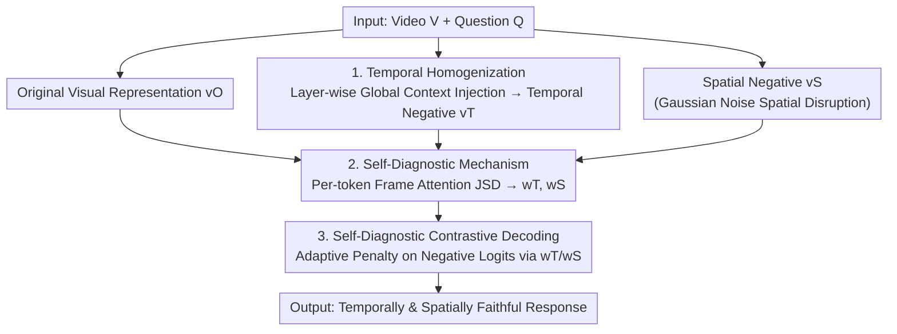

# SEASON: Mitigating Temporal Hallucination in Video Large Language Models via Self-Diagnostic Contrastive Decoding

**Conference**: CVPR 2026  
**Paper**: [CVF Open Access](https://openaccess.thecvf.com/content/CVPR2026/html/Wu_SEASON_Mitigating_Temporal_Hallucination_in_Video_Large_Language_Models_via_CVPR_2026_paper.html)  
**Code**: https://chriswu018.github.io/season/ (Project Page)  
**Area**: Video Understanding / Multimodal VLM  
**Keywords**: Video Hallucination, Temporal Hallucination, Contrastive Decoding, Training-free, Per-token Diagnosis

## TL;DR
SEASON is a **training-free** decoding method for VideoLLMs. It constructs "temporally homogenized" hard negatives that disrupt temporal information while preserving spatial structure. A per-token self-diagnostic mechanism determines whether a token is prone to temporal or spatial hallucination, adaptively applying contrastive decoding. It outperforms all training-free methods on three hallucination benchmarks without degrading general video understanding capabilities.

## Background & Motivation

**Background**: Video Large Language Models (VideoLLMs) have made significant progress in video understanding but frequently generate text inconsistent with the visual content, known as "hallucinations." Early works primarily focused on **spatial hallucinations** (describing non-existent objects/attributes), with contrastive decoding (CD) as a mainstream mitigation: subtracting logits of "corrupted visual input" from "original visual input" to cancel out biases from language priors.

**Limitations of Prior Work**: Videos possess **temporal structures** that static images lack. Directly applying image-based CD to videos may suppress spatial hallucinations but fails when the model **misinterprets event order or causality**—defined as **temporal hallucination**. Existing training-free methods have shortcomings: DINO-HEAL uses DINOv2 saliency maps to reweight features, focusing on spatial saliency while ignoring temporal order; TCD contrasts "original video" with "sparsely sampled video," but sampling merely reduces information rather than exposing causal confusion. Training-based methods (ArrowRL, TPO, RRPO) improve temporal faithfulness via RLHF or preference optimization but require expensive retraining and high-quality preference data.

**Key Challenge**: Specifically suppressing temporal and spatial hallucinations **without retraining** requires two elements missing in current literature: ① A **hard negative** that isolates temporal disruption without destroying spatial information (otherwise, the model easily identifies the negative via obvious spatial corruption, weakening the contrastive signal); ② A **per-token** diagnostic mechanism to determine if a word relies on temporal or spatial cues, as sentences contain both temporal-dependent words ("then", "after") and static-dependent words ("butter", "bowl").

**Goal**: To construct temporal hard negatives and a per-token diagnostician integrated into contrastive decoding via a two-step approach.

**Key Insight**: It is observed that **whether a token depends on temporal cues is reflected in its attention distribution over video frames**. When a video is temporally homogenized, attention for tokens relying on temporal consistency shifts drastically, while attention for static-object tokens remains nearly constant. This attention drift serves as a natural "self-diagnostic signal."

**Core Idea**: Use "temporal homogenization" to create temporal hard negatives and "per-token attention divergence" to diagnose hallucination tendencies, followed by adaptive contrastive decoding against temporal/spatial negatives.

## Method

### Overall Architecture

Given video $V=\{f_1,\dots,f_{|V|}\}$ and question $Q$, the VideoLLM (visual encoder $E_\theta$ + text decoder $D_\phi$) generates the response $y=\{y_1,\dots,y_N\}$ token-by-token. SEASON introduces three components at **inference time**: ① **Temporal Homogenization** processes original visual representations $v^O$ into a temporal negative $v^T$ (temporally confused but spatially preserved), alongside a spatial negative $v^S$ (spatially corrupted via Gaussian noise); ② A **Self-Diagnostic Mechanism** compares frame-level attention distributions across $v^O$ and negatives to calculate weights $w_T, w_S$ for each token; ③ **Self-Diagnostic Contrastive Decoding** weights the negative logits by $w_T, w_S$ and subtracts them from original logits. This zero-training pipeline can be integrated into any VideoLLM.

### Key Designs

**1. Temporal Homogenization: Creating "Temporal-Only" Hard Negatives**

Standard image-based corruption (adding Gaussian noise to frames to get $v^S$) destroys **both spatial and temporal** information, resulting in an "easy negative" that the model rejects based on obvious spatial corruption without needing to attend to temporal inconsistency. SEASON seeks a negative where spatial structure is intact but temporal variance is flattened, forcing the model to focus on temporal consistency during contrastive decoding.

This is achieved by progressively injecting "global temporal context" into each frame within the visual encoder. After a standard forward pass at layer $l$, the mean of all frame features $d_l=\frac{1}{|V|}\sum_t h'_{l,t}$ is computed. Each frame $h'_{l,t}$ is then linearly mixed with this global context: $h_{l,t}=(1-\beta)h'_{l,t}+\beta d_l$, where $h'_{l,t}=E_\theta^{(l)}(h_{l-1,t})$ is the output from the previous mixed layer and $\beta\in[0,1]$ controls the degree of homogenization. This **layer-wise accumulation** ensures that by the final layer, frames converge toward the "average of all frames," neutralizing temporal differences while maintaining patch-level spatial structures. The output $v^T=\{h_{L,t}\}_{t=1}^{|V|}$ serves as the temporal negative. Ablations (Table 3) show it significantly outperforms Average / Shuffled / Reverse baselines.

**2. Self-Diagnostic Mechanism: Per-token Hallucination Type Identification**

Different words in a sentence rely on different cues. The core insight is that **frame-level attention distribution of the preceding token $y_{i-1}$** reveals whether the current token $y_i$ is temporally or spatially dependent. Frame-level attention distributions are extracted from the multi-head attention of the $j$-th layer in text decoder $D_\phi$:

$$\mathcal{A}_\text{frame}(v)=\text{softmax}_t\Big[\sum_k\big(\sum_{j\in J}A_j\big)(y_{i-1},v_{t,k})\Big],$$

representing normalized attention across frames (summed over layers $J$, heads, and spatial tokens $k$). Drift is quantified using Jensen-Shannon Divergence (JSD):

$$D_T=\text{JSD}(\mathcal{A}_\text{frame}(v^O),\mathcal{A}_\text{frame}(v^T)),\quad D_S=\text{JSD}(\mathcal{A}_\text{frame}(v^O),\mathcal{A}_\text{frame}(v^S)),$$

and normalized to weights $w_T=\frac{D_T}{D_S+D_T}$ and $w_S=\frac{D_S}{D_S+D_T}$. High $D_T$ signifies heavy reliance on temporal cues (severe attention shift when time is flattened), indicating temporal hallucination tendency. Visualizations (Fig. 5) confirm that order-related words like "first" receive high $w_T$, while objects like "bowl" receive high $w_S$.

**3. Self-Diagnostic Contrastive Decoding: Adaptive Penalty**

Using per-token $w_T, w_S$, the contrastive decoding dynamically allocates penalties. Logits are computed under $v^O, v^S, v^T$ conditions given the context $(y_{<i},Q)$, resulting in the final distribution:

$$p_\text{SEASON}(y_i)=\text{softmax}\Big[(1+\alpha)\,\text{logits}(y_i|v^O)-\alpha\big(w_S\,\text{logits}(y_i|v^S)+w_T\,\text{logits}(y_i|v^T)\big)\Big],$$

where $\alpha$ is the contrastive strength. When $w_T$ is large, temporal negative logits are penalized more heavily, suppressing temporal hallucinations. This "self-check and targeted treatment" ensures faithfulness in both dimensions without retraining.

### Loss & Training

This is a **pure inference-time method** with no training or fine-tuning. It typically uses 8 frames for inference; self-diagnosis defaults to decoder layers $J=[20,21,22,23]$. Hyperparameters $\alpha$ and $\beta$ are determined via grid search. It is compatible with LLaVA-OV-7B, Qwen2.5-VL-7B, and LLaVA-Video-7B.

## Key Experimental Results

### Main Results

Evaluated across three hallucination benchmarks (VidHalluc, VideoHallucer, EventHallusion), two temporal understanding benchmarks (TempCompass, TVBench), and two general benchmarks (VideoMME, MVBench).

| Backbone | Method | Hallucination AVG | Temporal AVG | General AVG |
|----------|------|------|------|------|
| LLaVA-OV-7B | Base | 60.2 | 55.6 | 52.5 |
| LLaVA-OV-7B | +TCD (Training-free) | 62.6 | 55.7 | 52.4 |
| LLaVA-OV-7B | **+SEASON** | **64.3** | **56.1** | **52.7** |
| Qwen2.5-VL-7B | Base | 63.3 | 59.8 | 55.8 |
| Qwen2.5-VL-7B | +ArrowRL (**Training**) | 65.5 | 61.0 | 54.7 |
| Qwen2.5-VL-7B | **+SEASON** | **66.5** | 60.7 | **56.4** |
| LLaVA-Video-7B | Base | 59.6 | 57.5 | 55.7 |
| LLaVA-Video-7B | +RRPO (**Training**) | 61.1 | 57.8 | **56.0** |
| LLaVA-Video-7B | **+SEASON** | **61.6** | **58.8** | 55.6 |

> Note: SEASON is the only **training-free** method outperforming or matching training-based methods like ArrowRL/RRPO across backbones. It significantly improves temporal hallucination sub-tasks (e.g., +24.5% on VidHalluc TSH for LLaVA-OV). It scales effectively to LLaVA-OV-72B.

### Ablation Study

**(a) Temporal Negative Design (Table 3, combined Temporal Score)**:

| Negative Type | LLaVA-OV-7B AVG | Qwen2.5-VL-7B AVG |
|------------|------|------|
| Base (None) | 54.2 | 56.3 |
| Average | 59.9 | 58.6 |
| Shuffled | 55.0 | 59.7 |
| Reverse | 57.6 | 58.8 |
| **Homogenized (Ours)** | **61.4** | **62.0** |

**(b) Component Analysis (Table 4, Hallucination AVG)**:

| Configuration | LLaVA-OV-7B | Qwen2.5-VL-7B |
|------|------|------|
| Base | 59.0 | 63.3 |
| + Spatial Negative $v^S$ | 63.7 | 64.7 |
| + Temporal Negative $v^T$ | 63.9 | 66.2 |
| **+ SEASON (Both + Diagnostic)** | **64.4** | **66.5** |

### Key Findings
- **"Hard Negatives" are Critical**: Homogenized negatives outperform naive shuffling or reversing (+7.2% on LLaVA-OV), proving that isolating temporal disruption forces models to prioritize temporal consistency.
- **Negative Complementarity**: While $v^S$ and $v^T$ each provide gains, their combination with per-token weighted diagnosis achieves the best performance.
- **Robustness**: The mechanism is stable across various attention layers $J$ and scales well to 72B models.
- **No Performance Trade-offs**: Unlike standard CD, SEASON does not degrade general understanding because it avoids over-suppressing correct tokens.

## Highlights & Insights
- **Innovation in "Hard Negatives"**: While previous CD methods sought maximum corruption, SEASON preserves one dimension while flattening another to "distill" the contrastive signal. This fills a critical gap in transferring contrastive decoding from images to videos.
- **Attention as a Hallucination Probe**: Using attention drift as a zero-cost, interpretable diagnostic signal allows the model to differentiate between temporal and spatial cues per token.
- **Per-token Adaptation**: Avoiding stay-one-size-fits-all penalties prevents unnecessary suppression of static descriptors, explaining why general video understanding remains intact.

## Limitations & Future Work
- **Internal Access Requirement**: Requires access to the multi-head attention of the text decoder, making it incompatible with black-box API-only models.
- **Inference Overhead**: Requires multiple forward passes for $v^O, v^S, v^T$, increasing latency relative to the baseline.
- **Hyperparameter Sensitivity**: $\alpha$ and $\beta$ often require grid searches per dataset/backbone.
- **Improvement Directions**: Distilling multiple passes into a single forward pass and extending the "single-dimension negative" concept to other hallucination types (e.g., counting, spatial relations).

## Related Work & Insights
- **vs VCD / MARINE**: These target static image language biases. SEASON introduces temporal negatives and per-token diagnosis specifically for video-unique hallucinations.
- **vs TCD**: TCD compares original frames to sparsely sampled ones (information reduction); SEASON uses homogenization to isolate temporal inconsistency while retaining full information.
- **vs ArrowRL / TPO / RRPO**: These require expensive training and preference data; SEASON achieves comparable results as a plug-and-play inference method.

## Rating
- Novelty: ⭐⭐⭐⭐⭐ Filling the gaps in video CD with "hard temporal negatives" and "per-token self-diagnosis" is technically sound and transferable.
- Experimental Thoroughness: ⭐⭐⭐⭐ Extensive testing across backbones and benchmarks; slightly lower for lack of precise latency quantification.
- Writing Quality: ⭐⭐⭐⭐ Clear motivation and intuitive visualizations of attention drift.
- Value: ⭐⭐⭐⭐⭐ Training-free, compatible with 72B models; high utility for reliable video understanding in fields like autonomous driving.

<!-- RELATED:START -->

## Related Papers

- [\[CVPR 2026\] MAD: Modality-Adaptive Decoding for Mitigating Cross-Modal Hallucinations in Multimodal Large Language Models](mad_modality-adaptive_decoding_for_mitigating_cross-modal_hallucinations_in_mult.md)
- [\[CVPR 2026\] Envision, Attend, Then Respond: Counterfactual Hallucination Mitigation in Large Vision-Language Models](envision_attend_then_respond_counterfactual_hallucination_mitigation_in_large_vi.md)
- [\[CVPR 2026\] First Logit Boosting: Visual Grounding Method to Mitigate Object Hallucination in Large Vision-Language Models](first_logit_boosting_visual_grounding_method_to_mitigate_object_hallucination_in.md)
- [\[CVPR 2026\] HulluEdit: Single-Pass Evidence-Consistent Subspace Editing for Mitigating Hallucinations in Large Vision-Language Models](hulluedit_single-pass_evidence-consistent_subspace_editing_for_mitigating_halluc.md)
- [\[CVPR 2026\] Prefill-Time Intervention for Mitigating Hallucination in Large Vision-Language Models](prefill-time_intervention_for_mitigating_hallucination_in_large_vision-language_.md)

<!-- RELATED:END -->
