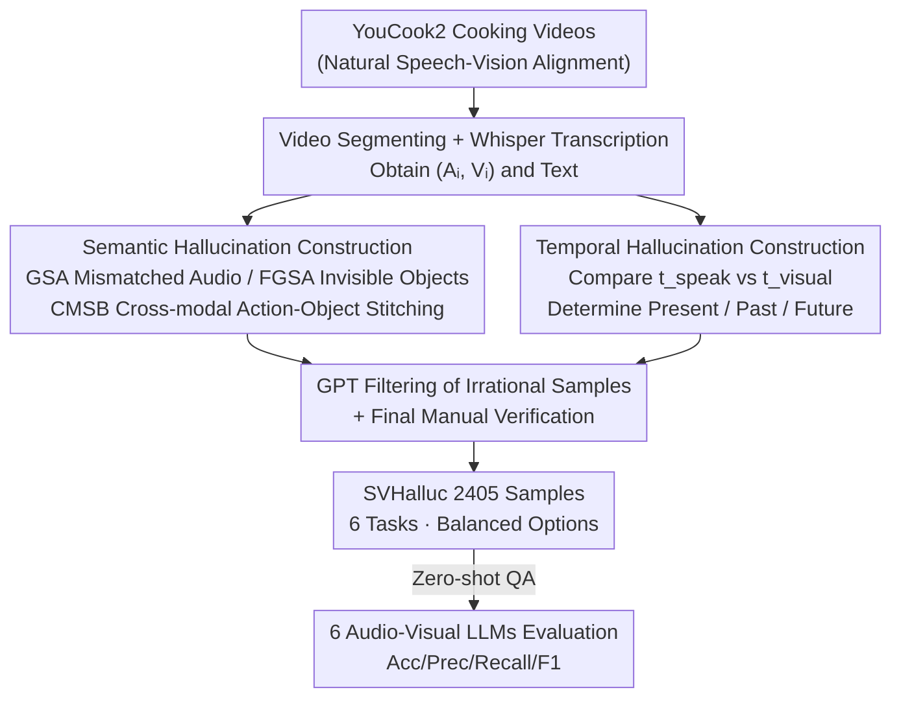

# SVHalluc: Benchmarking Speech-Vision Hallucination in Audio-Visual Large Language Models

**Conference**: CVPR 2026  
**arXiv**: [2606.02642](https://arxiv.org/abs/2606.02642)  
**Code**: Project Page https://chenshuang-zhang.github.io/projects/svhalluc/ (No open-source repository found)  
**Area**: Multimodal VLM / Hallucination Evaluation  
**Keywords**: Speech-vision hallucination, Audio-visual LLM, Cross-modal alignment, Temporal understanding, Benchmark

## TL;DR
SVHalluc is the first benchmark to systematically evaluate whether audio-visual large models can align **speech content** with corresponding visual signals. By designing 3 coarse-to-fine tasks for both semantic and temporal dimensions (6 tasks, 2405 samples total), experiments reveal that current open-source audio-visual LLMs perform near random guessing on most tasks, while Gemini 2.5 Pro leads significantly—the root cause is not poor unimodal perception, but a lack of cross-modal integration capability.

## Background & Motivation
**Background**: Audio-visual large language models (audio-visual LLMs, e.g., Qwen3-Omni, VideoLLaMA 2, Gemini 2.5 Pro) can process video and audio simultaneously and are expected to achieve real-world multimodal understanding. However, like all MLLMs, they produce "plausible but ungrounded" outputs, known as hallucinations.

**Limitations of Prior Work**: Existing audio-visual hallucination benchmarks (AVHBench, AV-Odyssey, etc.) almost exclusively use **environmental sounds** (dog barking, sirens) as indicators of whether an event occurred, reducing audio-visual understanding to questions like "Is a dog barking in the audio?" or "What is the person doing when the siren is heard?". This has two fundamental flaws: ① Environmental sounds can only indicate the occurrence of a simple event and are semantically poor; ② Environmental sounds only mark "the present moment" and cannot describe the past or future.

**Key Challenge**: Information carried by human **speech** is entirely different from environmental sounds—speech content cannot be summarized by a single sentence like "someone is speaking"; it may be an instruction, irrelevant small talk, describe the present, or discuss past/future events. This complex semantic and temporal relationship between "speech content $\leftrightarrow$ visual scene" is precisely the blind spot ignored by existing benchmarks and a new source of hallucinations.

**Goal**: Construct a benchmark to systematically diagnose "speech-induced visual hallucinations" to answer two questions: Can the model find the **semantic correspondence** between speech content and visual evidence (instead of hallucinating non-existent entities)? Can the model judge **when** the events described in the speech occur in the frame (present/past/future, instead of hallucinating events at the wrong time)?

**Key Insight**: The authors observe that speech adds two dimensions—"rich semantics" and "temporal structure"—compared to environmental sounds. Thus, they orthogonally split speech-vision hallucinations into **semantic hallucinations** and **temporal hallucinations**, designing three coarse-to-fine tasks for each to create a diagnostic suite capable of locating failure modes layer by layer.

**Core Idea**: Use controlled samples of "mismatch/cross-modal binding" to force the model to make judgments when speech and vision conflict, thereby exposing its alignment bias (the default assumption that speech describes the current frame).

## Method

### Overall Architecture
SVHalluc is essentially a benchmark consisting of two parts: the **task system** (what to evaluate) and the **data construction pipeline** (how to create samples). The task system unfolds across two complementary dimensions—semantic hallucinations (whether speech content is supported by visual evidence) and temporal hallucinations (when the described event occurs relative to the speaking time). Each dimension contains 3 coarse-to-fine diagnostic tasks, totaling 6 tasks and 2405 video-question pairs. All tasks are unified into binary or multiple-choice QA formats for zero-shot model response.

Data construction follows an automated pipeline that uses "originally aligned speech-video pairs as positive samples and generates negative samples through controlled perturbations," ensuring quality with GPT filtering and manual verification. The pipeline starts from YouCook2 cooking videos: segmenting $\rightarrow$ Whisper transcription $\rightarrow$ applying different perturbation strategies per task for positive/negative samples $\rightarrow$ GPT filtering of irrational samples $\rightarrow$ final manual verification.

### Key Designs

**1. Three Coarse-to-Fine Tasks for Semantic Hallucination: From "segment alignment" to "cross-modal mis-binding"**

The semantic dimension answers "Is the content of the speech actually in the visuals?". The authors designed three layers of progressive binary tasks. **GSA (Global Semantic Alignment)** asks "Does this speech describe the visual events in the video?". Positive samples are original aligned pairs $(A_i, V_i)$, while negative samples pair audio $A_j$ from a different video $j$ with the current video $V_i$, forming a disrupted $(A_j, V_i)$—testing if the model dares to say "unaligned" even when speech discusses boiling noodles while the visuals show frying meat. **FGSA (Fine-Grained Semantic Alignment)** lowers the granularity to the object level, asking "Can [object] be seen in the video?". Positive samples use visible objects, while negative samples use objects mentioned in speech but not visible in the frame, testing if the model hallucinations heard entities as visible. **CMSB (Cross-Modal Semantic Binding)** is the most difficult, asking "Can [event] be seen in the video?". The event is a cross-combination of "action from speech + object from vision" or "action from vision + object from speech" extracted by GPT. These events never actually happened in the frame; the correct answer is always "no"—if a model answers "yes," it indicates it incorrectly bound speech and visual fragments to hallucinate a non-existent composite event.

**2. Three Coarse-to-Fine Tasks for Temporal Hallucination: Diagnosing time misalignment using "speaking time vs. event visible time"**

The temporal dimension answers "When does the event described in the speech occur in the frame relative to the moment of speaking?". The authors annotate two time anchors for each sample: speaking time $t_{speak}$ and the time the event actually occurs in the visuals $t_{visual}$. If they are close, it is "present"; if $t_{visual}$ is much smaller than $t_{speak}$, it is "past"; if much larger, it is "future." Based on this, three tasks are set: **TA (Temporal Alignment)** is a binary question "Is the described event occurring synchronously while hearing the speech?"; **TF (Temporal Forecasting)** is a 3-choice question "Relative to the speaking time, does the event occur in (A) past (B) present (C) future?", further testing fine-grained temporal reasoning; **CMTB (Cross-Modal Temporal Binding)** is a multiple-choice question "What visual action is occurring in the frame while hearing the speech?". Here, speech deliberately acts as a distractor to test if the model can remain anchored to the currently visible action when speech describes non-simultaneous events.

**3. Automated Construction of "Original=Positive, Perturbed=Negative" + GPT/Manual Quality Control**

The reliability of the benchmark is built on sample construction. Materials are taken from the YouCook2 validation set, segmented into procedure clips, and ASR transcriptions are obtained via Whisper. Positive samples use original pairs directly; negative samples are customized for tasks: swapping audio tracks for GSA, inserting invisible objects for FGSA, cross-modal action-object stitching for CMSB, and automated labeling for temporal tasks based on the proximity of $t_{speak}$ and $t_{visual}$. GPT is utilized for extracting visible/invisible entities and filtering irrational combinations; finally, human-in-the-loop manual verification is performed. The number of options for each task is **balanced** (option-balanced), and random guessing baselines are reported for comparison.

### Loss & Training
This is a pure benchmark work; all models are evaluated **zero-shot** without training. Evaluation metrics: Binary tasks report Accuracy, Precision, Recall, and F1 (with "yes" as the positive class), where $\text{Accuracy} = \frac{\text{Correct Predictions}}{\text{Total Samples}}$ and $\text{F1} = \frac{2 \cdot P \cdot R}{P + R}$. Multiple-choice tasks report Accuracy. Analysis experiments additionally use WER and WIP for ASR capability, and mIoU for speech segment temporal localization.

## Key Experimental Results

### Main Results
6 audio-visual LLMs were evaluated. The table below shows Accuracy (Acc, %) for Semantic Hallucination:

| Model | GSA | FGSA | CMSB |
|------|-----|------|------|
| Gemini 2.5 Pro | **93.10** | **86.06** | **78.56** |
| video-SALMONN | 52.05 | 49.84 | 61.10 |
| video-SALMONN 2 | 53.92 | 79.58 | 72.77 |
| VideoLLaMA 2 | 50.00 | 67.57 | 73.03 |
| Qwen2.5-Omni | 77.70 | 81.08 | 72.28 |
| Qwen3-Omni | 55.10 | 79.50 | 74.34 |
| Random Guess | 50.00 | 50.00 | 50.00 |

Accuracy (%) for Temporal Hallucination (TF/CMTB are multiple-choice):

| Model | TA | TF | CMTB |
|------|-----|-----|------|
| Gemini 2.5 Pro | **85.17** | **53.89** | **69.25** |
| video-SALMONN | 50.00 | 32.81 | 37.39 |
| video-SALMONN 2 | 50.00 | 33.33 | 48.58 |
| VideoLLaMA 2 | 50.00 | 32.25 | 45.72 |
| Qwen2.5-Omni | 50.27 | 31.52 | 53.10 |
| Qwen3-Omni | 51.11 | 30.60 | 61.75 |
| Random Guess | 50.00 | 33.33 | 33.33 |

Key Findings: ① Open-source models perform near the random line on GSA, TA, and TF; several models show recall near 100% on GSA but low precision, indicating they **default to "speech describes the visuals"** (high alignment bias). ② Gemini 2.5 Pro leads significantly in all tasks (GSA 93.10%), proving the benchmark is solvable but challenging for current open-source models. ③ The TF 3-choice task is a struggle for all open-source models, with all performing at or below the 33.3% random line.

### Ablation Study
Analysis was performed using Qwen3-Omni under different input conditions (Acc, %):

| Configuration | Semantic Avg | Temporal Avg | Description |
|------|---------|---------|------|
| Original Qwen3-Omni | 69.64 | 47.82 | Full Video+Audio |
| + Transcription Text | 70.94 | 44.49 | Transcription added to text input |
| Video Only | 73.92 | 43.55 | No Audio |
| Audio Only | 60.03 | 41.80 | No Video |
| Random Guess | 50.00 | 38.88 | — |

### Key Findings
- **Failure root cause is not unimodal perception**: Qwen3-Omni's ASR WER on SVHalluc is only 0.0915, meaning it "hears clearly"; speech segment temporal localization mIoU reached 0.8844, meaning it "knows when someone is speaking." Both unimodal capabilities are strong, yet cross-modal integration fails—precisely pointing to "cross-modal alignment" rather than perception.
- **Transcription text is a double-edged sword**: Scores improved on FGSA and CMSB (speech as text is easier to understand), but **dropped** on CMTB—because in CMTB, speech is a temporal distractor, and feeding it as text exacerbates temporal hallucinations.
- **Unimodal ablation exposes dependency**: Removing audio for GSA/TA/TF had little effect—confirming models aren't performing true speech-vision alignment and are looking at modalities independently.

## Highlights & Insights
- **Focusing on "Speech" as a first-class citizen**: Speech semantics cannot be summarized as "someone is talking," and it inherently carries temporal indicators (past/present/future), leading to richer hallucination modes than environmental sounds. 
- **Clever "Cross-Modal Binding" in CMSB / CMTB**: Using cross-stitching of "speech action + visual object" to create physically non-existent events quantifies the model's tendency to "bind random fragments."
- **"Strong Unimodal $\neq$ Strong Cross-Modal" established**: The diagnostic chain (isolating perception vs. integration) is highly convincing and points to the fusion layer as the primary area for improvement.
- **Quantifying "Alignment Bias"**: High recall with low precision reveals the hidden bug of "blindly trusting the speech modality."

## Limitations & Future Work
- **Domain limitation**: All samples are from YouCook2 cooking videos; generalization to other scenarios (dialogue, sports, outdoors) is unknown.
- **Dependency on pseudo-labels**: Negative sample construction and visible entity extraction rely heavily on GPT and Whisper, which may propagate their own errors into the benchmark.
- **Diagnosis without mitigation**: The paper reveals failures but does not propose specific architectural or training solutions ("how to fix it").
- **Temporal thresholding**: Boundaries for past/present/future are empirical and may influence task difficulty.

## Related Work & Insights
- **Comparison to priorBenchmarks**: Unlike AVHBench or AV-Odyssey which use environmental sounds for simple binary detection, this work leverages human speech to introduce rich semantics and complex temporal relations. 
- **Methodology**: The diagnostic strategy of "unimodal capability decomposition + controlled cross-modal conflict samples" is highly reusable for other multimodal alignment evaluations.

## Rating
- Novelty: ⭐⭐⭐⭐⭐ First speech-vision hallucination benchmark; orthogonal split of semantic and temporal dimensions is precise.
- Experimental Thoroughness: ⭐⭐⭐⭐ Covers 6 models + three-layer diagnosis + unimodal ablation; complete chain, though data domain is narrow.
- Writing Quality: ⭐⭐⭐⭐⭐ Clear progression from motivation to tasks; logical structure.
- Value: ⭐⭐⭐⭐⭐ Correctly identifies the "strong perception, weak integration" bottleneck in current audio-visual LLMs.

<!-- RELATED:START -->

<!-- RELATED:END -->

## Related Papers

- [\[CVPR 2026\] AV-Reasoner: Improving and Benchmarking Clue-Grounded Audio-Visual Counting for MLLMs](av-reasoner_improving_and_benchmarking_clue-grounded_audio-visual_counting_for_m.md)
- [\[CVPR 2026\] Benchmarking Single-Factor Physical Video-to-Audio Generation](benchmarking_single-factor_physical_video-to-audio_generation.md)
- [\[CVPR 2026\] GraphVLM: Benchmarking Vision Language Models for Multimodal Graph Learning](graphvlm_benchmark_vlm_graph_learning.md)
- [\[NeurIPS 2025\] Watch and Listen: Understanding Audio-Visual-Speech Moments with Multimodal LLM](../../NeurIPS2025/multimodal_vlm/watch_and_listen_understanding_audio-visual-speech_moments_with_multimodal_llm.md)
- [\[CVPR 2026\] FAVE: A Structured Benchmark for Fine-Grained Audio-Visual Temporal Evaluation in Multimodal LLMs](fave_a_structured_benchmark_for_fine-grained_audio-visual_temporal_evaluation_in.md)

<!-- RELATED:END -->
