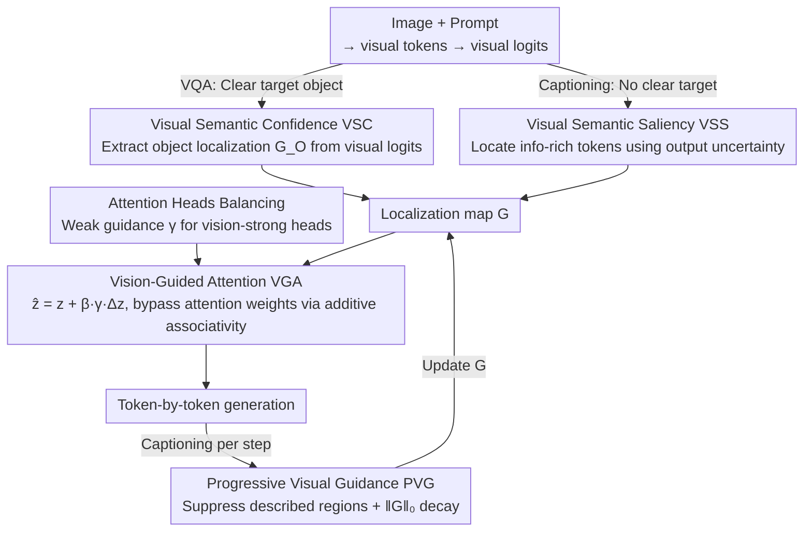

# Tell Model Where to Look: Mitigating Hallucinations in MLLMs by Vision-Guided Attention

**Conference**: CVPR2026  
**arXiv**: [2511.20032](https://arxiv.org/abs/2511.20032)  
**Code**: [github.com/beta-nlp/VGA](https://github.com/beta-nlp/VGA)  
**Area**: Hallucination Detection  
**Keywords**: Multimodal Hallucination, Visual Attention, Visual Semantic Confidence, Training-free, FlashAttention Compatible

## TL;DR
The authors propose Vision-Guided Attention (VGA), a training-free method that leverages the semantic features of visual tokens to construct precise visual localization. It guides the model's attention to relevant visual regions, effectively mitigating hallucinations in MLLMs while maintaining compatibility with FlashAttention.

## Background & Motivation
While MLLMs have made significant progress in visual understanding, they frequently produce hallucinated outputs that contradict the actual visual content. Existing de-hallucination methods are primarily divided into training-based and training-free approaches:
- **Training-based methods**: Involve constructing datasets or designing loss functions, but diminishing marginal returns occur due to the rapid iteration of model architectures.
- **Training-free methods**: These are more practical, especially those optimizing visual attention.

Limitations of Prior Work in current visual attention optimization:
1. Excessive reliance on the quality of attention itself, yet the localization capability of visual attention is inherently limited (affected by the attention sink phenomenon).
2. Introduction of computational overhead through external tools or additional forward passes.
3. Dependence on attention weights, which is incompatible with FlashAttention.

Key Insight: The model can accurately extract semantic features from visual tokens and transform them into conditional probabilities (visual logits), but it fails to fully utilize this advantage during the inference stage. This implies that the visual understanding capabilities of MLLMs are underestimated.

## Method

### Overall Architecture
The starting point of VGA is the observation that MLLMs can accurately extract semantic features of objects from visual tokens and convert them into conditional probabilities (visual logits), but this capability is underutilized during inference. Consequently, VGA follows a two-step "locate-then-guide" process and is entirely training-free. Step 1, **Construct Visual Localization**: When the target is clear (e.g., VQA), Visual Semantic Confidence (VSC) is used to extract the object distribution from visual logits. When the target is unclear (e.g., image captioning), Visual Semantic Saliency (VSS) is used to identify tokens rich in visual information. Step 2, **Guide Attention**: The localization map $G$ is used as a guiding signal superimposed on the attention output. Attention Heads Balancing is employed to prevent disrupting heads that are already proficient at processing visual information. For captioning scenarios, Progressive Visual Guidance (PVG) ensures the guidance focus shifts according to the generated content. Crucially, this injection is rewritten using the additive associativity, requiring only one forward pass per token without explicitly calculating attention weights, thus inherently supporting FlashAttention.

### Key Designs

**1. Visual Semantic Confidence (VSC): Extracting Object Localization from Visual Logits**

The localization capability of visual attention itself is unreliable due to the attention sink effect. VGA instead utilizes semantic confidence. For an object $O$, the semantic confidence of a visual token $v_i$ is $c_{v_i}(O) = \text{softmax}[\text{logit}_{v_i}(O)]$, approximated by the first token $o_0$ of object $O$. The confidence of the object relative to the entire image is obtained via max-pooling $c(O) = \max c_{v_i}(o_0)$, and the localization map is $G_O = \text{Norm}[\{c_{v_i}(o_0)\}_{i=1}^m]$. Experiments verify that VSC localization is significantly stronger than visual attention, particularly for large objects, as it is not disrupted by the attention sink.

**2. Visual Semantic Saliency (VSS): Localization for Targetless Tasks like Captioning**

While VSC requires a clear target object, tasks like image captioning do not have specific targets beforehand. VSS uses output uncertainty to measure the semantic saliency of visual tokens: $c_{v_i} = -\sum_k \log c_{v_i}(w_k) / \log K$ (entropy of Top-K tokens). Tokens with high VSS correspond to meaningful object regions, while low VSS corresponds to semantically insignificant backgrounds.

**3. Vision-Guided Attention (VGA): Bypassing Attention Weights via Additive Associativity**

To inject localization without breaking FlashAttention compatibility, VGA does not modify attention weights. Instead, it adds a guiding signal directly to the output: $\hat{z} = z + \beta \cdot \gamma \cdot \Delta z$, where $\Delta z$ is the guiding signal, $\beta$ is the guidance strength, and $\gamma$ is the attention head balancing coefficient. It utilizes additive associativity $\hat{z} = (\alpha + \beta \cdot G)V = z + \beta \cdot \Delta z$, eliminating the need to explicitly calculate attention weights and thus remaining compatible with FlashAttention.

**4. Attention Heads Balancing: Preserving Vision-Proficient Heads**

Different attention heads vary in their visual functionality. Uniform guidance would disrupt heads that are already naturally specialized in vision. VGA applies weaker guidance to heads with strong visual functionality and stronger guidance to non-visual heads. The cosine similarity between $z$ and $\Delta z$ approximates the visual functionality of a head, with guidance strength adjusted via $\gamma = \text{ReLU}(2 - H \cdot \gamma')$.

**5. Progressive Visual Guidance (PVG): Dynamically Shifting Focus during Generation**

Since captioning is generated step-by-step, previously described regions should not be repeatedly guided. PVG dynamically updates the localization $G_{t+1} = (1+\lambda)G_t - \lambda G_w$ to suppress described regions and encourage focus on areas yet to be described. As generation progresses, $\|G\|_0$ is used as a decay factor to automatically weaken guidance strength, preventing drifting logic in lengthy descriptions.

### Loss & Training
This is a completely training-free method applied only during inference. Hyperparameters include guidance strength $\beta$ and decay parameter $\lambda$.

## Key Experimental Results

### Main Results

| Dataset | Metric | VGA | Prev. SOTA | Gain |
|--------|------|-----|----------|------|
| POPE (Acc, Avg) | Accuracy | SOTA | Multiple baselines | Leading across LLaVA-7B/13B/Next and Qwen2.5-VL |
| POPE (F1, Avg) | F1 | SOTA | PAI/PAICD, etc. | Consistent improvement across models |

### Ablation Study

| Configuration | Key Metric | Description |
|------|---------|------|
| PSP only | Gain | Verification of position-timestep penalty effect |
| VGA on different MLLMs | Consistent Improvement | Strong generalizability of the method |
| VSC vs Attention Localization | Significant Dice lead | Clear advantage, especially on large objects |

### Key Findings
- Although VSC judgment accuracy is lower than the model's own response, it demonstrates correct preference (significantly exceeding 50%).
- Preference differences between VSC and model responses prove that the model's visual understanding is underutilized.
- VGA achieves SOTA in de-hallucination without adding extra forward passes (only one pass per token).

## Highlights & Insights
- Core Idea is compelling: Visual logits in MLLMs contain rich semantic localization information that is underutilized during inference.
- Elegant Design: Leveraging additive associativity to bypass attention weight calculation ensures FlashAttention compatibility.
- Attention Heads Balancing is a practical design that avoids disrupting the model's inherent visual processing heads.
- PVG provides an effective paradigm for dynamic attention guidance in captioning scenarios.

## Limitations & Future Work
- Using the first token to approximate object semantics in VSC may be imprecise, especially for multi-syllable or multi-token objects.
- Hyperparameter $\beta$ requires manual setting and may need adjustments for different models or tasks.
- Not yet combined with training-based methods; there may be room for complementary improvements.
- The decay strategy in PVG is somewhat heuristic and may lack stability for very long descriptions.

## Related Work & Insights
- Contrastive decoding methods (VCD, ICD, etc.) typically require additional forward passes to activate hallucination features.
- Attention editing methods (PAI, OPERA, etc.) rely on attention weights and are incompatible with FlashAttention.
- VGA successfully introduces visual semantic confidence as a new type of visual prior for attention guidance, an approach that can be extended to other tasks requiring precise visual localization.

## Rating
- Novelty: ⭐⭐⭐⭐⭐ VSC is a fresh concept; the FlashAttention-compatible design is highly practical.
- Experimental Thoroughness: ⭐⭐⭐⭐ Validated across multiple models and benchmarks with quantitative and qualitative analysis.
- Writing Quality: ⭐⭐⭐⭐⭐ Clear logic; transition from observation to methodological derivation is smooth.
- Value: ⭐⭐⭐⭐⭐ Training-free and FlashAttention-compatible, offering high deployment value.

<!-- RELATED:START -->

## Related Papers

- [\[CVPR 2025\] Seeing Far and Clearly: Mitigating Hallucinations in MLLMs with Attention Causal Decoding](../../CVPR2025/hallucination/seeing_far_and_clearly_mitigating_hallucinations_in_mllms_with_attention_causal_.md)
- [\[ACL 2026\] Spotlight and Shadow: Attention-Guided Dual-Anchor Introspective Decoding for MLLM Hallucination Mitigation](../../ACL2026/hallucination/spotlight_and_shadow_attention-guided_dual-anchor_introspective_decoding_for_mll.md)
- [\[CVPR 2026\] COPO: Causal-Oriented Policy Optimization for Hallucinations of MLLMs](copo_causal-oriented_policy_optimization_for_hallucinations_of_mllms.md)
- [\[CVPR 2026\] PAS: Prelim Attention Score for Detecting Object Hallucinations in Large Vision-Language Models](pas_prelim_attention_score_for_detecting_object_hallucinations_in_large_vision-l.md)
- [\[CVPR 2026\] Fighting Hallucinations with Counterfactuals: Diffusion-Guided Perturbations for LVLM Hallucination Suppression](fighting_hallucinations_with_counterfactuals_diffusion-guided_perturbations_for_.md)

<!-- RELATED:END -->
