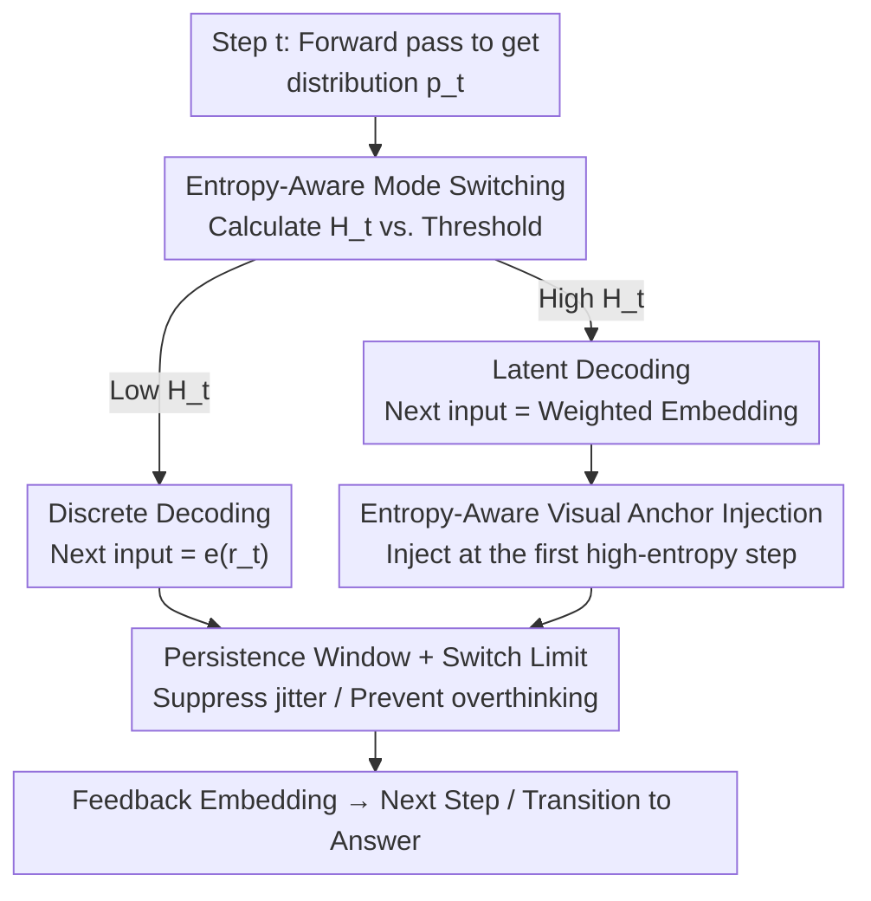

# Thinking in Uncertainty: Mitigating Hallucinations in MLRMs with Latent Entropy-Aware Decoding

**Conference**: CVPR 2026  
**Paper**: [CVF Open Access](https://openaccess.thecvf.com/content/CVPR2026/html/Xu_Thinking_in_Uncertainty_Mitigating_Hallucinations_in_MLRMs_with_Latent_Entropy-Aware_CVPR_2026_paper.html)  
**Code**: https://mlrm-LEAD.github.io/ (Project Page)  
**Area**: Multimodal VLM / Hallucination Mitigation  
**Keywords**: Multimodal Reasoning Models, Hallucination Mitigation, Entropy-Aware Decoding, Latent Superposed Reasoning, Visual Anchor Injection

## TL;DR
This paper discovers that hallucinations in Multimodal Large Reasoning Models (MLRMs) are highly concentrated around transition words like `because/however/wait`, which correspond to high-entropy (high-uncertainty) steps. Consequently, a training-free LEAD decoding strategy is proposed: at high-entropy steps, the single sampled token is replaced with "probability-weighted continuous embeddings" to preserve multiple reasoning hypotheses and inject visual anchors to reinforce visual grounding. At low-entropy steps, the model reverts to standard discrete decoding, consistently reducing hallucinations across multiple MLRMs and benchmarks.

## Background & Motivation
**Background**: Multimodal Large Reasoning Models (MLRMs) rely on test-time scaling to generate long explicit reasoning chains (causal, contrastive, self-reflective) before answering. Trained via reinforcement learning with verifiable rewards, these models show significantly enhanced reasoning in visual question answering.

**Limitations of Prior Work**: Despite stronger reasoning, MLRMs remain prone to hallucinations. Existing mitigation methods either modify visual rewards or perform data augmentation, both requiring additional training costs. Training-free contrastive decoding is cheaper but only perturbs the output distribution at the token level, **lacking an analysis of the reasoning model's inherent behavioral characteristics**.

**Key Challenge**: A critical observation by the authors is that MLRMs frequently use transition words (because, however, wait) to organize the semantic relationships of reasoning chains. These transition words **coincide with positions of highest token entropy** (Fig. 2), and the content immediately following them is most susceptible to hallucinations (Fig. 1 shows hallucination cases concentrated within 10 tokens after transition words). In other words, hallucinations are strongly correlated with "high-uncertainty reasoning crossroads." Further token masking ablations reveal that masking high-entropy tokens causes a significant drop in reasoning performance, while masking low-entropy tokens has almost no impact (Fig. 3a); moreover, earlier high-entropy tokens have a greater impact (Fig. 3b). This indicates that high-entropy tokens are the true "critical decision nodes" in the reasoning chain.

**Goal**: Without retraining the model, enable MLRMs to both preserve multiple candidate semantics (avoiding premature collapse) and pull attention back to the image (avoiding detachment from vision) during high-entropy reasoning steps to suppress hallucinations.

**Core Idea**: The root cause lies in discrete decoding, where each step collapses the entire predictive distribution $p_t$ into a single sampled token, losing the distributional information most needed at moments of uncertainty. This forces the model to perform early single-threaded explicit reasoning at crossroads. Inspired by **superposed representation theory**, the authors advocate for "constructing richer semantic representations using token probability distributions at high-entropy steps." This allows the model to pass multiple candidate reasoning hypotheses downward as continuous embeddings—the starting point for Latent Entropy-Aware Decoding (LEAD).

## Method

### Overall Architecture
LEAD is a plug-and-play, training-free decoding strategy wrapped around the autoregressive generation loop of any MLRM. Its core mechanism is **entropy-aware reasoning mode switching**: for each generated step, token-level entropy $H_t$ is used to measure current uncertainty and compared with a dynamic reference threshold $\hat{H}$:

- **Low-entropy (Certain) Step**: Performs standard **discrete decoding**, using the one-hot embedding of the sampled token $e(r_t)$ as the next input to ensure reasoning chain convergence and stable output.
- **High-entropy (Uncertain) Step**: Switches to **latent decoding**, replacing the next input with a probability-weighted embedding of the entire distribution $E_{v\sim p_t}[e(v)]$. This preserves multiple candidate semantics and avoids premature collapse. Simultaneously, a **visual anchor** is injected at the first step of a high-entropy segment to pull the model's attention back to the image.

To prevent high-frequency jitter between the two modes, a **persistence window** constrains the D→L switch, and a **maximum switch limit $C_{max}$** prevents overthinking. The final output stage still uses discrete sampling to produce the answer. The overall process is a decoding loop: "step-by-step entropy judgment → mode selection → next embedding construction":

### Key Designs

**1. Entropy-Aware Reasoning Mode Switch: Substituting Single Tokens with "Superposed Embeddings" at High-Entropy Crossroads**

This design directly addresses the issue where discrete sampling collapses the distribution into a single token, losing information during uncertainty. Token-level entropy is defined as $H_t = -\sum_v p_t[v]\log p_t[v]$. When multiple candidate tokens have similar probabilities ($p_t[v_1]\approx p_t[v_2]\approx\cdots$), entropy is high, indicating competition between reasoning paths. When a single token dominates ($p_t[v^\*]\gg p_t[v]$), entropy is low, and reasoning converges. LEAD defines the next input embedding accordingly:

$$\tilde{e}_t = \begin{cases} e(r_t), & H_t < \hat{H}\ (\text{Decreasing uncertainty}) \\ E_{v\sim p_t}[e(v)], & \text{otherwise}\ (\text{Increasing uncertainty}) \end{cases}$$

Where $E_{v\sim p_t}[e(v)]=\sum_v p_t[v]\,e(v)$ is a continuous "superposed embedding" weighted by predicted probabilities across the full vocabulary. It blends the semantics of all possible tokens back into the model, equivalent to allowing multiple reasoning hypotheses to propagate in parallel rather than gambling on a single path prematurely. The reference threshold $\hat{H}$ is not fixed: it is updated to the current entropy $\hat{H}\leftarrow H_t$ whenever the mode switches. Thus, the model adapts based on **local entropy trends** rather than a global threshold. This explains why the "dynamic threshold (∆)" outperforms any fixed threshold in ablations—a fixed high threshold locks the model into discrete CoT, while a fixed low threshold keeps it in latent mode too long to converge.

**2. Persistence Window and Max Switch Limit: Stabilizing Mode Transitions to Avoid Jitter and Overthinking**

Using only an entropy threshold introduces two engineering problems: jitter near the threshold causing frequent mode flipping, and a failure to stop switching after reasoning has converged, leading to overthinking. The authors resolve this with two gating variables. Let $m_t\in\{D,L\}$ be the current mode and $\rho_t$ be the steps stayed in the current mode. Define $g^D_t=\mathbb{1}[H_t<\hat{H}]$ and $g^L_t=\mathbb{1}[(H_t>\hat{H})\wedge(\rho_t\ge W_{D\to L})]$. The transition rule is $m_{t+1}=g^D_t D+g^L_t L+(1-g^D_t-g^L_t)m_t$. Crucially, this design is **asymmetric**: a persistence window $W_{D\to L}>0$ is set only for D→L transitions (one must stay in discrete mode for $W_{D\to L}$ steps to solidify reasoning before re-entering latent exploration), whereas L→D transitions can happen immediately once confidence returns. Additionally, a global switch counter $C_t$ with a limit $C_{max}$ (default 5) stops reasoning and forces the answer stage if exceeded. Ablations show a window size of 128 is optimal.

**3. Entropy-Aware Visual Anchor Injection: Forcing Attention Back to the Image at the Start of High-Entropy Segments**

The authors found that "high-entropy tokens with hallucinations" generally exhibit lower attention to visual features (Fig. 3d), meaning the model relies more on language priors when uncertainty is high. LEAD's countermeasure is to perform a one-time visual anchor injection only at the **first token of each high-entropy segment** (step $t^\star$), providing an initialization cue toward the visual semantic space without interfering with subsequent adaptive reasoning. Let $e_{vis}$ be the mean embedding of pre-trained special visual tokens (`<|vision_start|>`, `<|image_pad|>`, `<|vision_end|>`). The injection formula is:

$$\tilde{e}_{t^\star} = (1-\lambda)\,E_{v\sim p_{t^\star}}[e(v)] + \lambda\, e_{vis}$$

$\lambda\in[0,1]$ controls the strength of visual guidance. Ablation (Table 1) shows performance peaks at $\lambda=0.4$ across all datasets; beyond this, visual embeddings begin to overwhelm language context. This one-time injection at segment starts stabilizes visual grounding without drowning out semantic reasoning.

### Loss & Training
LEAD is **completely training-free**. It is a plug-and-play decoding strategy that does not modify any model parameters. The answer output stage still uses standard discrete sampling (greedy in examples). Default hyperparameters: $C_{max}=5$, persistence window 128, visual injection strength $\lambda=0.4$.

## Key Experimental Results

### Main Results
LEAD was integrated into 5 representative MLRMs (R1-Onevision-7B, Vision-R1-7B, VL-Rethinker-7B, VL-Cogito-7B, OpenVLThinker-7B). Evaluation covered general reasoning, hallucination, math, and science benchmarks. Using R1-Onevision-7B as an example, compared to VCD / MemVR / SID decoding methods (Table 2, excerpt):

| Method (R1-Onevision-7B) | VStar↑ | MMEval-Pro↑ | MMHalu↑ (0–6) | Bingo↑ (1–5) | POPE-R↑ |
|--------|------|------|------|------|------|
| Base | 66.5 | 69.4 | 3.52 | 3.65 | 84.6 |
| + VCD | 67.1 | 69.8 | 3.55 | 3.61 | 84.4 |
| + MemVR | 69.6 | 71.3 | 3.69 | 3.68 | 82.3 |
| + SID | 70.2 | 71.0 | 3.70 | 3.65 | 85.0 |
| **+ LEAD** | **71.2 (+4.7)** | **73.9 (+4.5)** | **3.80 (+4.7)** | **3.84 (+3.8)** | **85.9 (+1.3)** |

General reasoning and understanding improved by an average of +3.6%, while hallucination metrics MMHalu/Bingo improved by +4.7% / +3.8%. In domain-specific tasks (Table 3), math benchmark accuracy increased by +2.0% and science by +3.2% (e.g., MMK12-Bio from 40.8 → 44.8). These gains held across the other 4 MLRMs (e.g., Vision-R1-7B POPE-R from 88.0 → 91.4).

### Ablation Study

| Configuration | Key Metric | Description |
|------|---------|------|
| Dynamic Threshold ∆ (Full) | MMHalu +4.7% / +4.1% | Default LEAD, superior to any fixed threshold |
| Threshold → ∞ | Degenerates to Standard CoT | Locked in discrete reasoning, no latent exploration |
| Threshold → 0 | Increased hallucination risk | Stuck in latent reasoning, poor convergence |
| Persistence Window = 64/256/∞ | All lower than 128 | Window=128 is optimal; too large reverts to CoT |
| Visual Injection λ=0 / 0.2 / 0.6 | All lower than 0.4 | Peak at λ=0.4; too large overwhelms semantics |

### Key Findings
- **Dynamic entropy thresholds are the primary performance driver**: Fixed thresholds fail to match adaptive switching based on local entropy trends, proving that "when to explore latently" must follow contextual uncertainty.
- **Visual injection has a "sweet spot"**: $\lambda=0.4$ is optimal; larger values cause visual dominance and weaken language context, marking a balance between grounding and reasoning.
- **Reasoning is shorter yet more accurate**: On MathVision, LEAD's average reasoning length is shorter than all baselines while achieving the highest accuracy (Fig. 9). Latent reasoning merges multiple hypotheses at crossroads, saving the repeated trials used in discrete chains.
- **Text quality is preserved**: GPT-5 evaluations of grammar/fluency/naturalness and PPL show that LEAD maintains text quality while reducing hallucinations (Fig. 8).

## Highlights & Insights
- **Locating hallucinations at "Transition Words = High Entropy" is an elegant diagnosis**: The authors use correlation (Fig. 1) + entropy visualization (Fig. 2) + token masking causal ablation (Fig. 3a/b) to prove high-entropy tokens are critical nodes. The motivation is concrete and evidence-based.
- **"Superposed Embeddings" is the core trick**: Avoiding sampling at high-entropy steps and feeding back the weighted sum of the full vocabulary embedding allows multiple hypotheses to propagate in parallel, avoiding info loss from discrete collapse. This is transferable to any autoregressive reasoning model.
- **Asymmetric Persistence Window is pragmatic**: Setting a threshold for D→L but allowing immediate L→D transitions reflects the intuition: "be cautious to explore, but decisive to converge."
- Being training-free and plug-and-play with consistent gains across 5 different MLRMs makes it highly deployment-friendly.

## Limitations & Future Work
- Switching thresholds, persistence windows, $\lambda$, and $C_{max}$ are manually set hyperparameters. While defaults are provided, their sensitivity and need for tuning across different models/tasks are not fully explored.
- Probability-weighted embeddings require a weighted sum across the full vocabulary at every high-entropy step. ⚠️ While the paper claims to be "lightweight," the actual memory/latency overhead is not quantified relative to standard decoding.
- The visual anchor uses a mean embedding of pre-trained special tokens—a coarse global prior that does not utilize local visual regions relevant to the query, potentially limiting grounding.
- Evaluations focused on 7B-scale models; rules for larger/smaller scales and effectiveness on non-reasoning MLLMs require further validation.

## Related Work & Insights
- **vs. Contrastive Decoding (VCD / SID)**: These perturb the output distribution at the token level to suppress language priors but do not distinguish reasoning states; LEAD switches modes specifically at reasoning "crossroads" and outperforms both.
- **vs. MemVR (Visual Memory Re-injection)**: MemVR reinforces visual feedback but is not entropy-aware. LEAD limits injection to the start of high-entropy segments; qualitative visualization (Fig. 7a) shows LEAD assigns higher visual attention to query-relevant regions.
- **vs. Training-based Mitigation (Visual Rewards / Data Augmentation)**: Those require training costs; LEAD is a training-free, lighter alternative.

## Rating
- Novelty: ⭐⭐⭐⭐⭐ Diagnosis of "Transition words = High Entropy" + Superposed Latent Reasoning is fresh and self-consistent.
- Experimental Thoroughness: ⭐⭐⭐⭐ 5 MLRMs × Multiple benchmarks + Full ablations, though lacks memory/latency quantification.
- Writing Quality: ⭐⭐⭐⭐⭐ Logical chain from motivation to diagnosis to method is clear; effective formulas and visualization.
- Value: ⭐⭐⭐⭐⭐ Training-free, plug-and-play, stable hallucination reduction; high practical value.

<!-- RELATED:START -->

## Related Papers

- [\[CVPR 2026\] Residual Decoding: Mitigating Hallucinations in Large Vision-Language Models via History-Aware Residual Guidance](residual_decoding_mitigating_hallucinations_in_large_vision-language_models_via_.md)
- [\[CVPR 2026\] MAD: Modality-Adaptive Decoding for Mitigating Cross-Modal Hallucinations in Multimodal Large Language Models](mad_modality-adaptive_decoding_for_mitigating_cross-modal_hallucinations_in_mult.md)
- [\[CVPR 2026\] HulluEdit: Single-Pass Evidence-Consistent Subspace Editing for Mitigating Hallucinations in LVLMs](hulluedit_subspace_editing_hallucination.md)
- [\[CVPR 2026\] HulluEdit: Single-Pass Evidence-Consistent Subspace Editing for Mitigating Hallucinations in Large Vision-Language Models](hulluedit_single-pass_evidence-consistent_subspace_editing_for_mitigating_halluc.md)
- [\[CVPR 2026\] SEASON: Mitigating Temporal Hallucination in Video Large Language Models via Self-Diagnostic Contrastive Decoding](season_mitigating_temporal_hallucination_in_video_large_language_models_via_self.md)

<!-- RELATED:END -->
