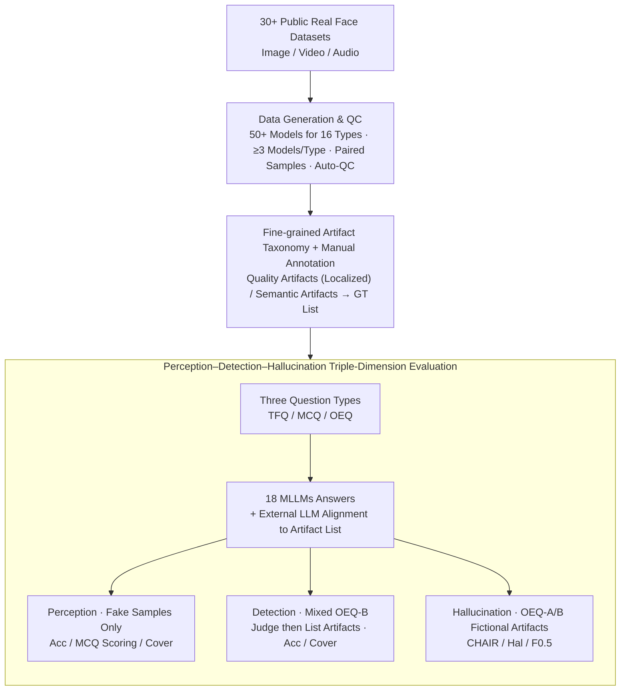

# TriDF: Evaluating Perception, Detection, and Hallucination for Interpretable DeepFake Detection

**Conference**: CVPR 2026  
**arXiv**: [2512.10652](https://arxiv.org/abs/2512.10652)  
**Code**: [https://j1anglin.github.io/TriDF/](https://j1anglin.github.io/TriDF/)  
**Area**: Hallucination Detection  
**Keywords**: DeepFake Detection, Interpretable Detection, Multi-modal Large Language Models, Hallucination Evaluation, Artifact Taxonomy

## TL;DR
This paper proposes TriDF, the first benchmark to comprehensively evaluate interpretable DeepFake detection across three dimensions: Perception, Detection, and Hallucination. Comprising 55K high-quality samples covering 16 DeepFake types and 3 modalities, it reveals the tripartite coupling relationship where accurate perception is the foundation of reliable detection, but hallucination severely undermines decision-making.

## Background & Motivation

1. **Background**: With the rapid advancement of generative models, DeepFake detection has evolved from simple binary classification to a requirement for interpretability—judging not only authenticity but also providing reasons for the verdict. Multi-modal Large Language Models (MLLMs) are increasingly utilized for interpretable DeepFake detection.

2. **Limitations of Prior Work**:
    - **Coarse-grained Annotations in Existing Datasets**: FF++, DFDC, and others only provide binary labels, failing to evaluate interpretability.
    - **Incomplete Benchmark Coverage**: DD-VQA covers only 4 forgery types, FakeBench covers 1, and LOKI covers 3; most support only the image modality, lacking cross-modal coverage.
    - **Lack of Hallucination Evaluation**: MLLMs may generate "hallucinations" (citing non-existent artifacts) when providing explanations. This is particularly dangerous in DeepFake detection, as false justifications can mislead judgment. Existing benchmarks entirely overlook this aspect.
    - **Reliance on MLLMs to Judge MLLMs**: Many benchmarks use GPT-4o to judge outputs from other models, introducing self-preference bias.

3. **Key Challenge**: Interpretable DeepFake detection requires models to simultaneously possess three capabilities—perceiving artifacts, detecting correctly, and explaining reliably—yet no unified framework exists to evaluate these three and their interdependencies.

4. **Goal**: To construct a comprehensive benchmark for interpretable DeepFake detection that unifiedly evaluates perception, detection, and hallucination to reveal their coupling relationships.

5. **Key Insight**: Starting from a human-annotated fine-grained artifact taxonomy, the authors establish quantifiable perception evaluations; pair real and fake samples to support hallucination detection; and cover three modalities (image/video/audio) and 16 DeepFake types.

6. **Core Idea**: Perception-Detection-Hallucination forms an inseparable triad for interpretable DeepFake detection, and TriDF is the first unified benchmark to evaluate all three simultaneously.

## Method

### Overall Architecture
TriDF decomposes the evaluation of whether an MLLM can trustworthily explain a DeepFake into three measurable tasks: whether it can see artifacts (Perception), whether it can make correct binary judgments after seeing them (Detection), and whether it fabricates non-existent artifacts in its explanation (Hallucination). To support these measurements, the pipeline is divided into two phases: **Data Construction**, which involves collecting face materials from public datasets, generating paired real-fake samples using 16 DeepFake techniques, and performing manual annotation based on a **fine-grained artifact taxonomy** after automatic quality control; and **Benchmark Evaluation**, which packages each sample into three types of questions (True/False, Multiple Choice, and Open-ended) for MLLMs to answer, followed by scoring via specific metrics for perception, detection, and hallucination. The benchmark ultimately covers 16 DeepFake types, 3 modalities, 55K samples, and evaluates 18 MLLMs.

### Key Designs

**1. Paired Real-Fake Data Generation and QC: Ensuring Accurate Annotation and Measurable Hallucination**

The first step is establishing solid data. TriDF collects real faces from 30+ public datasets and generates forged samples using 50+ specialized models (GAN, SD, DiT, commercial APIs, etc.). Each forgery type is generated by at least 3 different models to ensure generator diversity, with automatic quality filtering based on authenticity and consistency metrics. The 16 DeepFake types are divided into two families: **Partial Manipulation** (Face Swap, Attribute Editing, Lip Sync, Face Reenactment, Full-body Manipulation, Subject-driven Editing, Voice Conversion) and **Full Synthesis** (Audio-driven Talking Head, Identity-preserving Generation, Text-to-Human Image/Video, etc.). Pairing real and fake samples is crucial: it allows annotators to locate artifacts by comparison, and more importantly, it supports hallucination evaluation—verifying if a model "sees" artifacts in an inherently flawless real sample.

**2. Fine-grained Artifact Taxonomy: An Objective Yardstick for Perception**

To solve the problem of scoring model explanations objectively, TriDF uses a two-layer human-annotated taxonomy: **Quality Artifacts** (blur, noise, flickering, etc., which are low-level image degradations) and **Semantic Artifacts** (anatomical inconsistency, object integrity defects, unnatural prosody, etc., which require common-sense reasoning). Quality artifacts are further localized to specific parts (nose, limbs, background, etc.) to evaluate the model's localization capability. Since these annotations are entirely human-generated, the perception dimension has an objective ground truth independent of MLLM self-evaluation.

**3. Perception–Detection–Hallucination Evaluation: Decoupled Measurement with Specific Metrics**

The framework decouples these three capabilities using different sample subsets and question types. **Perception** uses only fake samples via TFQ/MCQ/OEQ-A. In MCQ, "None of the above" and multi-select options are included to increase difficulty. **Detection** uses mixed real/fake samples via OEQ-B, requiring the model to provide a binary judgment followed by supporting artifacts, scored by Accuracy and Cover (hit rate of correct artifacts). **Hallucination** is quantified by identifying fictional artifacts in OEQ-A and OEQ-B responses that do not exist in the ground truth list.

To ensure objective scoring, perception and detection use Accuracy (TFQ), Cover, and a penalty-based MCQ scoring system: with $K$ correct and $M-K$ incorrect options, selecting a correct one yields $+1/K$ while an incorrect one yields $-1/(M-K)$. Hallucination is measured by CHAIR (proportion of fictional artifacts), Hal (proportion of responses with at least one hallucination), and $F_{0.5}$. A critical penalty rule: if the model identifies zero artifacts or misclassifies a fake sample as real, CHAIR is set to 1 to prevent models from avoiding penalties by remaining silent. Alignment between free-text and the artifact list is handled by an external lightweight LLM (Gemini 1.5 Flash-Lite) to avoid self-preference bias.

## Key Experimental Results

### Main Results - Perception Evaluation (TFQ)

| MLLM | Image TFQ Avg | Video TFQ Avg | Total Avg | Rank |
|------|---------------|---------------|-----------|------|
| GPT-5 | 63.36% | 57.02% | 60.19% | 1 |
| Gemini 2.5-Pro | 61.69% | 57.58% | 59.63% | 3 |
| Qwen3-VL-30B | 61.04% | 58.65% | 59.85% | 2 |
| Claude Sonnet 4.5 | 53.57% | 51.05% | 52.31% | 14 |
| InternVL3_5-8B | 53.69% | 54.03% | 53.86% | 7 |

### Main Results - Detection + Hallucination Evaluation (Type-B OEQ)

| MLLM | Image Acc | Image Cover↑ | Image CHAIR↓ | Image F0.5↑ |
|------|-----------|-------------|--------------|-------------|
| Qwen3-Omni-30B | 0.6942 | 0.4143 | 0.6701 | 0.3381 |
| Qwen3-VL-30B | 0.6894 | 0.3661 | 0.7137 | 0.2388 |
| InternVL2_5-38B | 0.5747 | 0.2306 | 0.8066 | 0.1971 |
| GPT-4o (Proxy) | 0.6521 | 0.3422 | 0.7255 | 0.2541 |

### Key Findings
- **Perception is the foundation of detection**: Models with high perception capability (TFQ/MCQ ranks) generally show better detection performance, though it is not a sufficient condition.
- **Hallucination severely undermines decision-making**: Even with strong perception, high hallucination rates lead to unstable detection. Most MLLMs have a CHAIR > 0.5, meaning over half of their responses contain fabricated artifacts.
- **Open-source vs. Closed-source Gap**: GPT-5 ranks first in perception, but Qwen3-VL-30B performs best among open-source models. While Claude Sonnet 4.5 ranks lower in perception (14), it scores highest in MCQ (0.21), indicating higher reasoning "precision."
- **Video is harder than image**: Nearly all models perform worse on video modalities, indicating that temporal artifact recognition remains a challenge.
- **Hallucinations are pervasive**: Most models exhibit Type-A OEQ Hal > 0.9, meaning over 90% of responses contain at least one hallucinated artifact. This poses a serious threat to the credibility of interpretable detection.

## Highlights & Insights
- **Integrity of the Triadic Framework**: Unlike previous benchmarks focusing solely on accuracy or explanation quality, TriDF integrates Perception-Detection-Hallucination, revealing their inseparable nature. This framework is transferable to other XAI fields.
- **Human-annotated Artifact Taxonomy**: By avoiding MLLM self-evaluation, it establishes an objective benchmark. The two-tier design of quality and semantic artifacts is highly systematic.
- **Timely Introduction of Hallucination Evaluation**: The hallucination problem in DeepFake detection was previously ignored, but results showing Hal > 0.9 suggest current interpretable detection is far from reliable.

## Limitations & Future Work
- Artifact annotation relies on humans, which is costly and subject to inter-annotator consistency issues.
- While 55K samples is substantial, the distribution across 16 DeepFake types may be uneven, with potential data scarcity for rare types.
- The framework primarily targets static detection and does not consider interactive scenarios (e.g., follow-up questioning).
- The Cover metric only evaluates coverage, not the precision or detail of the descriptions.
- No specific suggestions or methods for mitigating hallucinations are provided.

## Related Work & Insights
- **vs FakeBench**: FakeBench covers only 1 DeepFake type and lacks hallucination evaluation; TriDF covers 16 and includes complete hallucination assessments.
- **vs LOKI**: LOKI supports multi-modal but covers only 3 types and lacks a human-annotated taxonomy.
- **vs Forensics-Bench**: Covers 10 types but its 63K samples lack perception and hallucination evaluations.
- **vs DD-VQA**: Pioneered VQA-style detection but covers only 4 types; TriDF is significantly more comprehensive.

## Rating
- Novelty: ⭐⭐⭐⭐ The tri-dimensional framework and hallucination evaluation are new contributions, though the core is a benchmark rather than a novel algorithm.
- Experimental Thoroughness: ⭐⭐⭐⭐⭐ Covers 16 types and 51 generators, evaluating 18 MLLMs.
- Writing Quality: ⭐⭐⭐⭐ Structured clearly, though some core insights could be more prominent amidst the numerous tables.
- Value: ⭐⭐⭐⭐⭐ Fills a critical gap in evaluating interpretable DeepFake detection.

<!-- RELATED:START -->

## Related Papers

- [\[CVPR 2026\] Evaluating and Easing Hallucinations for GUI Grounding](exposing_and_evaluating_hallucinations_for_gui_grounding.md)
- [\[CVPR 2026\] Lyapunov Probes for Hallucination Detection in Large Foundation Models](lyapunov_probes_for_hallucination_detection_in_large_foundation_models.md)
- [\[CVPR 2026\] Zina: Multimodal Fine-grained Hallucination Detection and Editing](zina_multimodal_fine-grained_hallucination_detection_and_editing.md)
- [\[ICML 2026\] From Out-of-Distribution Detection to Hallucination Detection: A Geometric View](../../ICML2026/hallucination/from_out-of-distribution_detection_to_hallucination_detection_a_geometric_view.md)
- [\[ICML 2026\] Automatic Layer Selection for Hallucination Detection](../../ICML2026/hallucination/automatic_layer_selection_for_hallucination_detection.md)

<!-- RELATED:END -->
