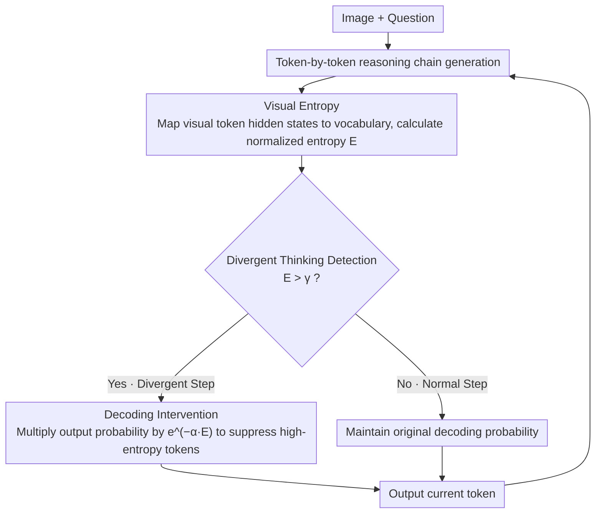

# Understanding and Mitigating Hallucinations in Multimodal Chain-of-Thought Models

**Conference**: CVPR 2026  
**arXiv**: [2603.27201](https://arxiv.org/abs/2603.27201)  
**Code**: [https://github.com/ASGO-MM/MCoT-hallucination](https://github.com/ASGO-MM/MCoT-hallucination)  
**Area**: Hallucination Detection  
**Keywords**: Multimodal Hallucination, Chain-of-Thought Reasoning, Divergent Thinking, Visual Entropy, Decoding Intervention

## TL;DR

This paper systematically analyzes the root causes of hallucinations in Multimodal CoT (MCoT) models. It discovers that hallucinations most frequently occur during reasoning steps involving associative free play (termed "divergent thinking"). Consequently, the authors propose a training-free detection and decoding intervention strategy based on visual entropy. This approach reduces CHAIRS by over 30% on Object HalBench while maintaining or even enhancing general reasoning capabilities.

## Background & Motivation

1. **Background**: Multimodal Chain-of-Thought (MCoT) models (e.g., R1-Onevision, PixelReasoner, GRIT) have become the mainstream paradigm for multimodal reasoning by significantly improving complex visual reasoning through explicit reasoning chains.
2. **Limitations of Prior Work**: MCoT models produce severe hallucinations during reasoning chain generation, yielding descriptions that contradict visual content. Existing studies (Liu et al., Tian et al.) attribute this to "visual attention decay as reasoning chains lengthen," but this is a legacy issue for LVLMs rather than an MCoT-specific discovery.
3. **Key Challenge**: Traditional LVLMs employ implicit reasoning (direct answers), while MCoT utilizes explicit reasoning (thinking before answering). There are fundamental differences in their reasoning processes. Do MCoT models possess unique hallucination causes?
4. **Goal**: (1) Identify the root cause of hallucinations unique to MCoT models; (2) Design training-free methods to locate and mitigate these hallucinations.
5. **Key Insight**: Drawing from cognitive science concepts of "divergent thinking vs. normal thinking," associative reasoning steps are collectively defined as divergent thinking. After segmenting and labeling reasoning chains, it was found that hallucinations are concentrated in divergent thinking steps (roughly 5 times more than in normal steps).
6. **Core Idea**: Use visual entropy to quantify the model's internal confidence in visual inputs. High-entropy steps denote divergent thinking. High-entropy tokens are dynamically penalized during decoding.

## Method

### Overall Architecture

Ours aims to address the issue of MCoT models becoming "increasingly irrational" when generating reasoning chains: once the model enters associative free play, it is prone to writing content that contradicts the image. The strategy involves real-time "lie detection" for each step during reasoning. Given an image and a question, the model generates tokens normally, but for each token, **visual entropy** is calculated to judge if it has detached from visual evidence. If the visual entropy exceeds a threshold $\gamma$, it is identified as a divergent thinking step, and the decoding probabilities of high-entropy tokens are immediately penalized to pull the model back to the image. This entire process does not modify model weights, applies only to the inference phase, and pre-calculates visual token probabilities during the prefill stage to avoid additional latency.

### Key Designs

**1. Visual Entropy: A scalar to quantify "image consultation"**

The root of hallucinations lies in the model's reliance on internal associations over visual evidence during divergent thinking. A signal is needed to reflect "the model's current grasp of visual input" per token. Visual entropy maps the hidden states of visual tokens back to the vocabulary through the language head to obtain a visual activation probability distribution $\mathbf{p}_v(y_t) \in \mathbb{R}^m$ for the current predicted token $y_t$ (where $m$ is the number of visual tokens). Its normalized entropy is then calculated as $E(y_t, v) = -\frac{\sum_{i=1}^m p_{v,i}(y_t) \log p_{v,i}(y_t)}{\log m}$, scaled to $[0,1]$. Higher entropy indicates more divergent visual evidence. Using visual entropy for logistic regression to classify divergent vs. normal steps yields a McFadden pseudo-$R^{2}$ exceeding 0.9, proving it captures the essence of these steps.

**2. Divergent Thinking Detection: Reusing existing representations with zero extra forward passes**

With visual entropy, detection becomes a simple threshold check. $E(y_t, v)$ is computed for each reasoning step; if it exceeds $\gamma$ (default $0.5$), the step is flagged as divergent thinking. Crucially, this does not require external labels or extra forward passes, as it uses existing visual token representations, incurring no additional inference overhead.

**3. Decoding Intervention: Exponential penalty on high-entropy tokens**

Once divergent thinking is detected, the model must be pulled back to visual evidence without the cost of double forward passes associated with contrastive decoding. The probability distribution is modified directly: the output probability for a divergent step is multiplied by a decay factor based on visual entropy:

$$\hat{p}_t(\cdot \mid v, q, y_{<t}) = p_t(\cdot \mid v, q, y_{<t}) \cdot e^{-\alpha \cdot E(\cdot, v)}$$

where $\alpha = 0.75$ controls penalty strength. Tokens with higher visual entropy are exponentially suppressed, encouraging the model to favor outputs grounded in the image. Since visual token probabilities are pre-computed during prefill, this adds almost zero overhead.

### Loss & Training

This method is entirely training-free and introduces no additional training stages. The hyperparameters $\gamma = 0.5$ and $\alpha = 0.75$ were experimentally validated to be transferable across models.

## Key Experimental Results

### Main Results

| Model | Method | CHAIRS↓ | CHAIRI↓ | POPE Random Acc↑ | POPE Adv Acc↑ | POPE Pop Acc↑ |
|------|------|---------|---------|------------------|---------------|---------------|
| GRIT-3B | Baseline | 23.8 | 10.5 | 78.1 | 77.5 | 78.6 |
| GRIT-3B | +FlexAC | 19.2 | 7.4 | 79.8 | 79.0 | 79.6 |
| GRIT-3B | **+Ours** | **16.0** | **5.5** | **81.0** | **79.8** | **80.6** |
| PixelReasoner-7B | Baseline | 22.0 | 7.8 | 85.5 | 82.3 | 84.3 |
| PixelReasoner-7B | **+Ours** | **15.4** | **5.3** | **87.3** | **84.3** | **86.5** |
| R1-Onevision-7B | Baseline | 23.2 | 9.4 | 81.2 | 78.5 | 80.4 |
| R1-Onevision-7B | **+Ours** | **15.8** | **5.7** | **83.5** | **81.6** | **82.2** |

### Ablation Study

| Configuration | CHAIRS↓ | POPE Adv Acc↑ | Description |
|------|---------|---------------|------|
| Full ($\gamma$=0.5, $\alpha$=0.75) | 15.8 | 81.6 | Complete model |
| w/o Detection (Global) | ~18.0 | ~80.0 | No distinction between steps |
| w/o Intervention | 23.2 | 78.5 | Detection only, no correction |
| + DoLa | ~14.5 | ~82.0 | Compatible with DoLa |
| + VCD  | ~14.8 | ~82.5 | Compatible with VCD |

### Key Findings

- **Divergent thinking is the core issue**: The hallucination rate is ~5x higher than normal thinking, and there is a high correlation between hallucinations in the thinking and answering phases ($\rho > 0.96$, $R^{2} > 0.92$).
- **Severe attention bias**: During answer generation, models allocate less than 0.04 of their attention to image tokens, biasing heavily toward the reasoning chain.
- **Plug-and-play capability**: Ours seamlessly integrates with DoLa, VCD, MemVR, and FlexAC for further gains.
- **Universal hyperparameters**: $\gamma = 0.5$ and $\alpha = 0.75$ work across GRIT, PixelReasoner, and R1-Onevision without fine-tuning.

## Highlights & Insights

- **Cognitive science perspective**: Adopting the "divergent vs. convergent thinking" framework provides a clear theoretical anchor for analyzing MCoT behavior.
- **Visual entropy as a three-in-one metric**: A single index detects divergence, guides intervention, and stacks with other methods—highly elegant design.
- **Training-free and low overhead**: Pre-calculating visual token probabilities avoids the double forward-pass penalty of contrastive decoding.
- **Transferable logic**: The visual entropy concept can transfer to other modalities (e.g., audio-language models) using modal-conditioned uncertainty.

## Limitations & Future Work

- Labeling for divergent thinking relies on GPT-5 and human verification, which is subjective and requires re-labeling for new models.
- $\gamma$ and $\alpha$ may need adjustment in extreme scenarios (e.g., medical imaging).
- Validation is limited to 3 MCoT models; performance on 70B+ scales remains unknown.
- Visual entropy depends on the number of visual tokens $m$, which may vary with resolution or tokenization.
- Future work could explore using visual entropy as a training signal (rather than just inference) during SFT/RLHF.

## Related Work & Insights

- **vs. DoLa/VCD (Contrastive Decoding)**: These methods suppress hallucinations via logit comparison but require extra forward passes. Ours utilizes pre-computed visual probabilities with zero additional overhead.
- **vs. MemVR (Memory Augmentation)**: MemVR addresses attention decay via visual memory; Ours addresses "divergent thinking," making them complementary.
- **vs. FlexAC (Attention Control)**: FlexAC manipulates attention weights; Ours intervenes at the probability distribution level, proving more lightweight.

## Rating

- Novelty: ⭐⭐⭐⭐ The divergent thinking + visual entropy framework is novel, though intervention techniques are straightforward.
- Experimental Thoroughness: ⭐⭐⭐⭐⭐ Comprehensive validation across 3 models, multiple benchmarks, and 5 baseline combinations.
- Writing Quality: ⭐⭐⭐⭐ Logical flow from problem discovery to causal analysis and solution.
- Value: ⭐⭐⭐⭐ Provides a theoretical perspective and a practical, plug-and-play tool for MCoT hallucination research.

<!-- RELATED:START -->

## Related Papers

- [\[CVPR 2026\] Grounded Chain-of-Thought for Multimodal Large Language Models](grounded_chain-of-thought_for_multimodal_large_language_models.md)
- [\[CVPR 2026\] Understanding the Role of Hallucination in Reinforcement Post-Training of Multimodal Reasoning Models](understanding_the_role_of_hallucination_in_reinforcement_post-training_of_multim.md)
- [\[CVPR 2026\] HulluEdit: Single-Pass Evidence-Consistent Subspace Editing for Mitigating Hallucinations in Large Vision-Language Models](hulluedit_single-pass_evidence-consistent_subspace_editing_for_mitigating_halluc.md)
- [\[CVPR 2026\] Mitigating Multimodal Hallucinations via Gradient-based Self-Reflection](mitigating_multimodal_hallucinations_via_gradient-based_self-reflection.md)
- [\[CVPR 2026\] MAD: Modality-Adaptive Decoding for Mitigating Cross-Modal Hallucinations in Multimodal Large Language Models](mad_modality-adaptive_decoding_for_mitigating_cross-modal_hallucinations_in_mult.md)

<!-- RELATED:END -->
