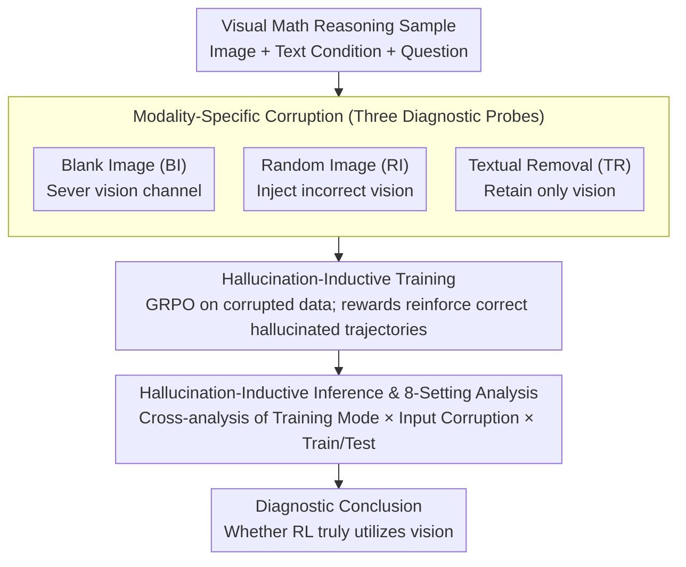

# Understanding the Role of Hallucination in Reinforcement Post-Training of Multimodal Reasoning Models

**Conference**: CVPR 2026  
**arXiv**: [2604.03179](https://arxiv.org/abs/2604.03179)  
**Code**: None  
**Area**: Hallucination Detection  
**Keywords**: Multimodal Reasoning, Reinforcement Post-Training, Hallucination Analysis, GRPO, Modality Corruption

## TL;DR

This paper proposes the Hallucination-as-Cue analysis framework to systematically investigate the actual mechanism of RL post-training in multimodal reasoning models through three modality-specific corruption strategies (Blank Image, Random Image, and Textual Removal). It finds that GRPO training significantly improves reasoning performance even under 100% corrupted visual input, challenging the mainstream assumption that "RL training effectively utilizes visual information."

## Background & Motivation

1. **Background**: inspired by the success of text-based reasoning LLMs like DeepSeek-R1, numerous works have applied RL post-training methods such as GRPO to multimodal LLMs (e.g., Qwen2.5-VL), achieving significant gains in tasks like visual mathematical reasoning.
2. **Limitations of Prior Work**: although RL post-training boosts benchmark scores, no existing work systematically studies whether these improvements stem from Genuine visual understanding or merely reinforced textual reasoning capabilities. Current RL rewards are based solely on the correctness of the final answer, regardless of whether the model utilized visual information correctly.
3. **Key Challenge**: if RL training primarily reinforces textual reasoning patterns rather than visual perception, current investments in this direction may be inefficient—models might simply be learning to "guess the answer" rather than "reason through the image."
4. **Goal**: to design a systematic diagnostic framework to quantitatively answer whether "RL post-training truly utilizes visual information."
5. **Key Insight**: to treat hallucination as a "diagnostic cue" rather than a defect to be eliminated, exposing the true training mechanism by intentionally inducing hallucinations.
6. **Core Idea**: design three modality-specific corruptions (Blank Image/Random Image/Textual Removal) applied at both training and inference stages, comprehensively analyzing RL training dynamics through eight setting combinations.

## Method

### Overall Architecture

The goal of this paper is not to train a stronger multimodal reasoning model, but to answer a diagnostic question: when performing RL post-training with GRPO on models like Qwen2.5-VL and benchmark scores increase, do these gains come from "truly understanding the image" or "reinforcing reasoning patterns in the text." The authors invert the view of hallucination from a flaw to a probe (**Hallucination-as-Cue**): they intentionally inject modality-specific "fake information" into the input to see if the model can still improve—if performance increases despite visual destruction, it suggests the model never relied much on vision.

The full framework corresponds to the three stages in Figure 2: designing **modality-specific corruptions** (three probes) → feeding corrupted data to GRPO for **hallucination-inductive training** → evaluating combinations of "hallucination-inductive training × corrupted evaluation input × training/test set" across **8 settings (S1–S8)** to identify what RL training actually reinforces. The three corruptions target different modality channels and serve as mutual controls, forming the core of the diagnosis.

### Key Designs

**1. Modality-Specific Corruption: Three Diagnostic Probes Targeting Different Channels**

This is the entry point of the framework, directly addressing the suspicion that models ignore vision. The authors designed three orthogonal corruptions to disrupt different information channels:

- **Blank Image (BI)**: replaces all images in training/testing with blank ones, completely severing the visual channel and forcing the model to reason solely from textual conditions. The logic is definitive: if RL training still improves performance without any vision, it proves these gains do not require vision and that RL reinforces textual reasoning.
- **Random Image (RI)**: replaces each image with another random image from the dataset, creating mismatched pairs. This is more severe than BI—the model lacks correct vision and faces interference from an irrelevant image. Effectiveness under RI suggests the model has learned to actively ignore vision and rely on text.
- **Textual Removal (TR)**: removes variable conditions and question descriptions using rule matching, leaving only template instructions and the image. This serves as a counter-probe—if RL truly utilizes vision, TR training should perform best since visual cues (values, arrows) are the only remaining information source.

**2. Hallucination-Inductive Training: GRPO on Corrupted Data with "Hallucination-Inductive Rewards"**

This step explains the counter-intuitive phenomenon where performance rises despite corrupted inputs. The mechanism lies in GRPO’s rule-based reward, which only considers final answer correctness. When inputs are corrupted, most sampled rollouts are hallucinations, but a **small subset of hallucinated trajectories happens to be correct** (by chance or inherent bias) and receives positive rewards—termed **hallucination-inductive rewards**. GRPO then increases the probability of these trajectories, and the model learns to derive answers from corrupted inputs plus hallucinated reasoning chains.

**3. Hallucination-Inductive Inference & 8-Setting Analysis Matrix**

To pinpoint whether RL reinforces text or vision, the authors crossed "hallucination-inductive training × corrupted input × training/test set" into 8 settings (S1–S8). S1–S2 are baselines on clean data; S3–S4 examine how normally trained models handle corruption; S5–S6 test hallucination-trained models on clean data; S7–S8 check if they outperform normal models under corruption. This systematic comparison allows the authors to decompose ambiguous gains into measurable controls.

### Loss & Training

The three corruptions are applied within standard GRPO, with the only variable being input corruption. GRPO uses group-normalized advantages $A_i = \frac{R_i - \mu_{group}}{\sigma_{group} + \epsilon}$ instead of a value network, following PPO-style clipped surrogates with a KL penalty. Training involves 15 episodes, rollout size of 5, temperature of 0.7, KL weight of 0.01, and a learning rate of $1 \times 10^{-6}$. Rewards are purely rule-based based on answer correctness.

## Key Experimental Results

### Main Results

| Model | Training Method | MathVision | MathVerse | MathVista | WeMath | AVG |
|------|----------|------------|-----------|-----------|--------|-----|
| Qwen2.5-VL-3B | Base | 18.19 | 34.82 | 51.40 | 54.48 | 39.72 |
| Qwen2.5-VL-3B | +GRPO | 22.73 | 37.72 | 58.40 | 60.11 | 44.74 |
| Qwen2.5-VL-3B | +GRPO-BI | 20.95 | 35.10 | 56.40 | 56.55 | 42.25 |
| Qwen2.5-VL-3B | +GRPO-RI | 20.86 | 35.76 | 58.00 | 55.17 | 42.45 |
| Qwen2.5-VL-7B | Base | 27.70 | 45.20 | 67.00 | 63.68 | 50.89 |
| Qwen2.5-VL-7B | +GRPO | 28.13 | 47.56 | 70.00 | 68.39 | 53.52 |
| Qwen2.5-VL-7B | +GRPO-BI | 28.39 | 48.86 | 68.50 | 66.84 | 53.15 |
| Qwen2.5-VL-7B | **+GRPO-RI** | **27.27** | **49.90** | **71.40** | **68.33** | **54.23** |

### Ablation Study

| Setting | Training Data | MathVision | MathVerse | MathVista | WeMath | AVG |
|------|----------|------------|-----------|-----------|--------|-----|
| GRPO | Geometry3K | 22.73 | 37.72 | 58.40 | 60.11 | 44.74 |
| GRPO | MMR1-V0 | 26.18 | 39.26 | 65.00 | 62.47 | 48.23 |
| GRPO | CLEVR | 23.06 | 35.96 | 58.20 | 55.75 | 43.24 |
| GRPO-BI | Geometry3K | 20.95 | 35.10 | 56.40 | 56.55 | 42.25 |
| GRPO-BI | MMR1-V0 | 24.28 | 40.03 | 61.20 | 61.61 | 46.78 |
| GRPO-BI | CLEVR | 21.51 | 35.05 | 58.20 | 54.20 | 42.24 |

### Key Findings

- **Most Surprising Finding**: the 7B model trained with random images (GRPO-RI) reached an AVG of 54.23%, **outperforming regular GRPO (53.52%)**. This implies training with entirely wrong images can actually be better.
- **BI Inference Anomaly in MathVision**: the 3B base model saw accuracy rise from 18.19% to 18.91% (+0.72%) under BI inference, suggesting visual information might actually interfere with small model reasoning.
- **Model Scaling Effect**: larger models benefit more from hallucinated trajectories—the gap between GRPO-BI/RI and regular GRPO is much smaller for the 7B model compared to the 3B model.
- **TR not superior to BI/RI**: even though TR retains visual cues, its performance is similar to BI, confirming that current RL training fails to effectively utilize visual information.
- **Vision Intensive Problems Suffered Most**: accuracy for Vision Intensive problems dropped by 20-26% under BI inference, while Text Dominant problems only dropped by 4-7%.

## Highlights & Insights

- **Impactful Counter-Intuitive Discovery**: the fact that training with incorrect images outperforms correct images is not just an interesting observation but a profound critique of the current multimodal RL training paradigm.
- **Reusable Diagnostic Framework**: the "Hallucination-as-Cue" approach of converting a "flaw" into a "signal" can be migrated to other scenarios, such as diagnosing text reliance in speech models using noisy audio.
- **Systematic 8-Setting Matrix**: the combination of training × inference × corruption ensures comprehensive coverage and reliable conclusions.

## Limitations & Future Work

- Only studies the GRPO algorithm; behaviors of PPO, DPO, or other RL methods might differ.
- Experiments are limited to Qwen2.5-VL 3B and 7B scales; it is unclear if larger models (72B) still rely heavily on textual priors.
- Training data is focused on visual math; generalizability to natural image VQA or video reasoning remains unknown.
- The paper focuses on diagnosis rather than proposing specific solutions to force visual utilization in RL.
- Future work could explore modality-aware reward designs (e.g., rewards based on visual grounding quality).

## Related Work & Insights

- **vs. DeepSeek-R1 / OpenAI-o1**: the success of text-only reasoning models suggests that reasoning ability may primarily reside in the language module; this paper validates this hypothesis in a multimodal context.
- **vs. Ma et al. (2603.27201)**: focuses on mitigating hallucinations during inference in MCoT models, whereas this work examines the role of hallucinations during training—they complement each other as "how to reduce" vs. "why it helps training."
- **vs. concurrent work**: while some works show models retain accuracy without images during inference, this paper shows that image removal during the training phase has even more far-reaching effects.

## Rating

- Novelty: ⭐⭐⭐⭐⭐ High; redefining hallucination as a diagnostic tool is innovative.
- Experimental Thoroughness: ⭐⭐⭐⭐⭐ Extensive matrix across 2 scales, 3 corruptions, and 5 benchmarks.
- Writing Quality: ⭐⭐⭐⭐ Clear logic, though some charts are highly dense.
- Value: ⭐⭐⭐⭐⭐ Significant warning for multimodal RL research; likely to influence future directions.

<!-- RELATED:START -->

## Related Papers

- [\[CVPR 2026\] Understanding and Mitigating Hallucinations in Multimodal Chain-of-Thought Models](understanding_and_mitigating_hallucinations_in_multimodal_chain-of-thought_model.md)
- [\[NeurIPS 2025\] Reasoning Models Hallucinate More: Factuality-Aware Reinforcement Learning for Large Reasoning Models](../../NeurIPS2025/hallucination/reasoning_models_hallucinate_more_factuality-aware_reinforcement_learning_for_la.md)
- [\[NeurIPS 2025\] Generalization or Hallucination? Understanding Out-of-Context Reasoning in Transformers](../../NeurIPS2025/hallucination/generalization_or_hallucination_understanding_out-of-context_reasoning_in_transf.md)
- [\[ICLR 2026\] Mechanistic Detection and Mitigation of Hallucination in Large Reasoning Models](../../ICLR2026/hallucination/mechanistic_detection_and_mitigation_of_hallucination_in_large_reasoning_models.md)
- [\[CVPR 2026\] Zina: Multimodal Fine-grained Hallucination Detection and Editing](zina_multimodal_fine-grained_hallucination_detection_and_editing.md)

<!-- RELATED:END -->
