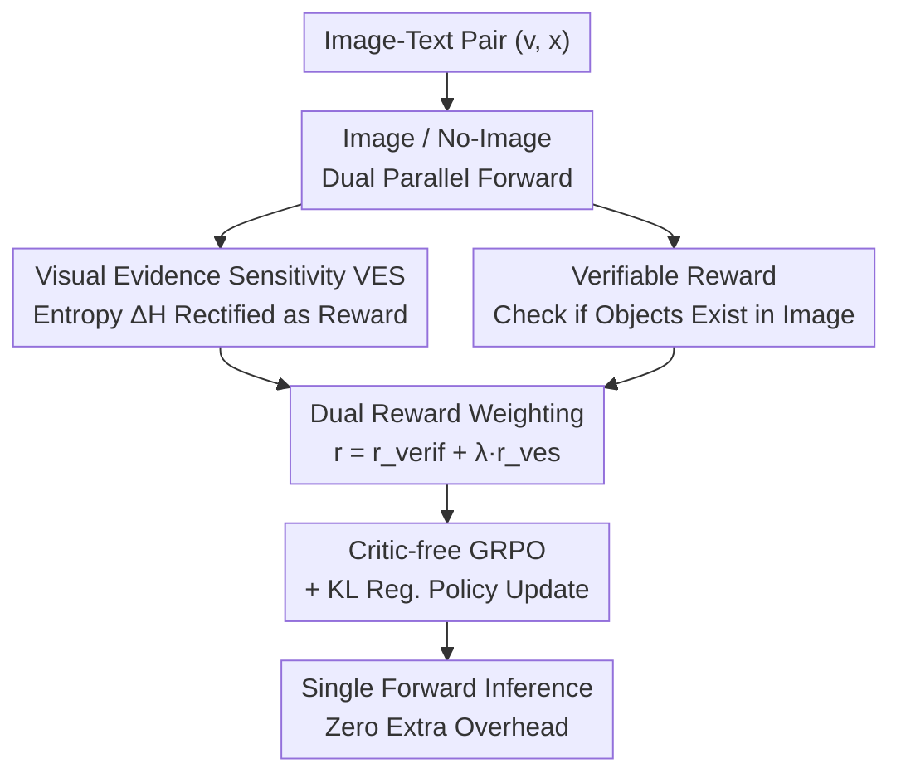

# VES-RFT: Rewarding Visual Evidence Sensitivity to Mitigate Hallucinations in Large Vision-Language Models

**Conference**: CVPR 2026  
**Paper**: [CVF Open Access](https://openaccess.thecvf.com/content/CVPR2026/html/Hou_VES-RFT_Rewarding_Visual_Evidence_Sensitivity_to_Mitigate_Hallucinations_in_Large_CVPR_2026_paper.html)  
**Area**: Multimodal VLM / Hallucination Mitigation / Reinforcement Fine-Tuning  
**Keywords**: Object Hallucination, Visual Evidence Sensitivity, Reinforcement Fine-Tuning, GRPO, Verifiable Rewards

## TL;DR
VES-RFT defines the "change in model decision entropy before and after providing an image" as a label-free Visual Evidence Sensitivity (VES) reward. Combined with a verifiable reward that automatically checks whether generated objects actually exist in the image, the model is jointly optimized using critic-free GRPO. This allows the VLM to learn to be "confident because it saw the image" rather than "blindly confident based on language priors," significantly reducing object hallucinations on POPE / CHAIR / AMBER with minimal training data and zero additional inference overhead.

## Background & Motivation
**Background**: Large Vision-Language Models (VLMs, such as LLaVA-1.5, Qwen2.5-VL) can process images alongside text, but object hallucination (confidently asserting the existence of non-existent objects) remains a persistent issue. Existing mitigation strategies broadly fall into two categories: **Retraining/Fine-tuning**, which uses supervised signals with hallucination labels or late-stage visual feature re-injection at a high training cost; and **Inference-time intervention**, which keeps the model frozen and suppresses tokens without visual support during testing using methods like Contrastive Decoding (VCD) or Mutual Information Maximization (M3ID), with the drawback of requiring additional forward passes for every inference.

**Limitations of Prior Work**: The authors point out a neglected fundamental issue—the disconnect between the model's "confidence" and its "actual usage of the image." Two empirical phenomena illustrate this: ① The co-occurrence frequency of different objects in pre-training corpora is highly skewed, leading the model to learn strong text-only priors. ② Leading prompts like "describe this image in detail" further push the model toward these priors, causing tokens later in the sequence to be increasingly dominated by language priors. A direct diagnostic is that **even if the image is removed ($v=\emptyset$), the model's prediction distribution for the answer often remains sharp and confident**, indicating its certainty stems from text statistics rather than visual evidence.

**Key Challenge**: Inference-time intervention methods "diagnose" low visual support states but do not update parameters to actively avoid them, and they require extra computation. Retraining methods "bake" visual faithfulness into the model, but rewards are typically discrete, offline preference labels that are decoupled from the model's own predictive uncertainty. Neither approach transforms the metric of "whether the image actually reduced decision uncertainty" into a **trainable** objective.

**Key Insight**: The authors adopt a counterfactual perspective—if the model is truly using the image, how should its uncertainty change? By fixing the query, decoding, and parameters, and comparing "image" versus "no-image" conditions: an ideal grounded model should **decrease** task-related decision uncertainty when an image provides valid evidence; otherwise, uncertainty should remain constant or increase if the image conflicts with text priors or is uninformative. In other words, confidence should stem "from the image" rather than "from text co-occurrence."

**Core Idea**: Transform the entropy difference between "with-image" and "no-image" conditions from a diagnostic metric into a **learnable reward**—Visual Evidence Sensitivity (VES). This is paired with a **verifiable reward** that automatically checks object existence. Both are jointly optimized during training using GRPO to reshape the model's decision habits regarding "when to be confident" from the source, while maintaining a single forward pass during inference.

## Method

### Overall Architecture
VES-RFT is a **model-agnostic, inference-zero-overhead** reinforcement fine-tuning framework that sits atop a supervised checkpoint. For each image-text pair $(v, x)$, two forward passes are run during training: one with the image and one with the image tokens masked (no-image control). The VES reward (entropy reduction provided by the image) is calculated from the two predictive distributions; simultaneously, a frozen validator checks if the generated object mentions are truly in the image to obtain a verifiable reward. These are weighted into a total reward for policy updates via critic-free GRPO. During inference, only the single forward pass with the image is executed, introducing no additional modules or computation.

### Key Designs

**1. Visual Evidence Sensitivity (VES): Turning "Entropy Change" into a Trainable Signal**

To address the core issue where models are confident but don't necessarily use the image, the authors define a task-related low-dimensional decision variable $z$ (e.g., yes/no in POPE, or a Bernoulli set of object occurrences in CHAIR/AMBER). They then measure the difference in predictive entropy of $z$ between the image and no-image conditions:

$$\Delta H(x, v) \triangleq H\big(p_\theta(z \mid x, v=\emptyset)\big) - H\big(p_\theta(z \mid x, v)\big)$$

where $H(p) = -\sum_i p_i \log_i$ is the Shannon entropy. $\Delta H > 0$ implies the distribution becomes sharper after adding the image, indicating certainty gain from visual evidence. The authors provide an information-theoretic interpretation: in an ideal Bayesian setting, the information gain from the image is the conditional mutual information $I(Z; V \mid X=x) = H(Z \mid X=x) - H(Z \mid X=x, V)$. Maximizing this is equivalent to maximizing the KL divergence between the with-image posterior and the text-only prior. Since calculating full KL on large spaces is expensive, **$\Delta H$ serves as a computationally cheap symmetric proxy for this mutual information**, grounding the abstract concept of "visual dependency" into an optimizable scalar.

**2. VES Reward: Rectified to Reward "Certainty from Images"**

Directly using $\Delta H$ as a reward can be unstable or negative. The authors use a monotonic shaping function $\phi: \mathbb{R} \to \mathbb{R}_{\geq 0}$, typically a rectifier:

$$r_{\mathrm{ves}}(v, x, y) = \max\{0, \Delta H(x, v)\}$$

This preserves the ranking of entropy gains while clipping negative values to zero—only when "the image tightens the decision distribution" is a positive score awarded. Intuitively, this acts as a single-sample proxy for conditional mutual information: the reward is high when observing $v$ makes $Z$ significantly more predictable given $X=x$. This reward is **label-free**, requiring only an extra no-image forward pass.

**3. Verifiable Reward: Preventing "Confidently Incorrect" Degeneracy**

VES reward alone is insufficient, as the model could become "confidently wrong," gaining reward by reducing entropy while providing incorrect answers. The authors add a complementary verifiable reward that scores the semantic correctness of the answer. Given $(x, v, y)$, a task-related **frozen** validator $V$ maps the answer to $[0,1]$:

$$r_{\mathrm{verif}}(v, x, v, y) = V(x, v, y), \quad r_{\mathrm{verif}} \in [0, 1]$$

For closed-form QA, normalized exact/soft matching is used; for multiple-choice, gold option indicators are used; for open-ended captioning, object-level consistency scoring is used between extracted mentions and reference annotations. The validator is shared and frozen between training and evaluation to prevent reward hacking. The framework is **validator-agnostic**, allowing for open-vocabulary detectors or smaller frozen VLMs in open scenarios.

**4. Dual Reward + Critic-free GRPO: Baking Hallucination Mitigation into the Model**

The two rewards are tied together using a weighted objective:

$$r(v, x, y) = r_{\mathrm{verif}}(v, x, y) + \lambda \, r_{\mathrm{ves}}(v, x, y)$$

where $\lambda \geq 0$ (set to $\lambda=1$ in experiments) balances semantic correctness and visual sensitivity. They constrain each other: $r_{\mathrm{verif}}$ prevents the model from reducing entropy via "confidently incorrect" answers, while $r_{\mathrm{ves}}$ prevents the model from ignoring the image and over-relying on language priors. Together, they force confidence to be "both grounded and factually valid." Using critic-free GRPO with KL regularization allows for stable RFT on supervised checkpoints without a value network.

### Loss & Training
The total reward is $r = r_{\mathrm{verif}} + \lambda\, r_{\mathrm{ves}}$ ($\lambda=1$), optimized using critic-free GRPO + KL regularization. VES is calculated directly from token-level distributions without changing the backbone architecture. Each sample runs two forward passes (with image and masked image) under identical decoding settings, leveraging parallel execution and shared KV caches to reduce overhead. Benchmarks were conducted on LLaVA-7B and Qwen2.5-VL-7B checkpoints using approximately 2.8k preference pairs.

## Key Experimental Results

### Main Results
POPE (Object-level binary classification hallucination, across Random/Popular/Adversarial sets), reporting Accuracy↑, F1↑, and Yes%↓ (lower means fewer hallucinations):

| Type | Method | Data Size | Avg Acc↑ | Avg F1↑ | Avg Yes%↓ |
|------|------|--------|-----------|----------|------------|
| — | LLaVA-1.5 baseline | — | 82.04 | 80.43 | 41.64 |
| Decoding | +M3ID | — | 85.79 | 84.71 | 42.74 |
| Mixed | +HIO | 5.7k | 87.55 | 87.37 | — |
| Training | +SFT | 220k | 83.10 | 82.70 | 47.10 |
| Training | +LLaVA-RLHF | 122k | 82.90 | 81.50 | 41.80 |
| Training | **+VES-RFT (Ours)** | **2.8k** | **86.96** | **85.61** | 45.20 |
| — | Qwen2.5-VL baseline | — | 84.84 | 70.86 | 39.67 |
| Training | +SFT | 90k | 88.44 | 87.47 | 42.13 |
| Training | **+VES-RFT (Ours)** | **2.8k** | **88.93** | **87.97** | 42.77 |

VES-RFT achieves the best average F1 among training-based methods using only 2.8k pairs (25–100× less than SFT/RLHF), with particularly significant gains on the Adversarial subset.

CHAIR (MS-COCO long caption) and AMBER generation:

| Method | CHAIRS↓ | CHAIRI↓ | CHAIR↓ | Cover↑ | HalRate↓ | Cog↓ |
|------|---------|---------|--------|--------|----------|------|
| LLaVA-1.5 | 55.6 | 15.8 | 7.7 | 51.6 | 34.7 | 4.2 |
| +M3ID | 57.0 | 15.2 | 6.0 | 48.9 | 26.0 | 1.5 |
| **+VES-RFT (Ours)** | **42.8** | **14.0** | **5.2** | 50.6 | **18.9** | 1.8 |
| Qwen2.5-VL | 37.0 | 9.4 | 6.3 | 52.3 | 26.4 | 1.9 |
| **+VES-RFT (Ours)** | **28.7** | **7.3** | 4.9 | 50.3 | **22.8** | **1.4** |

### Ablation Study
Removing components (Average settings):

| Model | Config | POPE Acc↑ | POPE F1↑ | CHAIRS↓ | CHAIRI↓ |
|------|------|-----------|----------|---------|---------|
| LLaVA-1.5 | VES-RFT | 86.96 | 85.61 | 42.8 | 14.0 |
| | w/o VES | 86.03 | 84.98 | 47.6 | 14.6 |
| | w/o verified reward | 84.86 | 84.15 | 51.0 | 15.2 |
| | baseline | 82.04 | 80.43 | 55.6 | 15.8 |

### Key Findings
- **Essential Roles of Both Rewards**: Removing VES drops CHAIRS from 42.8 to 47.6; removing the verifiable reward drops it further and hurts POPE Acc. Verifiable rewards ensure the baseline of correctness, while VES is critical for reducing hallucinations in captioning.
- **Superior Data Efficiency**: Matching or exceeding SFT baselines (using 90k-220k samples) with only 2.8k pairs.
- **Pareto Optimal Compared to DPO**: Unlike OPA-DPO which reduces CHAIRS at the cost of significantly lower POPE Accuracy, VES-RFT maintains high performance on both.
- **Controlled Overhead**: VES only requires one extra no-image pass per sample during training.

## Highlights & Insights
- **Diagnostic Signals as Training Rewards**: Previous work used the "image vs. no-image entropy gap" only as a diagnostic signal; this paper is the first to rectify it into a trainable reward with information-theoretic backing.
- **Interlocking Rewards**: VES prevents "correct answer ignoring the image," while the verifiable reward prevents "confidently incorrect answers."
- **Zero Inference Cost**: All costs are paid during training; inference remains a standard single-image forward pass, providing an engineering advantage over inference-time intervention methods.
- **Label-Free Scalability**: Rewards are calculated automatically, avoiding the need for human hallucination labels.

## Limitations & Future Work
- **Task-Specific Variables**: $z$ must be manually instantiated for different tasks (yes/no vs. object list), and a universal solution for automatic construction is not yet available.
- **Validator Dependence**: The quality of the verifiable reward is limited by the coverage and precision of object matching/detection tools.
- **Entropy Proxy Approximation**: $\Delta H$ is a single-sample proxy for mutual information; its error bounds and potential failures in certain distributions remain unexplored.
- **Scale and Diversity**: Experiments were focused on 7B-class models and object hallucinations; performance on larger models or more nuanced hallucinations (attributes, relations) needs verification.

## Related Work & Insights
- **vs. Inference-time Interventions (VCD / M3ID)**: These methods suppress unsupported tokens during testing but don't update parameters and require extra computation per inference. VES-RFT "bakes" these signals into the model parameters during training.
- **vs. Preference Optimization (V-DPO / OPA-DPO)**: These use discrete preference pairs which are decoupled from the model's own uncertainty. VES-RFT uses token-level entropy directly.
- **vs. RFT/GRPO Paradigms**: This work extends the RFT route of using automated task checkers as verifiable rewards by introducing a **new verifiable signal: visual evidence sensitivity**, shifting the reward from pure correctness to "grounded certainty."

## Rating
- Novelty: ⭐⭐⭐⭐⭐ Transforming a diagnostic entropy gap into a trainable VES reward with information-theoretic support is a significant leap.
- Experimental Thoroughness: ⭐⭐⭐⭐ Solid coverage across major benchmarks and backbones, though lacking evaluations on larger models.
- Writing Quality: ⭐⭐⭐⭐ Clear paradigm comparisons and motivation; most technical derivations are sound.
- Value: ⭐⭐⭐⭐⭐ High data efficiency and zero inference cost make it highly attractive for practical application.

<!-- RELATED:START -->

## Related Papers

- [\[CVPR 2026\] First Logit Boosting: Visual Grounding Method to Mitigate Object Hallucination in Large Vision-Language Models](first_logit_boosting_visual_grounding_method_to_mitigate_object_hallucination_in.md)
- [\[CVPR 2026\] HulluEdit: Single-Pass Evidence-Consistent Subspace Editing for Mitigating Hallucinations in Large Vision-Language Models](hulluedit_single-pass_evidence-consistent_subspace_editing_for_mitigating_halluc.md)
- [\[CVPR 2026\] CausalLens: Sensitivity-Guided Multi-Head Causal Intervention for Hallucination Mitigation in Large Vision-Language Models](causallens_sensitivity-guided_multi-head_causal_intervention_for_hallucination_m.md)
- [\[CVPR 2026\] SVHalluc: Benchmarking Speech-Vision Hallucination in Audio-Visual Large Language Models](svhalluc_benchmarking_speech-vision_hallucination_in_audio-visual_large_language.md)
- [\[ACL 2025\] Visual Evidence Prompting Mitigates Hallucinations in Large Vision-Language Models](../../ACL2025/hallucination/visual_evidence_prompting.md)

<!-- RELATED:END -->
