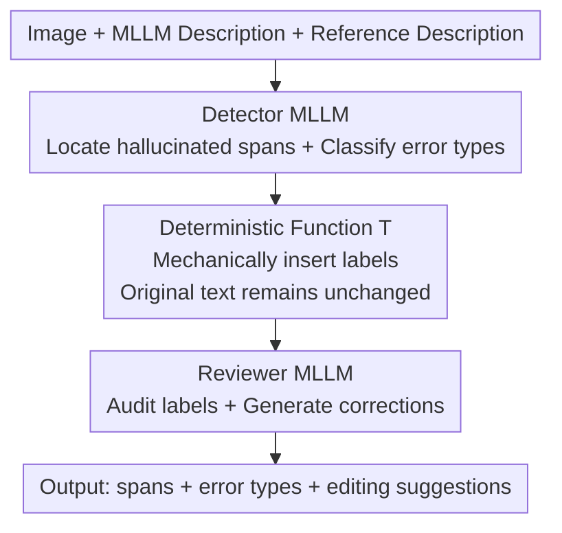

# Zina: Multimodal Fine-grained Hallucination Detection and Editing

**Conference**: CVPR 2026  
**arXiv**: [2506.13130](https://arxiv.org/abs/2506.13130)  
**Code**: [https://yuiga.dev/zina](https://yuiga.dev/zina)  
**Area**: Hallucination Detection  
**Keywords**: Multimodal hallucination detection, fine-grained editing, VLM evaluation, synthetic data, label taxonomy

## TL;DR
Zina proposes a multimodal fine-grained hallucination detection and editing task, designing a two-stage system (detector MLLM + reviewer MLLM) that delegates token copying to a deterministic function to simplify the model burden. Additionally, the VisionHall dataset is constructed (6.9K manual annotations + 20K graph-structured synthetic data), exceeding GPT-4o by 15.8 points in detection F1.

## Background & Motivation

**Background**: Multimodal Large Language Models (MLLMs) frequently produce hallucinations in tasks such as image captioning—generating textual content that deviates from the actual image content. Existing hallucination detection methods primarily operate at a coarse-grained level: POPE uses Yes/No questions to detect object hallucinations, AMBER uses the CHAIR metric to measure object-level error rates, and MHalDetect performs three-way classification (hallucinated/non-hallucinated/partial).

**Limitations of Prior Work**: (1) Coarse-grained methods can only judge "whether this sentence contains a hallucination" but cannot pinpoint "which word/span" is incorrect or specify the "error type"; (2) Existing methods only perform detection without editing, failing to provide actionable correction suggestions; (3) Hallucinations take various forms (object, color, number, relation, text, factual), yet most methods focus solely on object hallucinations.

**Key Challenge**: To perform fine-grained hallucination detection and editing, a model must simultaneously complete three tasks—precisely locate spans, classify error types, and generate correction suggestions. However, if a model is required to copy the original sentence token-by-token while inserting labels (as in FAVA), it must (i) perfectly replicate the original text, (ii) determine label positions per token, and (iii) handle cascading errors caused by exposure bias. This triple burden is overly demanding for model capabilities.

**Goal**: (1) Formalize the multimodal fine-grained hallucination detection and editing task and establish a 6-category hallucination taxonomy; (2) Design a two-stage method to reduce task complexity; (3) Construct high-quality training and evaluation datasets.

**Key Insight**: Decouple the mechanical task of token copying from the language model and delegate it to a deterministic function. This allows the model to focus on detection and editing themselves, thereby significantly reducing task difficulty.

**Core Idea**: Divide the complexity of hallucination detection and editing through two-stage decoupling (detector localization + deterministic tagging + reviewer auditing/editing).

## Method

### Overall Architecture
Given an image $x_{\text{img}}$, an MLLM-generated description $x_{\text{desc}}$, and a human reference description $x_{\text{ref}}$, the Zina workflow is as follows: (1) The Detector MLLM $\mathcal{M}_{\text{det}}$ receives the triplet input and outputs a list of hallucinated spans and their error types; (2) A deterministic function $\mathcal{T}$ inserts labels into the corresponding positions of the original text to generate a tagged sequence; (3) The Reviewer MLLM $\mathcal{M}_{\text{rev}}$ audits each label for correctness and generates correction suggestions in editing mode. The final output includes the set of hallucinated spans $\hat{\mathcal{Y}}_{\text{text}}$, the set of error types $\hat{\mathcal{Y}}_{\text{type}}$, and the set of editing suggestions $\hat{\mathcal{Y}}_{\text{edit}}$.

### Key Designs

**1. Deterministic label insertion function $\mathcal{T}$: Removing "verbatim replication" from model responsibilities**

The most difficult part of fine-grained detection is not identifying the error, but embedding the detection results back into the original sentence without disrupting the remaining text. Previous methods (e.g., FAVA) required the model to autoregressively copy the original sentence token-by-token while inserting labels—any missing or extra letter would cause all subsequent label boundaries to shift, leading to cascading errors due to exposure bias. Zina's approach delegates this step to a pure string function:

$$z_i = \mathcal{T}(x_{\text{desc}},\, h_{\text{text}}^{(i)},\, h_{\text{type}}^{(i)})$$

Given the original description, the detected hallucination span, and its error type, $\mathcal{T}$ mechanically wraps the span with corresponding opening and closing tags (e.g., `<object>books</object>`) without calling any model inference. This ensures the original text is preserved exactly and label positions are aligned, allowing the model to focus on "content understanding" rather than "format following."

**2. Detector–Reviewer two-stage: Splitting a high-load task into two simpler sub-tasks**

It is cognitively taxing for a single model to simultaneously locate spans, determine types, and write corrections. Zina splits this into two processes: The Detector $\mathcal{M}_{\text{det}}$ (Qwen2.5-VL-72B) only answers "which spans are problematic and what are their types," without copying text or arranging labels. Once $\mathcal{T}$ has inserted the labels, the Reviewer $\mathcal{M}_{\text{rev}}$ (also Qwen2.5-VL-72B) audits each one to check if "the label position and type are correct" and produces corrected text in editing mode, acting as a secondary verification and editor. Both models are trained using cross-entropy. This "initial coarse detection followed by review + editing" division of labor is similar to step-by-step reasoning in chain-of-thought; the introduction of the Reviewer provides the most significant performance gain.

**3. Graph-based synthetic data augmentation: Ensuring generated errors carry the cascading structure of real hallucinations**

Real hallucinations are often not isolated—if a model hallucinates a non-existent apple, it will likely continue to fabricate details such as "the apple is on the table" or "the apple is red." If errors are randomly inserted into descriptions, the synthetic data distribution will not match the real distribution. Zina addresses this in two steps: first, it uses Error Insertion where o3-mini injects errors into non-hallucinated descriptions and records dependencies between errors in XML (e.g., "mentioning a non-existent apple" $\rightarrow$ "describing the apple's relationship with other objects"); then, it uses GraphAug to build these dependencies into a directed graph, removes cycles to get a DAG, and selects a node with probability $p$ to prune it along with all its descendants. When a root error is pruned, its dependent child errors also disappear, allowing a single description to derive numerous training samples with varying, yet causally consistent, error combinations.

### Key Experimental Results

**Main Results (VisionHall Dataset)**

| Method | Detection F1↑ | CLIP-S↑ | PAC-S↑ | BERT-F1↑ | CLIP-F1↑ |
|-------|-------------|---------|--------|----------|----------|
| GPT-4o | 29.37 | 65.58 | 73.86 | 24.89 | 30.19 |
| Qwen2.5-VL-72B | 21.31 | 64.38 | 72.99 | 18.85 | 23.67 |
| LLaVA-OV-72B | 25.70 | 65.74 | 73.91 | 20.81 | 26.81 |
| Llama-3.2-90B | 16.92 | 65.28 | 73.54 | 14.56 | 17.62 |
| **Zina (Ours)** | **45.15** | **66.08** | **74.36** | **44.02** | **50.39** |

**Ablation Study**

| Configuration | Detection F1 | BERT-F1 | CLIP-F1 | Description |
|--------------|-------------|---------|---------|-------------|
| (i) No Reviewer, direct Qwen2.5-VL-72B 3-shot | 21.91 | 15.54 | 17.88 | Baseline |
| (ii) +Reviewer (32B) | 32.55 | 27.52 | 34.66 | Adding Reviewer improves +10.6 |
| (iii) +Reviewer (LLaVA-OV-72B) | 34.41 | 31.39 | 36.10 | Larger backbone |
| (iv) Zina, n=1 | 43.25 | 42.53 | 49.54 | Few-shot count has minor impact |
| (vi) Zina, n=3 (Full) | 45.15 | 44.02 | 50.39 | Full model |

**Key Findings**
- **Introduction of the Reviewer provides the largest contribution**: From configuration (i) to (ii), F1 jumps from 21.91 to 32.55, indicating that the two-stage decoupling strategy is central to performance gains.
- **GPT-4o performs poorly on fine-grained detection**: Even the strongest closed-source model only achieves a 29.37 F1, showing this task remains difficult for current MLLMs.
- **Error type distribution analysis**: Object hallucinations are the most frequent (~30-40%), while Fact hallucinations are the least common (<5%). Error distributions vary significantly across models—GPT-4o's Text hallucination ratio (12.27%) is higher than Qwen-7B's (14.96%).
- **Strong performance on out-of-domain dataset MHaluBench**: Zina outperforms baselines in 9 out of 10 metrics, demonstrating the generalization capability of the method.

## Highlights & Insights
- **The design idea of "delegating token copying to a deterministic function" is highly ingenious**: It essentially liberates the language model from the burden of "format following," allowing it to focus on "content understanding." This approach is applicable not only to hallucination detection but also to any task requiring local modification while maintaining original structure (e.g., grammatical error correction, fact-checking).
- **Graph-structured dependent error injection** is another highlight: By modeling causal relationships between errors using a DAG, synthetic data more closely aligns with real hallucination distributions. The DAG pruning strategy naturally provides data diversity.
- **BERT-F1 and CLIP-F1 metrics** address the "multiple correct answers" problem in editing evaluation, proving more reasonable than exact match F1.

## Limitations & Future Work
- **Dependence on human reference descriptions**: The task definition assumes reliable reference captions, which are costly to obtain in practical applications. Future work could explore reference-free detection.
- **6-category hallucination taxonomy may not be comprehensive**: For example, it lacks "causal relationship errors" (A leads to B) and "tense errors" (confusing past/present/future).
- **Detector and Reviewer use the same architecture (Qwen2.5-VL-72B)**: The inference cost of 72B models is high; whether smaller models + distillation can achieve similar effects is worth exploring.
- **VisionHall dataset is based on DCI reference descriptions**: DCI images are mostly daily scenes, lacking coverage for domain-specific hallucination detection (e.g., medical or remote sensing imagery).

## Related Work & Insights
- **vs FAVA**: FAVA is a text hallucination detection method that requires the model to copy tokens and insert labels. Zina's core improvement is replacing token copying with a deterministic function and extending to multimodal settings.
- **vs UniHD**: UniHD extracts verifiable claims and then verifies them with tools, resulting in a heavy pipeline dependent on external tools (detectors, OCR). Zina is an end-to-end, lightweight alternative.
- **vs HalLocalizer**: HalLocalizer performs token-level localization but cannot guarantee that replacing detected tokens will fix the hallucination; Zina performs span-level localization, making detection results directly editable.
- **Inspiration**: The Detector-Reviewer two-stage paradigm can be generalized to other self-refinement tasks, such as code bug detection/fix and translation error detection/correction.

## Rating
- Novelty: ⭐⭐⭐⭐ Innovative task definition (fine-grained detection + editing), deterministic tag insertion, and graph-structured data generation.
- Experimental Thoroughness: ⭐⭐⭐⭐⭐ Compared against 10+ baselines, validated on VisionHall + MHaluBench, and thorough ablation analysis.
- Writing Quality: ⭐⭐⭐⭐⭐ Clear problem definition, natural motivation derivation, and high-quality figures/tables.
- Value: ⭐⭐⭐⭐ Provides refined tools for MLLM hallucination governance; the VisionHall dataset holds lasting value.

<!-- RELATED:START -->

## Related Papers

- [\[CVPR 2026\] Fine-Grained Multi-Image Object Hallucination Benchmark](fine-grained_multi_image_object_hallucination_benchmark.md)
- [\[CVPR 2026\] FINER: MLLMs Hallucinate under Fine-grained Negative Queries](finer_mllms_hallucinate_under_fine-grained_negative_queries.md)
- [\[CVPR 2026\] Beyond the Global Scores: Fine-Grained Token Grounding as a Robust Detector of LVLM Hallucinations](beyond_global_scores_fine_grained_token_grounding_as_robust_detector_of_lvlm_hallucinations.md)
- [\[CVPR 2026\] HulluEdit: Single-Pass Evidence-Consistent Subspace Editing for Mitigating Hallucinations in Large Vision-Language Models](hulluedit_single-pass_evidence-consistent_subspace_editing_for_mitigating_halluc.md)
- [\[ACL 2025\] Fine-grained Hallucination Detection and Mitigation in Long-form Question Answering](../../ACL2025/hallucination/localizing_and_mitigating_errors_in_long-form_question_answering.md)

<!-- RELATED:END -->
