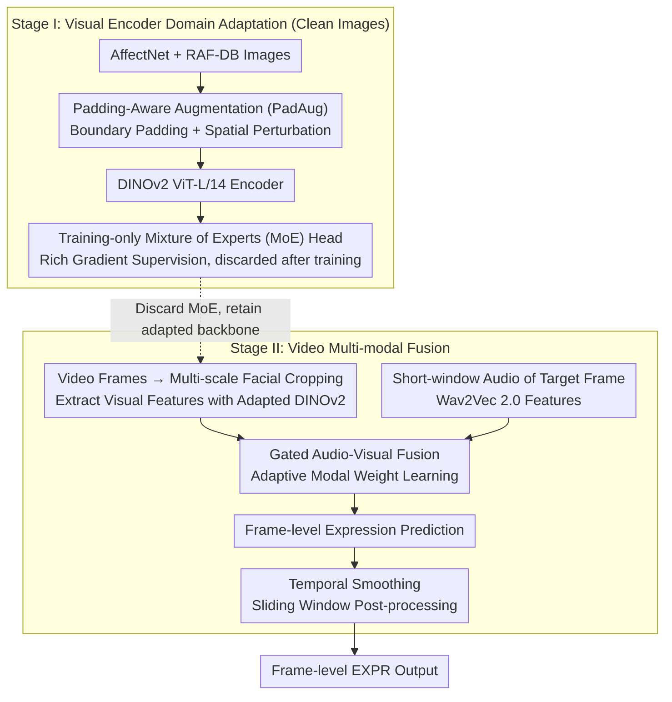

# A Two-Stage Dual-Modality Model for Facial Expression Recognition

**Conference**: CVPR 2026  
**arXiv**: [2603.12221](https://arxiv.org/abs/2603.12221)  
**Code**: None  
**Area**: Human Understanding / Expression Recognition  
**Keywords**: Facial Expression Recognition, DINOv2, Audio-Visual Fusion, Mixture of Experts, Data Augmentation

## TL;DR

A two-stage dual-modality facial expression recognition framework is proposed: Stage I adapts a DINOv2 encoder on external datasets using Padding-Aware Augmentation and a training-time MoE head; Stage II achieves frame-level audio-visual expression classification through multi-scale facial cropping, Wav2Vec 2.0 audio feature extraction, and gated fusion, obtaining a 0.5368 Macro-F1 in the ABAW 2026 competition.

## Background & Motivation

Frame-level facial expression recognition (EXPR) in the wild faces significant challenges: unstable facial localization, large scale variations, and the prevalence of blur, occlusion, extreme poses, and lighting changes. Raw videos in the Aff-Wild2 dataset contain many of these distractors, making single-frame visual features noisy and inconsistent.

Furthermore, emotional signals are inherently multi-modal—visual information may be insufficient for accurate expression judgment in ambiguous scenes, while audio (e.g., tone of voice, plosives) can provide critical complementary cues. However, effectively fusing multi-modal data while maintaining temporal consistency remains a challenge.

Ours strategy: A two-stage solution—first enhancing the expression-aware capability of the visual encoder on external image datasets, then performing multi-modal fusion and temporal smoothing on videos.

## Method

### Overall Architecture

This competition solution addresses two primary pain points of frame-level EXPR in wild videos like Aff-Wild2: single-frame visual features are noisy and unstable, and visual information alone is insufficient in ambiguous scenarios. The authors decouple the problem into two stages to prevent interference. Stage I focuses on adapting the DINOv2 ViT-L/14 encoder's expression awareness on clean image datasets (AffectNet + RAF-DB) by introducing PadAug augmentation and a training-only MoE head. Stage II transitions to video: multi-scale facial crops are processed through the Stage I adapted DINOv2 to extract visual features, while Wav2Vec 2.0 extracts frame-aligned audio features. These are integrated via gated fusion for frame-level prediction, followed by temporal smoothing using a sliding window.

### Key Designs

**1. Padding-Aware Augmentation (PadAug): Practicing "Out-of-Frame" Cropping during Training**

The Limitations of Prior Work arise during multi-scale cropping in Stage II—to avoid losing context, large crop boxes often exceed original image boundaries, requiring black padding. During inference, the model frequently encounters these inputs with padding strips; if never seen during training, this causes a distribution shift. PadAug actively inserts black padding and applies slight spatial perturbations at image boundaries during training, covering various boundary forms (left, right, top, bottom, corners) to habituate the model to these artifacts in Stage I. This incorporates the "out-of-bounds" scenarios expected at inference into the training distribution, preventing performance collapse during large-scale cropping.

**2. Training-only Mixture of Experts (MoE) Head: Richer Gradients for Adaptation without Inference Overhead**

A standard linear classification head provides weak supervision during visual adaptation, limiting the discriminative features DINOv2 can learn for expressions. The authors attach an MoE classification head after the encoder. Sample-dependent expert routing provides richer, more targeted gradients to steer DINOv2 toward expression recognition. The Key Insight is that this MoE head is "disposable"—used only during Stage I training and discarded afterward. Consequently, the benefits of MoE (stronger supervision) are baked into the encoder weights, while its cost (increased inference computation) is not carried into Stage II.

**3. Gated Audio-Visual Fusion + Temporal Smoothing: Adaptive Integration and Jitter Reduction**

In Stage II, visual inputs are derived from three facial crop scales via the adapted DINOv2, and audio inputs come from Wav2Vec 2.0 features within a short window. Simple concatenation poses a risk: audio is not always useful. While it can resolve ambiguity (e.g., using tone to distinguish "Anger" from "Disgust"), silent or noisy segments can introduce interference. The authors use a lightweight gated fusion module to learn weights for each modality, allowing the model to adaptively trust vision or audio per frame. Finally, to eliminate temporal jitter from independent per-frame predictions, a sliding window is applied as a post-processing step to smooth the output sequence.

### Loss & Training

Stage I utilizes Cross-Entropy loss to fine-tune DINOv2 on AffectNet + RAF-DB (8-class classification). Stage II trains the gated fusion module on Aff-Wild2 videos. Temporal smoothing post-processing is applied during inference.

## Key Experimental Results

### Main Results

| Conference Setting | Macro-F1 | Description |
|--------------------|----------|-------------|
| Official Val Set   | **0.5368** | Final submission result |
| 5-Fold CV          | 0.5122 ± 0.0277 | Stability verification |
| Official Test Set  | 0.391 | Challenge server result |

### Ablation Study

| Configuration | Gain/Loss (Macro-F1) | Description |
|---------------|----------------------|-------------|
| w/o PadAug    | Decrease | Boundary artifacts impact multi-scale crops |
| w/o MoE Head  | Decrease | Weakened visual adaptation effect |
| Visual Only   | Decrease | Audio provides complementary information |
| w/o Smoothing | Decrease | Unstable inter-frame predictions |
| Full Model    | **Optimal** | Components are mutually beneficial |

### Key Findings

- Visual encoder domain adaptation (Stage I) is the primary source of performance, as images contain the core emotional information.
- Audio serves as a complementary modality providing the final performance boost, though the gain is limited.
- PadAug is particularly important for scenarios involving multi-scale cropping.
- The significant gap between validation and test performance (0.54 vs 0.39) suggests potential overfitting or distribution shifts.

## Highlights & Insights

- **PadAug Designed for Real-world Issues**: Padding artifacts are a common yet overlooked issue in "in-the-wild" videos; targeted augmentation is more effective than generic approaches.
- **"Disposable" Training-only MoE Strategy**: Leveraging rich MoE gradients to aid adaptation without introducing inference overhead is a clever design pattern.
- **Two-stage Decoupling**: Learning visual representations on clean images before fusion on noisy video prevents video noise from contaminating visual feature learning.

## Limitations & Future Work

- The validation-to-test performance drop (0.54 $\rightarrow$ 0.39) raises questions about generalization.
- The gated fusion module is relatively simple and does not model complex audio-visual temporal interactions.
- Only DINOv2 is used as a visual backbone; other models like CLIP were not explored.
- Temporal smoothing is handled via post-processing rather than an end-to-end learned temporal model.

## Related Work & Insights

- **vs MAE-based EXPR**: The reconstruction objective of MAE may be less effective for discriminative expression features compared to the self-distillation objective of DINOv2.
- **vs CLIP-based EXPR**: CLIP’s text alignment might offer advantages in designing text prompts for expression classification.
- **vs Multi-task Methods**: Some ABAW methods jointly train EXPR + AU + VA, potentially improving performance through shared representations.

## Rating

- Novelty: ⭐⭐⭐ PadAug and training-time MoE show clever design, though the overall framework is relatively standard.
- Experimental Thoroughness: ⭐⭐⭐⭐ Ablation studies validate component contributions, but the test set drop is significant.
- Writing Quality: ⭐⭐⭐⭐ Method descriptions are clear and diagrams are intuitive.
- Value: ⭐⭐⭐ As a competition solution, the practical tricks are valuable, though academic innovation is moderate.

<!-- RELATED:START -->

## Related Papers

- [\[CVPR 2026\] D³FER: Dual Channel and Dual Branch Network for Robust Facial Expression Recognition under Dual Challenges](d3fer_dual_channel_and_dual_branch_network_for_robust_facial_expression_recognit.md)
- [\[CVPR 2026\] Dynamic Label Noise Suppression with Optimal Teacher Pool for Facial Expression Recognition](dynamic_label_noise_suppression_with_optimal_teacher_pool_for_facial_expression_.md)
- [\[CVPR 2026\] CLEX: Complementary Label Exchange Learning for Noisy Facial Expression Recognition](clex_complementary_label_exchange_learning_for_noisy_facial_expression_recogniti.md)
- [\[CVPR 2026\] Region-Aware Instance Consistency Learning for Micro-Expression Recognition](region-aware_instance_consistency_learning_for_micro-expression_recognition.md)
- [\[ECCV 2024\] Generalizable Facial Expression Recognition](../../ECCV2024/human_understanding/generalizable_facial_expression_recognition.md)

<!-- RELATED:END -->
