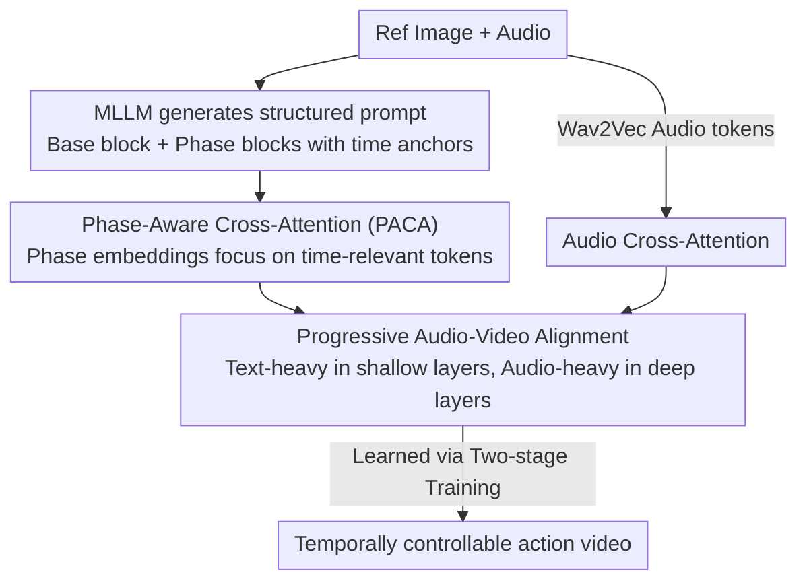

# ActAvatar: Temporally-Aware Precise Action Control for Talking Avatars

**Conference**: CVPR 2026  
**Paper**: [CVF Open Access](https://openaccess.thecvf.com/content/CVPR2026/html/Peng_ActAvatar_Temporally-Aware_Precise_Action_Control_for_Talking_Avatars_CVPR_2026_paper.html)  
**Code**: [Project Page](https://ziqiaopeng.github.io/ActAvatar/) (No public repository found)  
**Area**: Digital Human / Video Generation / Multimodal  
**Keywords**: Talking Avatar Video Generation, Action Control, Temporal Alignment, Cross-Attention, Diffusion Transformer

## TL;DR
ActAvatar utilizes "structured text prompts + phase-aware cross-attention" to allow talking avatar videos to perform specific actions within designated time windows. Combined with "depth-progressive audio influence" and "two-stage training," it maintains lip-sync, action accuracy, and image quality without relying on pose skeletons, achieving 14B-level effects with a 5B model.

## Background & Motivation
**Background**: Audio-driven talking avatar generation has achieved high-quality results and accurate lip-sync using diffusion models. Recent works (HunyuanVideo-Avatar, OmniAvatar, Wan-S2V, etc.) can also generate reasonable hand movements.

**Limitations of Prior Work**: The authors identify three specific issues. First, **poor text-following ability**—models treat the entire prompt as a uniform condition, causing action-describing words to compete with scene/identity words in attention, often failing to execute commands like "make him wave." Second, **temporal misalignment between actions and speech**—actions may appear at any time rather than anchoring to semantically relevant speech segments because standard conditioning lacks explicit temporal structure. Third, **reliance on extra control signals**—many methods depend on pose skeleton sequences, which increases annotation/inference complexity and limits the ability to generate novel actions.

**Key Challenge**: Achieving "precise text-driven action control" requires establishing three correspondences simultaneously: linguistic semantics (what action), time windows (when to act), and audio cues (how action coordinates with speech). Furthermore, **text-driven action generation** and **audio-driven lip-sync** are competing objectives. When both modalities exert strong influence, models fluctuate between conflicting signals, leading to either degraded action quality or poor lip-sync. Moreover, fine-tuning pre-trained models on domain-specific data to improve lip-sync often triggers catastrophic forgetting, erasing existing text-following capabilities.

**Core Idea**: Decompose flat global prompts into a "global base block + phase blocks with time anchors," enabling cross-attention to focus on tokens of the corresponding phase within specific time windows (solving "what + when"). Then, allow audio influence to increase progressively with Transformer layer depth, aligning with the "coarse-to-fine" feature learning hierarchy of diffusion models (solving modal competition). Finally, use two-stage training to decouple lip-sync learning from action control injection (solving forgetting).

## Method

### Overall Architecture
ActAvatar is built on an image-to-video diffusion Transformer backbone (implemented using Wan2.2-TI2V-5B with 30 DiT blocks). Inputs include an audio $a$, a reference image $I_{ref}$, and a **structured prompt** $P$. This prompt is automatically generated by a Multimodal Large Language Model (MLLM, e.g., Qwen3-Omni) based on the image and audio content, specifying "what action to perform at which time interval." The output is a video $V=\{I_t\}_{t=1}^T$ where lip-sync matches the audio and actions occur within semantically appropriate time windows.

Inside each DiT block, text conditions are injected via **Phase-Aware Cross-Attention (PACA)**, and audio conditions via **Audio Cross-Attention**. These are fused using **Progressive Audio-Visual Alignment** weighted by layer depth. The phase embeddings used by PACA and the Audio Adapter are learned through **two-stage training**. The three components have distinct roles: PACA handles "action semantics ↔ time window" alignment, progressive alignment prevents "text vs. audio" conflict, and two-stage training ensures "new capabilities do not overwrite old ones."

### Key Designs

**1. Phase-Aware Cross-Attention (PACA): Decomposing flat prompts into anchored phase blocks for timed focus**

Addressing "poor text-following" and "untimed actions." Standard approaches use a single global prompt $P_{global}$, which lacks temporal structure, causing action information to be spread uniformly across all timesteps (semantic diffusion). PACA performs **hierarchical prompt decomposition**:

$$P = \{P_{base}, \{P_k, T_k\}_{k=1}^K\}$$

Where $P_{base}$ is the global base block encoding time-invariant semantics (identity, environment, mood, style, overall motion); each phase block $P_k$ describes a local action bound to a normalized time window $T_k=[\tau_k^{start}, \tau_k^{end}]$. For example, Base: "A woman in professional attire speaking professionally," Phase-1 [0–2s]: "gestures with palms facing outward," Phase-2 [2–4s]: "points downward to emphasize details."

Time anchors alone are insufficient; the model must identify which tokens belong to which phase. The authors add **learnable phase positional embeddings**: for each text token $c_i$ belonging to phase $k$, a phase bias is added: $c'_i = c_i + e_k$, where $e_k$ is zero-initialized (ensuring original behavior is preserved early in training). This provides an inductive bias encouraging the model to distinguish between base and phase tokens in cross-attention. Queries, keys, and values are then computed from phase-augmented tokens using standard softmax cross-attention $\mathrm{softmax}(Q_f K^T/\sqrt{D})V$. After training on temporally annotated data, when a frame $f$ (normalized to video time $\tau$) falls within window $T_k$, attention naturally concentrates on tokens for that phase. Attention visualization (Figure 4) shows that with a two-phase prompt, attention stays on Phase-1 tokens in the first half and shifts to Phase-2 in the second, with phase separation being sharper in deep layers (layer 20) than shallow ones (layer 5).

**2. Progressive Audio-Visual Alignment: Increasing audio influence with depth to avoid text-audio competition**

Addressing the competition between "text-driven action" and "audio-driven lip-sync." The authors exploit the inherent **coarse-to-fine** feature hierarchy of diffusion Transformers—shallow layers capture global structure/layout while deep layers refine local details/high frequencies. Consequently, they apply **layer-depth-aware scaling** to the audio cross-attention residual:

$$x_\ell \leftarrow x_\ell + f(\ell)\cdot r_\ell^{audio}, \qquad f(\ell)=\left(\frac{\ell}{L}\right)^{\gamma}, \;\gamma>1$$

With $\gamma>1$, $f(\ell)$ increases significantly only in deep layers. Thus, shallow layers ($\ell\ll L$, small $f(\ell)$) are dominated by text, establishing the overall skeleton—body posture, hand trajectories, gesture types—with minimal interference from audio. In deep layers ($\ell\to L$, large $f(\ell)$), audio weight rises to refine lip-sync and facial phonemes on the established action framework. Text and audio thus operate in **complementary rather than competitive** intervals. In the implementation, $\gamma=1.5$ and $L=30$. Ablation studies show this improves Sync-C from 6.39 to 6.57 without degrading action metrics.

**3. Two-stage Training: Decoupling lip-sync from action control to prevent forgetting**

Addressing catastrophic forgetting where fine-tuning for audio-visual alignment erases text-following capabilities. The authors separate "learning audio-visual correspondence" from "learning temporal action control."

**Stage 1 (Audio Adapter Training)**: Robust lip-sync correspondence is established on 500,000 diverse talking head videos using Flow Matching. Given data $x_0$ and noise $x_1\sim N(0,I)$, an optimal transport path $x_t=(1-t)x_0+tx_1$ is constructed, and the model predicts the velocity field $v_{target}=x_1-x_0$. The loss is $\mathbb{E}\big[\|v_\theta(x_t,t,C_{brief},A)-(x_1-x_0)\|^2\big]$, using only brief text $C_{brief}$ and Wav2Vec 2.0 audio embeddings $A$. Crucially, the **text-to-video backbone $\theta_{base}$ is frozen**, and only the **audio adapter $\theta_{audio}$** is trained, ensuring lip-sync is learned without modifying the backbone's original capabilities.

**Stage 2 (Temporal Action Control Injection)**: A dataset is constructed by selecting videos with significant motion via DWPose, then using an MLLM to generate hierarchical prompts with phase descriptions and time anchors, resulting in 100,000 samples with phase-level temporal annotations. Starting from the base I2V backbone with the Stage 1 audio adapter injected, Flow Matching is used again, but with the condition $C_{PACA}$ containing phase positional embeddings. This stage involves **full fine-tuning** of $\theta_{stage2}=\{\theta_{base},\theta_{audio},\theta_{PACA}\}$ to optimize both lip-sync and action control. By treating action control as a **compositional extension** rather than destructive parameter overwriting, both capabilities are preserved.

### Loss & Training
Both stages use Flow Matching (Optimal Transport path + velocity field regression), with the loss $\mathcal{L}=\mathbb{E}\big[\|v_\theta(x_t,t,C,A)-(x_1-x_0)\|^2\big]$. The difference lies in the condition $C$ (Stage 1 uses brief text; Stage 2 uses PACA structured prompts). Stage 1 runs for 20K steps, Stage 2 for 14K steps, with a batch size of 40, learning rate $5\times10^{-6}$, and AdamW on 40 H20 GPUs. Inference generates 125 frames (25 FPS, 5 seconds) at $704\times 1280$ resolution using 40-step flow-matching sampling, with CFG scales of 5.0 for both text and audio.

## Key Experimental Results

### Main Results
On the **HDTF Test Set** (100 high-quality talking heads, upper body only, no hand actions; primarily testing lip-sync and image quality), ActAvatar with 5B parameters @720p achieves the best image quality while maintaining lip-sync parity with the strongest methods:

| Method | Params/Res | FID↓ | IQA↑ | ASE↑ | Sync-C↑ | Sync-D↓ | Time |
|------|------------|------|------|------|---------|---------|------|
| HunyuanVideo-Avatar | 13B/720p | 24.515 | 4.054 | 2.693 | 7.647 | 7.564 | 74 min |
| OmniAvatar | 14B/480p | 24.398 | 4.088 | 2.664 | **7.986** | 7.696 | 36 min |
| Wan-S2V | 14B/720p | 23.850 | 4.108 | 2.684 | 7.462 | 7.745 | 68 min |
| **ActAvatar (Ours)** | **5B/720p** | **23.471** | **4.120** | **2.714** | 7.663 | **7.545** | **16 min** |

On the self-constructed **Action Bench** (200 diverse action prompts with ref images + TTS audio + structured prompts), action control leads significantly. Metrics are scored using a Gemini evaluation framework: H@S (Hit@Segment), AA (Action Accuracy), TC (Temporal Correctness), AQ (Action Quality), HC (Hand Clarity):

| Method | Sync-C↑ | H@S↑ | AA↑ | TC↑ | AQ↑ | HC↑ |
|------|---------|------|------|------|------|------|
| HunyuanVideo-Avatar | 6.251 | 0.674 | 3.977 | 5.491 | 6.609 | 8.044 |
| OmniAvatar | 6.765 | 0.818 | 5.505 | 7.032 | 7.147 | 8.042 |
| Wan-S2V | 6.473 | 0.754 | 4.934 | 6.465 | 6.630 | 8.168 |
| **ActAvatar (Ours)** | **6.893** | **0.854** | **5.971** | **7.353** | **7.671** | **8.483** |

Notably, ActAvatar achieves the **highest lip-sync on Action Bench (Sync-C 6.893)**, indicating that PACA allows precise action control without sacrificing audio-visual alignment. In terms of efficiency, generating a 5-second video on a single H20 takes 16 minutes, over 4x faster than Wan-S2V (68 min) / HunyuanVideo-Avatar (74 min); 8 GPUs reduce this to 2 minutes.

### Ablation Study
Stepwise component additions on Action Bench (Table 4):

| Configuration | Sync-C↑ | H@S↑ | AA↑ | TC↑ | AQ↑ | HC↑ |
|------|---------|------|------|------|------|------|
| Base (Global Prompt) | 6.37 | 0.725 | 3.91 | 6.47 | 6.21 | 7.68 |
| + PACA | 6.39 | 0.829 | 5.78 | 7.12 | 7.48 | 8.36 |
| + PACA + Prog. Align | 6.57 | 0.831 | 5.75 | 7.10 | 7.52 | 8.47 |
| + Two-stage Training (Full) | **6.89** | **0.854** | **5.97** | **7.35** | **7.67** | **8.48** |

A user study with 45 participants (scale 0–5) also ranked it first across all dimensions: Action-Prompt Alignment (4.03), Action Quality (4.15), Hand Clarity (4.22), Lip Sync (3.89), and Overall (4.18), with hand clarity as the strongest point.

### Key Findings
- **PACA is the engine of action control**: Adding PACA increased H@S from 0.725 to 0.829, AA from 3.91 to 5.78, and TC from 6.47 to 7.12. In visualizations, the base model remained static, while actions emerged naturally with PACA.
- **Progressive alignment primarily aids lip-sync**: It raised Sync-C from 6.39 to 6.57 without affecting action metrics, confirming that "text for structure in shallow layers, audio for lips in deep layers" effectively mitigates modal interference.
- **Two-stage training provides overall enhancement**: The full version achieved the best Sync-C (6.89) and action control (H@S 0.854), suggesting that decoupling audio-visual learning from action injection is necessary to preserve both.
- **Quality-Efficiency Sweet Spot**: The 5B model at 720p matches or exceeds 14B models while being significantly faster during inference.

## Highlights & Insights
- **Explicitly embedding "When" into prompt structure**: Using a hierarchical prompt with "base block + phase blocks with time anchors" combined with zero-initialized phase embeddings allows cross-attention to learn segment-based focus automatically—achieving phase-level temporal precision without external control signals like skeletons.
- **Using layer depth as a "modal scheduler"**: Mapping the inherent hierarchy of diffusion Transformers (coarse-to-fine) to a text/audio influence schedule (text in shallow, audio in deep) via a simple $(\ell/L)^\gamma$ scaling resolves multi-modal contention. This approach of "prioritizing by depth" is applicable to any multi-condition video generation tasks.
- **Decoupled training to prevent forgetting**: Training the audio adapter while freezing the backbone (Stage 1) followed by full action control injection (Stage 2) treats new capabilities as compositional extensions rather than destructive rewrites, providing a practical paradigm for domain-specific fine-tuning.

## Limitations & Future Work
- Structured prompts rely on MLLM generation; errors in phase descriptions or time anchor accuracy directly impact action control. Manual verification was used in the paper, suggesting fully automatic prompting is not yet 100% reliable. ⚠️
- Action metrics (AA/TC/AQ/HC) depend heavily on the Gemini-based evaluation framework. Absolute scores from such LLM-based evaluations are difficult to compare across different papers.
- Most evaluations featured two phases (Phase-1/Phase-2, ~2s each). Temporal precision under finer-grained, multi-phase, or longer video scenarios has not been fully demonstrated; generation length is fixed at 5s.
- The scaling function $(\ell/L)^\gamma$ and $\gamma=1.5$ are empirical; sensitivity analysis for $\gamma$ was not provided.

## Related Work & Insights
- **vs. OmniAvatar / Wan-S2V / HunyuanVideo-Avatar (Global Prompt-based)**: These rely on strong backbones for generic actions but use **global prompts**, failing to control temporal precision. ActAvatar uses phase decomposition + embeddings to inject temporal structure directly into attention, leading to higher H@S/AA/TC.
- **vs. EchoMimic v2 / Hallo 4 (Skeleton-based)**: These use pose sequences to control motion, which increases annotation costs and limits novelty. ActAvatar achieves phase-level control using only text, offering a simpler and more flexible pipeline.
- **vs. AgentAvatar (Timeline-based)**: AgentAvatar also uses timelines but focuses only on facial expressions; ActAvatar extends precise temporal control to full-body motion (gestures, posture).
- **vs. MultiTalk (Natural Action Generation)**: MultiTalk generates motion, but the motion does not follow prompt content; ActAvatar's phase-conditional attention ensures actions correspond specifically to the relevant text segment.

## Rating
- Novelty: ⭐⭐⭐⭐ Phase-level prompt decomposition + phase embeddings + depth-based modal scheduling is clever, though built on mature mechanisms (Cross-Attention, Flow Matching, Two-stage Fine-tuning).
- Experimental Thoroughness: ⭐⭐⭐⭐ Uses two test sets, component-wise ablation, 45-person user study, and attention visualization; however, action metrics rely heavily on Gemini scoring, and the number of phases is limited.
- Writing Quality: ⭐⭐⭐⭐ Clear mapping between the three pain points and the three components; motivation and formulas are well-explained.
- Value: ⭐⭐⭐⭐ Skeleton-free temporal action control plus the 5B-matching-14B efficiency makes it highly practical for controllable digital human products.

<!-- RELATED:START -->

## Related Papers

- [\[CVPR 2026\] PC-Talk: Precise Facial Animation Control for Audio-Driven Talking Face Generation](pc-talk_precise_facial_animation_control_for_audio-driven_talking_face_generatio.md)
- [\[CVPR 2026\] AudioAvatar: Personalized Audio-driven Whole-body Talking Avatars](audioavatar_personalized_audio-driven_whole-body_talking_avatars.md)
- [\[CVPR 2026\] Tavatar: Topology-Aware Gaussian Attribute Derivation for Animatable Human Avatars](tavatar_topology-aware_gaussian_attribute_derivation_for_animatable_human_avatar.md)
- [\[CVPR 2026\] SyncDreamer: Controllable and Expressive Avatar Generation Beyond the Talking Head](syncdreamer_controllable_and_expressive_avatar_generation_beyond_the_talking_hea.md)
- [\[CVPR 2026\] FlexAvatar: Learning Complete 3D Head Avatars with Partial Supervision](flexavatar_learning_complete_3d_head_avatars_with_partial_supervision.md)

<!-- RELATED:END -->
