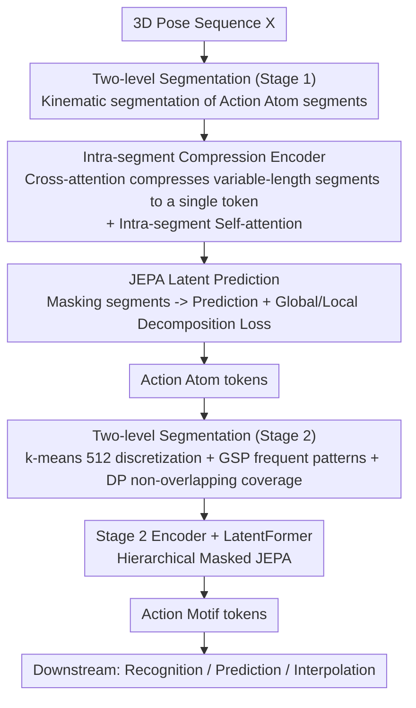

# Action Motifs: Self-Supervised Hierarchical Representation of Human Body Movements

**Conference**: CVPR 2026  
**Paper**: [CVF Open Access](https://openaccess.thecvf.com/content/CVPR2026/html/Kinoshita_Action_Motifs_Self-Supervised_Hierarchical_Representation_of_Human_Body_Movements_CVPR_2026_paper.html)  
**Code**: None (Project page https://vision.ist.i.kyoto-u.ac.jp/ )  
**Area**: Human Understanding / Self-Supervised Representation Learning / Human Behavior Modeling  
**Keywords**: Action Atoms/Motifs, Hierarchical Representation, Self-Supervised, JEPA, 3D Pose

## TL;DR
This paper proposes A4Mer, a nested latent-space Transformer, which learns a two-level hierarchical representation of "Action Atoms → Action Motifs" from 3D pose sequences in a **fully self-supervised** manner. This allows semantically meaningful, reusable, variable-length action segments to "emerge" bottom-up, significantly outperforming existing fixed-granularity representations on action recognition, long-term motion prediction, and motion interpolation.

## Background & Motivation
**Background**: Modeling human behavior requires a representation that captures the "compositionality" of body movements. Existing self-supervised methods (reconstruction, masked modeling, 2D-to-3D lifting, contrastive learning, etc.) almost exclusively learn representations at a **fixed granularity**: frame-by-frame (like letters), clip-by-clip (like n-grams), or entire videos (like full articles).

**Limitations of Prior Work**: Frame-level representations are too fine-grained and redundant; clip-level representations are misaligned with semantic boundaries; video-level representations completely blur out reusable motion patterns. None of these can represent reusable mid-level segments like "raising a hand," which can belong to both "opening a door" and "reaching."

**Key Challenge**: Extracting "phrase-level" reusable motion segments faces a chicken-and-egg dilemma. The first is **segmentation and semantics**: different temporal segmentations alter action semantics, thereby changing distances in the representation space; yet, without knowing the semantics, boundaries cannot be defined. The second is **representation and composition**: even if boundaries are known, the motion representations themselves and their temporal compositions must be learned jointly—composition determines what kind of representation is needed, while the representation constrains how compositions can form. Manually labeling such mutually dependent two-level hierarchical structures is impractical, meaning they must emerge unsupervised from the data.

**Goal**: To learn a hierarchical representation without any action labels—where the lower-level Action Atoms capture atomic joint movements, and the upper-level Action Motifs are formed by the temporal composition of Atoms, encoding similar body movements that recur across different overall actions while abstracting away variations from individuals or scenarios.

**Key Insight**: Analogizing atomic actions to "words" in language, recurring temporal patterns that collectively express different actions are "phrases"—reusable across different sentences (actions). The authors advocate for letting these phrase-level segments **naturally emerge** through bottom-up hierarchical composition, rather than pre-specifying their length.

**Core Idea**: Utilizing a nested latent-space Transformer (A4Mer) with masked latent token prediction (JEPA) as a unified pretext, letting variable-length, semantically aligned Action Motifs emerge bottom-up from the recurring patterns of Action Atoms.

## Method

### Overall Architecture
The input to A4Mer is a 3D pose sequence $X=(x_1,\dots,x_T)$, and the outputs are two-level latent representations: lower-level Action Atom tokens and upper-level Action Motif tokens, which are used for downstream tasks. The entire system is a **two-stage, nested architecture sharing the same model structure (Encoder + LatentFormer)**: the first stage segments the sequence based on kinematic cues to learn Atom representations; then, the entire dataset is fed into the trained first-stage model to mine recurring Atom patterns as second-stage Motif segments; finally, the two stages are trained jointly end-to-end. Both stages rely on the same pretext—masking several segments in the sequence and predicting the tokens of the masked segments in their respective latent spaces.

### Key Designs

**1. Bottom-up Two-stage Nested Architecture: Letting Mid-level Semantic Segments "Emerge" Instead of Pre-specifying Them**

Defining "what constitutes a reusable action segment" directly is difficult—which is the root of the segmentation-semantics entanglement. A4Mer bypasses pre-specified lengths in favor of a two-level bottom-up composition: it first learns representations at a fine granularity (Atoms), then treats the **recurring patterns** of Atoms as upper-level (Motif) segments, learning representations over these segments in the second stage. Thus, high-level segments naturally emerge as "recurring patterns" of low-level motions rather than being manually segmented. The training order follows this: first, train the first stage independently -> use it to identify second-stage segments -> train both stages end-to-end jointly. This alternating process allows "learning semantics" and "segmenting intervals" to feed into each other, untangling the chicken-and-egg dependency. Both stages share the same Encoder + LatentFormer architecture, differing only in the granularity of the input segments.

**2. Encoder Compressing Variable-Length Segments into a Single Token + Intra-Segment Self-Attention**

The duration of a segment (whether Atom or Motif) varies with action types, individuals, and scenarios; representing variable-length segments in a unified framework is non-trivial. The Encoder draws inspiration from BLT: for the $k$-th segment, it first initializes a latent token $z_k$ using max-pooling of intra-segment input tokens $X_k=\{x_t\mid s(t)=k\}$. It then performs **cross-attention** with $z_k$ as the query and $X_k$ as the key/value to digest the entire segment into a single token (where $s(t)$ returns the segment index for frame $t$, and the number of segments $K$ in the sequence varies with the input). The Encoder uses a Transformer-decoder structure, alternating cross-attention with **intra-segment self-attention**—deliberately restricting self-attention to tokens within the same segment rather than the entire sequence. If full-sequence self-attention were allowed, the model would overreact to subtle pose similarities between distant frames, hindering semantic understanding. Explicitly decoupling "intra-segment information aggregation" from "inter-segment relationship modeling"—and leaving the latter to the LatentFormer (performing self-attention among latent tokens)—enables A4Mer to learn temporal relationships between movements at a semantic level.

**3. Two-Level Segmentation: Kinematic Segmentation for Atoms + Frequent Pattern Mining for Motifs**

The two-level representation requires two sets of segmentation rules. **Atom segmentation** relies on kinematic cues: treating the discrepancy between "linearly extrapolated joint trajectories" and "actually observed trajectories" as the start of fine-grained movements, where non-linear changes define Atom boundaries. **Motif segmentation** aims to find recurring Atom patterns shared across different actions: first, the entire dataset is processed through the stage-one model to obtain Atom sequences. The Atoms are discretized into category codes using k-means (with $512$ clusters; clustering is done only during training, while inference uses nearest neighbors to assign each Atom to a cluster). Then, the Generalized Sequential Pattern (GSP) algorithm is used to iteratively expand frequent subsequences with occurrences above a threshold from these code sequences, mining co-occurrence patterns. Since an Atom may be covered by multiple patterns, the authors apply **dynamic programming (DP)** to each sequence, selecting a non-overlapping set of patterns that covers the entire sequence with the minimum number of patterns—resulting in clean Motif segmentation.

**4. JEPA Latent Token Prediction + Global/Local Decomposition Loss**

To jointly learn representations and their temporal compositions, both stages solve the same pretext task: randomly masking a set of segments $\mathcal{K}$, where the feature extractor $f_\theta$ (Encoder+LatentFormer) outputs tokens looking only at visible segments, and the predictor $g_\phi$ fills in the latent tokens of the masked segments. JEPA is adopted: the loss is computed in the **latent space** rather than the pose space, allowing the model to learn the semantic essence of motion and remain insensitive to trivial pose differences (avoiding the need for manually designed semantic-preserving augmentations in contrastive learning). The original JEPA objective is

$$\min_{\theta,\phi,M}\sum_{k\in\mathcal{K}} \mathrm{SL1}\big(\hat z_k - \mathrm{sg}(z_k)\big),\quad \hat Z=g_\phi(M, f_\theta(X_{vis})),$$

where the target $z_k$ is computed using the target network parameter $\bar{\theta}$ which is updated using the EMA of $\theta$ to prevent representation collapse, and $\mathrm{SL1}$ is the smooth L1 loss. During end-to-end training, **hierarchical masking** is employed: when a Motif segment is selected for masking, its underlying Atom segments are masked together to prevent the second stage from "cheating" using target information leaked from the first stage.

More critically, the **global/local decomposition** is proposed: the original objective does not constrain whether contextual information should be embedded in the representation or inferred by the model from the sequence. To force the learning of "context-free, highly reusable" representations, each predicted token is decomposed into a global component $z_g=\frac{1}{|\mathcal{K}|}\sum_k z_k$ representing the overall motion of the entire segment and a local deviation $z_k^l=z_k-z_g$, with the loss heavily weighting the local component:

$$L=\frac{1}{|\mathcal{K}|}\sum_{k\in\mathcal{K}} L_k^l + \frac{\alpha\lambda_k}{|\mathcal{K}|}L_g,\quad L_k^l=\mathrm{SL1}(\hat z_k^l - z_k^l),\ L_g=\mathrm{SL1}(\hat z_g - z_g),$$

where $\lambda_k=\mathrm{sg}(L_k^l/L_g)$, $\alpha=0.05$, and the dynamic weighting ensures that the local term dominates. Ablations show that without decomposition, all tokens in a sequence collapse into similar representations, causing Motif segments to be partitioned too long; keeping only the local term loses global context, making it unable to reflect the semantics conveyed by temporal compositions.

**5. AMD Dataset and Foot-Camera Annotation: Providing Natural Long Sequences for Hierarchical Learning**

Learning "recurring motion motifs in daily activities" requires long sequences of free movement in realistic home environments with frame-by-frame 3D annotations. However, existing datasets either utilize MoCap suits that make appearances unnatural, or suffer from severe self- or environmental occlusions in RGB videos, limiting the variety of movements. The authors construct the **Action Motif Dataset (AMD)**: 50 subjects (aged 21–69) perform household chores in a furnished living room, captured by 24 cameras at 30fps for a total of 14.2 hours. Each sequence lasts 1–17 minutes, with no prescribed action sequence to preserve natural transitions. For annotations, they extend SMPLify-X for multi-view optimization (fixing shape parameters from body scans) and add a ground-intersection loss $E_f=\sum_{v\in V}\max(-v_z,0)$ to keep SMPL vertices above the floor. Addressing the observation that legs are most frequently occluded, they devise a clever design: installing miniature **foot-mounted cameras** on each foot and sticking ChArUco markers on the ceiling and under tables (unseen by ceiling cameras, preserving scene appearance). They locate the foot cameras via PnP, incorporating relative foot poses as constraints into the SMPL fitting, enabling accurate frame-by-frame annotations even under heavy occlusion.

### Loss & Training
The core objective is the aforementioned loss $L$ (smooth L1 with local-dominant global/local decomposition). The training pipeline is: (1) First, train stage one with Atom segmentation; (2) Pass the full dataset through stage one -> obtain Motif segments via k-means(512) + GSP + DP; (3) Train both stages jointly end-to-end, paired with hierarchical masking. All datasets are downsampled to 5fps, and the model input is fixed to 30-second pose sequences. Downstream heads are kept lightweight: recognition uses a 1-layer Transformer encoder for frame-by-frame classification (or zero-shot weighted k-NN); prediction uses a "next latent token" autoregressive head (estimating both token and segment length) + an independently trained decoder; interpolation inserts learnable tokens at unobserved latent positions and decodes them.

## Key Experimental Results

### Main Results
All methods are pre-trained on AMD. Action recognition is trained/evaluated on the HiK dataset (both zero-shot k-NN and trained head). Prediction and interpolation are evaluated on AMD and migrated zero-shot to HiK, using MPJPE (mm) as the metric.

| Method | Pretext | Segmentation | Recog k-NN (top-1/-3) | Recog head | Pred AMD↓ | Pred HiK↓ | Interp AMD↓ | Interp HiK↓ |
|------|---------|------|------|------|------|------|------|------|
| MotionBERT | 2D→3D | frame | 1.77 / 0.35 | 27.9 | 237 | 199 | 141 | 124 |
| USDRL | contrast | frame | 31.1 / 43.0 | 30.1 | 171 | 155 | 137 | 127 |
| PUMPS | recon | frame | 16.1 / 31.2 | 14.0 | 214 | 209 | 197 | 188 |
| MacDiff | denoise | clip | 22.1 / 46.5 | 30.3 | 210 | 132 | 186 | 110 |
| BehaveMAE | MAE | clip | 20.9 / 22.1 | 35.6 | 167 | 288 | 163 | 362 |
| H2OT | 2D→3D | – | 26.8 / 28.7 | 31.8 | 187 | 145 | 143 | 123 |
| **A4Mer** | **JEPA** | **variable** | **31.7 / 59.0** | **38.1** | **150** | **120** | **126** | **110** |

A4Mer achieves overall superior performance across all three tasks: the top-3 k-NN for recognition reaches 59.0% (compared to 46.5% for the runner-up), and the trained head achieves 38.1%. MPJPE for prediction and interpolation is also the lowest, maintaining its lead even when migrated zero-shot to HiK, illustrating that the semantics of Action Motifs, rather than fixed-length pose similarities, play a critical role.

### Ablation Study
SL represents the average length of Action Motif segments across the entire dataset.

| Configuration | Replaced with | SL | Recog k-NN↑ | Recog head↑ | Pred↓ | Interp↓ |
|------|--------|----|------|------|------|------|
| Local + Global (dynamic weight) | — | 10.6 | 38.1 | 59.0 | 150 | 126 |
| $L_k^l+\lambda_k L_g$ | Eq.(1) Org. JEPA | 24.1 | 15.1 | 51.7 | 222 | 210 |
| Only $L_k^l$ | — | 22.3 | 16.2 | 51.0 | 254 | 218 |
| $L_k^l+L_g$ (equal weight) | — | 14.5 | 25.8 | 50.2 | 188 | 181 |
| Intra-segment attention | Full-sequence attention | — | 22.0 | 54.8 | 212 | 197 |
| Variable-length Motif segments | Frame-level | 1 | 31.5 | 58.8 | 309 | 154 |
| Variable-length Motif segments | clip (=avg. segment length) | 10 | 26.3 | 55.5 | 208 | 183 |
| JEPA | BERT-style | — | 34.8 | 58.2 | 169 | 112 |

### Key Findings
- **Global/local decomposition is the primary contributor**: Removing it (reverting to the original JEPA Eq.1) plummets recognition k-NN from 38.1 to 15.1, and the average segment length inflates from 10.6 to 24.1—the token collapse leads to overly long Motif segments. Keeping only the local term is even worse (16.2). Equal weighting is also significantly inferior to dynamic weighting.
- **Variable-length Motif segmentation is irreplaceable**: Switching to frame-level deteriorates prediction MPJPE from 150 to 309; switching to fixed-length clips degrades all three tasks, proving that semantically-aligned variable-length segments are the source of performance gains.
- **JEPA outperforms BERT-style reconstruction**: Latent-space prediction helps representations capture semantic essentials while being insensitive to trivial pose details. In addition, smooth L1 shapes the latent space to follow a "Manhattan geometry," which benefits k-means clustering and facilitates stage-two segmentation.
- **Intra-segment attention is more robust** compared to full-sequence attention across metrics like recognition head (from 54.8 to higher), as it forces the Encoder to focus on intra-segment aggregation, leaving inter-segment reasoning to the LatentFormer.

## Highlights & Insights
- **"Emergent" rather than "partitioned" hierarchical modeling**: Treating reusable action segments as frequent co-occurrences of low-level patterns bypasses the "segmentation-semantics" chicken-and-egg dilemma. The analogy of "words → phrases" in language is highly fitting, and the methodology aligns closely with this metaphor.
- **Global/local decomposition is the crowning touch**: Formulating a simple loss split with dynamic weights operationalizes the abstract requirement of "context-free, highly reusable" representations. Its direct impact on preventing collapse and determining segment length shown in ablations makes it a transferable trick for other JEPA representation learning frameworks.
- **Clever annotation via foot-mounted cameras and ceiling markers**: Capitalizing on two simple observations—that legs are frequently occluded and rooms have ceilings—they obtain frame-by-frame SMPL fits under heavy occlusion using non-obtrusive markers, illustrating highly ingenious data engineering.
- Unifying recognition, prediction, and interpolation under the same latent representation and enabling zero-shot transfer demonstrates that Action Motifs indeed serve as task-agnostic "fundamental units of behavior modeling."

## Limitations & Future Work
- **Dependence on a custom dataset**: Core conclusions are established on AMD. The collection scheme involving foot cameras and ceiling markers is heavy and difficult to replicate; generalization to external datasets remains to be verified.
- **Motif segmentation is a multi-step offline process**: The pipeline concatenates k-means(512), GSP, and DP, with clustering done strictly during training. The impact of hyperparameters like the number of clusters on the quality of emergent segments has not been thoroughly explored, and the frequency threshold for GSP remains an implicit setting.
- **Small quantitative gain from foot cameras**: mIoU only increases slightly from 0.906 to 0.910 (evaluated on frames with full-body visibility, which favors this metric). The authors rely primarily on qualitative demonstrations, making the quantitative evidence somewhat weak.
- **Evaluation simplification on HiK**: Due to the complexity of multi-labels in HiK, the authors merge actions into coarser, single-label custom classes for recognition evaluation, which is not fully comparable to the original annotation protocol.
- **Future directions**: Making Motif discovery end-to-end differentiable, introducing cross-dataset pre-training to validate generalizability, and exploring multi-level (Atom → Motif → Action) extensions for longer temporal scales.

## Related Work & Insights
- **vs. Fixed-Granularity Self-Supervision (MotionBERT/USDRL/PUMPS/MacDiff/BehaveMAE/H2OT)**: These methods learn representations at fixed granularities of frame/clip/video, which either misaligns with semantic boundaries or blurs reusable patterns. A4Mer learns semantically aligned **variable-length** segments, leading across three tasks and enabling zero-shot transfer.
- **vs. Contrastive Learning**: Contrastive methods require carefully pre-designed semantic-preserving augmentations. A4Mer employs JEPA to predict in the latent space, capturing semantics without manual augmentations.
- **vs. Existing JEPA (masking joint elements)**: Some prior works perform JEPA over joint-level masked elements. A4Mer instead masks "latent tokens compressing motion segments," predicting abstract representations to capture segment-level semantics rather than mere pose similarity.
- **vs. Action-Label Supervised Methods**: Supervised methods yield accurate recognition but suffer from expensive annotation, restriction to predefined classes, and poor generalization to unseen actions. This work learns directly from untrimmed natural sequences without any action labels.

## Rating
- Novelty: ⭐⭐⭐⭐⭐ Formulates a completely new hierarchical motion representation using "emergence + JEPA + frequent pattern mining," which is highly coherent and unique.
- Experimental Thoroughness: ⭐⭐⭐⭐ Evaluated across three tasks with extensive ablations, yet mostly tied to the custom AMD dataset, leaving external generalization and collection reproducibility somewhat weak.
- Writing Quality: ⭐⭐⭐⭐⭐ Well-structured derivation of motivations, consistent metaphors, and clear alignment among text, figures, and equations.
- Value: ⭐⭐⭐⭐ Proposes a representation that can serve as a fundamental unit for human behavior modeling, alongside a dataset with a clever annotation scheme, advancing self-supervised action understanding.

<!-- RELATED:START -->

## Related Papers

- [\[CVPR 2026\] PRISM: Learning a Shared Primitive Space for Transferable Skeleton Action Representation](prism_learning_a_shared_primitive_space_for_transferable_skeleton_action_represe.md)
- [\[CVPR 2026\] SAM 3D Body: Robust Full-Body Human Mesh Recovery](sam_3d_body_robust_full-body_human_mesh_recovery.md)
- [\[CVPR 2025\] FSFM: A Generalizable Face Security Foundation Model via Self-Supervised Facial Representation Learning](../../CVPR2025/human_understanding/fsfm_a_generalizable_face_security_foundation_model_via_self-supervised_facial_r.md)
- [\[CVPR 2026\] Interact2Ar: Full-Body Human-Human Interaction Generation via Autoregressive Diffusion Models](interact2ar_full-body_human-human_interaction_generation_via_autoregressive_diff.md)
- [\[CVPR 2026\] Occluded Human Body Capture with Frequency Domain Denoising Prior](occluded_human_body_capture_with_frequency_domain_denoising_prior.md)

<!-- RELATED:END -->
