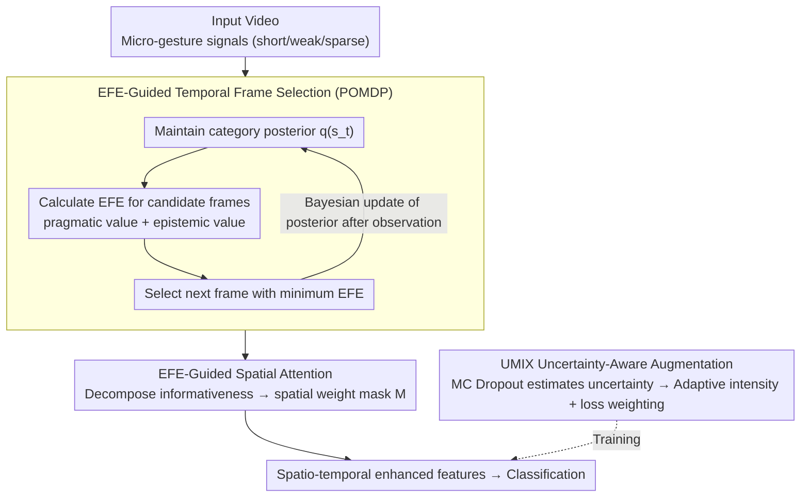

# Active Inference for Micro-Gesture Recognition: EFE-Guided Temporal Sampling and Adaptive Learning

**Conference**: CVPR 2026  
**arXiv**: [2603.07559](https://arxiv.org/abs/2603.07559)  
**Authors**: Weijia Feng et al. (Tianjin Normal University, Shenzhen University, Zhejiang University, Tianjin University)  
**Area**: Medical Imaging  
**Keywords**: Micro-Gesture Recognition, Active Inference, Expected Free Energy, POMDP, Uncertainty-Aware Augmentation

## TL;DR

Ours proposes the UAAI framework, which introduces Active Inference to micro-gesture recognition for the first time. Through EFE-guided temporal frame selection, spatial attention, and UMIX uncertainty-aware augmentation, it achieves 63.47% on the RGB modality of the SMG dataset, significantly outperforming traditional RGB methods.

## Background & Motivation

Micro-gestures refer to subtle bodily movements produced unconsciously during communication, such as slight finger taps or minor head tilts. Unlike conventional gesture recognition, micro-gestures present several unique challenges:

**Extremely Short Duration**: Usually <0.5 seconds, accounting for a very low proportion of long videos.

**Miniscule Amplitude**: The magnitude of motion is much smaller than daily gestures and is easily submerged in noise.

**High Individual Variability**: The same category of micro-gesture manifests differently across individuals.

**Spatiotemporal Sparsity**: Critical information only exists in specific subsets of frames and localized regions.

Existing methods (e.g., C3D, TSM, SlowFast) are designed for general action recognition and lack specific modeling for these "fleeting" signals. The **Core Problem** is: **How to accurately capture these fleeting and weak signals in both temporal and spatial dimensions?**

Active Inference is a cognitive framework under Bayesian Brain theory where an agent selects actions by minimizing "Expected Free Energy" (EFE)—pursuing both information gain (epistemic value) and goal fulfillment (pragmatic value). This naturally aligns with the need to "actively search for key frames and regions" in micro-gesture recognition.

## Method

### Overall Architecture

UAAI (Uncertainty-Aware Active Inference) is designed to handle "fleeting" micro-gesture signals—characterized by <0.5s duration, minimal amplitude, and spatiotemporal sparsity. Utilizing the cognitive framework of Active Inference, it treats the decision of "where to look" (in terms of frames and regions) as active actions. EFE is used to select the most informative frames and spatial areas, while an uncertainty-aware data augmentation stabilizes training. The overall architecture connects three modules: EFE-guided temporal frame selection for "which frames to watch," EFE-guided spatial attention for "which regions to watch," and UMIX for "how to learn robustly from noisy samples."

### Key Designs

**1. EFE-Guided Temporal Frame Selection: Modeling "Finding Key Frames" as an Active Decision Problem**

Critical information for micro-gestures resides in very few frames; uniform or random sampling is likely to miss them (dropping 5–6% in ablation). UAAI models frame selection as a POMDP: the state is the hidden belief about the micro-gesture category, the observation is the visual feature of the current frame, and the action is selecting the next frame to observe. At each timestep $t$, the category posterior $q(s_t)$ is maintained. A likelihood matrix $A_{a_t}$, parameterized by an MLP, maps observations to state updates. EFE is calculated for each candidate action:

$$G(a) = \underbrace{-D_{KL}[q(o|a) \| \tilde{p}(o)]}_{\text{pragmatic value}} - \underbrace{E_{q(o|a)}[H[q(s|o,a)]]}_{\text{epistemic value}}$$

The action with the minimum EFE is chosen—favoring frames that are both goal-oriented (pragmatic) and uncertainty-reducing (epistemic). After observing the new frame, the posterior is updated via Bayesian inference. Unlike post-hoc attention selection, EFE is forward-looking: it predicts which frame will best reduce category confusion. This module contributes the most in ablation studies (a 3.64% drop without it).

**2. EFE-Guided Spatial Attention: Allocating Informativeness Scores to Spatial Locations**

Even with the correct frames, micro-movements can be buried in the background. This module decomposes EFE along spatial dimensions to obtain informativeness scores for each location, generating a learnable spatial weight mask $M = \sigma(\text{Conv}([F_{\text{avg}}; F_{\text{max}}]))$, where $F_{\text{avg}}$ and $F_{\text{max}}$ are average and max-pooled features across channels. The mask enhances local regions where micro-gestures actually occur and suppresses irrelevant backgrounds, complementing temporal selection (dropping 2.45% individually; 6.21% if both temporal and spatial modules are removed, indicating synergy).

**3. UMIX Uncertainty-Aware Augmentation: Differentiated Treatment Based on Sample Uncertainty**

Micro-gesture data is noisy and ambiguous; treating all samples equally with augmentation can amplify noise gradients. UMIX uses Monte Carlo Dropout to estimate predictive uncertainty for each sample: samples with high uncertainty receive higher augmentation intensity but lower loss weights (to avoid noisy gradients), while low-uncertainty samples receive less augmentation and maintain normal weights. The mixing ratio is adaptively sampled from $\lambda = \text{Beta}(\alpha(u), \beta(u))$. This ensures augmentation intensity follows confidence levels, expanding diversity for hard samples without letting noise derail training (dropping 1.93% without it).

### Loss & Training

The total loss is based on Variational Free Energy (VFE) minimization: $L = L_{\text{accuracy}} + \beta \cdot L_{\text{complexity}}$, where $L_{\text{accuracy}}$ is cross-entropy for correct prediction and $L_{\text{complexity}}$ is the KL divergence between posterior and prior to prevent overfitting and encourage compact representations. Training involves alternating optimization: first warming up the base feature extractor, then end-to-end training of the spatio-temporal selection modules. UMIX calculates uncertainty online per mini-batch. EFE calculation is made differentiable via reparameterization.

## Key Experimental Results

### Main Results (SMG Dataset, RGB Modality)

| Method | Backbone | Top-1 Acc (%) |
|------|----------|---------------|
| C3D | 3D CNN | 45.90 |
| I3D | Inception | 50.23 |
| TSM | ResNet-50 | 58.69 |
| SlowFast | ResNet-50 | 56.42 |
| Video Swin-T | Swin | 59.14 |
| TimeSformer | ViT | 57.83 |
| **UAAI (Ours)** | **ResNet-50** | **63.47** |
| MS-G3D (Skeleton) | GCN | 64.75 |

UAAI reaches 63.47% in the RGB modality, significantly outperforming other RGB methods and approaching the skeleton-based MS-G3D.

### Ablation Study

| Configuration | Top-1 Acc (%) | Gain/Drop |
|------|---------------|------|
| Full UAAI | 63.47 | — |
| w/o EFE Temporal | 59.83 | -3.64 |
| w/o EFE Spatial | 61.02 | -2.45 |
| w/o UMIX | 61.54 | -1.93 |
| w/o EFE Temporal + Spatial | 57.26 | -6.21 |
| Random Temporal Sampling | 56.91 | -6.56 |
| Uniform Temporal Sampling | 58.12 | -5.35 |

### Key Findings

1. **EFE temporal selection contributes most** (-3.64%), validating that finding key frames is the primary bottleneck.
2. **Spatial attention is complementary** (-2.45%), further focusing on relevant body parts.
3. **UMIX stabilizes training** (-1.93%), effectively countering noise and ambiguity in micro-gesture data.
4. **Joint spatio-temporal removal causes a sharp decline** (-6.21%), indicating synergistic effects.
5. **EFE significantly outperforms random/uniform sampling** (by 6.56/5.35 points), proving the superiority of Active Inference over heuristic sampling.

## Highlights & Insights

1. **Cross-disciplinary Fusion**: Merges cognitive science (Free Energy Principle) with CV, providing a sophisticated theoretical motivation.
2. **POMDP for Frame Selection**: Unlike posterior attention, EFE is forward-looking, selecting frames expected to maximize uncertainty reduction.
3. **Global Uncertainty Awareness**: From information gain in EFE to adaptive augmentation in UMIX, uncertainty serves as a unified guiding signal.
4. **RGB Chasing Skeleton Performance**: Achieving 63.47% with pure RGB avoids the computational overhead of skeleton estimation in deployment.

## Limitations & Future Work

1. **Computational Efficiency**: EFE calculation requires forward passes for multiple actions, which may be heavy for long sequences.
2. **POMDP Approximation**: Practical implementation uses single-step approximations, potentially missing long-range dependencies.
3. **Dataset Diversity**: Primarily validated on SMG; cross-dataset generalization (e.g., iMiGUE) is needed.
4. **Domain Classification**: Strictly, micro-gesture recognition is behavior understanding rather than medical imaging, though the methodology is transferable.
5. **Multimodal Fusion**: Integration with skeleton modalities could yield further improvements.
6. **Uncertainty Overhead**: UMIX relies on multiple MC Dropout passes, increasing training time.

## Related Work & Insights

- **Free Energy Principle (Friston)**: The theoretical origin of Active Inference.
- **AdaFrame / SCSampler**: Frame sampling methods in video understanding, but based on RL rather than Active Inference.
- **MS-G3D**: A strong skeleton-based baseline nearly matched by the proposed RGB method.
- **Mixup / CutMix**: UMIX provides a meaningful uncertainty-aware extension to these classic augmentations.
- **Insight**: The EFE-guided selection framework can be generalized to other tasks requiring precise spatio-temporal localization (e.g., micro-expressions, pain detection, surgical step recognition).

## Rating

| Dimension | Score (1-5) | Description |
|------|-----------|------|
| Novelty | 4.5 | First introduction of Active Inference to this field; highly creative. |
| Technical Depth | 4 | Complete system including POMDP, EFE, and Bayesian updates. |
| Experimental Thoroughness | 3.5 | Detailed ablation, but restricted to few datasets. |
| Value | 3.5 | Practical RGB-only approach, despite the specialized niche. |
| Writing Quality | 4 | Balanced theoretical derivation and intuitive explanation. |
| **Overall Score** | **3.9** | Unique cognitive perspective with a high-value framework. |

<!-- RELATED:START -->

## Related Papers

- [\[CVPR 2026\] Region-Aware Instance Consistency Learning for Micro-Expression Recognition](region-aware_instance_consistency_learning_for_micro-expression_recognition.md)
- [\[CVPR 2026\] OMG-Bench: A New Challenging Benchmark for Skeleton-based Online Micro Hand Gesture Recognition](omg-bench_a_new_challenging_benchmark_for_skeleton-based_online_micro_hand_gestu.md)
- [\[CVPR 2026\] LaMoGen: Language to Motion Generation Through LLM-Guided Symbolic Inference](lamogen_language_to_motion_generation_through_llm-guided_symbolic_inference.md)
- [\[CVPR 2026\] Active Intelligence in Video Avatars via Closed-loop World Modeling](active_intelligence_in_video_avatars_via_closed-loop_world_modeling.md)
- [\[CVPR 2026\] Text-guided Feature Disentanglement for Cross-modal Gait Recognition](text-guided_feature_disentanglement_for_cross-modal_gait_recognition.md)

<!-- RELATED:END -->
