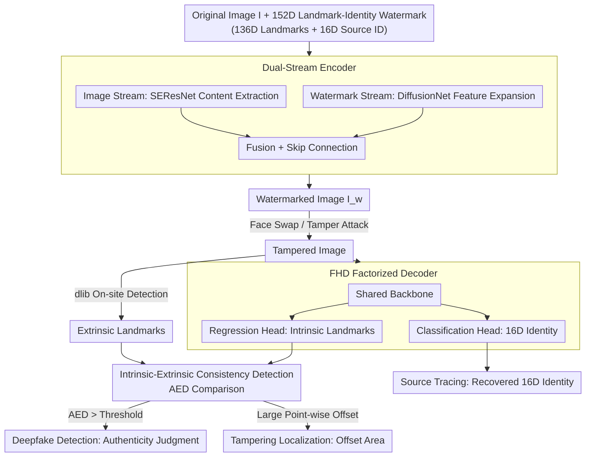

# All in One: Unifying Deepfake Detection, Tampering Localization, and Source Tracing with a Robust Landmark-Identity Watermark

**Conference**: CVPR2026  
**arXiv**: [2602.23523](https://arxiv.org/abs/2602.23523)  
**Code**: [GitHub](https://github.com/vpsg-research/LIDMark)  
**Area**: Human Understanding  
**Keywords**: deepfake detection, watermarking, tampering localization, source tracing, proactive forensics, facial landmark

## TL;DR

This paper proposes LIDMark, the first framework to unify deepfake detection, tampering localization, and source tracing into a single proactive forensics system. By embedding a 152-dimensional Landmark-Identity watermark (136D facial landmarks + 16D source ID), it utilizes intrinsic/extrinsic consistency to achieve three-in-one forensics, outperforming existing methods in both PSNR/SSIM and detection accuracy.

## Background & Motivation

The rapid development of Deepfake technology poses serious security threats. Existing forensic methods fall into two categories:

**Passive Forensics**: Directly extracts forgery traces from images for detection. Problems include: (a) Only supports binary classification (real/fake), failing to localize tampered regions or trace sources; (b) Poor generalization, with performance dropping sharply on unseen forgery methods.

**Proactive Forensics (Watermarking)**: Embeds a watermark into the image beforehand and performs forensics by analyzing the destruction or retention of the watermark. Limitations of current methods (e.g., FaceSigns, MBRS, PIMoG):
   - Most only support detection, not tampering localization.
   - Limited watermark capacity (usually 30 bits) makes it difficult to encode multiple types of information simultaneously.
   - Detection and localization require different watermark designs, making unification difficult.

**Key Insight**: Facial landmarks naturally possess two complementary properties: (1) Sensitivity to tampering (landmark distribution changes after a face swap), making them suitable for localization; (2) Identity (ID) components that need to be robust to forgery, making them suitable for source tracing. Encoding both as a unified watermark addresses all three forensic tasks.

## Core Problem

How to design a unified proactive forensic framework that achieves the following within a single watermark:
- **Deepfake Detection**: Determining if an image has been tampered with.
- **Tampering Localization**: Precisely localizing the tampered facial regions.
- **Source Tracing**: Tracing the original source identity of the image.

## Method

### Overall Architecture

LIDMark is a proactive forensic framework: before an image is released, an encoder embeds a 152-dimensional Landmark-Identity watermark (136D facial landmarks + 16D source ID) into the face image, resulting in a watermarked image $I_w = E(I, m)$. When this image is face-swapped or tampered with, the decoder recovers the originally embedded watermark and compares it with the landmarks re-detected from the current image. The discrepancy between "intrinsic vs. extrinsic" data simultaneously supports authenticity judgment, tampering localization, and source tracing, consolidating previously separate tasks into a single pipeline.

### Key Designs

**1. 152D Landmark-Identity Watermark: Upgrading Watermarks to Semantic Encoding**

Traditional proactive forensics treats watermarks as arbitrary bitstrings (usually 30 bits), which are insufficient for multi-source information or localization. LIDMark uses 136 dimensions for $(x, y)$ coordinates of 68 facial landmarks (normalized to $[0, 1]$) and 16 dimensions for binary source identity encoding. These two parts are complementary: landmarks are sensitive to tampering (recovered landmarks will mismatch the current face after swapping, aiding localization), while identity codes are designed to be robust (aiding source tracing). This semantic watermark allows a single image to encode both appearance and identity.

**2. Dual-Stream Encoder + FHD Factorized Decoder: Efficient Embedding and Extraction**

The encoder uses a dual-stream architecture: an image stream (SEResNet) for content features and a watermark stream (DiffusionNet) to expand the 152D vector into a feature map. These are fused with skip connections to preserve quality, such that $I_w = E(I, m)$, where $m = [m_{\text{land}}, m_{\text{id}}]$. The Factorized Head Decoder (FHD) uses a shared backbone to extract features, branching into a regression head for landmarks $\hat{m}_{\text{land}}$ (L1 loss) and a classification head for identity $\hat{m}_{\text{id}}$ (BCE loss). This sharing enables task synergy and parameter efficiency.

**3. Intrinsic-Extrinsic Consistency Detection: The Forensic Pivot**

With a recoverable semantic watermark, detection becomes a consistency check. Intrinsic landmarks $\hat{m}_{\text{land}}$ are recovered from the watermark (representing the original face), while extrinsic landmarks $m_{\text{ext}}$ are detected from the current image (e.g., via dlib).
- **Detection**: Calculated via Average Euclidean Distance $\text{AED} = \frac{1}{68}\sum_{i=1}^{68} \| \hat{p}_i - p_i^{\text{ext}} \|_2$; if $\text{AED} > \tau$, the image is forged.
- **Localization**: High-offset points indicate the tampered region.
- **Tracing**: Derived directly from the classification head's 16D identity output.

### Loss & Training

Training follows two stages: Stage 1 pre-trains the encoder-decoder using conventional distortions (JPEG, noise, cropping). Stage 2 fine-tunes the model on forged images from SimSwap, UniFace, CSCS, and StarGAN-v2 to strengthen deepfake robustness. The total loss is:

$$\mathcal{L} = \lambda_1 \mathcal{L}_{\text{image}} + \lambda_2 \mathcal{L}_{\text{land}} + \lambda_3 \mathcal{L}_{\text{id}}$$

Where $\mathcal{L}_{\text{image}}$ is the quality loss (L2 + LPIPS), $\mathcal{L}_{\text{land}}$ is the landmark regression L1 loss, and $\mathcal{L}_{\text{id}}$ is the ID classification BCE loss.

## Key Experimental Results

### Image Quality

| Resolution | PSNR ↑ | SSIM ↑ | Capacity |
|------------|--------|--------|----------|
| 128×128    | **40.22** | **0.98** | 152 bits |
| 256×256    | **44.31** | **0.99** | 152 bits |
| Best Baseline (MBRS)| 38.76 | 0.97 | 30 bits |

Even with higher capacity, LIDMark outperforms all baselines in image quality.

### Deepfake Detection Performance

| Dataset    | Method  | AUC ↑ |
|------------|---------|-------|
| CelebA-HQ  | LIDMark | **Best** |
| LFW        | LIDMark | **Best** |

LIDMark achieves superior AUC compared to existing proactive forensic methods on CelebA-HQ and LFW.

### Tampering Localization Accuracy

LIDMark produces tampering heatmaps highly consistent with face-swapped regions through point-wise offset analysis, outperforming methods based on global watermark discrepancies.

### Source Tracing Accuracy

The 16D ID recovery accuracy remains above 95% after various forgery attacks, proving the robustness of the identity component.

### Ablation Study

| Component | PSNR | Detection AUC | Description |
|-----------|------|---------------|-------------|
| Full LIDMark | 40.22 | Best | — |
| No skip connection | 38.5 | Lower | Significant drop in image quality |
| Dual Decoders instead of FHD | 39.8 | Comparable | More parameters, slight quality drop |
| Stage 1 Training Only | 40.1 | Lower | Not robust to deepfake attacks |

## Highlights & Insights

1. **Unified Framework**: First to unify detection, localization, and tracing into a single watermark scheme.
2. **Ingenious Watermark Design**: Exploits the dual attributes of landmarks (tamper-sensitivity + semantic richness) to move from "bit encoding" to "semantic encoding."
3. **Intrinsic-Extrinsic Consistency**: The core innovation that transforms forensics into a consistency check, naturally extending detection to localization.
4. **FHD Factorized Decoding**: A shared backbone with task-specific heads is more efficient than separate designs.
5. **High Capacity with High Quality**: Achieves 152 bits capacity—far exceeding the 30 bits of prior work—while maintaining superior PSNR/SSIM.

## Limitations & Future Work

1. **Proactive Nature**: Requires embedding before image release; ineffective for existing legacy images.
2. **Resolution Constraints**: Experiments only cover 128×128 and 256×256; high-resolution (1024+) scalability is unverified.
3. **Forgery Coverage**: Fine-tuning used 4 methods; generalization to newer generative techniques (e.g., Diffusion Models) requires further study.
4. **Detector Dependency**: Accuracy depends on the extrinsic landmark detector (e.g., dlib); failures in detection affect the framework.
5. **Adversarial Robustness**: Robustness against targeted adversarial watermark removal attacks was not extensively discussed.

## Related Work & Insights

- Compared to **FaceSigns** (2022): FaceSigns only handles detection; LIDMark extends to localization and tracing.
- Compared to **MBRS** (2021): MBRS lacks localization and has low capacity (30 bits); LIDMark provides 152 bits and localization.
- Compared to passive methods (**Xception**, **Face X-ray**): Passive methods generalize poorly; LIDMark trades deployment convenience for reliable three-in-one capabilities.
- **Insight**: Watermarks do not have to be arbitrary bits. Utilizing domain semantics (landmarks) allows for functionality far beyond traditional watermarking, a concept that could be applied to medical or satellite imagery.

## Rating

- **Novelty**: ⭐⭐⭐⭐⭐ — First three-in-one proactive framework with ingenious watermark design.
- **Experimental Thoroughness**: ⭐⭐⭐⭐ — Strong baseline comparisons, though lacks verification on ultra-high-resolution models.
- **Value**: ⭐⭐⭐⭐ — High practical value for proactive forensics.
- **Writing Quality**: ⭐⭐⭐⭐ — Clear framework description and logical motivation.
- **Overall Rating**: ⭐⭐⭐⭐ (4.0/5)

<!-- RELATED:START -->

## Related Papers

- [\[CVPR 2026\] Unleashing Vision-Language Semantics for Deepfake Video Detection](unleashing_vision-language_semantics_for_deepfake_video_detection.md)
- [\[CVPR 2026\] BarbieGait: An Identity-Consistent Synthetic Human Dataset with Versatile Cloth-Changing for Gait Recognition](barbiegait_an_identity-consistent_synthetic_human_dataset_with_versatile_cloth-c.md)
- [\[CVPR 2026\] Superman: Unifying Skeleton and Vision for Human Motion Perception and Generation](superman_unifying_skeleton_and_vision_for_human_motion_perception_and_generation.md)
- [\[CVPR 2026\] ReGenHOI: Unifying Reconstruction and Generation for 3D Human-Object Interaction Understanding](regenhoi_unifying_reconstruction_and_generation_for_3d_human-object_interaction_.md)
- [\[CVPR 2025\] Two is Better than One: Efficient Ensemble Defense for Robust and Compact Models](../../CVPR2025/human_understanding/two_is_better_than_one_efficient_ensemble_defense_for_robust_and_compact_models.md)

<!-- RELATED:END -->
