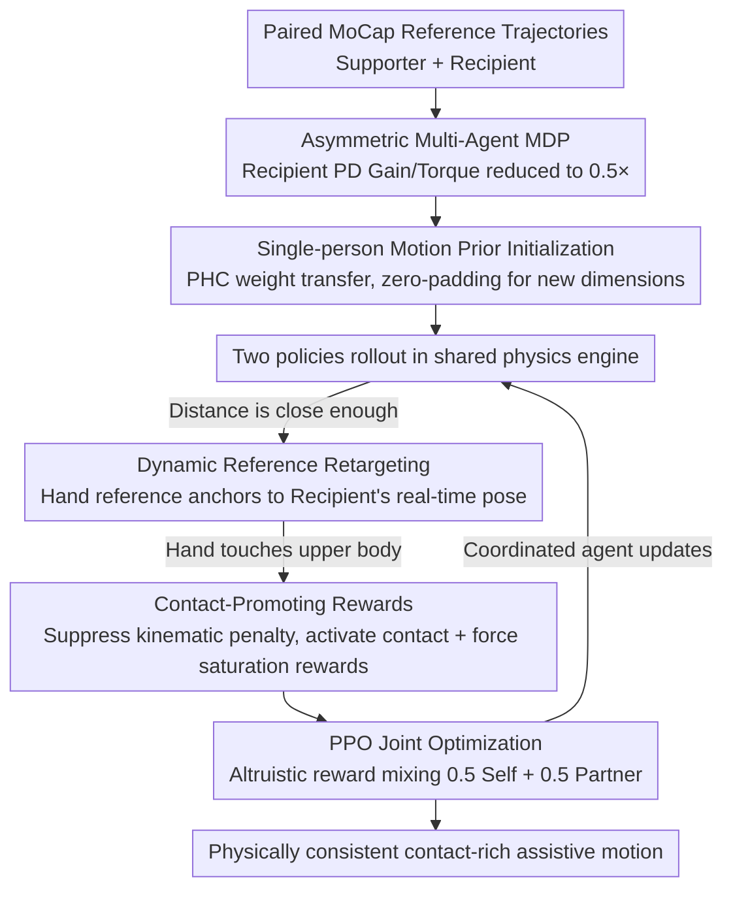

# AssistMimic: Physics-Grounded Humanoid Assistance via Multi-Agent RL

**Conference**: CVPR 2026  
**arXiv**: [2603.11346](https://arxiv.org/abs/2603.11346)  
**Code**: [Project Page](https://yutoshibata07.github.io/AssistMimic/)  
**Area**: Others  
**Keywords**: Multi-Agent Reinforcement Learning, Physics Simulation, Assistive Behavior, Motion Mimicry, Contact-rich Interaction  

## TL;DR

The first Multi-Agent RL (MARL) framework for imitation learning of contact-rich human-human assistive behaviors in physics simulation. It makes MARL viable in high-contact settings through motion prior initialization, dynamic reference retargeting, and contact-promoting rewards.

## Background & Motivation

**Background**: Single-person motion tracking (e.g., PHC, DeepMimic) can successfully imitate a wide range of human actions but is primarily limited to non-contact social interactions or isolated movements. Assistive scenarios (e.g., helping a fallen person up, caring for bedridden patients) require continuous perception of a partner and adaptation to their dynamic changes, involving tight contact and force exchange—significantly more challenging than non-contact social interactions like high-fives.

**Limitations of Prior Work**: Previous methods utilized "kinematic playback" strategies—generating the movement of the assisted person independently before training the supporter's response. However, in assistive scenarios, the recipient is physically incapable of completing the movement independently (e.g., a person with muscle weakness cannot stand up alone); this paradigm is fundamentally inapplicable. Decoupling the learning of the two agents breaks physical consistency.

**Key Challenge**: RL training for contact-rich assistive motion is extremely unstable—minute errors in contact position and force can cause the recipient to lose balance. Furthermore, severe occlusion in MoCap data leads to highly noisy reference trajectories. Consequently, a comprehensive set of technical components is needed to make MARL viable in physically tight-coupling scenarios.

## Method

### Overall Architecture

This paper aims to enable a simulated humanoid (Supporter) to "assist" another weakened person (Recipient) in a physics simulation—such as lifting a fallen person or turning over a bedridden person—rather than just mimicking movements in the air. To achieve this, the task is formulated as an **asymmetric multi-agent MDP**: two agents have independent policies but share the same physics engine, jointly optimized via PPO. The key lies in the "asymmetry": the Recipient is artificially weakened to simulate physical impairment—its PD control gains and maximum joint torques are reduced to $0.5\times$ (both lower and upper limbs). Thus, the Recipient cannot stand up alone and must rely on real contact forces applied by the Supporter. This approach eliminates the fallback of the old paradigm "generate recipient motion first, then train supporter response," forcing both policies to learn together in a physically tight-coupled manner. This introduces significant difficulty: small errors in contact can lead to failure, and noisy MoCap references make direct MARL convergence nearly impossible. The following three designs are introduced to transform the training from "unfeasible" to viable: **Single-person motion prior initialization** provides a stable starting point, **dynamic reference retargeting** ensures precise assistance, and **contact-promoting rewards** ensure firm support. These are sequentially integrated into the "initialization → proximity rollout → contact" data flow.

### Key Designs

**1. Motion Prior Initialization: Providing a stable starting point for tight-coupled MARL**

When training from scratch, both agents must simultaneously learn to stand, walk, and contact each other, resulting in a search space that is too vast—experiments show 0% success rates or reward hacking. The approach here uses a pre-trained PHC single-person tracking controller to initialize **shared network parameters** for both policies. This grants them basic standing and walking capabilities from the start, allowing them to focus on learning contact coordination. A challenge is that the assistive task includes "partner state" as additional input, causing a dimension mismatch. The solution is to zero-pad the new input dimensions and define the weights as $\mathbf{W}_{new} = [\mathbf{W}_{prior} \mid \mathbf{0}]$. This ensures the initial output matches the single-person prior, preventing the model from being derailed by random new parameters.

**2. Dynamic Reference Retargeting: Anchoring the supporter's hands to the partner**

Where the supporter's hands should be placed is originally guided by a MoCap reference trajectory. However, these trajectories are noisy due to occlusion; strictly following them might cause the hands to deviate from the recipient's actual body position. If contact is lost, the weakened recipient immediately falls. The retargeting mechanism switches the supporter's hand reference from a "fixed world-frame reference" to an "offset relative to the recipient's current pose" when the agents are close. Thus, the target for the hands is no longer a point in space but a specific body part of the partner, moving with their real-time pose. Ablation studies show that removing this leads to a $-10.3\%$ performance drop in bed-care scenarios (HHI), indicating that movements with significant partner pose changes rely heavily on this design.

**3. Contact-Promoting Rewards: Changing rewards during contact**

Pure kinematic tracking rewards have an inherent contradiction: under noisy references, performing "correct physical support" might be penalized for deviating from the reference, leading the policy to avoid contact. This method switches rewards based on distance—when the supporter's hand nears the recipient's upper body, kinematic tracking penalties are suppressed, and contact-based rewards are activated. These include a **sparse contact reward** for successful contact and a **force saturation aggregation function** to score the quality of contact force (forces too small don't count, and rewards cap after saturation). This retargets the reward signal from "staying on the reference trajectory" to "actually supporting the person."

### A Complete Example: Helping a person stand up

Integrated, the three designs handle different stages of the assisting process:

- **Start (Prior Init)**: Policies start with PHC weights; the supporter stands and approaches stably, while the recipient (PD gain $0.5\times$) tries but fails to rise alone. Without the prior, this step usually results in a 0% success rate.
- **Approach (Retargeting Trigger)**: Once the supporter is close, hand references anchor to the recipient's pose. Even if the MoCap reference jitters, the supporter's hands remain aimed at the partner's torso/arms.
- **Contact (Promotion Reward)**: Upon touching the recipient's upper body, kinematic penalties are suppressed and contact rewards activate. The force saturation function drives the supporter to apply sufficient force to lift the recipient.
- **Result**: The recipient stands using the external force. These designs ensure the supporter "can move," "targets precisely," and "supports firmly."

### Loss & Training

Each agent's total reward is an equal mix of task reward and AMP adversarial reward: $r = 0.5\,r_{task} + 0.5\,r_{AMP}$. To encourage altruism, the supporter's final reward is a blend of its own and the recipient's: $r_{sup} = 0.5\,r_{sup}^{self} + 0.5\,r_{rec}$. This links the supporter's gains to the recipient's success. Training involves two stages: training expert policies on individual motion clips, then distilling these via DAgger into a generalist policy (improving success from $39.8\%$ to $64.7\%$).

## Key Experimental Results

### Main Results

| Dataset | Metric | AssistMimic | w/o Init | w/o Contact Reward |
|---------|------|-------------|---------|-----------|
| Inter-X | SR | 83.3% | 0% | 77.1% |
| HHI-Assist | SR | 73.2% | hacking | 27.7% |

### Ablation Study

| Configuration | Key Metric | Description |
|------|---------|------|
| Joint vs. Sequential | 72.8% vs 50.5% | Joint optimization is crucial for physical consistency |
| Generalist Policy (DAgger) | SR=64.7% | Direct training yielded only 39.8% |
| w/o Dynamic Retargeting | -10.3% (HHI) | Critical for scenarios like bed care |
| 1.5× Weight / 0.5× PD | Still Succeeds | Zero-shot robustness verification |

### Key Findings

- Motion prior initialization is indispensable: results in 0% SR on Inter-X and reward hacking on HHI-Assist without it.
- Successful tracking of trajectories generated by diffusion models demonstrates generalization to unseen motions.
- Failure modes are primarily due to insufficient hand dexterity for fine-grained tasks like grasping and lifting.

## Highlights & Insights

- Achieved the first multi-agent imitation learning of contact-rich assistive behavior in physics simulation, filling the gap between "social interaction" and "force-exchange assistance." The experimental design of isolating assistance contribution by reducing recipient physical parameters is highly ingenious.

## Limitations & Future Work

- Hand dexterity remains a major bottleneck, requiring more detailed hand modeling.
- Policies rely on privileged physical state information and lack visual observations.
- Sim-to-real transfer has not yet been verified.
- Lack of tight coupling between the motion planner and tracking controller.

## Related Work & Insights

- **vs Human-X**: Uses kinematic playback + reactive strategies, leading to physical inconsistency in assistive scenarios where the recipient "stands up on their own."
- **vs PHC**: AssistMimic builds upon PHC, extending it to a dual-person partner-aware architecture.

## Rating

- Novelty: ⭐⭐⭐⭐⭐ First to solve assistive motion mimicry; innovative formalization and technical solutions.
- Experimental Thoroughness: ⭐⭐⭐⭐⭐ Two datasets, multiple scenarios, detailed ablations, and generalization tests.
- Writing Quality: ⭐⭐⭐⭐ Clear structure and complete technical details.
- Value: ⭐⭐⭐⭐⭐ Opens a new direction for assistive robot control.

<!-- RELATED:START -->

## Related Papers

- [\[CVPR 2026\] InterAgent: Physics-based Multi-agent Command Execution via Diffusion on Interaction Graphs](interagent_physics-based_multi-agent_command_execution_via_diffusion_on_interaction_graphs.md)
- [\[CVPR 2026\] PHASE-Net: Physics-Grounded Harmonic Attention System for Efficient Remote Photoplethysmography Measurement](phase-net_physics-grounded_harmonic_attention_system_for_efficient_remote_photop.md)
- [\[CVPR 2026\] SyncMos: Scalable Motion Synchronisation for Multi-Agent Scene Interaction](syncmos_scalable_motion_synchronisation_for_multi-agent_scene_interaction.md)
- [\[CVPR 2026\] Push-and-Step: From RL-Based Balance Recovery to Physical Simulation of Dense Crowds](push-and-step_from_rl-based_balance_recovery_to_physical_simulation_of_dense_cro.md)
- [\[CVPR 2026\] Humanoid-GPT: Scaling Data and Structure for Zero-Shot Motion Tracking](humanoid-gpt_scaling_data_and_structure_for_zero-shot_motion_tracking.md)

<!-- RELATED:END -->
