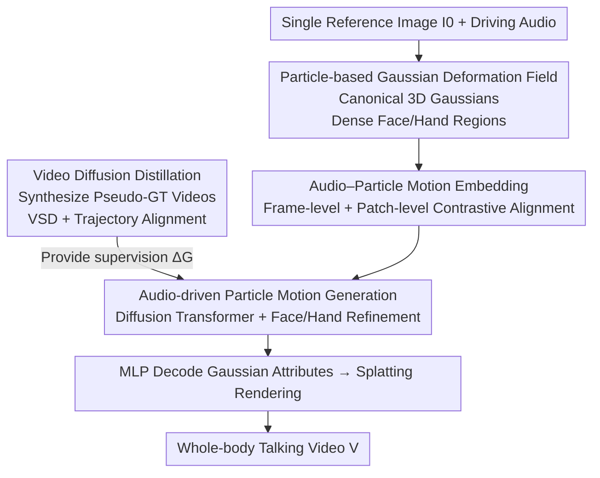

# AudioAvatar: Personalized Audio-driven Whole-body Talking Avatars

**Conference**: CVPR 2026  
**Paper**: [CVF Open Access](https://openaccess.thecvf.com/content/CVPR2026/html/Lee_AudioAvatar_Personalized_Audio-driven_Whole-body_Talking_Avatars_CVPR_2026_paper.html)  
**Code**: None  
**Area**: Human Understanding / Digital Humans / 3D Vision  
**Keywords**: Audio-driven digital humans, 3D Gaussians, Particle deformation fields, Diffusion distillation, Single-image personalization  

## TL;DR
AudioAvatar reconstructs a canonical 3D Gaussian whole-body digital human from a single portrait and allows audio to **directly** modulate the motion trajectory of each Gaussian particle (skipping the lossy intermediate chain of "audio → parametric pose → rendering"). By leveraging large-scale audio-driven video diffusion models for feature distillation, it significantly outperforms pose-driven baselines in lip synchronization, facial micro-expressions, and gesture naturalness.

## Background & Motivation
**Background**: Current approaches for "talking whole-body digital humans" primarily follow two paths: (a) Large-scale **audio-driven video diffusion models** (e.g., OmniAvatar, HunyuanVideo-Avatar), which directly generate talking videos from a reference image and audio; (b) **Templated 3D digital humans**, using SMPL/SMPL-X to fit canonical geometry and appearance, followed by pose-driven Linear Blend Skinning (LBS) combined with NeRF or 3D Gaussian rendering.

**Limitations of Prior Work**: Generating videos via diffusion models is typically limited to the head or upper body, often results in blurry hands and facial details, suffers from identity drift in long sequences, and is slow due to iterative denoising. Templated 3D digital humans provide realistic rendering, but driving them with speech requires an **independent audio-to-pose module** to predict parametric body/facial/hand poses, which are then fed into a pose-conditional renderer.

**Key Challenge**: The intermediate audio-to-pose step serves as a **lossy bottleneck**. Errors from quantization, retargeting, and frame-by-frame tracking accumulate, causing poor lip-sync and smoothing out critical **micro-articulations** (such as lip closure, cheek puffing, nasolabial fold movements, blinking, and subtle finger gestures) essential for realism. This issue is particularly pronounced in the ill-posed setting of "single-image personalization."

**Goal**: To obtain from a single photo: (1) a deformable, identity-preserving whole-body canonical digital human, and (2) a controller capable of directly aligning face/hand/body dynamics from audio.

**Key Insight**: **Allow audio to directly modulate the per-particle trajectories of canonical Gaussian particles**, mapping audio to a dense differentiable deformation field end-to-end. This completely removes the two lossy handovers of "audio → pose → rendering" and uses priors from large video diffusion models via distillation to compensate for the scarcity of single-image supervision.

## Method

### Overall Architecture
Given a reference image $I_0$ and driving audio, the goal is to synthesize an identity-preserving talking video $V=\{I_t\}_{t=0}^{T}$. The scene is represented by a set of 3D Gaussians $G=\{g_i\}_{i=1}^{N}$ in a canonical space, where particles are dense in expressive regions like the face/hands and sparse elsewhere to optimize computation. The pipeline consists of four integrated components: first, aligning audio features and Gaussian deformation into the same semantic manifold (embedding); second, using a Diffusion Transformer to generate per-particle motion from aligned audio with specific refinement for the face and hands (generation); third, decoding the generated particle motion into Gaussian attributes via an MLP for splatting-based rendering; and finally, supervising the generator and deformation field via a **video diffusion distillation** module. This module synthesizes identity-specific talking videos as pseudo-GT and injects diffusion priors into particle dynamics using score distillation and trajectory alignment losses.

The training setup is "self-bootstrapping": a large-scale audio-driven video diffusion model is first used to synthesize identity-specific talking videos $\hat{V}_i$. A deformable Gaussian splatting model is then fitted to these videos to extract Gaussian deformations $\Delta G$. These **pseudo-ground-truth motions** serve as supervision for learning the "audio-particle embedding" and "audio-driven particle generation."

### Key Designs

**1. Particle-based Gaussian Deformation Field: Direct Audio-to-Trajectory Mapping**

To address the lossy "audio → parametric pose" bottleneck, the authors abandon low-dimensional pose prediction (e.g., SMPL-X). Instead, they reconstruct an identity-preserving canonical digital human from a single photo and instantiate Gaussian particles. Particles are **dense** in highly expressive areas like the mouth, eyes, and hands, and **sparse** elsewhere for efficiency. Audio features **directly** modulate the trajectory of each particle, allowing local control of micro-articulations in the face/hands while maintaining global body coordination. Running this control at audio-synced frame rates enables the expression of rapid transients (e.g., plosive lip closures) and long-term rhythmic movements (e.g., head nods or beat gestures). To suppress jitter while retaining high-frequency details, regularization is applied to locality and the frequency spectrum, alongside ARAP (As-Rigid-As-Possible) distance preservation to constrain the geometry between k-nearest neighbor particles across adjacent time steps.

**2. Audio–Particle Motion Embedding: Aligning Modalities in a Shared Manifold**

Directly regressing particle motion from raw audio is unstable due to modality misalignment. Inspired by CLIP-style contrastive learning, the authors train a particle motion encoder $\mathcal{E}_X$ to map Gaussian deformations $\Delta G_t$ into implicit motion features $x_t=\mathcal{E}_X(\Delta G_t)$. This ensures high cosine similarity for **semantically corresponding** audio-particle pairs and low similarity for mismatched pairs, minimizing a frame-level similarity loss $\mathcal{L}_{sim}$ to obtain a modality-invariant representation. An additional **patch-level contrastive** layer is added: audio features $a_t$ and motion features $x_t$ are sliced into short-term patches via a sliding window, and cosine similarity is calculated between mean-pooled patch representations. This hierarchical alignment ensures both frame-level semantic matching and temporal smoothness within short-term contexts.

**3. Audio-driven Particle Motion Generation: Diffusion Transformer with Refinement**

A single network struggles to manage both "large body movements" and "high-frequency hand/mouth details." The authors use a layered design: since motion is represented in a compact low-dimensional manifold, a high-capacity **Diffusion Transformer** $F$ first synthesizes whole-body particle motion $x_t=\{x_t^{body}, x_t^{face}, x_t^{hand}\}$. It takes noisy motion $X_\tau$ concatenated with audio features $A$, with diffusion step $\tau$ injected via FiLM, to predict the clean motion:
$$X_0 = F(X_\tau \mid A, \tau)$$
Subsequently, a Transformer **refinement module** processes the face/hand subset. Crucially, this module is **not** conditioned on diffusion step $\tau$, but rather on the motion time index $t$ within the talking sequence, enabling time-consistent fine-grained motion refinement. Finally, the complete set of particle motions is decoded via an MLP into Gaussian attributes $\{G_0,\dots,G_T\}$ for splatting rendering.

**4. Video Diffusion Distillation: Leveraging Large-model Priors for Supervision**

To overcome sparse supervision in single-image personalization, the authors distill "audio-motion priors" from large video diffusion models. The first step involves **hybrid data synthesis**: a text-conditioned base model generates diverse identities (gender, age, hair, clothing) based on an attribute dictionary. These are paired with TTS-synthesized speech and fed into multiple **audio-driven video diffusion models** to generate synced talking videos. The second step injects these priors using two losses: **Video Score Distillation (VSD)** ensures rendered frames fall within the teacher's audio-conditioned video manifold. For noise level $\tau$ and teacher score network $s_\psi$, the gradient is:
$$\nabla_\Phi \mathcal{L}_{vsd} = \mathbb{E}_{t,\tau,\epsilon}\Big[w(\tau)\big(s_\psi(\tilde{I}_{t,\tau},\tau,c)-\epsilon\big)\frac{\partial \tilde{I}_{t,\tau}}{\partial \Phi}\Big]$$
where $\tilde{I}_{t,\tau}=\alpha(\tau)\hat{I}_t+\sigma(\tau)\epsilon$. The **trajectory alignment loss** ensures temporal consistency of 4D Gaussian deformations by using diffusion-generated pixel motion as GT, accumulating re-projection errors for rendered centers $\hat{u}_t^i$ and target pixels $u_t^i$:
$$\mathcal{L}_{traj}=\sum_i\sum_t \lVert \hat{u}_t^i - u_t^i \rVert_2^2$$
L1 loss is also used to enforce consistency between rendered frames and diffusion-generated images.

### Loss & Training
The model is trained end-to-end, with rendering gradients backpropagated through time to the audio-conditioned deformation field. The total objective includes: the $\mathcal{L}_{simple}$ diffusion loss for particle generation; video score distillation $\mathcal{L}_{vsd}$; trajectory alignment $\mathcal{L}_{traj}$; L1 rendering loss; and ARAP regularization for k-NN particles. The embedding phase utilizes frame-level and patch-level contrastive losses $\mathcal{L}_{sim}$.

## Key Experimental Results

### Main Results
Testing was performed on 30 unseen talking subjects (from public causal conversational datasets and self-generated data). Baselines include single-image Gaussian digital humans (LHM, PERSONA paired with an external audio-to-pose converter [6]) and audio-driven video diffusion models (OmniAvatar, HunyuanVideo-Avatar, EchoMimicV2).

| Method | IQA↑ | ASE↑ | SyncC↑ | SyncD↓ | HKC↑ | CSIM↑ | SSIM↑ | PSNR↑ | FID↓ | FVD↓ |
|------|------|------|--------|--------|------|-------|-------|-------|------|------|
| EchoMimicV2 | 3.37 | 1.98 | 4.12 | 10.20 | 0.836 | 0.458 | 0.660 | 15.90 | 22.8 | 420 |
| OmniAvatar | 3.99 | 2.64 | 6.40 | 7.60 | 0.858 | 0.525 | 0.705 | 17.20 | 18.6 | 350 |
| HunyuanVideo-Avatar | 4.08 | 2.71 | 6.90 | 7.12 | 0.875 | 0.539 | 0.709 | 17.55 | 17.2 | 320 |
| LHM | 3.80 | 2.50 | 6.10 | 7.00 | 0.860 | 0.500 | 0.700 | 16.90 | 19.5 | 365 |
| PERSONA | 3.88 | 2.58 | 6.30 | 6.80 | 0.868 | 0.510 | 0.708 | 17.20 | 18.9 | 345 |
| **AudioAvatar (Ours)** | **4.22** | **2.83** | **7.20** | **5.42** | **0.897** | **0.551** | **0.742** | **18.30** | **12.4** | **240** |

Compared to single-image Gaussian baselines: perceptual quality IQA +3.4% / ASE +4.4%, lip-sync SyncC +4.3% / SyncD +20.3%, low-level fidelity SSIM +4.7% / PSNR +4.3%. Compared to the strongest diffusion baseline: FID decreased by 27.9%, FVD decreased by 25.0%, and gesture fidelity HKC +2.5%.

### Ablation Study
| Configuration | SyncC↑ | SyncD↓ | HKC↑ | FID↓ | FVD↓ | Description |
|------|--------|--------|------|------|------|------|
| Full model | 7.20 | 5.42 | 0.897 | 12.4 | 240 | Full model |
| w/o Audio–Particle Embedding | 7.05 | 5.60 | 0.890 | 13.8 | 265 | Sync decreases, modality alignment suffers |
| w/o Patch-level Alignment | 7.15 | 5.45 | 0.870 | 13.1 | 252 | Lower SSIM/PSNR, poorer spatial consistency |
| w/o Face/Hand Refinement | 7.10 | 5.50 | 0.860 | 13.7 | 258 | Structural degradation in high-articulation regions |
| w/o Hybrid Synthesis | 6.85 | 5.80 | 0.888 | 14.2 | 272 | Significant drop in audio-video sync |
| w/o Video Score Distillation | 6.90 | 5.78 | 0.886 | 15.0 | 290 | Temporal smoothness disrupted |
| w/o Trajectory Alignment | 6.70 | 6.20 | 0.872 | 15.6 | 310 | **Worst sync**: SyncD 5.42 → 6.20 |

### Key Findings
- **Trajectory alignment loss is critical for synchronization**: Its removal caused SyncD to spike from 5.42 to 6.20, indicating that trajectory-level (rather than per-frame pose-level) alignment is key to stable, coherent motion.
- **VSD loss primarily governs temporal smoothness**: Its removal increased FVD from 240 to 290, validating its role in injecting the teacher's temporal coherence into particle dynamics.
- **Face/hand refinement is essential for gestures**: HKC dropped from 0.897 to 0.860 without it, proving its responsibility for structural consistency in high-articulation regions.

## Highlights & Insights
- **The "Pose-Free" Bet**: Replacing parametric poses with dense differentiable per-particle trajectories fundamentally eliminates error accumulation from quantization, retargeting, and tracking. This paradigm is potentially transferable to any "signal → pose → rendering" pipeline (e.g., sign language, dance).
- **Adaptive Particle Density**: Using dense particles for the mouth/eyes/hands and sparse elsewhere efficiently allocates the computational budget to regions requiring high-frequency control.
- **Self-bootstrapping Supervision**: Synthesizing pseudo-GT via diffusion models and fitting deformable Gaussians bypasses the severe data scarcity of "paired whole-body video + audio" datasets.
- **Refinement Conditioning**: Changing the conditioning axis of the refinement module from diffusion step $\tau$ to real-time index $t$ is a subtle but effective design for time-consistent fine-tuning.

## Limitations & Future Work
- **Heavy Dependence on Teacher Models**: Pseudo-GT quality and identity diversity are capped by the upper-bound performance of the upstream video diffusion models; teacher biases in specific mouth shapes or languages may be distilled.
- **Data and Scalability**: Public conversational whole-body data is scarce. Testing was limited to 30 subjects and short sequences (5–10s); long-term stability and cross-lingual generalization require further validation.
- **Implementation Details**: Locality/spectral regularization and ARAP weights are briefly mentioned; reproduction requires further parameter tuning.
- **Future Directions**: Exploring multi-teacher ensembles, introducing explicit long-term identity memory, and utilizing larger-scale real conversational data.

## Related Work & Insights
- **Vs Audio-driven Video Diffusion**: These directly generate video but are limited by blurry details, identity drift, and lack of explicit 3D geometry. Ours uses explicit 3D Gaussians to lock identity in canonical space, enabling efficient rendering and superior FID/FVD.
- **Vs Pose-driven Gaussian Avatars**: These require external converters, which act as a lossy bottleneck. By driving particles directly with audio, ours achieves better sync and micro-articulation.
- **Vs SMPL/NeRF Pipelines**: Ours retains the realism of Gaussian rendering but replaces the "pose template + LBS" with an implicit particle deformation layer to better capture facial dynamics and finger gestures.

## Rating
- Novelty: ⭐⭐⭐⭐⭐ Bridging audio directly to per-particle trajectories is a clean and powerful paradigm shift for digital humans.
- Experimental Thoroughness: ⭐⭐⭐⭐ Metrics are comprehensive and ablations are thorough, though the test set size and long-sequence validation are limited.
- Writing Quality: ⭐⭐⭐⭐ Motivation and pipeline are clear, though some regularization details are brief.
- Value: ⭐⭐⭐⭐⭐ The combination of "removing lossy intermediate layers + diffusion distillation" is highly valuable for conversational digital human applications.

<!-- RELATED:START -->

## Related Papers

- [\[CVPR 2026\] UniLS: End-to-End Audio-Driven Avatars for Unified Listening and Speaking](unils_end-to-end_audio-driven_avatars_for_unified_listening_and_speaking.md)
- [\[CVPR 2026\] PC-Talk: Precise Facial Animation Control for Audio-Driven Talking Face Generation](pc-talk_precise_facial_animation_control_for_audio-driven_talking_face_generatio.md)
- [\[CVPR 2026\] Talking Together: Synthesizing Co-Located 3D Conversations from Audio](talking_together_synthesizing_co-located_3d_conversations_from_audio.md)
- [\[CVPR 2026\] ActAvatar: Temporally-Aware Precise Action Control for Talking Avatars](actavatar_temporally-aware_precise_action_control_for_talking_avatars.md)
- [\[CVPR 2026\] CIGPose: Causal Intervention Graph Neural Network for Whole-Body Pose Estimation](cigpose_causal_intervention_graph_neural_network_for_whole-body_pose_estimation.md)

<!-- RELATED:END -->
