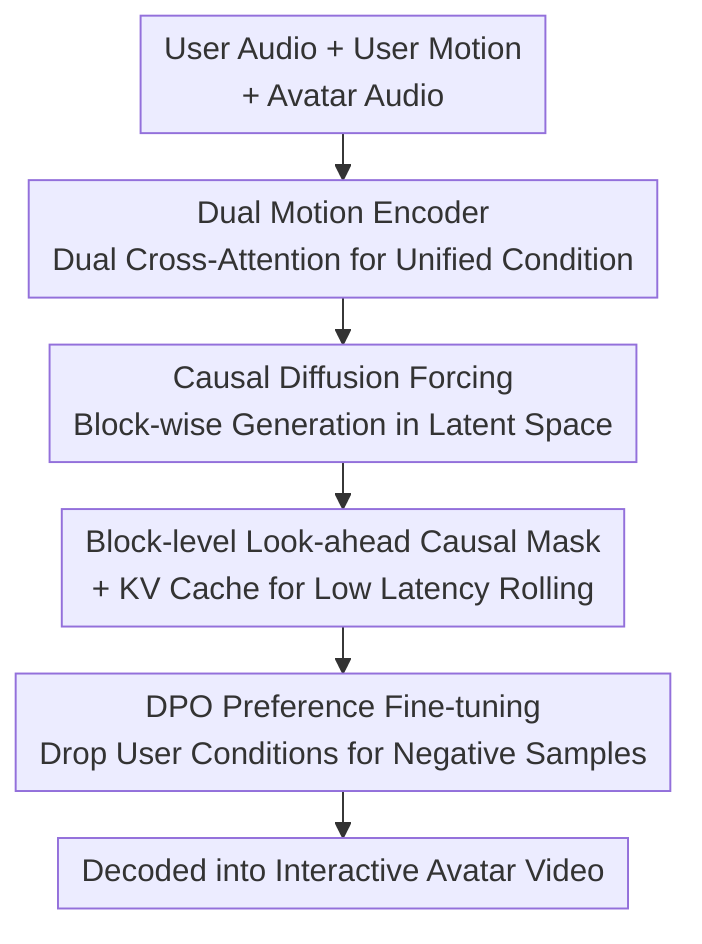

# Avatar Forcing: Real-Time Interactive Head Avatar Generation for Natural Conversation

**Conference**: CVPR 2026  
**arXiv**: [2601.00664](https://arxiv.org/abs/2601.00664)  
**Code**: https://taekyungki.github.io/AvatarForcing (Project Page)  
**Area**: Human Understanding / Digital Human / Diffusion Models  
**Keywords**: Interactive Digital Human, Diffusion Forcing, Causal Generation, Preference Optimization, Real-time Low Latency

## TL;DR
The authors upgrade "talking head generation" from unidirectional broadcasting to genuine bidirectional conversation. By utilizing causal diffusion forcing in the motion latent space, the model receives user audio/motion while auto-regressively generating avatar head movements. Combined with KV caching, the latency is reduced to ~500ms (6.8x faster than baselines). Furthermore, a label-free DPO (Direct Preference Optimization), which generates negative samples by "dropping user conditions," enables the avatar to learn expressive reactions like nodding and smiling, achieving over an 80% preference rate against the strongest baseline in human evaluations.

## Background & Motivation
**Background**: Talking head generation drives a static portrait with audio to create a speaking digital human. Mainstream works (SadTalker, EMO, FLOAT, INFP, etc.) predominantly focus on aligning lip/head movements with the "avatar's own audio," aiming to "broadcast" information accurately and naturally.

**Limitations of Prior Work**: This paradigm is inherently **unidirectional**—the avatar only speaks without "listening" or "responding" to the user. Real conversation is bidirectional: when a user nods, frowns, laughs, or pauses, the interlocutor provides immediate active listening and empathetic feedback. Two specific obstacles exist: (1) **Real-time Performance**: Sustained reception and response to multi-modal user signals require low inference time and low latency; however, bidirectional Transformers like INFP must access the entire conversation context (>3 seconds, including future frames), resulting in ~3.4s latency, making immediate interaction impossible. (2) **Expressiveness**: Interactive reactions are naturally "one-to-many"—the same user cue can correspond to many reasonable responses, leading to weak supervision signals. Moreover, existing listening datasets often feature stiff poses and low variance, causing models to learn awkward and homogenous listening behaviors.

**Key Challenge**: While bidirectional attention can model rich user-avatar interactions, it requires full (including future) context, which directly conflicts with "real-time causal generation." Simultaneously, there is a lack of explicit labels and rewards for "what a reaction should look like," making it impossible to learn via strong supervision like lip-syncing.

**Goal**: (1) Construct a **causal** head motion generation framework for immediate response to online input; (2) Make reactions vivid and expressive without additional human annotation.

**Key Insight**: Borrowing from diffusion forcing in interactive video generation (independent noise per token, causal prediction of the next token) and applying it to the **motion latent space** of talking heads. This preserves the controllability of diffusion generation while allowing block-wise auto-regressive rolling and history reuse.

**Core Idea**: Replace "bidirectional full-context Transformers" with "causal diffusion forcing + KV cache" for real-time response. Use "unlabelled DPO with degraded samples (generated by dropping user conditions)" to align stiff moves into expressive interactions.

## Method

### Overall Architecture
The input to Avatar Forcing includes: a reference image of the avatar (identity), the avatar's own audio, and the user's real-time audio + user motion latents. The output is an interactive avatar head motion video. The pipeline operates in a motion latent space where identity and motion are decoupled: an image is encoded as $z = z_S + \mathbf{m}_S$, where $z_S$ is the identity latent and $\mathbf{m}_S$ is the motion latent. Generation is formulated auto-regressively:

$$p_\theta(\mathbf{m}^{1:N}) = \prod_{i=1}^{N} p_\theta(\mathbf{m}^i \mid \mathbf{m}^{<i}, \mathbf{c}^{\le i})$$

Each frame's motion latent $\mathbf{m}^i$ is predicted by past motion latents and the current condition triplet $\mathbf{c}^i = (\mathbf{a}_u^i, \mathbf{m}_u^i, \mathbf{a}^i)$ (user audio, user motion, avatar audio). The core vector field model $v_\theta$ consists of two parts: a **Dual Motion Encoder** that fuses the three conditions into a unified representation, and a **Causal DFoT motion generator** that produces motion latents block-by-block under causal constraints, which are then decoded into video. After training, **DPO preference fine-tuning** is applied to maximize expressiveness.

### Key Designs

**1. Causal Diffusion Forcing in Motion Latent Space: Enabling Real-time Response**

The authors address the latency issues of bidirectional models like INFP. Their DiT must see the entire time window (future frames included) to output a single frame. This work switches to diffusion forcing: following flow matching noise $\mathbf{x}_{t_n}^n = t_n \mathbf{x}_1^n + (1-t_n)\mathbf{x}_0^n$, the training target is to regress the vector field $v_\theta(\mathbf{m}_{t_n}^n, t_n, \mathbf{c}^n) \to (\mathbf{m}_1^n - \mathbf{m}_0^n)$. Crucially, the generator uses a **block-wise causal** structure: latent frames are sliced into blocks. **Intra-block** bidirectional attention captures local dependencies, while **inter-block** causal masks prevent current blocks from seeing future ones. This allows the model to predict the next block immediately upon receiving a short segment. Using the motion latent space (dimension $d=512$) is inherently lighter than pixel space. Combined with KV caching, latency is reduced from 3.4s to 0.5s.

**2. Dual Motion Encoder: Allowing the Avatar to "See" and Respond to the User**

Simply listening to user audio is insufficient—non-verbal cues like smiles or nods are silent and cannot be perceived via audio alone. The Dual Motion Encoder utilizes two cascaded cross-attention layers for condition fusion: first, user motion $\mathbf{m}_u^i$ and user audio $\mathbf{a}_u^i$ are aligned via cross-attention to obtain a "user action" representation. Second, this representation is fused with the avatar's own audio $\mathbf{a}^i$ in a second cross-attention layer to learn the causal relationship between user and avatar. Ablation studies show that including user motion $\mathbf{m}_u$ is the "switch" for responsiveness: without it, the avatar freezes when the user is silent, even if the user is laughing; with it, the avatar can laugh back or switch to an attentive expression.

**3. Block-wise look-ahead Causal Mask: Balancing Causality and Smoothness**

Strict block-wise causal masks ensure real-time performance but cause side effects—motion transitions at block boundaries become discontinuous, leading to jitter. This work adds "look-ahead" to the causal mask: each block is allowed to see a small segment of future frames while maintaining overall causality. The mask is defined as $M_{i,j} = 1 \text{ if } \lfloor j/B \rfloor \le \lfloor i/B \rfloor + l \text{ else } 0$, where $B$ is block size and $l$ is look-ahead frames (implementation uses $B=10, l=2$). This slight "peeking" achieves smooth transitions between blocks. During inference, a sliding window attention of size $2l$ is applied for temporal smoothing.

**4. Label-free DPO: Teaching Expressiveness by Dropping Conditions**

While real-time capability is solved, listening motions remain stiff because reactions are a "one-to-many" problem lacking clear rewards, and data variance is low. Direct RLHF is hindered by the difficulty of defining rewards for interaction. This work adopts DPO (reward-free): preference samples $\mathbf{m}^w$ are taken from real videos (expressive, context-appropriate). **Negative samples $\mathbf{m}^l$ are generated by a pure talking model that only sees avatar audio and ignores all user signals**—essentially "synthetic unresponsive motion." This design ensures that the difference between pairs is concentrated on "active listening/reaction," while lip-sync and voice-driven motion remain consistent. The fine-tuning objective $\mathcal{L}_{ft}(\theta) = \mathcal{L}_{DF}(\theta) + \lambda \mathcal{L}_{DPO}(\theta)$ aligns preferences without destroying lip-sync or requiring manual annotation.

### Loss & Training
- Main Objective: Diffusion forcing vector field regression loss $\mathcal{L}_{DF}$ (Eq. 6), with independent noise timesteps $t_n$ per frame.
- Fine-tuning Objective: $\mathcal{L}_{ft} = \mathcal{L}_{DF} + \lambda \mathcal{L}_{DPO}$, where DPO uses the diffusion likelihood form with a frozen $\pi_{\text{ref}}$.
- Inference: Auto-regressive rollout + rolling KV cache (Algorithm 1). When the cache is full (reaches max size $M$), the oldest block is evicted to maintain constant memory and latency.
- Key Hyperparameters: Adam, $lr = 10^{-4}$, batch size 8, latent $d=512$, 8 attention heads, $h=1024$, 1D RoPE; $N=50$ frames / $B=5$ blocks (10 frames each) / $l=2$; Audio uses Wav2Vec2.0 multiscale features; 10 NFE sampling + Euler solver + CFG; Single H100.

## Key Experimental Results

### Main Results
Datasets: RealTalk, ViCo (dyadic conversation), HDTF (talking head). Comparison with the strongest interactive baseline INFP* (re-implemented by authors) on RealTalk:

| Metrics (RealTalk) | FLOAT (Unidir, Ref) | INFP* | Ours | GT |
|------|------|------|------|------|
| Latency ↓ | 2.4s | 3.4s | **0.5s** | N/A |
| rPCC-Exp ↓ | 0.054 | 0.035 | **0.003** | 0.000 |
| rPCC-Pose ↓ | 0.182 | 0.064 | **0.036** | 0.000 |
| SID ↑ | 2.785 | 2.343 | **2.442** | 3.972 |
| Var ↑ | 2.778 | 1.638 | **1.734** | 1.658 |
| FID ↓ | 81.30 | 24.55 | **24.33** | N/A |
| FVD ↓ | 438.82 | **159.00** | 170.87 | N/A |
| LSE-C ↑ | 6.361 | 6.536 | **6.723** | 6.940 |

Latency is 0.5s vs 3.4s, roughly a 6.8x speedup. Reactivity (rPCC) and motion richness (SID/Var) significantly outperform INFP*, while visual quality and lip-sync remain competitive. In pure talking head comparisons (HDTF), Ours achieved best FID (20.33) and FVD (149.80). In human evaluations, the preference rate exceeded 80% over INFP*.

### Ablation Study
Table 4 (RealTalk, adding user motion $\mathbf{m}_u$ and DPO step-by-step):

| w/ $\mathbf{m}_u$ | DPO | rPCC-Exp ↓ | rPCC-Pose ↓ | SID ↑ | Var ↑ |
|------|------|------|------|------|------|
| ✗ | ✗ | 0.052 | 0.175 | 2.165 | 1.586 |
| ✓ | ✗ | 0.042 | 0.146 | 2.236 | 1.408 |
| ✓ | ✓ | **0.003** | **0.036** | **2.442** | **1.734** |

### Key Findings
- **User motion $\mathbf{m}_u$ is the "Responsiveness Toggle"**: Without it, the avatar remains static during user audio pauses even if the user is laughing, as the model lacks visual cues.
- **DPO is the primary source of Expressiveness**: rPCC-Exp dropped from 0.042 to 0.003 and rPCC-Pose from 0.146 to 0.036 after DPO, while SID/Var rose significantly. This proves that preference optimization is critical for reactive synchrony and motion diversity.
- Without DPO, adding $\mathbf{m}_u$ slightly reduced Var (1.586→1.408), suggesting that simply providing input is insufficient—low-variance listening data tends to make the model stiff; DPO is required to "pull" the model toward expressive behavior.

## Highlights & Insights
- **Migration of Diffusion Forcing**: Moving diffusion forcing from video generation to the talking head motion latent space with block-causal generation and KV cache is a key solution for "real-time interactive digital humans."
- **Ingenious Label-free DPO**: Using a version of the model that ignores user signals to generate negative samples for "unexpressive" behavior is brilliant. It focuses optimization precisely on active listening without manual rewards and is applicable to any alignment task where a degraded version can be synthetically constructed.
- **Look-ahead Causal Mask**: Trading a tiny amount of causality (peeking $l$ frames) for inter-block smoothness is a small but effective trick for coherent causal generation.

## Limitations & Future Work
- The main interactive baseline INFP* is a re-implemented version (author version not open-sourced), introducing some uncertainty in comparative fairness ⚠️. 
- It remains limited to head avatars (expressions + head motion), without torso or hand gestures for full embodied interaction. 500ms latency meets the real-time threshold but real deployment requires adding audio processing and decoding overhead.
- DPO negative samples come from a fixed old model; expressiveness definitions remain indirect and may not cover all natural behaviors.

## Related Work & Insights
- **vs INFP**: INFP uses bidirectional Transformers + unified memory which requires full context (3.4s latency). Ours uses block-causal DFoT + KV cache for 0.5s latency with better reactivity.
- **vs DIM**: DIM quantizes dyadic motion into discrete latent spaces but requires manual turn-taking signals. Ours models bidirectional influence continuously in a single latent space without state switching.
- **vs FLOAT / EMO**: These focus on unidirectional broadcasting. Ours incorporates "listening + responding" into the conditioning.
- **vs L2L / RLHG**: These rely on personalized motion or explicit pose signals. Ours uses DPO to directly align expressiveness without manual labels.

## Rating
- Novelty: ⭐⭐⭐⭐⭐ First application of causal diffusion forcing to interactive avatars with a clever label-free DPO.
- Experimental Thoroughness: ⭐⭐⭐⭐ Extensive baselines and human studies, though the re-implemented baseline is a caveat.
- Writing Quality: ⭐⭐⭐⭐ Clear problem decomposition and coherent methodology.
- Value: ⭐⭐⭐⭐⭐ Highly valuable for real-time human-computer interaction and virtual companionship scenarios.

<!-- RELATED:START -->

## Related Papers

- [\[CVPR 2026\] OMG-Avatar: One-shot Multi-LOD Gaussian Head Avatar](omg-avatar_one-shot_multi-lod_gaussian_head_avatar.md)
- [\[CVPR 2026\] MimicTalker: A Multimodal Interactive and Memory-Enhanced Framework for Real-Time Dyadic 3D Head Generation](mimictalker_a_multimodal_interactive_and_memory-enhanced_framework_for_real-time.md)
- [\[CVPR 2026\] SyncDreamer: Controllable and Expressive Avatar Generation Beyond the Talking Head](syncdreamer_controllable_and_expressive_avatar_generation_beyond_the_talking_hea.md)
- [\[CVPR 2026\] FloodDiffusion: Tailored Diffusion Forcing for Streaming Motion Generation](flooddiffusion_tailored_diffusion_forcing_for_streaming_motion_generation.md)
- [\[CVPR 2026\] AVATAR: Reinforcement Learning to See, Hear, and Reason Over Video](avatar_reinforcement_learning_to_see_hear_and_reason_over_video.md)

<!-- RELATED:END -->
