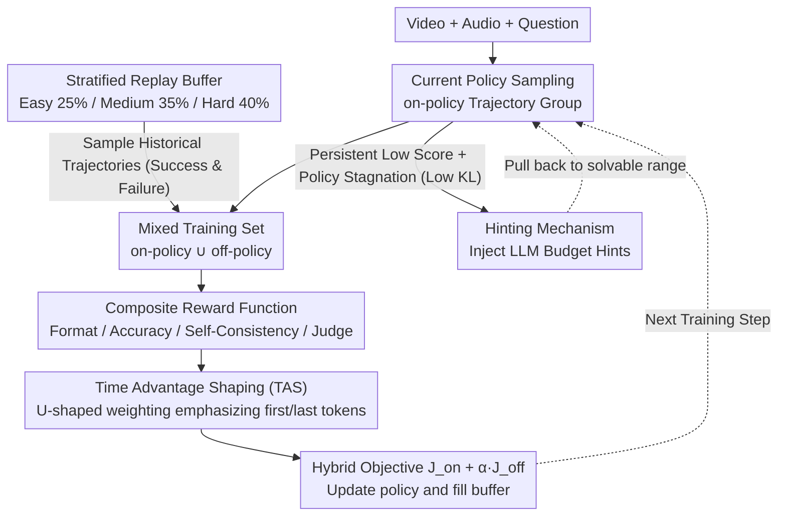

# AVATAR: Reinforcement Learning to See, Hear, and Reason Over Video

**Conference**: CVPR 2026  
**arXiv**: [2508.03100](https://arxiv.org/abs/2508.03100)  
**Code**: [https://people-robots.github.io/AVATAR/](https://people-robots.github.io/AVATAR/)  
**Area**: Human Understanding / Multimodal Reasoning  
**Keywords**: Audio-Visual Reasoning, GRPO Enhancement, Off-policy Reinforcement Learning, Time Advantage Shaping, Multimodal Large Language Model (MLLM)

## TL;DR
The AVATAR framework is proposed to improve GRPO through two core components: an off-policy training architecture (stratified replay buffer) and Time Advantage Shaping (TAS, using U-shaped weighting to emphasize the beginning and end of reasoning chains). This approach addresses three major issues of GRPO—data inefficiency, vanishing advantages, and uniform credit assignment—significantly outperforming the GRPO baseline on audio-visual reasoning benchmarks.

## Background & Motivation

1. **Background**: MLLMs require the alignment of video, audio, and language modalities to support long-term reasoning. As an RL method, GRPO has demonstrated potential for enhancing reasoning, but it faces significant limitations in open-ended video domains.
2. **Limitations of Prior Work** (Three main problems of GRPO):
    - **Data Inefficiency**: As an on-policy method, it discards experience after each update, leading to severe waste of expensive video annotation data.
    - **Vanishing Advantage**: When the intra-group reward variance collapses (all correct or all incorrect), the advantage drops to zero, and the learning signal disappears.
    - **Uniform Credit Assignment**: It applies the same reward to all tokens in a reasoning chain, ignoring the criticality of the planning phase (beginning) and the synthesis phase (end).
3. **Key Insight**: Systematically address the three structural flaws of GRPO from the perspective of RL algorithm design.
4. **Core Idea**: Combine an off-policy architecture with a stratified replay buffer to solve the first two problems, and use the U-shaped position weighting of TAS to solve the third.

## Method

### Overall Architecture
AVATAR enables all-modality MLLMs to perform long-chain reasoning across video, audio, and language. It identifies that GRPO suffers in open video scenarios due to discarded experience, advantage zeroing during variance collapse, and uniform credit distribution across the reasoning chain. Rather than replacing the framework, AVATAR augments the on-policy updates of GRPO with four components: a hierarchical replay buffer to reuse historical trajectories, a Hinting mechanism to assist when the model is stuck, Time Advantage Shaping (TAS) to re-weight advantages by token position, and a suite of composite rewards for audio-visual tasks. The first two form the off-policy training architecture to address "data inefficiency + vanishing advantage"; TAS specifically handles "uniform credit assignment"; while the composite rewards provide dense, multi-faceted signals. In each training step, historical trajectories are sampled from the replay buffer and mixed with current on-policy groups. This mixture is scored by composite rewards, weighted by TAS, and used to update the policy via a hybrid objective, after which new experiences are stored back in the buffer—forming a closed-loop training feedback. This training mechanism is wrapped in a four-stage curriculum: Stage 0 (SFT cold start), Stage 1 (pure visual reasoning), Stage 2 (joint audio-visual reasoning), and Stage 3 (fine-grained audio object localization).

### Key Designs

**1. Off-policy Architecture & Stratified Replay Buffer: Reclaiming discarded experience and preventing vanishing advantages**

Pure on-policy GRPO discards sampled trajectories after each update. Since video annotation data is inherently expensive, this is wasteful. More critically, when a group of samples is entirely correct or entirely incorrect, the intra-group reward variance collapses, causing the normalized advantage to become zero and halting learning. AVATAR maintains a stratified buffer $\mathcal{B}$ with a capacity of 10K, categorizing prompts into three layers based on their moving average reward $\bar{R}(q)$—Easy (25%), Medium (35%), and Hard (40%). During training, historical trajectories are mixed with current on-policy groups using a hybrid objective:

$$\mathcal{J}_{AVATAR} = \mathcal{J}_{on} + \alpha \cdot \mathcal{J}_{off}$$

The off-policy component is corrected for distribution shifts using an importance sampling ratio $r_i^{off} = \pi_\theta(o_i|q) / \pi_{\theta_{off}}(o_i|q)$. This design offers two benefits: the Hard layer receives the largest capacity to ensure difficult samples are reinforced, and mixing successful/failed historical trajectories ensures non-zero variance, effectively eliminating the vanishing advantage problem.

**2. Hinting Mechanism: Providing a stepping stone when the model stops exploring**

Replay buffers alone are insufficient if certain prompts remain persistently difficult, causing the policy to settle into local optima and stop exploring. AVATAR monitors two signals to detect "stagnation": first, a consistently low moving average reward $\bar{R}(q)$; second, a low KL divergence $D_{KL}(\pi_\theta \| \pi_\beta)$ relative to the reference policy. When both occur, the system injects a pre-computed hint (e.g., "First locate the sounding object, then count"), generated offline by Qwen2.5-VL-72B. This is essentially a teacher-student strategy that pulls training samples back into a "challenging but solvable" range.

**3. Time Advantage Shaping (TAS): Differentiated credit for the reasoning chain**

GRPO distributes a single scalar advantage uniformly across every token in a reasoning chain. However, the planning phase (start) and the synthesis phase (end) are functionally more critical than intermediate transition tokens. TAS applies a U-shaped parabolic weight based on position:

$$w_t = 1.0 + \lambda_{TAS} \cdot (2\tilde{t} - 1)^2, \quad \tilde{t} = \frac{t}{L-1}$$

The normalized position $\tilde{t}$ yields the peak weight $1+\lambda_{TAS}$ at the start and end, while dropping to $1.0$ at the center ($\tilde{t}=0.5$). This results in token-level advantages $A_{i,t}^{TAS} = w_{i,t} \cdot A_i$. This U-shape aligns with the "attention sink" phenomenon in Transformers (where initial tokens are consistently attended to) and the decisive role of final tokens in formulating the answer. This improvement requires no additional critic network.

**4. Composite Reward Function: Decoupling format, accuracy, and reasoning quality**

Since final answers alone are insufficient for driving high-quality reasoning in audio-visual QA, AVATAR utilizes four reward streams. $R_{format}$ ensures adherence to the reasoning format; $R_{acc}$ provides a dense accuracy signal via rMAE; $R_{self}$ provides a self-supervised signal using consistency with majority-voted pseudo-labels; and $R_{judge}$ utilizes a frozen InternVL3-2B to evaluate the quality of the reasoning process itself.

### Loss & Training
The final training objective overlays the off-policy term onto the standard GRPO loss (Hybrid Objective $\mathcal{J}_{AVATAR}$), replaces uniform advantages with TAS-weighted token advantages, and is driven by the four-way composite reward. The four-stage curriculum starts with SFT cold-starting and gradually transitions from visual reasoning to joint audio-visual reasoning and finally to fine-grained audio object localization.

## Key Experimental Results

### Main Results

| Model | OmniBench | MMVU | Video-Holmes | AV-Odyssey |
|------|-----------|------|-------------|------------|
| Qwen2.5-Omni (Baseline) | 44.2 | - | - | 29.8 |
| + GRPO | 45.4 (+1.2) | - | - | 31.3 (+1.5) |
| + **AVATAR** | **49.1 (+4.9)** | - | - | **32.1 (+2.3)** |
| Ola-7B (Baseline) | 45.3 | - | - | 25.6 |
| + GRPO | 46.8 (+1.5) | - | - | 27.0 (+1.4) |
| + **AVATAR** | **47.2 (+1.9)** | - | - | **28.8 (+3.2)** |

AVATAR vs GRPO on Qwen2.5-Omni: OmniBench +3.7, Video-Holmes +1.9, while requiring **80% fewer generation completions** to reach target performance.

### Ablation Study

| Component | OmniBench | DailyOmni | Description |
|------|-----------|-----------|------|
| GRPO (Baseline) | 45.4 | 44.8 | |
| + Off-policy only | +1.5 | +1.2 | Contribution of Off-policy architecture |
| + TAS only | +1.0 | +0.8 | Contribution of Time Shaping |
| + Both (AVATAR) | **+3.7** | **+2.2** | Complementary gains |

### Key Findings
- AVATAR is consistently effective across two base models (Qwen2.5-Omni and Ola-7B), proving its model-agnostic nature.
- Sample efficiency improved by 5×: 80% fewer completions are needed to achieve target performance.
- Gains from off-policy learning and TAS are complementary rather than overlapping.
- All improvements are validated with 95% confidence intervals (bootstrap), ensuring statistical reliability.

## Highlights & Insights
- **Systematic Solution to GRPO Flaws**: Successfully engineers and applies classic RL problems (off-policy learning, credit assignment, exploration-exploitation) to MLLM training.
- **TAS Simplicity and Effectiveness**: Theoretically aligned with Transformer attention patterns and implemented as a simple formulaic modification without requiring extra networks or critics.
- **Practicality of Hinting**: Utilizing a large model (72B) to pre-calculate guidance for a smaller model is a highly practical teacher-student RL strategy.

## Limitations & Future Work
- The TAS U-shape is fixed; different tasks or reasoning lengths might benefit from adaptive shapes.
- Hinting depends on an external large model and is not applicable in purely autonomous learning scenarios.
- Validated only on audio-visual QA tasks; the effect on longer-term reasoning (e.g., planning, decision-making) is unknown.
- Replay buffer size (10K) and hierarchical ratios (25/35/40) are manually determined.

## Related Work & Insights
- **vs. Standard GRPO**: AVATAR is a direct improvement, maintaining simplicity while solving three structural issues.
- **vs. Video-R1**: While Video-R1 uses temporal contrastive rewards, AVATAR optimizes the training algorithm; the two are potentially combinable.
- **vs. DAPO**: DAPO reduces uniform groups via sampling modifications, but AVATAR addresses vanishing advantages more fundamentally through off-policy replay.

## Rating
- Novelty: ⭐⭐⭐⭐ (Combines existing RL techniques with novel application in MLLM scenarios)
- Experimental Thoroughness: ⭐⭐⭐⭐ (Multiple benchmarks, base models, statistical tests, and comprehensive ablations)
- Writing Quality: ⭐⭐⭐⭐⭐ (Clear analysis with a direct mapping from limitations to solutions)
- Value: ⭐⭐⭐⭐ (Generic improvements for MLLM RL training that are widely applicable)

<!-- RELATED:START -->

## Related Papers

- [\[CVPR 2026\] Learning to Diversify and Focus: A Reinforcement Framework for Open-Vocabulary HOI Detection](learning_to_diversify_and_focus_a_reinforcement_framework_for_open-vocabulary_ho.md)
- [\[CVPR 2026\] OMG-Avatar: One-shot Multi-LOD Gaussian Head Avatar](omg-avatar_one-shot_multi-lod_gaussian_head_avatar.md)
- [\[CVPR 2026\] Avatar Forcing: Real-Time Interactive Head Avatar Generation for Natural Conversation](avatar_forcing_real-time_interactive_head_avatar_generation_for_natural_conversa.md)
- [\[CVPR 2026\] See Through the Noise: Improving Domain Generalization in Gaze Estimation](see_through_the_noise_improving_domain_generalization_in_gaze_estimation.md)
- [\[CVPR 2026\] Vision-Language Attribute Disentanglement and Reinforcement for Lifelong Person Re-Identification](vision-language_attribute_disentanglement_and_reinforcement_for_lifelong_person_.md)

<!-- RELATED:END -->
