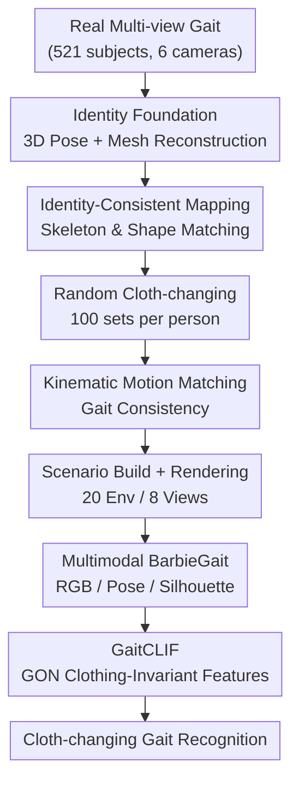

# BarbieGait: An Identity-Consistent Synthetic Human Dataset with Versatile Cloth-Changing for Gait Recognition

**Conference**: CVPR2026  
**arXiv**: [2604.12221](https://arxiv.org/abs/2604.12221)  
**Code**: https://github.com/BarbieGait/BarbieGait  
**Area**: Human Understanding / Gait Recognition / Synthetic Dataset  
**Keywords**: Gait recognition, cloth-changing, synthetic dataset, identity consistency, clothing-invariant features

## TL;DR
Addressing the pain point that real-world collection of gait data for "one person wearing hundreds of outfits" is nearly impossible, this paper maps 521 real subjects into a virtual engine. By randomly generating 100 outfits per person, the authors construct an identity-consistent synthetic gait dataset, BarbieGait. A companion clothing-invariant baseline, GaitCLIF, is proposed, achieving SOTA results on BarbieGait and real-world datasets including CCPG, SUSTech1K, Gait3D, and GREW.

## Background & Motivation
**Background**: Gait recognition is a biometric technology capable of long-distance, non-cooperative identification, making it suitable for surveillance and security. While recent methods have advanced rapidly, appearance changes caused by covariates such as clothing and carrying remain core bottlenecks. To verify whether a "model is truly robust to cloth-changing," gait sequences with massive clothing variations for each individual are required.

**Limitations of Prior Work**: Existing benchmarks almost universally lack "large-scale cloth-changing" data. Laboratory datasets like CASIA-B provide only 3 outfits per person, while outdoor datasets like GREW provide 6. Even CCPG, specifically designed for cloth-changing, only achieves 7 clothing states per person despite significant effort. Insufficient clothing diversity fails to prove the reliability of gait recognition under major clothing changes or test whether existing methods can handle extreme cases.

**Key Challenge**: Collecting real-world cloth-changing gait data covering multiple races, seasons, and complex clothing styles is not only extremely costly but also nearly impossible due to privacy concerns. While existing synthetic human datasets (SURREAL, SynBody, VersatileGait, etc.) can generate massive data, they generally emphasize "motion diversity." They either use one motion to drive different people or use vastly different gaits to drive the same person—**identity consistency is destroyed**, and the synthetic "same person" no longer carries the original gait identity.

**Goal**: (1) Create a dataset with a massive number of outfits per person where each virtual character's gait identity faithfully replicates a specific real person; (2) Provide a robust baseline capable of learning clothing-invariant features under extreme clothing changes.

**Key Insight**: The authors address a critical question: Can a generative paradigm synthesize cloth-changing gait data while preserving the discriminative gait identity of real subjects? Identity is reflected in both static skeleton length/body shape and dynamic joint motion trajectories. Thus, high-precision 3D human pose and mesh are used for "static + dynamic" dual alignment.

**Core Idea**: Construct cloth-changing data using "Real Human → Virtual Human" identity-consistent mapping (skeleton/shape matching + kinematic motion matching), then use Gait-Oriented Normalization (GON) to strip clothing statistics and learn clothing-invariant features.

## Method

### Overall Architecture
The paper consists of two parts: the **Data Generation System** (producing the BarbieGait dataset) and the **GaitCLIF Recognition Baseline** (learning clothing-invariant features on both synthetic and real datasets).

The generation system takes multi-view gait videos as input and outputs synthetic sequences with 100 outfits per person across RGB, 2D pose, and silhouette modalities. First, a 6-camera array captures 521 real subjects. 2D poses are estimated via HRNet, followed by triangulation and EasyMoCap to reconstruct high-precision 3D poses and meshes as "identity foundations." Subsequently, the pipeline passes through five stages: skeleton/body shape matching (creating virtual humans aligned with real ones), random cloth-changing (100 sets per person), kinematic motion matching (transferring real gait to the virtual human while maintaining consistency), scenario construction (20 indoor/outdoor environments in Blender with 8 cameras), and GPU cluster rendering. Finally, silhouette segmentation and 2D pose extraction yield the multi-modal data.

GaitCLIF learns clothing-invariant features through two perspectives: stripping clothing statistics (GON) and preserving fine-grained motion details (frame-level GON-P3D/3D + sequence-level GON-FC). The architecture consists of four visual stages followed by Temporal Pooling (TP), Horizontal Pooling (HP), and a linear head.

### Key Designs

**1. Identity-Consistent Mapping: Replicating Static Shape and Dynamic Gait**

This is the foundation of the dataset's "credibility," directly addressing the issue of "same person, different gait" in prior synthetic data. The authors split alignment into static and dynamic layers. The static layer performs **skeleton length + body shape matching**: 3D skeleton length is stable for an individual, so 3D poses are used to align the lengths of virtual thighs, shins, etc. For body shape, SMPL meshes are estimated frame-by-frame using EasyMoCap, and 12 static girth parameters (neck, chest, waist, hips, etc.) are defined using sequence averages to align the virtual body, reducing single-frame mesh recovery errors. The dynamic layer performs **Kinematic Motion Matching** (Algorithm 1): local coordinate systems are established for each bone of the original 3D pose to calculate unit quaternions relative to the world system $Q^t=\text{CalQ}(P^t)$. These local rotations are then transferred to the target skeleton—using $Q=Q^s(k)\cdot Q^t(k)$ for the root and $Q=Q^s(k)\cdot Q^t(k_p)\cdot Q^t(k)$ for other bones to account for parent rotations, ensuring stable, gimbal-lock-free replication of the subject's unique motion. By locking skeleton, shape, and motion to the real human, identity is preserved even after changing 100 outfits.

**2. Random Cloth-changing + Multi-Scenario Rendering: Maximizing Clothing Diversity**

The "hundreds of outfits per person" unattainable in the real world is solved in the virtual engine using MakeHuman. Outfits are randomly selected from a diverse wardrobe (hair, tops, bottoms, shoes, accessories) for each person based on seasonal and daily matching rules. To ensure data proximity to real conditions, Blender is used to build 20 indoor/outdoor environments. Each scene features 8 cameras placed every 45° on a 4m radius circle at a 2.5m height. Obstacles (chairs, walls) and day/night lighting changes are intentionally introduced. Rendering is optimized by focusing on the body and shadow regions, rendering static areas only once, increasing speed by 5–6x. BarbieGait ultimately comprises 521 subjects, 521k meshes, 8 views, and over 1.2M sequences, providing 3D joints, 3D meshes, and silhouette ground truths.

**3. GON (Gait-Oriented Normalization): Stripping Clothing Statistics by Body Partitioning**

A core recognition challenge is that clothing diversity increases intra-class variance, creating clothing-related "sub-domains" that interfere with identity features. The authors propose removing frame-level clothing variations as a key step. Finding that Instance Normalization (common in domain-invariant learning) is unsuitable for gait because each channel of silhouette features contains noise, they propose **GON (Gait-Oriented Normalization)** inspired by Layer Norm. Instead of global normalization, the feature $X \in \mathbb{R}^{N \times C \times H \times W}$ is cut horizontally into $m$ regions $x_0, \dots, x_m$, which are normalized separately: $X' = \text{Cat}(\text{GON}(x_0), \dots, \text{GON}(x_m))$, where $\text{GON}(x_i) = \gamma \cdot \frac{x_i - \mu(x_i)}{\sigma(x_i)} + \beta$. The mean and variance $\mu, \sigma$ are calculated across channels $C$ and spatial dimensions $h_i, W$. The motivation is specific: the head is less affected by clothing, while the lower body is heavily impacted by pants/skirts. Regional normalization suppresses clothing fluctuations while preserving identity-related structures.

**4. Fine-grained Motion Preservation: Dual Frame-level and Sequence-level Approach**

Stripping statistics is insufficient; fine-grained motion details are critical for identity. The authors embed GON into two network levels. At the frame level, **GON-P3D / GON-3D** blocks add temporal convolutions to GON to enhance motion representation and improve frame-level invariant learning. At the sequence level, addressing the inability of standard Separate FC layers to handle massive cloth-changes, they propose **GON-FC**: two FC layers, each followed by GON. After temporal pooling, this enhances non-linear expression in fine-grained regions and reduces sequence-level clothing variance. The two complement each other: GON-P3D suppresses frame-level fluctuations, and GON-FC stabilizes sequence-level identity cues.

### Loss & Training
Evaluation uses Rank-1 accuracy (R1) and mAP. To analyze the impact of clothing thickness, a **clothing complexity metric** is defined: the non-overlapping area between a naked silhouette and a clothed silhouette is used as clothing complexity, normalized by the naked silhouette area to obtain "relative clothing thickness." These are divided into ten levels, THK0–THK9 (THK0 as gallery, THK1–THK9 as probes). Training follows official protocols for each dataset (e.g., BarbieGait uses [1,1,1,1] blocks and 60k steps; GREW uses [1,4,4,1] and 180k steps).

## Key Experimental Results

Identity Consistency Verification: After 3D pose matching and motion alignment, the mean joint position error between real and synthetic data is only 12.2 mm (primarily from hierarchical accumulation), and the joint angle error is 0.02°, indicating highly accurate alignment.

### Main Results

Cloth-changing recognition on BarbieGait (THK0 gallery, THK1–THK9 probe, AVG for average):

| Input Modality | Method | AVG-R1 | AVG-mAP |
|----------------|--------|--------|---------|
| Silhouette | GaitSet | 9.7 | 12.8 |
| Silhouette | DeepGaitV2-P3D | 67.7 | 57.6 |
| Silhouette | DeepGaitV2-3D | 71.7 | 60.2 |
| Silhouette | **GaitCLIF-P3D (ours)** | **75.6** | **63.2** |
| Silhouette | **GaitCLIF-3D (ours)** | **80.4** | **65.7** |
| Heatmap | SkeletonGait | 77.1 | 72.3 |
| Heatmap | **GaitCLIF-P3D (ours)** | **78.1** | **73.3** |

Even with 100 outfits per person, GaitCLIF improves the silhouette baseline DeepGaitV2-P3D's mAP from 57.6% to 63.2%. Feeding ideal Blender silhouettes into DeepGaitV2-P3D reaches R1 91.2% / mAP 83.4%, but switching to real segmented silhouettes (with noise) drops performance to R1 67.7% / mAP 57.6%, highlighting the difficulty of cloth-changing scenarios.

Generalization on Real Datasets (CCPG ReID protocol, SUSTech1K, in-the-wild):

| Dataset | Metric | Gain / Result |
|---------|--------|---------------|
| CCPG (ReID) | R1 / mAP | +1.9% / +2.3% |
| SUSTech1K | R1 / R5 | +2.4% / +1.1% |
| Gait3D | R1 / mAP | 76.5% / 67.9% |
| GREW | R1 / R5 | 80.2% / 89.2% |

For in-the-wild datasets with limited clothing changes (Gait3D / GREW), using the full GON suite causes excessive intra-class divergence, so only GON-FC is used to enhance non-linear mapping.

### Ablation Study

Module ablation of GaitCLIF-P3D on BarbieGait:

| GON-P3D | GON-FC | AVG-R1 (%) | AVG-mAP (%) |
|---------|--------|-----------|-------------|
| × | × | 67.7 | 57.6 |
| √ | × | 69.8 | 57.6 |
| × | √ | 69.2 | 59.1 |
| √ | √ | **75.6** | **63.2** |

### Key Findings
- **Strong complementarity between modules**: Adding only GON-P3D (frame-level) improves R1 to 69.8% but maintains mAP; adding only GON-FC (sequence-level) improves mAP to 59.1%. Both are required to reach 75.6%/63.2%.
- **Silhouette quality is a hidden ceiling**: The mAP gap between ideal silhouettes (83.4%) and real segmented silhouettes (57.6%) shows that segmentation noise consumes a large portion of performance.
- **Pose modality is more resistant to clothing changes**: Under heatmap input, SkeletonGait (mAP 72.3%) outperforms silhouette-based GaitCLIF-3D (65.7%), confirming that pose-based methods are naturally robust to appearance changes.

## Highlights & Insights
- **Dual Alignment (Real-to-Virtual)**: Using 3D skeletons/shapes for static locking and kinematic motion transfer for dynamic locking bypasses the costs/privacy issues of real-world collection while avoiding the gait distortion common in prior synthetic data. This mapping can be transferred to Re-ID or human rendering tasks.
- **Partitioned Normalization (GON)**: Mapping the observation that "head is less affected by clothing than the lower body" directly into height-based horizontal partition normalization is more effective for gait than global IN/LN.
- **Clothing Thickness Grading (THK0–THK9)**: Provides a quantifiable scale for cloth-changing recognition. This evaluation protocol allows analysis of exactly where models fail under increasing clothing thickness.

## Limitations & Future Work
- **Sim-to-Real Gap**: The large mAP gap between ideal and real segmented silhouettes indicates that models trained on BarbieGait are still limited by noise when migrating to real data.
- **Clothing Sources**: While 100 sets are numerous, styles and materials are limited by MakeHuman assets and random matching rules, which may differ from extreme or rare real-world distributions.
- **GON Over-divergence**: In low clothing-variation scenarios (Gait3D/GREW), GON can cause excessive intra-class variance.
- **Public Range**: Due to privacy, only synthetic data is released. Replicating the "real → virtual" mapping chain for downstream tasks may face a data gap regarding real RGB/faces.

## Related Work & Insights
- **vs VersatileGait / SynBody**: These also synthesize gait/human data but focus on motion diversity, often destroying identity consistency. BarbieGait is the first to establish "cloth-changing while preserving gait identity" via dual 3D alignment.
- **vs CCPG**: CCPG is real-world but has only 7 outfits per person. BarbieGait scales this to 100 outfits and 1.2M+ sequences, and GaitCLIF still yields gains on CCPG (+1.9% R1).
- **vs Instance Normalization**: Unlike domain-invariant learning using global IN, which the authors found unsuitable for noisy silhouette features, GON uses partition-based normalization inspired by LN to suit gait characteristics.

## Rating
- Novelty: ⭐⭐⭐⭐⭐ First to use dual "Real → Virtual" alignment for identity-consistent cloth-changing gait data.
- Experimental Thoroughness: ⭐⭐⭐⭐ Extensive validation on BarbieGait + 4 real datasets, though sim-to-real analysis could be deeper.
- Writing Quality: ⭐⭐⭐⭐ Clear distinction between dataset and method; complete protocols.
- Value: ⭐⭐⭐⭐⭐ Provides controllable large-scale data + robust baseline, with high long-term value for the field.

<!-- RELATED:START -->

## Related Papers

- [\[CVPR 2026\] MMGait: Towards Multi-Modal Gait Recognition](mmgait_multi_modal_gait_recognition.md)
- [\[CVPR 2026\] EventGait: Towards Robust Gait Recognition with Event Streams](eventgait_towards_robust_gait_recognition_with_event_streams.md)
- [\[CVPR 2026\] Text-guided Feature Disentanglement for Cross-modal Gait Recognition](text-guided_feature_disentanglement_for_cross-modal_gait_recognition.md)
- [\[CVPR 2026\] HyperGait: Unleashing the Power of Parsing for Gait Recognition in the Wild via Hypergraph](hypergait_unleashing_the_power_of_parsing_for_gait_recognition_in_the_wild_via_h.md)
- [\[CVPR 2026\] Unlocking Motion from Large Vision Models with a Semantic and Kinematic Duality for Gait Recognition](unlocking_motion_from_large_vision_models_with_a_semantic_and_kinematic_duality_.md)

<!-- RELATED:END -->
