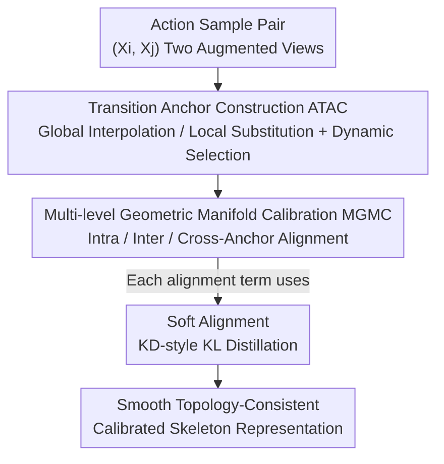

# Beyond Binary Contrast: Modeling Continuous Skeleton Action Spaces with Transitional Anchors

**Conference**: CVPR 2026  
**Paper**: [CVF Open Access](https://openaccess.thecvf.com/content/CVPR2026/html/Feng_Beyond_Binary_Contrast_Modeling_Continuous_Skeleton_Action_Spaces_with_Transitional_CVPR_2026_paper.html)  
**Code**: To be open-sourced (Paper states: Code will be made publicly available)  
**Area**: Self-supervised / Skeleton Action Recognition  
**Keywords**: Skeleton Action Recognition, Contrastive Learning, Transitional Anchors, Manifold Calibration, Confidence Calibration  

## TL;DR
To address the issues of isolated clusters and rigid boundaries caused by "binary contrast" in self-supervised skeleton action recognition, TranCLR synthesizes "transitional anchors" as manifold regularization terms between actions and reshapes the representation space from discrete point clouds into continuous smooth manifolds using three-level geometric manifold calibration. It achieves SOTA across linear evaluation, transfer learning, and retrieval on NTU/PKU-MMD, while reducing the Expected Calibration Error (ECE) from ~5.6% to 0.65%.

## Background & Motivation
**Background**: Skeleton action recognition uses joint coordinate sequences to classify human actions. The mainstream self-supervised paradigm is contrastive learning—constructing positive and negative pairs based on MoCo v2, pulling two augmented views of the same sample (positive pair) closer in the embedding space and pushing other samples (negative pairs) apart to learn discriminative representations without labels. Representative works include SkeletonCLR, AimCLR, and ActCLR.

**Limitations of Prior Work**: These methods all adopt a **binary contrastive objective**—either positive or negative. By visualizing top-3 predictions and confidence, the authors found that AimCLR/ActCLR predictions on "hard samples" and "ambiguous samples" are neither reliable nor calibrated (confidence is disconnected from true accuracy). There are two root causes: (1) **Limited intra-class connectivity**—positive pairs only come from simple augmentations of the same sample, failing to pull different samples of the same action together, which results in fragmented intra-class clusters; (2) **Rigid inter-class boundaries**—different actions sharing sub-actions (e.g., "washing face" and "headache" both involve raising hands to the head) are harshly pushed apart as negative pairs, destroying the naturally smooth topology of the action manifold.

**Key Challenge**: Human movement is essentially **continuous**—actions transition gradually, and adjacent actions share sub-actions, resulting in numerous "transitional states." Binary contrast only provides coarse-grained "similar/dissimilar" signals, lacking perception of **fine-grained distance** in the embedding space, making it impossible to characterize transitional states and ambiguous behaviors, which in turn hinders calibration and uncertainty estimation.

**Goal**: To transition from discrete binary contrast to a **continuous, topology-aware** representation paradigm—not just distinguishing similarity but explicitly modeling the potential continuous transitions between actions.

**Key Idea**: Synthesize **"transitional anchors"** between two action samples as manifold regularization terms (rather than physically interpretable poses), and then use multi-level geometric calibration to constrain the relative positions of these anchors into a coherent manifold, making the representation space both smooth and discriminative.

## Method

### Overall Architecture
TranCLR is built upon the MoCo v2 dual-network (online encoder-projector $h_q=g_q(f_q)$ + momentum $h_k$) + InfoNCE. The framework consists of two sequential parts: First, **ATAC** creates "transitional anchors" between sample pairs (using two complementary methods + dynamic selection); second, **MGMC** uses these anchors to align and calibrate the embedding space across three levels. To mitigate multi-objective conflicts, all alignments use **Soft Alignment** (knowledge distillation-style soft alignment) instead of hard InfoNCE. The final training objective is the sum of intra, inter, and cross terms.

The input is two augmented views of an action sample pair $(X_i, X_j)$, and the output is a smooth, topology-consistent, and confidence-calibratable skeleton representation encoder (frozen for downstream linear evaluation/transfer/retrieval).

### Key Designs

**1. ATAC Transition Anchor Construction: Creating "Intermediate Landmarks" to Fill Manifold Cavities**

Binary contrast fragments the manifold because it only contains "endpoints" (real samples) and no "intermediate states." ATAC synthesizes a transitional anchor $A$ between sample pairs $X_i, X_j$. It does not aim for physically interpretable poses but serves as a **manifold regularization term**, inserting landmarks along reasonable semantic paths between two actions to force the representation space to become continuous. ATAC uses two complementary methods:

- **Global Trajectory Interpolation**: Borrowing from Mixup, it performs a convex combination at the data level $A_G = \lambda_G X_i + (1-\lambda_G) X_j$, where $\lambda_G \sim U(0,1)$ is directly treated as a semantic distance measure from the anchor to the endpoints. The advantage is global smoothness, though it may blur fine-grained motion details.
- **Local Spatio-temporal Substitution**: The skeleton is divided into 5 body parts $P=\{L-Arm, R-Arm, L-Leg, R-Leg, Trunk\}$. A random number $S\in[S_{min},S_{max}]$ of parts and a time window of length $T$ are selected. A sub-sequence of length $T'\in[\kappa_l T,\kappa_r T]$ is sampled from the corresponding parts of $X_i$, resized to $T$ frames, and substituted into $X_j$: $A_L = M \odot \text{Resize}(X_i \odot M', \mathcal{T}) + (1-M)\odot X_j$. The mask mean $\lambda_L=\mathbb{E}[M]$ implicitly quantifies the semantic distance. This preserves local kinematic fidelity (no blurred details).
- **Dynamic Anchor Selection**: For each action pair, one method is chosen with a 0.5 probability: $\text{ATAC}(X_i,X_j;\lambda)=\mathbf{1}_{\{p<0.5\}}A_G + \mathbf{1}_{\{p\ge0.5\}}A_L$. This allows the model to encounter both "globally smooth" and "locally faithful" transitions, gaining the benefits of both. Ablations prove both are essential.

**2. MGMC Multi-level Geometric Manifold Calibration: Aligning Anchors into Embedding Space**

Having anchors is insufficient; the embedding space must know where these anchors should be positioned. MGMC uses anchors from ATAC to impose topology-consistency constraints across three complementary levels, centered on a **homomorphic mapping** constraint—semantic transitions in the input space (mixing coefficient $\lambda$) must correspond to linear interpolations in the embedding space:

- **Intra-Sample Continuity**: Targets "positive pairs only being augmentations of the same sample $\rightarrow$ fragmented intra-class clusters." Anchors $A_i^{intra}=\text{ATAC}(\hat X_i,\tilde X_i;\lambda_{intra})$ are created for two views of the same sample, constraining $h_q(A_i^{intra}) \longleftrightarrow \lambda_{intra}h_k(\hat X_i)+(1-\lambda_{intra})h_k(\tilde X_i)$. This ensures interpolations along positive pair trajectories are linear in the embedding space, stitching together intra-class discontinuities.
- **Inter-Sample Bridging**: Targets "sharing sub-actions being pushed apart $\rightarrow$ rigid boundaries." Semantic midpoint anchors $A_{ij}^{inter}$ are created for different actions $X_i, X_j$, constraining $h_q(A_{ij}^{inter})\longleftrightarrow \lambda_{inter}h_k(\tilde X_i)+(1-\lambda_{inter} )h_k(\tilde X_j)$. This represents gradual changes like "walking $\rightarrow$ running" as continuous distances, softening inter-class boundaries.
- **Cross-Anchor Relational Consistency**: The first two levels generate many anchors from related parent pairs that overlap semantically but are geometrically unconstrained. This level uses deterministic sampling—pairing $X_i$ with its reverse sequence $X_{N-i+1}$, creating two anchors $A_i^{(1)}, A_i^{(2)}$ with coefficients $\lambda_1, \lambda_2$, and defining a **composite similarity score** to measure "lineage" overlap: same-source $k_h=\min(\lambda_1,\lambda_2)+\min(1-\lambda_1,1-\lambda_2)$, cross-source $k_c=\min(\lambda_1,1-\lambda_2)+\min(1-\lambda_1,\lambda_2)$. Normalizing gives weight $\lambda_{cross}=k_h/(k_h+k_c)$, followed by the constraint $h_q(A_i^{(1)})\longleftrightarrow \lambda_{cross}h_k(A_i^{(2)})+(1-\lambda_{cross})h_k(A_{N-i+1}^{(2)})$. This uses implicit topological relationships between anchors as weak supervision to refine the transition network into a globally consistent manifold.

**3. Soft Alignment: Using KD-style Distillation to Resolve Multi-objective Conflicts**

The three-level objectives naturally conflict: $\mathcal{L}_{intra}$ wants to tighten intra-class clusters, while $\mathcal{L}_{inter}$ wants to soften inter-class boundaries. Direct alignment with hard InfoNCE leads to unstable training. The authors use knowledge distillation for soft alignment: for each query-target pair $(q,k)$, the top-$K$ most similar neighbors $\mathcal{N}_K$ to $k$ are retrieved from a memory queue $\mathcal{M}$ (removing noise, keeping high-confidence neighbors). Similarity vectors $p_k, p_q$ are calculated, followed by alignment using **asymmetric temperatures** via KL divergence: $\mathcal{L}(q,k)=\text{KL}(\text{softmax}(p_k/\tau_k)\,\|\,\text{softmax}(p_q/\tau_q))$, where $\tau_k<\tau_q$ makes the target distribution sharper, emphasizing peak similarities and guiding the query to learn the target's "sharpened affinity spectrum." Applying this to the three levels yields $\mathcal{L}_{intra}, \mathcal{L}_{inter}, \text{ and } \mathcal{L}_{cross}$.

### Loss & Training
The unified objective is the sum of three terms: $\mathcal{L}=\mathcal{L}_{intra}+\mathcal{L}_{inter}+\mathcal{L}_{cross}$. The encoder uses ST-GCN but only with 16 hidden channels (1/4 of the original size); the projector is a 2-layer MLP (256→128). Soft alignment temperatures are $\tau_q=0.1, \tau_k=0.05$; $K=8192$; memory bank size is 65536. Optimization uses SGD (momentum 0.9, wd 1e-4), training for 300 epochs, lr 0.1 → reduced to 0.01 at epoch 250; batch size 128 on a single A100.

## Key Experimental Results

### Main Results (Linear Evaluation, NTU Dataset)
Frozen pre-trained encoder with a linear classifier. The table compares Joint single-stream vs. three-stream (Joint+Motion+Bone):

| Method | Stream | NTU-60 Avg | NTU-120 X-Sub | NTU-120 Avg |
|------|----|-----------|---------------|-------------|
| AimCLR | Joint | 77.0 | 63.4 | 63.4 |
| ActCLR | Joint | 83.8 | 69.0 | 69.8 |
| **Ours (TranCLR)** | Joint | **85.9** | **74.3** (+5.3) | **74.5** |
| 3s-ActCLR | J+M+B | 86.6 | 74.3 | 75.0 |
| **Ours (3s-TranCLR)** | J+M+B | **88.5** | **78.8** | **78.9** (+17.2 vs baseline) |

Transfer Learning (NTU pre-training → PKU-MMD Part II): 3s-TranCLR transferred from NTU-60 achieves **65.6%**, surpassing Heter-Skeleton (CVPR'25) by 1.3% and reconstruction-enhanced 3s-ActCLR+ by 3.5%. Retrieval (NTU-60 X-Sub **74.6%**, NTU-120 X-Sub **59.1%**) also achieves multiple SOTA results.

### Key Experimental Results (Calibration Error ECE↓ / AECE↓)
The authors first introduced calibration error evaluation to self-supervised skeleton action recognition, showing impressive improvements:

| Metric | Method | NTU-60 X-Sub | NTU-120 X-Sub | NTU-120 X-Set |
|------|------|------|------|------|
| ECE↓ | ActCLR | 5.25 | 5.71 | 5.63 |
| ECE↓ | **Ours (TranCLR)** | **0.98** | **0.78** | **0.65** (−88%) |

### Ablation Study
Two anchor construction methods in ATAC (NTU-60 Avg):

| w/ Global | w/ Local | Avg |
|-----------|----------|-----|
| ✗ | ✗ | 77.4 |
| ✓ | ✗ | 83.8 |
| ✗ | ✓ | 85.0 |
| ✓ | ✓ | **85.9** |

Three levels in MGMC (NTU-60 Avg):

| Lintra | Linter | Lcross | Avg |
|--------|--------|--------|-----|
| ✗ | ✗ | ✗ | 77.4 |
| ✓ | | | 83.0 |
| | ✓ | | 78.7 |
| ✓ | ✓ | | 84.8 |
| ✓ | ✓ | ✓ | **85.9** |

### Key Findings
- **Complementary anchor methods**: Global interpolation alone is lowest (83.8, blurs fine-grained kinematics), while local substitution is stronger (85.0, faithful but lacks global coherence). Dynamic selection reaches 85.9—confirming the synergy of "global smoothness × local discrimination."
- **Hierarchical MGMC**: Intra is the stable foundation (83.0); inter alone is weak (78.7, lacks foundation for bridging). Combining intra+inter yields 84.8, and adding cross global regularization reaches 85.9.
- **Biomechanical basis for local substitution**: Replacing 2~3 body parts is optimal (consistent with eating/walking involving 2~3 limbs), with time windows of [16, 24] frames and $\kappa\in[0.5, 2]$ to handle natural speed variations.
- **Trade-offs in retrieval**: The authors admit softening boundaries sacrifices peak retrieval precision that relies on "rigid separation" (not every metric leads), in exchange for better generalization and topological consistency—an inevitable result of the design philosophy.

## Highlights & Insights
- **"Transitional anchors are manifold regularization terms, not real poses"** is the core insight: Reinterpreting Mixup from "data augmentation" to "filling manifold landmarks" avoids debates over "physical plausibility of synthesized poses" and directly addresses the topological cavities of binary contrast.
- **Cross-anchor composite similarity $k_h, k_c$** is clever: Using the sum of min mixing coefficients to measure "lineage overlap" turns unsupervised geometric relationships between anchors into calculable weak supervision weights at nearly zero cost.
- **Introducing ECE to evaluation** highlights an overlooked dimension—continuous manifolds naturally suppress downstream classifier overconfidence. Reducing ECE to 0.65% is highly valuable for real-world applications requiring reliable uncertainty (medical rehab, HCI).
- Soft alignment using asymmetric temperatures $\tau_k<\tau_q$ to sharpen the target stabilizes multi-objective conflicts; this trick is transferable to any contrastive/distillation framework with conflicting objectives.

## Limitations & Future Work
- The authors acknowledge a trade-off in retrieval precision, where softening boundaries sacrifices peak accuracy.
- ⚠️ The method introduces multiple hyperparameters ($S, T, \kappa, \lambda$, $\tau_q/\tau_k/K$). While grid analysis on NTU-60 is provided, cross-dataset stability and sensitivity are not fully explored.
- Lack of direct validation for anchor plausibility: Transitional anchors are treated as regularization and don't require interpretability, but "global interpolation blurring details" suggests intermediate states might not fall on the true action manifold, potentially introducing pseudo-transitions.
- Only verified on ST-GCN (and 1/4 channels), not tested on Transformer-based backbones to see if the paradigm remains effective.

## Related Work & Insights
- **vs. ActCLR**: ActCLR cuts skeletons into discriminative "actionlets" to strengthen semantic invariance but remains within binary contrast with rigid boundaries. Ours **creates transitional states between samples**, replacing discrete contrast with continuous manifold calibration, leading significantly in calibration error.
- **vs. AimCLR / Extreme Augmentation**: These rely on harder positive samples (extreme aug, hierarchical scheduling, spatio-temporal mixing) to improve discriminability, operating within "positive pairs." Ours expands the scope to **transitions between sample pairs**.
- **vs. MAMP / S-JEPA (Masked Reconstruction)**: Those lines rely on reconstruction (stronger on PKU-MMD Part I, e.g., MacDiff 92.8). Ours follows the contrastive route but overtakes on the harder Part II set (59.9%), indicating continuous manifolds are more robust for hard/ambiguous samples.
- **vs. Mixup**: Relocating Mixup from classification regularization to "manifold topological regularization" for self-supervised representation is a successful repositioning of interpolation-based augmentation.

## Rating
- Novelty: ⭐⭐⭐⭐⭐ Reconstructing binary contrast into continuous manifold calibration with transitional anchors as regularization is novel and self-consistent.
- Experimental Thoroughness: ⭐⭐⭐⭐ Four tasks across three datasets plus full ablation; first to introduce calibration evaluation. However, limited to a single backbone and lacks deep hyperparameter sensitivity analysis across datasets.
- Writing Quality: ⭐⭐⭐⭐ Logical flow from motivation to method to experiment is clear; formulas and figures are well-integrated. Some symbols (e.g., $k_h/k_c$ derivation) require slight reader inference.
- Value: ⭐⭐⭐⭐⭐ The -88% reduction in ECE is highly practical for trustworthy uncertainty scenarios; soft alignment/transitional anchor tricks are widely applicable.

<!-- RELATED:START -->

## Related Papers

- [\[CVPR 2026\] PRISM: Learning a Shared Primitive Space for Transferable Skeleton Action Representation](prism_learning_a_shared_primitive_space_for_transferable_skeleton_action_represe.md)
- [\[CVPR 2026\] LLaMo: Scaling Pretrained Language Models for Unified Motion Understanding and Generation with Continuous Autoregressive Tokens](llamo_scaling_pretrained_language_models_for_unified_motion_understanding_and_ge.md)
- [\[CVPR 2026\] ActAvatar: Temporally-Aware Precise Action Control for Talking Avatars](actavatar_temporally-aware_precise_action_control_for_talking_avatars.md)
- [\[CVPR 2026\] Beyond Scanpaths: Graph-Based Gaze Simulation in Dynamic Scenes](beyond_scanpaths_graph-based_gaze_simulation_in_dynamic_scenes.md)
- [\[CVPR 2026\] Superman: Unifying Skeleton and Vision for Human Motion Perception and Generation](superman_unifying_skeleton_and_vision_for_human_motion_perception_and_generation.md)

<!-- RELATED:END -->
