# Beyond Scanpaths: Graph-Based Gaze Simulation in Dynamic Scenes

**Conference**: CVPR 2026  
**Paper**: [CVF Open Access](https://openaccess.thecvf.com/content/CVPR2026/html/Palmer_Beyond_Scanpaths_Graph-Based_Gaze_Simulation_in_Dynamic_Scenes_CVPR_2026_paper.html)  
**Code**: Project Page [glimpse.ml/beyond-scanpaths](https://glimpse.ml/beyond-scanpaths) (Code repository not yet public)  
**Area**: Human Understanding / Driving Attention Modeling  
**Keywords**: Gaze Simulation, Heterogeneous Graph Transformer, Driver Attention, Mixture Density Networks, Dynamical Systems Modeling

## TL;DR
The authors model driver gaze as an autoregressive dynamical system: each frame of the traffic scene is encoded into a "gaze-centric" heterogeneous spatio-temporal graph. An Affinity Relational Transformer (ART) models the interaction between the gaze and traffic objects, while an Object-level Density Network (ODN) predicts the next-step gaze distribution, which is autoregressively unrolled into continuous gaze trajectories. This unified model simultaneously generates SOTA-level gaze time series, scanpaths, and saliency maps.

## Background & Motivation

**Background**: In scenarios like driving safety, it is crucial to understand where the driver's gaze is directed. Mainstream approaches compress gaze into two types of static representations: either aggregated **saliency maps** (one probability heatmap per frame) or discrete **scanpaths** (a sequence of fixations). Video saliency methods have evolved from CNN-LSTM to ViT and adversarial models, but they consistently produce "aggregated probability distributions."

**Limitations of Prior Work**: Both representations treat the **temporal dynamics** of gaze only as an implicit byproduct. Saliency maps eliminate the trajectory of gaze movement over time. While scanpaths preserve order, generating them requires **fixation filtering**. In video-stimulated environments, fixation detection algorithms are unreliable; filtering introduces artifacts, loses data, and discards continuous eye movements like smooth pursuits as noise. Effectively, existing methods model on "corrupted intermediate representations."

**Key Challenge**: Human gaze is inherently a process that **evolves continuously over time, driven by correlations between objects in the scene**. Current methods either discard the temporal dimension (saliency maps) or discretize continuous trajectories based on fragile preprocessing (scanpaths). Furthermore, training separate models for the three representations (trajectory / scanpath / saliency map) leads to fragmentation.

**Goal**: ① Directly learn the "gaze generation process" on **raw gaze trajectories** without any fixation filtering; ② Use **a single model** to produce raw trajectories and derive scanpaths and saliency maps through training-free post-processing, achieving SOTA in all three tasks.

**Key Insight**: The authors borrow the "Graph-Based Simulation (GBS)" paradigm from physics simulation—where systems like fluids, cloth, or sand are modeled as graphs with nodes representing objects/agents and edges representing physical relations, using GNNs for autoregressive dynamics. Recent research suggests GBS can also model **discontinuous and stochastic** dynamics. Human gaze, characterized by discontinuous and random jumps, fits this paradigm naturally.

**Core Idea**: Treat the driver's gaze as an **active agent** within the visual environment. A specific "gaze node" is established in a heterogeneous scene graph, allowing it to evolve alongside traffic object nodes. The model predicts the next gaze location autoregressively—marking the first application of GBS to human attention modeling in video and driving contexts.

## Method

### Overall Architecture
The method addresses the following: given $T$ frames of driving video and observed historical gaze, predict the driver's gaze location at the next time step ($T{+}1$) and roll out to generate a complete trajectory. The process consists of three serial stages: first, convert synchronized video + gaze into a **gaze-centric spatio-temporal heterogeneous scene graph**; second, use stacked **ART** blocks for message passing to model interactions between the gaze node and various traffic object nodes; finally, use the **ODN** to read the representations of nodes in the last frame and output a **node-adaptive 2D Gaussian Mixture Model (GMM)** as the next gaze position. The model is trained using negative log-likelihood. During inference, a gaze point is **sampled** from the mixture distribution, fed back into the graph for the next time step, and **autoregressively rolled out** to obtain continuous trajectories. These trajectories are then converted into scanpaths and saliency maps via training-free post-processing.

```mermaid
%%{init: {'flowchart': {'rankSpacing': 24, 'nodeSpacing': 28, 'padding': 6, 'wrappingWidth': 400}}}%%
flowchart TD
    A["Input: T frames of driving video<br/>+ Synchronized historical gaze"] --> B["Gaze-centric spatio-temporal<br/>heterogeneous scene graph<br/>(Object/Structure/Gaze nodes + Spatio-temporal affinity edges)"]
    B --> C["Affinity Relational Transformer ART<br/>Injects relative edge affinity into graph attention"]
    C --> D["Object Density Network ODN<br/>Each node contributes a Gaussian component<br/>→ Adaptive GMM"]
    D -->|Sample point and update graph| B
    D --> E["Autoregressive Rollout: Raw gaze trajectory"]
    E --> F["Training-free Post-processing<br/>→ Scanpaths / Saliency Maps"]
```

### Key Designs

**1. Gaze-centric Spatio-temporal Heterogeneous Scene Graph: Giving the gaze a node to interact with objects**

To address the limitation where saliency maps and scanpaths erase the interaction between gaze and scene, this work builds a heterogeneous graph $G=(V,E,A,R)$ for each frame. Every traffic entity (car, person, traffic light, etc.) is a node at each time step. Node features $x$ include 2D position, bounding box shape, detection confidence, appearance vectors, depth estimation, and one-hot categories. Crucially, a **gaze node** is introduced to represent the driver's foveal field. It is defined with the same features as object nodes, but its bounding box center is placed at the measured gaze position, with a fixed size (20% height × 10% width of the frame), and its appearance is cropped from that region. A **structure node** encoding the drivable area is also added. Nodes are grouped into five heterogeneous types: `vehicle / person / static / gaze / structure`, allowing the model to assign type-specific parameters.

Edges are categorized into two types: bidirectional **spatial edges** connecting all node pairs within the same time step, and **temporal edges** connecting past to future time steps only when the time difference falls within a predefined set $T_d=\{1,2,4,8,16\}$ (multi-scale temporal context to save computation). Each edge carries an **affinity feature vector** $a_{i,j}$, encoding 3D position differences, time step differences, and cosine similarity of appearance vectors. Edges between gaze and object nodes allow information flow from "previously viewed objects" and "currently viewed objects," which, combined with the gaze node's history, provides context for autoregressive prediction. This is the vehicle for using GBS in attention modeling: gaze is no longer a post-processed point but an interacting member of the graph.

**2. Affinity Relational Transformer (ART): Injecting relative relations from edges directly into attention**

Standard Heterogeneous Graph Transformers (HGT) use type-specific scaled dot-product attention $a(x_i,x_j)=\xi_j\!\left(\frac{Q_iK_j^{\mathsf T}}{\sqrt d}\right)$, where query/key/value come from the nodes themselves, meaning **relative geometric/appearance relations on the edges (i.e., $a_{i,j}$) do not enter the attention mechanism**. However, gaze shifts depend precisely on the relative position, time, and appearance differences of objects relative to the current gaze. ART uses two independent encoders to embed edge affinity $a_{i,j}$ as key and value biases (Linear→BatchNorm→ReLU→Linear):

$$p^K_{i,j}=\max(0,\,\mathrm{BN}(a_{i,j}W^K_1+b^K_1))W^K_2,\qquad p^V_{i,j}=\max(0,\,\mathrm{BN}(a_{i,j}W^V_1+b^V_1))W^V_2$$

These are then **directly added** to the key and value: $K_j=(x_jW^\tau_K+b^\tau_K)W^\phi_K + p^K_{i,j}$, $V_j=(x_jW^\tau_V+b^\tau_V)W^\phi_V + p^V_{i,j}$, and aggregated via $\tilde x'_i=\sum_{j\in\mathcal N_i}\xi_j\!\left(\frac{Q_iK_j^{\mathsf T}}{\sqrt d}\right)V_j$. This generalizes the idea of "relative position encoding" in NLP/CV to "arbitrary d-dimensional relation vectors," injecting spatial, temporal, and appearance relations into every message. ART blocks use a Pre-LN design (LayerNorm→ART Attention→LayerNorm→Two-layer FFN) with type-specific gated residuals $y=\lambda_\tau u+(1-\lambda_\tau)h$, forming an $L$-layer graph processor. Compared to HGT/HEAT, this "relations-into-attention" mechanism makes the generated gaze sequences more human-like.

**3. Object Density Network (ODN): A mixture density head with adaptive components based on scene complexity**

Given that human attention in complex tasks like driving is guided by object relevance rather than pixels, ODN adopts an **object-level** perspective rather than predicting pixel-level heatmaps. It reads the features of the node set $V_T$ from the $L$-th ART layer in the last frame, letting **each node $v_k$ contribute one Gaussian component**, resulting in a mixture component count of $K=|V_T|$. As the scene becomes more crowded and complex, the mixture capacity scales automatically. This differs fundamentally from traditional MDNs with **fixed** component counts. For each node, a heterogeneous linear layer outputs component parameters $[\Delta\hat x_k,\Delta\hat y_k,\hat\sigma_{xk},\hat\sigma_{yk},\hat\rho_k,\hat\pi_k]$. Weights $\pi_k$ are obtained via softmax, correlation coefficients via $\tanh$, and standard deviations via $\exp$ to ensure positivity. The mean is the node's image plane position plus a constrained offset $\Delta\mu_k=\Delta_{\max}\tanh(\Delta\hat\mu_k)$ ($\Delta_{\max}=0.05$). The next gaze distribution is:

$$p(x,y)=\sum_{k=1}^{K}\pi_k\,\mathcal N\big((x,y)\,|\,\mu_k,\sigma_k,\rho_k\big).$$

This design provides **interpretable gaze mechanisms**: a high $\pi_k$ on the gaze node indicates a tendency to remain at the current position (fixation), while high $\pi_k$ on environment nodes indicates a shift toward traffic objects or drivable areas (saccade). A single weight unified the expression of "staying" and "moving."

### Loss & Training
The training objective is the negative log-likelihood of the ground-truth future gaze under the predicted mixture distribution:

$$\mathcal L_{\mathrm{NLL}}=-\frac1n\sum_i^n\log\sum_{k=1}^{K}\pi_k\,\mathcal N\big(g^{\mathrm{GT}}_i\,|\,\mu_k,\sigma_k,\rho_k\big).$$

Training was conducted using Adam with a batch size of 128 in float16 on 4×L40S GPUs for 50 epochs. Base learning rate for Focus100 was $3\times10^{-4}$ and $1\times10^{-3}$ for MAAD. The ODN head used a 0.1× base learning rate, with weight decay of $1\times10^{-6}$, selecting the checkpoint with the lowest validation loss. **The entire training process uses raw gaze data without fixation filtering.** During inference, the first 20 (Focus100) or 25 (MAAD) steps are used for initialization, followed by rollout through sampling. Saliency maps are generated by running 50 simulations per sequence with random initializations, detecting fixations via EyeMMV, and applying Gaussian kernels per frame.

## Key Experimental Results

Datasets: The authors introduced **Focus100** (30 subjects viewing 100 60s first-person driving videos, 10 fps video + 60 Hz synchronized gaze, split 70/10/20; includes hazardous object labels) and **MAAD** (an existing, smaller driving dataset with synchronized raw gaze). Evaluation covers three dimensions: raw sequences (TC↑, DTW↓, LEV↓), saccadic dynamics (Fix Dur, Fix Rate, AOI TFF, closer to Human is better), and saliency maps (NSS↑, IG↑, AUC↑).

### Main Results

| Dataset | Model | TC ↑ | DTW ↓ | LEV ↓ | NSS ↑ | IG ↑ | AUC ↑ |
|--------|------|------|-------|-------|-------|------|-------|
| Focus100 | Human | 0.46 | 30.93 | 1.03 | - | - | - |
| Focus100 | DReyeVENet | 0.23 | 49.23 | 1.43 | 3.749 | 9.041 | 0.920 |
| Focus100 | SCOUT | 0.22 | 51.76 | 1.45 | 4.152 | 9.440 | 0.933 |
| Focus100 | ViNet | 0.23 | 49.68 | 1.41 | 4.310 | 9.471 | 0.938 |
| Focus100 | **ART (Ours)** | 0.22 | **42.31** | **1.23** | **4.864** | **9.728** | **0.945** |
| MAAD | Human | 0.42 | 2.65 | 0.10 | - | - | - |
| MAAD | ViNet | 0.20 | 4.20 | 0.16 | **5.733** | **10.264** | 0.949 |
| MAAD | SCOUT | 0.19 | 5.91 | 0.18 | 4.191 | 9.735 | 0.952 |
| MAAD | **ART (Ours)** | **0.46** | **2.70** | **0.10** | 4.926 | 9.778 | **0.953** |

> ART leads significantly in **raw sequence alignment (DTW/LEV)** across both datasets. On MAAD, its TC (0.46) even matches Human (0.42) levels, with DTW/LEV nearly identical to human performance. In Focus100, its saliency metrics are all SOTA. This is significant: while baselines are **specifically designed for saliency tasks**, ART achieves superior results without saliency supervision, purely by modeling raw gaze dynamics, suggesting that underlying attention structures are encoded in the raw dynamics.

Comparisons in saccadic dynamics are even more striking: On Focus100, Human Fix Rate is 1.61 fix/s and Fix Dur is 0.44 s. **ART achieves 1.64 fix/s and 0.41 s**, nearly identical. In contrast, SCOUT/ViNet/DReyeVENet have Fix Rates of only 0.05~0.07 fix/s—they fail to produce continuous segments, and their gaze behavior is non-human-like.

### Ablation Study

| Processor | Time | Head | TC ↑ | DTW ↓ | LEV ↓ | Description |
|-----------|------|------|------|-------|-------|------|
| ART | 20 | ODN | 0.22 | 42.31 | 1.23 | Full Model |
| HGT | 20 | ODN | 0.21 | 42.72 | 1.28 | ART→HGT, no relation in attention, slight drop |
| HEAT | 20 | ODN | 0.13 | 59.50 | 1.47 | ART→HEAT, sequence plausibility drops sharply |
| ART | 20 | MDN(k=10) | 0.14 | 44.78 | 1.30 | ODN→fixed 10-component MDN, significantly worse |
| ART | 20 | MDN(k=20) | 0.14 | 45.69 | 1.32 | Fixed 20-component is also poor |
| ART | 8 | ODN | 0.17 | 43.46 | 1.26 | Reduced time window, worse alignment |
| ART | 1 | ODN | 0.17 | 42.35 | 1.24 | Window reduced to 1 |

### Key Findings
- **ODN is the backbone of performance**: Replacing the adaptive ODN with a standard fixed-component MDN caused TC to drop from 0.22 to 0.14. Fixed components cannot scale with scene complexity, validating the design of letting mixture capacity equal node count.
- **ART’s relation-aware attention is effective**: Switching to HGT resulted in a minor drop, but using HEAT slashed TC in half (0.22→0.13) and caused DTW to surge, proving that injecting relative affinity into attention contributes to plausible gaze sequences.
- **Longer temporal context is better**: Reducing the time window $T$ from 20 to 8 or 1 dropped TC from 0.22 to 0.17, highlighting the importance of long-term dependencies in gaze dynamics.
- **Unsupervised success over specialized models**: ART outperformed models specifically designed for saliency tasks on saliency metrics without using saliency labels, implying raw dynamics contain the blueprint of attention.

## Highlights & Insights
- **Redefining "where to look" as "how an agent evolves in a scene graph"**: The gaze node and object nodes participate equally in message passing. History of both gaze and environment conditions the next step—shifting attention modeling from "static prediction" to "dynamical system simulation."
- **Naturally interpretable ODN weights**: High weights on gaze nodes indicate fixation, while environment nodes indicate saccades. A single mixture weight unified fixation and saccade behavior while adapting capacity to the number of objects.
- **Learning the generation process on raw data avoids fragile intermediate steps**: Bypassing fixation filtering allowed the model to derive trajectories, scanpaths, and saliency maps simultaneously at SOTA levels, suggesting that "discretization before modeling" may be counterproductive.
- **Transferability of ART's relation injection**: The mechanism of encoding arbitrary d-dimensional relation vectors into graph attention keys/values is not limited to gaze; it can be reused for trajectory prediction or scene graph reasoning.

## Limitations & Future Work
- The authors acknowledge that Focus100 was collected in a **controlled lab environment** (subjects watching screens), which may differ from real-world on-road driving gaze behavior.
- ART **depends on the upstream perception stack** (YOLOv8, YOLOPv2, monodepth2, vgg16). Errors in detection or depth estimation propagate directly to gaze prediction, posing risks to end-to-end robustness.
- **Lack of explicit intent modeling**: Intentions like "preparing to turn left" strongly modulate attention. The authors list this as a natural subsequent direction.
- *Self-supplemented limitation*: The evaluation aligns each generated sequence with the "closest ground-truth" before averaging. This best-match strategy might overestimate alignment quality, and DTW/LEV metrics are sensitive to sequence length, making absolute values difficult to compare across different datasets.

## Related Work & Insights
- **vs. Video Saliency (ViNet / DReyeVENet / SCOUT / GLC)**: These produce aggregated heatmaps, losing temporal dynamics (Fix Rate 0.05~0.07 fix/s). ART rollouts raw trajectories with human-like Fix Rates (1.64 vs 1.61) and outperforms them on saliency metrics without supervision.
- **vs. Driving Scanpath Work [39] (CNN-Transformer + IRL)**: Work [39] predicts discrete fixation sequences without duration and relies on filtering. ART models continuous raw gaze, preserves dynamics like smooth pursuits, and derives scanpaths without additional training.
- **vs. Diffusion-based Gaze Generation [45]**: [45] uses diffusion on static images. ART is the first to bring continuous gaze sequence generation to **task-driven video/driving** scenarios.
- **vs. GBS in Traffic Trajectory Prediction (e.g., [44])**: While ART follows the heterogeneous spatio-temporal graph + Transformer framework, it **uniquely incorporates the driver's attention as a dedicated node** for simulation, representing a first for GBS in human attention modeling.

## Rating
- Novelty: ⭐⭐⭐⭐⭐ First application of GBS to video/driving gaze modeling; Gaze Node + ART + Adaptive ODN are highly original.
- Experimental Thoroughness: ⭐⭐⭐⭐☆ Two datasets across three metric dimensions + comprehensive ablation; however, lacks real-world on-road validation.
- Writing Quality: ⭐⭐⭐⭐⭐ Motivation is clearly derived, formulas and diagrams are complete, and the unified representation story is well-told.
- Value: ⭐⭐⭐⭐⭐ Unified framework + new Focus100 dataset; high utility for driving safety and temporal human attention modeling.

<!-- RELATED:START -->

## Related Papers

- [\[CVPR 2026\] Forecasting 3D Scanpaths in Egocentric Video](forecasting_3d_scanpaths_in_egocentric_video.md)
- [\[CVPR 2026\] SyncDreamer: Controllable and Expressive Avatar Generation Beyond the Talking Head](syncdreamer_controllable_and_expressive_avatar_generation_beyond_the_talking_hea.md)
- [\[CVPR 2026\] Beyond Static Frames: Temporal Aggregate-and-Restore Vision Transformer for Human Pose Estimation](beyond_static_frames_temporal_aggregate-and-restore_vision_transformer_for_human.md)
- [\[CVPR 2026\] Push-and-Step: From RL-Based Balance Recovery to Physical Simulation of Dense Crowds](push-and-step_from_rl-based_balance_recovery_to_physical_simulation_of_dense_cro.md)
- [\[CVPR 2026\] Beyond Single-View Sufficiency: CVBench for Cross-View Human Understanding](beyond_single-view_sufficiency_cvbench_for_cross-view_human_understanding.md)

<!-- RELATED:END -->
